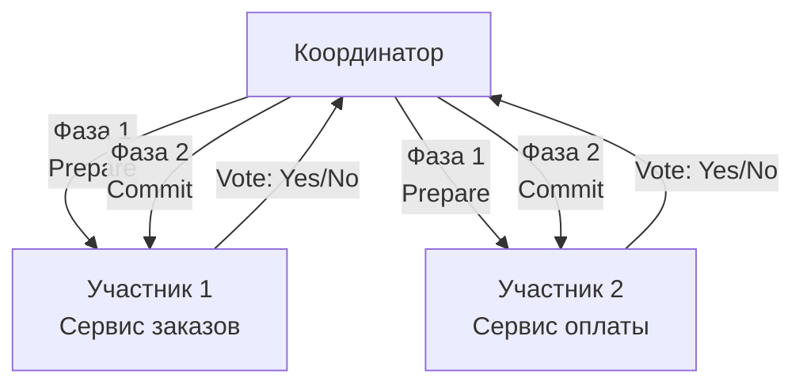

## Почему распределённые транзакции — это трудно

В рамках одного процесса и одной базы данных транзакции ACID — давно решённая задача. Открыли `sql.Tx`, выполнили операции, закоммитили — и база данных гарантирует атомарность, консистентность и изоляцию. Но как только данные распределяются по нескольким микросервисам, каждый со своей базой данных, простая и надёжная модель рушится. Возникает потребность в **распределённых транзакциях** — механизмах, обеспечивающих атомарность операций, затрагивающих несколько независимых систем.

В этой статье мы разберём классический Two-Phase Commit (2PC), его внутреннее устройство, фундаментальные проблемы и влияние на архитектуру Go-сервисов, а также поймём, почему современные системы всё чаще отказываются от него в пользу Saga ([[26. Saga Pattern. Оркестрация и хореография]]).

### Что такое распределённая транзакция

**Распределённая транзакция** — это набор операций над данными в разных узлах сети, которые должны быть выполнены как единое целое: либо все узлы подтверждают изменения, либо ни один. Классический пример — перевод денег между счетами в разных банках: нужно списать сумму в банке A и зачислить в банке B, причём обе операции должны быть атомарны.

В распределённых системах для координации таких транзакций исторически применяется протокол **Two-Phase Commit (2PC)**.

### Two-Phase Commit: как он работает

2PC вводит центрального **Координатора (Coordinator)**, который управляет процессом. Участники (Participants) — это сервисы или базы данных, которые должны выполнить часть работы.



**Фаза 1 — Подготовка (Prepare / Voting)**
Координатор отправляет всем участникам запрос `Prepare`. Участник выполняет свою часть работы, но **не фиксирует** изменения. Он захватывает необходимые блокировки, записывает все изменения в лог предзаписи (WAL), чтобы гарантировать возможность коммита или отката, и отвечает Координатору: `YES` — готов закоммитить, `NO` — не готов (например, нарушено бизнес-правило).

**Фаза 2 — Фиксация (Commit / Decision)**
Если **все** участники ответили `YES`, Координатор принимает решение `COMMIT` и рассылает его всем. Участники фиксируют изменения и освобождают блокировки. Если **хотя бы один** ответил `NO`, Координатор рассылает `ROLLBACK`, и все участники откатывают изменения.

> [!info] Под капотом
> Координатор должен вести собственный WAL-лог, чтобы после сбоя восстановить состояние распределённой транзакции. Если Координатор упал после отправки `Prepare`, но до принятия решения, он перечитывает лог и продолжает с того же места. Именно из-за того, что участник, ответивший `YES`, **обязан** ждать решения Координатора, возникает главная проблема 2PC — блокировка на неопределённое время.

### Фундаментальные проблемы 2PC

#### 1. Блокирующая природа и недоступность

Участник, проголосовавший `YES`, не может самостоятельно ни закоммитить, ни откатить изменения до получения команды от Координатора. Если связь с Координатором потеряна, участник зависает в состоянии `in-doubt` с захваченными блокировками. Никакие другие транзакции не могут изменить эти данные, пока не будет получено решение. Это прямое нарушение **доступности** (Availability) — одной из сторон CAP-теоремы ([[30. CAP теорема и реальные компромиссы]]).

#### 2. Единая точка отказа

Координатор — единая точка отказа. Без него участники в состоянии `in-doubt` остаются заблокированными. Можно сделать Координатора отказоустойчивым с помощью репликации лога (Paxos/Raft), но это значительно усложняет систему и всё равно не решает проблему потери связи с участником.

#### 3. Задержки и производительность

Две сетевые фазы (Prepare и Commit) добавляют минимум два RTT (round-trip time) к каждой операции. Участники удерживают блокировки дольше, что снижает пропускную способность системы. Для высоконагруженных Go-сервисов это катастрофа: горутины, инициировавшие распределённую транзакцию, висят в ожидании ответа координатора, потребляя память и забивая планировщик.

#### 4. Проблема с долгими транзакциями

Если бизнес-операция длится минуты или часы (например, ожидание подтверждения платежа пользователем), 2PC неприменим. Участники не могут удерживать блокировки так долго.

### Mechanical Sympathy: 2PC и Go

Предположим, мы реализуем 2PC между двумя Go-сервисами, каждый со своей PostgreSQL. Координатор — третий Go-сервис.

```go
// Координатор
func (c *Coordinator) Transfer(ctx context.Context, amount int) error {
    participants := []Participant{orderService, paymentService}
    
    // Фаза 1: Prepare
    for _, p := range participants {
        vote, err := p.Prepare(ctx, amount)
        if err != nil || vote != VoteYes {
            c.rollbackAll(ctx, participants)
            return fmt.Errorf("prepare failed: %w", err)
        }
    }
    
    // Фаза 2: Commit
    for _, p := range participants {
        err := p.Commit(ctx)
        if err != nil {
            // УЖЕ НЕ МОЖЕМ ОТКАТИТЬ — КТО-ТО МОГ ЗАКОММИТИТЬ
            // Остаёмся в состоянии ручного восстановления
            log.Fatal("inconsistent state after partial commit", "error", err)
        }
    }
    return nil
}
```

> [!warning] Ловушка / Gotcha
> В реальном коде ошибка на фазе `Commit` приводит к неконсистентному состоянию: первый участник уже закоммитил, второй — нет. ALERT! Простой `log.Fatal` — не решение. Нужен сложный механизм восстановления с логами и ручным вмешательством.

**Влияние на горутины:** Каждая распределённая транзакция занимает сетевые соединения и горутины на всех трёх сервисах. При тысячах одновременных транзакций количество горутин в состоянии ожидания (I/O wait) может достигнуть десятков тысяч. Планировщик Go справляется, но потребление памяти растёт линейно (~2KB стека + структура горутины). Важнее то, что эти горутины удерживают соединения с БД, уменьшая доступный пул.

**Блокировки в БД:** Во время фазы Prepare участник открывает транзакцию и выполняет изменения. В PostgreSQL открытая транзакция удерживает блокировки строк. Пока Координатор не ответит, все остальные запросы к этим строкам блокируются. Это увеличивает latency всех операций на сервисе, даже если они не имеют отношения к данной транзакции.

### Почему 2PC редко применяется в микросервисах

Современные архитектуры, особенно на Go, ориентированы на:
- **Высокую доступность**: 2PC жертвует доступностью ради консистентности, что неприемлемо для многих бизнес-сценариев.
- **Слабую связанность**: 2PC требует от участников знания о Координаторе и готовности к двухфазному протоколу, что связывает сервисы сильнее, чем синхронный REST.
- **Горизонтальное масштабирование**: блокировки в БД препятствуют масштабированию.

Большинство проблем, для которых исторически использовали 2PC, сегодня решаются паттерном **Saga** ([[26. Saga Pattern. Оркестрация и хореография]]) — распределённой транзакцией, состоящей из последовательности локальных транзакций с компенсирующими действиями.

### Альтернативы 2PC

**Saga (Хореография или Оркестрация):**
Каждая операция выполняется в локальной транзакции и публикует событие. Следующий шаг реагирует на событие. Если шаг не удаётся, предыдущие шаги компенсируются. Преимущества: нет блокировок, высокая доступность, слабая связанность. Недостатки: eventual consistency, сложность компенсаций.

**Outbox Pattern:**
Вместо 2PC для атомарного обновления БД и публикации события используется таблица `outbox`: в одной локальной транзакции сохраняется и изменение данных, и запись о событии. Отдельный процесс читает Outbox и публикует события в брокер, гарантируя at-least-once доставку. Это даёт атомарность без распределённого протокола.

**Idempotent Receiver:**
Повторная отправка одной и той же команды не вызывает дублирования. В сочетании с Outbox это позволяет избежать 2PC для многих сценариев (см. [[27. Idempotency и exactly once семантика]]).

### Когда 2PC всё же оправдан

2PC не исчез полностью. Он применяется в сценариях, где **строгая консистентность критична** и допустима более низкая доступность:
- Внутри кластера баз данных (например, PostgreSQL поддерживает 2PC для распределённых транзакций через `PREPARE TRANSACTION` и `COMMIT PREPARED`).
- В системах с жёсткими требованиями ACID (финансовые транзакции в пределах одного дата-центра с надёжной сетью).
- Инструменты вроде Atomikos, Narayana, основанные на спецификации XA, которые интегрируются с драйверами БД. Go имеет ограниченную поддержку XA через библиотеки вроде `go-xa`.

> [!tip] Собеседование
> **Вопрос:** Что такое Two-Phase Commit, и почему он не рекомендуется для высоконагруженных микросервисных систем?
> **Ответ:** 2PC — это протокол координации распределённых транзакций, состоящий из фазы голосования и фазы фиксации. Он гарантирует атомарность изменений в нескольких БД, но имеет фундаментальные недостатки: блокировки на время неопределённого ожидания решения координатора (нарушает доступность), единая точка отказа в виде координатора, высокая задержка из-за двух сетевых раундов и проблема долгих транзакций. В микросервисах эти недостатки перевешивают преимущества, поэтому используют Saga и eventual consistency.

### Итог

Two-Phase Commit — классическое решение задачи атомарности в распределённых системах, которое ценой блокировок и потери доступности гарантирует строгую консистентность. В мире Go и микросервисов его применение крайне ограничено из-за высоких накладных расходов и противоречия принципам масштабируемости и отказоустойчивости. Архитектор должен понимать механики 2PC, но в большинстве случаев отдавать предпочтение более гибким и живучим паттернам — Saga, Outbox, идемпотентному приёмнику.

В следующей статье мы подробно разберём основной современный подход к распределённым транзакциям: [[26. Saga Pattern. Оркестрация и хореография]].