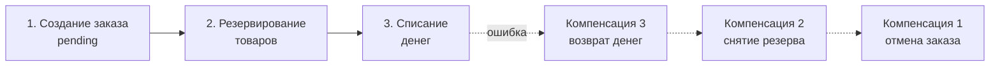
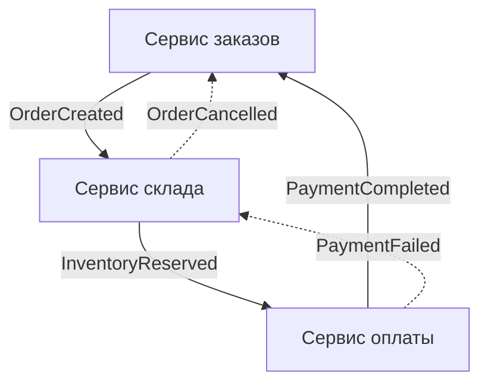
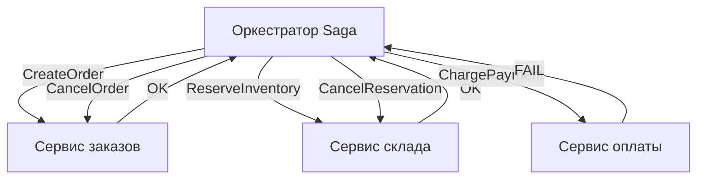

## Saga: распределённые транзакции без блокировок

В предыдущей статье мы разобрали Two-Phase Commit и его фундаментальные проблемы: блокировки, единая точка отказа, низкая доступность. Современные микросервисные системы, особенно написанные на Go, требуют иного подхода — такого, который не жертвует доступностью и не заставляет горутины висеть в ожидании координатора. Этим подходом стал **паттерн Saga**.

Saga — это механизм обеспечения консистентности данных в распределённой системе, который разбивает глобальную транзакцию на последовательность **локальных транзакций**, каждая из которых выполняется в своём сервисе. Если какая-то локальная транзакция завершается неудачей, Saga запускает **компенсирующие транзакции**, откатывающие предыдущие шаги.

### Как работает Saga

Представьте процесс оформления заказа:
1. Сервис заказов создаёт заказ в статусе `Pending`.
2. Сервис склада резервирует товары.
3. Сервис оплаты списывает деньги.

В классической распределённой транзакции все три шага должны быть атомарны. В Saga каждый шаг — это независимая локальная транзакция, которая публикует событие или получает команду для перехода к следующему шагу. Если на третьем шаге оплата не прошла, выполняются компенсации: отмена резервирования на складе, отмена заказа.



Важно: Saga **не гарантирует изоляции** (буква I в ACID). Пока шаги выполняются, другие транзакции могут видеть промежуточные состояния. Это осознанная жертва в пользу доступности и масштабируемости.

### Два стиля координации

Saga может координироваться двумя способами: **хореография** и **оркестрация**.

#### Хореография (Choreography)

В хореографии нет центрального управляющего. Каждый сервис, завершив свою локальную транзакцию, публикует событие. Другие сервисы подписываются на эти события и реагируют на них, выполняя свои шаги или компенсации.



**Реализация на Go (хореография с Kafka):**

```go
// Сервис заказов
func (s *OrderService) Create(ctx context.Context, cmd CreateOrder) (string, error) {
    order := NewOrder(cmd)
    if err := s.repo.Save(ctx, order); err != nil {
        return "", err
    }
    // Публикуем событие, запускающее следующий шаг
    s.eventBus.Publish(ctx, OrderCreated{OrderID: order.ID, Items: cmd.Items})
    return order.ID, nil
}

// Сервис склада подписан на OrderCreated
func (s *InventoryService) OnOrderCreated(ctx context.Context, ev OrderCreated) error {
    err := s.Reserve(ctx, ev.Items)
    if err != nil {
        s.eventBus.Publish(ctx, ReservationFailed{OrderID: ev.OrderID, Reason: err.Error()})
        return err
    }
    s.eventBus.Publish(ctx, InventoryReserved{OrderID: ev.OrderID})
    return nil
}

// Сервис оплаты подписан на InventoryReserved
func (s *PaymentService) OnInventoryReserved(ctx context.Context, ev InventoryReserved) error {
    err := s.Charge(ctx, ev.OrderID)
    if err != nil {
        s.eventBus.Publish(ctx, PaymentFailed{OrderID: ev.OrderID})
        return err
    }
    s.eventBus.Publish(ctx, PaymentCompleted{OrderID: ev.OrderID})
    return nil
}

// Сервис заказов подписан на PaymentCompleted — переводит заказ в Confirmed
// Сервис склада подписан на PaymentFailed — отменяет резерв
```

**Плюсы хореографии:**
- Слабая связанность: сервисы не знают друг о друге, только о событиях.
- Высокая автономность: каждый сервис можно развивать и масштабировать независимо.

**Минусы хореографии:**
- Бизнес-процесс «размазан» по коду нескольких сервисов; сложно увидеть общую картину.
- Сложность отладки: чтобы понять, на каком шаге произошёл сбой, нужно собирать трассировку.
- Циклические зависимости между событиями трудно контролировать.

#### Оркестрация (Orchestration)

В оркестрации есть центральный **Оркестратор Saga**. Он последовательно отправляет команды сервисам и обрабатывает их ответы. При сбое Оркестратор запускает компенсирующие команды.



**Реализация на Go (оркестратор):**

```go
type SagaOrchestrator struct {
    orderSvc     OrderService
    inventorySvc InventoryService
    paymentSvc   PaymentService
}

func (o *SagaOrchestrator) CreateOrderSaga(ctx context.Context, cmd CreateOrder) error {
    // Шаг 1: создать заказ
    orderID, err := o.orderSvc.Create(ctx, cmd)
    if err != nil {
        return err
    }
    // Сохраняем прогресс Saga (persistent store)
    saga := Saga{ID: uuid.New(), OrderID: orderID, Step: "order_created"}
    o.sagaStore.Save(ctx, saga)

    // Шаг 2: зарезервировать товары
    err = o.inventorySvc.Reserve(ctx, orderID, cmd.Items)
    if err != nil {
        // Компенсация: отменить заказ
        o.orderSvc.Cancel(ctx, orderID)
        return err
    }
    saga.Step = "inventory_reserved"
    o.sagaStore.Update(ctx, saga)

    // Шаг 3: списать деньги
    err = o.paymentSvc.Charge(ctx, orderID)
    if err != nil {
        // Компенсации в обратном порядке
        o.inventorySvc.Release(ctx, orderID) // отмена резерва
        o.orderSvc.Cancel(ctx, orderID)      // отмена заказа
        return err
    }
    saga.Step = "completed"
    o.sagaStore.Update(ctx, saga)
    return nil
}
```

**Плюсы оркестрации:**
- Процесс явно виден в одном месте: легко читать, тестировать, изменять.
- Проще отладка и обработка ошибок.
- Управление временем жизни и таймаутами централизованно.

**Минусы оркестрации:**
- Оркестратор становится центральным узлом, требующим высокой надёжности.
- Риск «умного» оркестратора, который начинает содержать бизнес-логику, — тогда сервисы становятся «глупыми», что нарушает автономность.
- Дополнительная инфраструктура: нужно хранилище состояния Saga.

### Mechanical Sympathy: Saga и Go

**Горутины и оркестратор.** В Go оркестратор может запускать каждый шаг Saga в отдельной горутине с собственным контекстом и таймаутом. Однако Saga может длиться минуты, часы или дни (например, ожидание оплаты). Держать горутину всё это время нельзя — это утечка памяти и потеря состояния при перезапуске. Поэтому оркестратор должен быть **stateless** относительно выполняемых Saga: он сохраняет состояние в БД, а возобновляет выполнение по таймеру или внешнему сигналу.

```go
// Оркестратор восстанавливает незавершённые Saga при старте и продолжает их
func (o *SagaOrchestrator) ResumePendingSagas(ctx context.Context) {
    sagas, _ := o.sagaStore.FindPending(ctx)
    for _, saga := range sagas {
        go o.resumeSaga(ctx, saga) // в фоне продолжает с прерванного шага
    }
}
```

**GC и аллокации.** При использовании событийной хореографии каждое событие — это аллокация в куче. При тысячах событий в секунду это усиливает давление на GC. Используйте пулы для событий (`sync.Pool`) или переходите на бинарную сериализацию (Protobuf) для уменьшения аллокаций.

**Сеть и системные вызовы.** Каждый шаг Saga — это сетевой запрос (HTTP/gRPC или сообщение в брокер). Суммарная задержка складывается из всех шагов. Проектируйте Saga так, чтобы шагов было немного, а компенсации были идемпотентными и надёжными.

### Управление таймаутами и повторными попытками

Saga не может висеть бесконечно. Каждый шаг должен иметь таймаут, а общий процесс — глобальный таймаут. В Go это реализуется через `context.WithTimeout` и `context.WithDeadline`.

```go
func (o *SagaOrchestrator) ExecuteStep(ctx context.Context, step StepFunc) error {
    stepCtx, cancel := context.WithTimeout(ctx, 10*time.Second)
    defer cancel()
    return step(stepCtx)
}
```

Если шаг не укладывается в таймаут, запускаются компенсации. Повторные попытки (retry) реализуются с exponential backoff (см. [[36. Circuit Breaker, Retry, Timeout и Backoff]]).

### Идемпотентность и Exactly-Once

В Saga компенсирующие операции могут быть вызваны повторно при сбоях сети или рестарте оркестратора. Поэтому **команды и компенсации должны быть идемпотентны**. Например, повторная отмена заказа не должна дважды менять статус или отправлять дублирующее уведомление. Эта тема подробнее раскрыта в [[27. Idempotency и exactly once семантика]].

### Хранение состояния Saga

При оркестрации нужно где-то хранить состояние процесса: текущий шаг, аргументы, историю выполненных операций. Варианты:
- Отдельная таблица в PostgreSQL.
- Отдельный сервис State Machine (например, на основе Temporal.io).
- Event Store, если используется Event Sourcing ([[24. Event Sourcing. Хранение событий вместо состояния]]).

### Temporal.io как продвинутая реализация Saga

**Temporal** (и его предшественник Cadence) — это платформа для оркестрации длительных бизнес-процессов, идеально подходящая для Saga на Go. Разработчик пишет Workflow как обычную Go-функцию, а Temporal гарантирует:
- Сохранение состояния процесса в БД при каждом шаге.
- Восстановление выполнения после перезапуска сервиса.
- Таймауты, повторные попытки, таймеры.
- Идемпотентность.

```go
func CreateOrderWorkflow(ctx workflow.Context, cmd CreateOrder) error {
    var orderID string
    err := workflow.ExecuteActivity(ctx, CreateOrderActivity, cmd).Get(ctx, &orderID)
    if err != nil {
        return err
    }

    err = workflow.ExecuteActivity(ctx, ReserveInventoryActivity, orderID).Get(ctx, nil)
    if err != nil {
        workflow.ExecuteActivity(ctx, CancelOrderActivity, orderID) // компенсация
        return err
    }

    // ...
}
```

Temporal заменяет ручное хранение состояния и сложную логику восстановления, но требует отдельного кластера.

### Сравнение хореографии и оркестрации

| Аспект | Хореография | Оркестрация |
|--------|------------|-------------|
| **Связанность** | Очень низкая, только через события | Средняя, через команды от оркестратора |
| **Видимость процесса** | Размыта по сервисам | Сосредоточена в оркестраторе |
| **Сложность отладки** | Высокая, нужна распределённая трассировка | Низкая, процесс виден в одном месте |
| **Автономность сервисов** | Высокая, каждый сам решает, как реагировать | Ниже, сервисы следуют командам |
| **Точка отказа** | Нет единой точки отказа | Оркестратор — потенциальная точка отказа |
| **Изменение процесса** | Требует координации нескольких сервисов | Изменяется только в оркестраторе |
| **Подход в Go** | Каналы, брокеры событий | Синхронные/gRPC вызовы или Temporal |

> [!tip] Собеседование
> **Вопрос:** Какой стиль Saga вы выберете для системы с 20 микросервисами, где бизнес-процессы часто меняются? Обоснуйте.
> **Ответ:** Я выберу **оркестрацию**, возможно с использованием Temporal. Причина: при частых изменениях процессов хореография становится неуправляемой — изменение последовательности шагов требует координации изменений в нескольких сервисах. В оркестрации процесс описан в одном месте, что упрощает его модификацию и тестирование. Temporal дополнительно снимает с разработчиков бремя управления состоянием, таймаутами и восстановлением после сбоев. Хореографию я бы применил для стабильных, редко меняющихся потоков данных.

### Антипаттерны

1. **Слишком длинные Saga.** Если процесс включает 20 шагов, любой сбой в середине вызывает каскад компенсаций. Дробите Saga на более мелкие, независимые процессы.
2. **Неполные компенсации.** Компенсирующая операция должна полностью откатывать эффект прямой операции. Например, если созданы документы в нескольких системах, все они должны быть отменены.
3. **Отсутствие идемпотентности.** Если компенсация вызвана дважды, она не должна создавать двойной отрицательный эффект (например, двойное пополнение баланса вместо снятия).
4. **Игнорирование таймаутов.** Без таймаутов Saga может висеть вечно, удерживая ресурсы (зарезервированные товары, заблокированные средства).

### Итог

Saga — это практический компромисс между строгой ACID-консистентностью 2PC и полной анархией без гарантий. Она обеспечивает атомарность на уровне бизнес-процессов, жертвуя изоляцией и добавляя сложность в виде компенсирующих операций. Выбор между хореографией и оркестрацией зависит от сложности процессов и требуемой автономности сервисов. Go с его горутинами, каналами и контекстами предоставляет отличную основу для реализации обоих стилей, а Temporal поднимает оркестрацию на уровень production-grade.

В следующей статье мы детально разберём ключевую технику, без которой надёжная Saga невозможна: [[27. Idempotency и exactly once семантика]].