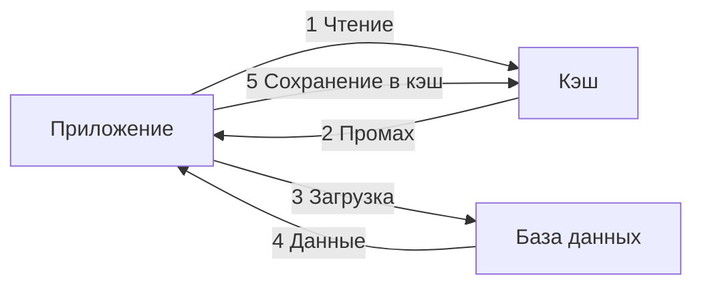
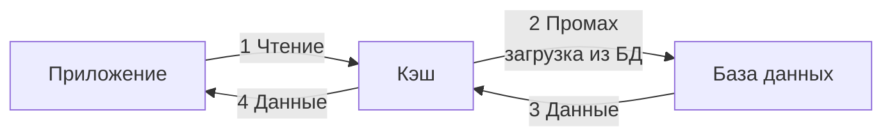
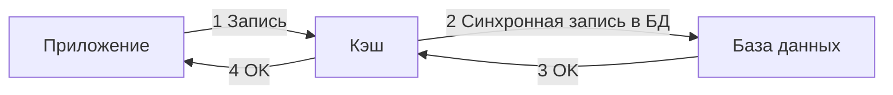
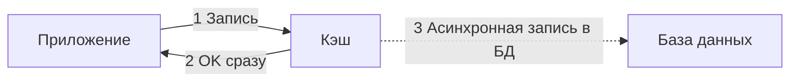

Кэширование — один из самых мощных инструментов в арсенале архитектора для снижения задержки, уменьшения нагрузки на базу данных и повышения пропускной способности. Но, как и любой мощный инструмент, оно требует аккуратности: неправильно выбранная стратегия или отсутствие дисциплины инвалидации ведут к трудноуловимым багам и устаревшим данным. В этой статье мы разберём четыре фундаментальных паттерна кэширования, их реализацию в Go, влияние на рантайм и критерии выбора.

### Четыре паттерна кэширования

Кэш может находиться на разных уровнях: от локального in-memory в процессе Go (быстро, но не разделяется между инстансами) до внешнего Redis или Memcached (медленнее, но доступен всем репликам). Вне зависимости от расположения, стратегия управления кэшем определяется одним из четырёх паттернов.

#### Cache-Aside (Look-Aside, Lazy Loading)

Приложение само управляет кэшем: перед чтением проверяет кэш, при промахе загружает данные из базы, сохраняет в кэш и возвращает. При изменении данных приложение явно инвалидирует запись в кэше.



**Преимущества:**
- Простота реализации и понимания.
- Гибкость: приложение решает, что и на сколько кэшировать.
- Кэш содержит только реально запрашиваемые данные (емкость не тратится на «мёртвые» записи).

**Недостатки:**
- Первый запрос всегда медленный (cold start).
- При сбое загрузки кэш остаётся пустым, нагрузка на БД возрастает.
- Ответственность за инвалидацию лежит на разработчике.

**Реализация Cache-Aside в Go:**

```go
type UserService struct {
    db    *sql.DB
    cache *redis.Client
}

func (s *UserService) GetUser(ctx context.Context, id string) (*User, error) {
    // 1. Проверяем кэш
    val, err := s.cache.Get(ctx, "user:"+id).Bytes()
    if err == nil {
        var user User
        json.Unmarshal(val, &user)
        return &user, nil
    }
    if err != redis.Nil {
        return nil, fmt.Errorf("cache error: %w", err)
    }

    // 2. Загружаем из БД
    user, err := s.loadFromDB(ctx, id)
    if err != nil {
        return nil, err
    }

    // 3. Сохраняем в кэш (асинхронно, без блокировки ответа)
    go func() {
        data, _ := json.Marshal(user)
        s.cache.Set(context.Background(), "user:"+id, data, 5*time.Minute)
    }()
    return user, nil
}

func (s *UserService) UpdateUser(ctx context.Context, user *User) error {
    tx, _ := s.db.BeginTx(ctx, nil)
    defer tx.Rollback()
    if err := s.updateInDB(ctx, tx, user); err != nil {
        return err
    }
    // Инвалидация кэша после успешной записи
    s.cache.Del(ctx, "user:"+user.ID)
    return tx.Commit()
}
```

> [!warning] Ловушка / Gotcha
> Инвалидация кэша *после* коммита транзакции не атомарна. Если кэш удалён, а транзакция позже откатится — в кэше останутся неконсистентные данные. Лучше удалять кэш внутри транзакции через `LISTEN/NOTIFY` или отложенную задачу, но на практике часто приемлемо удалять после коммита, если время жизни TTL короткое.

#### Read-Through

Приложение всегда обращается к кэшу, а кэш сам загружает данные из базы при промахе. Приложение не знает о существовании БД для этой операции. Обычно реализуется библиотекой или прокси-слоем.



**Преимущества:**
- Простота кода приложения — всегда только вызов `cache.Get()`.
- Удобно для стандартизации логики загрузки.

**Недостатки:**
- Требует реализации логики загрузки внутри кэширующего слоя (часто через плагины или ручную реализацию).
- Менее гибко, чем Cache-Aside.

В Go можно реализовать через обёртку:

```go
type ReadThroughCache struct {
    client *redis.Client
    loader func(ctx context.Context, key string) (interface{}, error)
}

func (c *ReadThroughCache) Get(ctx context.Context, key string, dest interface{}) error {
    val, err := c.client.Get(ctx, key).Bytes()
    if err == nil {
        return json.Unmarshal(val, dest)
    }
    if err != redis.Nil {
        return err
    }
    obj, err := c.loader(ctx, key)
    if err != nil {
        return err
    }
    data, _ := json.Marshal(obj)
    c.client.Set(ctx, key, data, time.Minute)
    // копируем obj в dest через рефлексию или возвращаем как есть
    return nil
}
```

#### Write-Through

Приложение записывает данные в кэш, а кэш синхронно записывает их в базу данных. Данные всегда попадают в кэш и БД одновременно.



**Преимущества:**
- Кэш всегда содержит актуальные данные (при условии, что запись идёт только через кэш).
- Консистентность данных между кэшем и БД.

**Недостатки:**
- Увеличивает задержку записи (приходится ждать и кэш, и БД).
- При недоступности БД запись не пройдёт, что может быть избыточно для некритичных данных.

#### Write-Behind (Write-Back)

Приложение пишет в кэш, который сразу отвечает, а запись в БД происходит асинхронно, с задержкой.



**Преимущества:**
- Минимальная задержка записи.
- Высокая пропускная способность.
- Устойчивость к временным сбоям БД (операции буферизуются).

**Недостатки:**
- Риск потери данных при падении кэша до сброса в БД.
- Сложность реализации: нужно обеспечить надёжный буфер и механизм повторов.
- Консистентность — eventual.

В Go можно реализовать Write-Behind через буфер в канале и фоновые горутины:

```go
type WriteBehindCache struct {
    client *redis.Client
    db     *sql.DB
    writes chan writeOp
}

type writeOp struct {
    key   string
    value interface{}
}

func (c *WriteBehindCache) Start(ctx context.Context) {
    for i := 0; i < 4; i++ {
        go func() {
            batch := make([]writeOp, 0, 100)
            ticker := time.NewTicker(500 * time.Millisecond)
            for {
                select {
                case op := <-c.writes:
                    batch = append(batch, op)
                    if len(batch) >= 100 {
                        c.flush(ctx, batch)
                        batch = batch[:0]
                    }
                case <-ticker.C:
                    if len(batch) > 0 {
                        c.flush(ctx, batch)
                        batch = batch[:0]
                    }
                case <-ctx.Done():
                    return
                }
            }
        }()
    }
}
```

### Mechanical Sympathy: влияние кэша на Go-рантайм

**Локальный кэш vs Внешний кэш.** 
- Локальный (`sync.Map`, `map + sync.RWMutex`, библиотеки типа `bigcache`, `ristretto`) — обращение за наносекунды, нет сети, но:
    - Данные в куче, увеличивают working set и время GC.
    - Не разделяется между инстансами, ведёт к несогласованности при горизонтальном масштабировании.
- Внешний (Redis) — обращение за микросекунды/миллисекунды, сеть, но:
    - Не нагружает GC Go-приложения.
    - Единый для всех инстансов.

> [!info] Под капотом
> Каждый вызов Redis-команды — это системный вызов `write/read` к сокету, горутина блокируется на I/O и передаётся netpoller'у. Планировщик Go эффективно обрабатывает тысячи таких горутин, но для сверхвысоконагруженных сервисов стоит использовать конвейеризацию (pipelining) в Redis и пул соединений (`go-redis` управляет им автоматически).

**Аллокации и GC.** При использовании локального кэша каждая вставка — это аллокация ключа и значения. Кэш с коротким TTL порождает много мусора. Чтобы уменьшить давление на GC, применяют `sync.Pool` для часто создаваемых объектов. Библиотеки вроде `bigcache` специально оптимизированы под минимизацию аллокаций и используют слайсы байтов вместо структур.

### Инвалидация и её грабли

Инвалидация кэша — одна из двух самых сложных проблем в Computer Science (шутка Phil Karlton). Основные стратегии:

1. **TTL (Time To Live)** — запись живёт фиксированное время. Просто, но данные могут устареть раньше или жить дольше необходимого.
2. **Явная инвалидация** — при изменении данных приложение удаляет запись из кэша. Требует дициплины: при любом изменении (включая фоновые задачи, миграции) нужно помнить об инвалидации.
3. **Ключи на основе версий** — ключ включает версию данных, при изменении версия растёт, старый ключ игнорируется.
4. **Обновление вместо удаления** — вместо удаления запись обновляется новыми данными. Устраняет cold start проблему, но может вызвать запись данных, которые не будут прочитаны.

### Проблема Thundering Herd (Stampede)

Когда популярная запись в кэше истекает, множество одновременных запросов могут обнаружить промах и одновременно пойти в БД, вызывая лавину. Решение — **блокировка на уровне ключа** (mutex per key) или **вероятностная досрочная регенерация** (XFetch).

```go
// Простейшая защита от stampede через singleflight
var g singleflight.Group

func (s *UserService) GetUser(ctx context.Context, id string) (*User, error) {
    val, err, _ := g.Do("user:"+id, func() (interface{}, error) {
        // Только одна горутина выполняет эту функцию для ключа
        user, err := s.loadFromDB(ctx, id)
        if err != nil {
            return nil, err
        }
        s.cache.Set(ctx, "user:"+id, user, time.Minute)
        return user, nil
    })
    if err != nil {
        return nil, err
    }
    return val.(*User), nil
}
```

Пакет `singleflight` из стандартной библиотеки `golang.org/x/sync/singleflight` предотвращает дублирование дорогих операций. Однако он работает только в рамках одного процесса. Для распределённого мьютекса нужен внешний механизм (например, `SETNX` в Redis).

### Выбор паттерна в архитектуре

- **Cache-Aside** — наиболее универсален, подходит для большинства сценариев. Используйте для данных, где допустима eventual consistency и холодные старты не критичны.
- **Read-Through** — когда нужно полностью изолировать приложение от БД для операций чтения. Удобен при рефакторинге хранения.
- **Write-Through** — для критичных данных, где важна строгая консистентность между кэшем и БД (например, финансы).
- **Write-Behind** — для высоконагруженной записи, где потеря нескольких записей допустима (логи, счётчики) и критична низкая задержка.

Сравнение с консистентностью ([[29. Consistency модели. Strong, Eventual, Causal]]) и CAP ([[30. CAP теорема и реальные компромиссы]]): кэширование почти всегда жертвует строгой консистентностью ради производительности. Исключение — Write-Through, но он увеличивает latency.

### Кэширование и устойчивость к отказам

Кэш — не источник истины. При недоступности кэша система должна продолжать работу, даже если с повышенной задержкой (Circuit Breaker на кэш, fallback к БД). В Go это означает обёртку, которая при ошибке кэша логирует её и идёт в БД напрямую.

```go
func (s *UserService) GetUser(ctx context.Context, id string) (*User, error) {
    if user, err := s.getFromCache(ctx, id); err == nil {
        return user, nil
    } else if !errors.Is(err, redis.Nil) {
        // Проблема с кэшем — логируем и идём в БД
        log.Warn("cache unavailable, falling back to db", "error", err)
    }
    return s.loadFromDB(ctx, id)
}
```

> [!tip] Собеседование
> **Вопрос:** Как бы вы спроектировали кэширование для высоконагруженного API с 100k RPS и требованием к latency P99 < 50 мс? Какие паттерны используете?
> **Ответ:** Я бы использовал многоуровневый кэш. Первый уровень — in-memory кэш в процессе Go (например, `ristretto`) с коротким TTL, чтобы обслуживать горячие ключи без сети. Второй уровень — распределённый Redis для общих данных между инстансами. Стратегия — Cache-Aside с защитой от thundering herd через `singleflight` и вероятностную преждевременную регенерацию. Инвалидация через публикацию событий об изменении данных в Redis Pub/Sub, чтобы все инстансы сбрасывали локальный кэш при изменении. Для данных, не критичных к актуальности, TTL увеличиваю до минут, а для критичных — секунды.

### Итог

Кэширование — это всегда компромисс между производительностью и актуальностью данных. Правильно подобранный паттерн (Cache-Aside, Read-Through, Write-Through или Write-Behind) и дисциплина инвалидации определяют, станет ли кэш ускорителем системы или источником загадочных ошибок. Go с его эффективной работой с памятью и горутинами позволяет реализовывать даже сложные стратегии без лишних фреймворков, но требует внимания к GC при локальном кэшировании и к сети при внешнем.

В следующей статье мы погрузимся в фундаментальное свойство распределённых систем, которое напрямую влияет на выбор между всеми этими паттернами: [[29. Consistency модели. Strong, Eventual, Causal]].