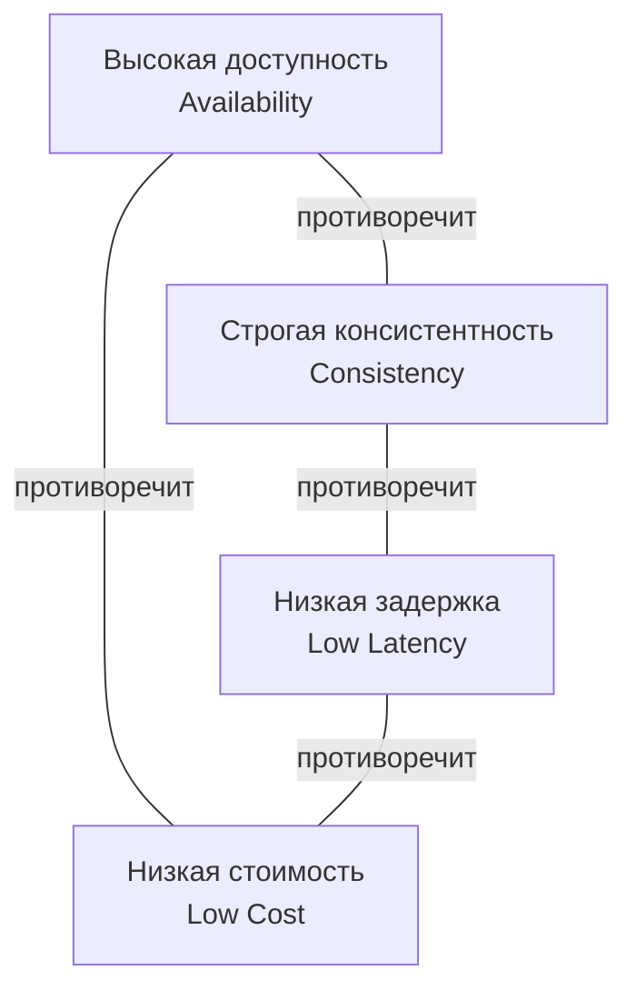

Любая программная система создается для решения конкретных задач бизнеса или пользователей. Эти задачи формулируются в виде **требований** — формальных описаний того, что система должна делать и как она должна это делать. Опытный архитектор понимает, что требования бывают двух принципиально разных типов, и игнорирование одного из них ведет к провалу проекта, даже если код написан идеально.

В этой статье мы разберем:
- Что такое функциональные и нефункциональные требования.
- Почему нефункциональные требования часто важнее функциональных при проектировании архитектуры.
- Как нефункциональные требования проявляются в контексте Go и накладывают ограничения на выбор инструментов и паттернов.

### Функциональные требования (Functional Requirements)

**Функциональные требования** описывают, **ЧТО** система должна делать. Это конкретные бизнес-возможности, фичи и поведение, видимые пользователю или другим системам.

Примеры для типичного бэкенд-сервиса на Go:
- Пользователь может зарегистрироваться, указав email и пароль.
- Система должна отправлять email с подтверждением регистрации.
- Пользователь может создать заказ, содержащий список товаров.
- Администратор может просмотреть список всех заказов за период с фильтрацией по статусу.
- При создании заказа необходимо проверить наличие товара на складе через внешний API склада.

Функциональные требования обычно фиксируются в виде User Stories, Use Cases или спецификаций API. Они являются основой для написания кода и тестов.

С точки зрения Go-разработчика, реализация функциональных требований — это написание обработчиков HTTP, бизнес-логики в use case слое, запросов к базе данных и вызовов внешних сервисов. Это то, чем мы занимаемся каждый день.

### Нефункциональные требования (Non-Functional Requirements, NFR)

**Нефункциональные требования** описывают, **КАК** система должна выполнять свои функции. Это качественные характеристики, ограничения и атрибуты системы, которые часто не видны напрямую в коде одной функции, но определяют общий успех или провал в продакшене.

Нефункциональные требования также называют **Quality Attributes** или **"-ilities"** (Scalability, Reliability, Maintainability, Security и т.д.).

Ключевые категории нефункциональных требований:

| Категория | Примеры метрик / требований | Как влияет на архитектуру Go-сервиса |
|-----------|----------------------------|--------------------------------------|
| **Производительность** | Latency (P95 < 100ms), Throughput (10k RPS) | Выбор между sync/async, настройка пулов соединений, профилирование аллокаций, тюнинг GC |
| **Масштабируемость** | Горизонтальное масштабирование до 100 инстансов, линейный рост пропускной способности | Stateless-дизайн, отсутствие локального состояния, правильное шардирование БД |
| **Надёжность / Доступность** | Uptime 99.95%, время восстановления < 5 мин | Graceful shutdown, health checks, retry, circuit breaker, репликация |
| **Безопасность** | Аутентификация по JWT, шифрование данных в покое, защита от OWASP Top 10 | Middleware аутентификации, валидация входных данных, использование crypto/rand |
| **Сопровождаемость** | Время добавления новой фичи < 2 дней, понятная структура кода | Clean Architecture, DI, модульные тесты, документация |
| **Наблюдаемость** | Все запросы трассируются, метрики по RED (Rate, Errors, Duration) | Интеграция OpenTelemetry, экспорт метрик в Prometheus, структурированное логирование |
| **Стоимость** | Бюджет на инфраструктуру, лимиты CPU/Memory на под | Оптимизация аллокаций, переиспользование объектов, эффективная сериализация |

> [!info] Под капотом
> Нефункциональные требования напрямую связаны с ограничениями физического мира. Требование «Latency P99 < 10ms» означает, что ваш Go-сервис не может позволить себе:
> - Блокирующие системные вызовы без таймаутов.
> - Большие аллокации, вызывающие частые циклы GC.
> - Сетевые вызовы к медленным downstream-сервисам без кэширования.
> - Неоптимальную сериализацию JSON (лучше использовать protobuf или easyjson).
> - Блокировки мьютексов, которые могут привести к ожиданию в очереди горутин.

### Почему нефункциональные требования критичны для архитектуры

Представьте, что вы спроектировали систему, идеально реализующую все функциональные требования: пользователи могут регистрироваться, создавать заказы, просматривать историю. Вы написали чистый Go-код с интерфейсами и DI, покрыли тестами. Но когда сервис вышел в продакшен под нагрузкой, выяснилось:
- Обработка запроса занимает 2 секунды, потому что на каждый запрос сервис ходит во внешний API без кэша.
- При 100 одновременных запросах сервер падает с `out of memory`, потому что каждая горутина аллоцирует большой буфер для JSON.
- После перезапуска сервис теряет все заказы, созданные в памяти, но еще не сохраненные в БД.

Система **функционально корректна**, но **нефункционально провальна**. Пользователи не будут ждать 2 секунды, бизнес теряет деньги.

**Архитектура — это в первую очередь дисциплина удовлетворения нефункциональных требований.** Функциональные требования можно реализовать множеством способов, но именно NFR диктуют, какой из способов выбрать. Например, если требуется высокая пропускная способность, вы пожертвуете простотой синхронного REST в пользу асинхронной очереди ([[19. Синхронное vs асинхронное взаимодействие сервисов]]). Если требуется мгновенная консистентность данных, вы откажетесь от CQRS в пользу транзакционной записи в одну БД ([[23. CQRS. Разделение чтения и записи]]).

### Go и нефункциональные требования: практические проекции

Go как язык и платформа предлагает уникальные возможности и накладывает определенные ограничения в контексте NFR.

#### Производительность и масштабируемость

**Возможности:**
- **Легковесные горутины** позволяют обрабатывать десятки тысяч конкурентных соединений на одном инстансе без значительных накладных расходов (в отличие от модели 1 поток = 1 соединение в Java или C#).
- **Встроенный HTTP-сервер** (`net/http`) эффективно использует пул горутин и неблокирующий I/O через `epoll/kqueue`.
- **Низкий порог входа в оптимизацию** через встроенные инструменты `pprof` и `trace` ([[16. Профилирование, отладка и производительность]]).

**Ограничения и ловушки:**
- **Garbage Collector** — хотя GC в Go очень быстрый и имеет субмиллисекундные паузы, он всё равно может влиять на хвостовые задержки (tail latency) в системах с жёсткими требованиями к предсказуемости. Для таких случаев требуются ручное управление памятью через `sync.Pool` и минимизация аллокаций.
- **Блокировка горутины на системном вызове** не блокирует весь поток ОС (благодаря hand-off в планировщике), но создаёт дополнительную нагрузку на планировщик. При большом количестве заблокированных на I/O горутин может потребоваться увеличение `GOMAXPROCS`.

```go
// Пример: минимизация аллокаций через sync.Pool для высоконагруженного сервиса
var bufferPool = sync.Pool{
    New: func() interface{} {
        return make([]byte, 0, 4096)
    },
}

func handler(w http.ResponseWriter, r *http.Request) {
    buf := bufferPool.Get().([]byte)
    defer bufferPool.Put(buf[:0]) // возвращаем в пул, обнуляя длину

    // использование buf для сериализации или чтения
    // ...
}
```

> [!warning] Ловушка / Gotcha
> **Неявные аллокации при конвертации строк и слайсов.** Выражение `string(b)` или `[]byte(s)` создаёт новую копию данных в куче. В критичных к производительности местах это может породить лавину аллокаций и нагрузку на GC. Используйте `unsafe` только в крайнем случае и после тщательного профилирования.

#### Надёжность и отказоустойчивость

**Инструменты Go:**
- **Контексты (`context.Context`)** — стандартный механизм передачи дедлайнов и отмены операций. Позволяет корректно обрывать цепочки вызовов, предотвращая утечки горутин и бесконечные ожидания.
- **Graceful Shutdown** — возможность корректно завершить HTTP-сервер, дождавшись обработки текущих запросов.

```go
srv := &http.Server{Addr: ":8080"}
go func() {
    if err := srv.ListenAndServe(); err != http.ErrServerClosed {
        log.Fatal(err)
    }
}()

stop := make(chan os.Signal, 1)
signal.Notify(stop, syscall.SIGINT, syscall.SIGTERM)
<-stop

ctx, cancel := context.WithTimeout(context.Background(), 10*time.Second)
defer cancel()
if err := srv.Shutdown(ctx); err != nil {
    log.Printf("shutdown error: %v", err)
}
```

**Паттерны устойчивости:**
- **Retry с exponential backoff** — реализуется в несколько строк, но требует осторожности с идемпотентностью ([[36. Circuit Breaker, Retry, Timeout и Backoff]]).
- **Circuit Breaker** — библиотеки вроде `gobreaker` или `sony/gobreaker` предотвращают каскадные отказы.

#### Безопасность

Go имеет богатую стандартную библиотеку `crypto`, которая позволяет реализовать большинство криптографических операций без внешних зависимостей. Однако важно помнить:
- Не используйте `math/rand` для генерации токенов или ключей — только `crypto/rand`.
- При работе с JWT проверяйте алгоритм подписи (избегайте `alg: none`).
- Всегда валидируйте входные данные перед анмаршалингом в структуры.

### Компромиссы между нефункциональными требованиями

Нефункциональные требования часто конфликтуют друг с другом. Нельзя одновременно максимизировать все показатели. Архитектор должен находить баланс.



- **CAP-теорема** ([[30. CAP теорема и реальные компромиссы]]): в распределённой системе при сетевом разделении вы должны выбрать между доступностью и консистентностью.
- **Latency vs Consistency**: репликация данных асинхронно (eventual consistency) даёт низкую задержку записи, но читатели могут видеть устаревшие данные. Синхронная репликация гарантирует свежесть, но увеличивает время ответа.
- **Cost vs Performance**: добавление индексов в БД ускоряет чтение, но замедляет запись и увеличивает объём хранилища. Добавление кэша Redis снижает нагрузку на БД, но увеличивает сложность и стоимость инфраструктуры.

> [!tip] Собеседование
> **Вопрос:** При проектировании системы оформления заказов бизнес требует, чтобы пользователь ВСЕГДА видел актуальный статус заказа сразу после его создания. Какое нефункциональное требование здесь доминирует и какой компромисс вы вынуждены принять?
> **Ответ:** Доминирует требование **строгой консистентности (Strong Consistency)**. Это означает, что после записи заказа в БД все последующие чтения должны попадать на ту же реплику (или ждать синхронной репликации). Компромисс: **доступность и задержка**. Если мастер БД упал, запись станет невозможна до восстановления или фейловера (жертвуем доступностью). Если мы используем синхронную репликацию, время ответа увеличивается на время подтверждения от реплик (жертвуем latency).

### Как Go помогает управлять компромиссами

1. **Явная обработка ошибок** заставляет разработчика думать о том, что может пойти не так, и проектировать поведение системы при отказах. В языках с исключениями легко забыть обработать редкий случай.

2. **Контексты** делают таймауты и отмену первоклассными гражданами, а не дополнительной опцией. Это напрямую влияет на надёжность и предсказуемость.

3. **Простота конкурентности** через горутины и каналы позволяет строить высокопроизводительные системы без сложных абстракций вроде реактивных потоков, но требует дисциплины в управлении временем жизни горутин.

4. **Статическая компиляция** упрощает деплой и контейнеризацию, снижая операционные риски (несоответствие версий библиотек, уязвимости в системных пакетах). Это напрямую влияет на сопровождаемость и безопасность.

### Итог

- **Функциональные требования** отвечают на вопрос «Что система делает?». Они видимы пользователю и определяют продуктовую ценность.
- **Нефункциональные требования** отвечают на вопрос «Как система это делает?». Они определяют качество, надёжность, производительность и, в конечном счёте, удовлетворённость пользователя и стоимость владения.
- Архитектура системы на 80% определяется нефункциональными требованиями. Функциональные требования можно реализовать по-разному, но только NFR диктуют выбор конкретных паттернов и технологий.
- Go предоставляет отличный баланс между производительностью, простотой и надёжностью, но требует от разработчика понимания того, как написанный код транслируется в поведение системы под нагрузкой.

Теперь, когда мы понимаем разницу между функциональными и нефункциональными требованиями, мы готовы перейти к конкретным метрикам, с помощью которых бизнес и инженеры договариваются о качестве сервиса. В следующей статье мы разберем: [[4. SLA, SLO, SLI и как они влияют на дизайн]].