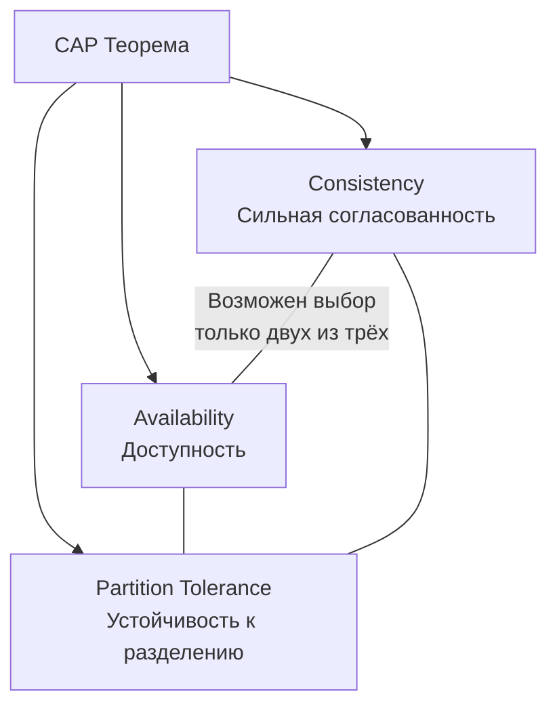

В предыдущей статье мы рассмотрели модели согласованности: strong, eventual и causal. Каждая из них представляет определённую точку в пространстве компромиссов между корректностью данных и производительностью. Но все эти компромиссы упираются в фундаментальное ограничение, формализованное Эриком Брюэром в 2000 году и доказанное Сетом Гилбертом и Нэнси Линч в 2002 — **CAP-теорему**. Понимание этой теоремы и её практических следствий обязательно для любого архитектора, проектирующего распределённые системы, особенно на Go, где мы часто строим микросервисы и распределённые хранилища.

### Что утверждает CAP-теорема

CAP-теорема гласит, что в распределённой системе (состоящей из нескольких узлов, связанных асинхронной сетью) при наличии **сетевого разделения** (Partition) невозможно одновременно обеспечить полную **доступность** (Availability) и строгую **консистентность** (Consistency). Можно гарантировать только два из трёх свойств.

Три свойства:

- **Consistency (Согласованность)** — все узлы видят одни и те же данные в любой момент времени. Более формально: после успешной записи любое последующее чтение (с любого узла) возвращает записанное значение или более новое. Это эквивалент линеаризуемости.
- **Availability (Доступность)** — каждый запрос к работающему узлу завершается корректным ответом (не ошибкой). Даже если часть узлов отказала или сеть разделилась, оставшиеся узлы обязаны отвечать.
- **Partition Tolerance (Устойчивость к разделению)** — система продолжает работать при произвольной потере сообщений или сетевых задержках между узлами. Разделение — это неисправность, при которой сеть распадается на изолированные сегменты.



### Почему невозможно иметь все три одновременно

Представьте систему из двух узлов (Node1 и Node2), реплицирующих данные. Клиент пишет значение `X` на Node1, а затем читает с Node2. Если сеть между узлами работает, Node1 реплицирует `X` на Node2, и чтение возвращает `X` — консистентность и доступность соблюдены.

Теперь представьте, что сеть между узлами разорвалась (сетевое разделение, Partition). Node1 принял запись `X`, но не может передать её на Node2. Клиент пытается прочитать с Node2. У системы есть выбор:

- **Сохранить консистентность (CP):** Node2 отвечает ошибкой, потому что не знает актуальное значение. Доступность нарушена (клиент получил ошибку, хотя узел работал).
- **Сохранить доступность (AP):** Node2 отвечает тем, что у него есть (устаревшим значением `Y`). Консистентность нарушена (чтение не вернуло последнюю запись).

Этот мысленный эксперимент показывает суть теоремы: **при наличии сетевого разделения выбор неизбежен**. Без разделения можно иметь и консистентность, и доступность одновременно. Но поскольку в распределённых системах сетевые разделения неизбежны (закон Мёрфи), архитектор обязан решить, чем жертвовать при их возникновении.

> [!info] Под капотом
> Важно: CAP-теорема говорит именно о **сетевом разделении**, а не о любом отказе. Отказ узла — это предельный случай, когда узел полностью изолирован. На практике «разделение» включает любые задержки, потерю пакетов, асимметричные проблемы связи. Система должна быть готова к тому, что сообщения между узлами могут теряться или приходить с произвольной задержкой.

### CP vs AP: реальные системы

**CP-системы** (жертвуют доступностью ради консистентности при разделении):
- **etcd** — распределённое хранилище конфигурации на Raft. При потере кворума отказывает в обслуживании запросов, гарантируя, что данные не разойдутся. Go-клиент etcd при недоступности кворума получает ошибку и должен ретраить или отдавать fallback.
- **ZooKeeper** — аналогично.
- **PostgreSQL с синхронной репликацией** — запись ждёт подтверждения от реплик; если реплика недоступна, запись блокируется или завершается ошибкой.

**AP-системы** (жертвуют консистентностью ради доступности):
- **Amazon DynamoDB, Apache Cassandra** — настраиваемые уровни консистентности (ONE, QUORUM, ALL), но по умолчанию работают в AP-режиме.
- **Redis Cluster** — продолжает обслуживать запросы изолированных шардов, допуская потерю данных или рассинхронизацию.
- **DNS** — классический пример AP: записи кэшируются, и изменения распространяются медленно.
- **REST API с кэшированием** — если кэш не инвалидирован, читатель получает устаревшие данные (eventual consistency).

### Go и CAP: как выбор влияет на код

При проектировании Go-сервиса выбор между CP и AP отражается в обработке ошибок, таймаутах и паттернах взаимодействия.

**CP-сервис на Go:**
```go
func (s *Service) GetConfig(ctx context.Context, key string) ([]byte, error) {
    ctx, cancel := context.WithTimeout(ctx, 2*time.Second)
    defer cancel()
    resp, err := s.etcd.Get(ctx, key)
    if err != nil {
        // Важно: при разделении возвращаем ошибку, данные не отдаём
        return nil, fmt.Errorf("config unavailable: %w", err)
    }
    return resp.Kvs[0].Value, nil
}
```

**AP-сервис на Go с fallback к устаревшим данным:**
```go
func (s *Service) GetProfile(ctx context.Context, id string) (*Profile, error) {
    // Сначала пытаемся получить свежие данные из основного хранилища
    profile, err := s.primaryDB.Get(ctx, id)
    if err == nil {
        return profile, nil
    }
    // При недоступности отдаём кэш (возможно, устаревший)
    cached, cacheErr := s.cache.Get(ctx, id)
    if cacheErr == nil {
        log.Warn("serving stale data due to primary DB outage", "id", id)
        return cached, nil
    }
    return nil, fmt.Errorf("profile unavailable: %w", err)
}
```

> [!warning] Ловушка / Gotcha
> Часто думают, что можно выбрать «только Consistency и Availability» и игнорировать Partition Tolerance. Но в распределённой системе вы **не можете** отказаться от Partition Tolerance: сетевые разделения случаются, хотите вы этого или нет. Когда говорят «CA-система», обычно имеют в виду монолит с одной БД — но это уже не распределённая система в смысле CAP. Любая распределённая система обязана быть P-tolerant, и реальный выбор всегда между CP и AP.

### PACELC: расширение CAP

CAP рассматривает компромисс только при наличии разделения. Однако на практике компромиссы существуют и без разделений. **PACELC-теорема** (Daniel Abadi) уточняет:
- При **P**artition: выбираем между **A**vailability и **C**onsistency.
- **E**lse (без разделения): выбираем между **L**atency и **C**onsistency.

Даже когда сеть работает, синхронная репликация (строгая консистентность) добавляет задержку, потому что нужно ждать ответа от реплик. Асинхронная репликация (eventual consistency) снижает задержку, но допускает расхождение. Этот компромисс особенно важен для высоконагруженных Go-сервисов, где каждый лишний миллисекунд может выбиваться из SLO.

### Mechanical Sympathy: CAP и Go-рантайм

**CP-системы:** каждая операция записи ожидает подтверждения от кворума, что означает блокировку горутины на сетевом I/O. Планировщик Go эффективно открепляет горутину от потока ОС, но её память (стек ~2 КБ + структуры) остаётся занятой. При тысячах одновременных CP-запросов это увеличивает потребление памяти и снижает пропускную способность. Более того, таймауты должны быть тщательно выверены: слишком короткий таймаут приводит к ложным отказам, слишком длинный — к удержанию ресурсов.

**AP-системы:** операции быстрые, горутины быстро освобождаются, throughput выше. Но возникают конфликты данных, требующие разрешения (LWW, CRDT, слияние на уровне приложения). Разрешение конфликтов добавляет CPU-нагрузку и может порождать дополнительную сетевую активность.

### Реальные компромиссы на System Design интервью

На собеседованиях ожидается, что кандидат умеет артикулировать компромиссы CAP для конкретных систем.

**Пример: проектирование платежной системы.**
Платежи должны быть строго консистентны (нельзя допустить двойного списания или потери транзакции). Значит, система должна быть **CP**: при разделении жертвуем доступностью. Если база данных не отвечает, лучше отказать в платеже, чем рисковать дублированием. Реализация в Go: использовать транзакции PostgreSQL с уровнем изоляции SERIALIZABLE, а при распределённых сценариях — etcd для лидерства и координации.

**Пример: лента новостей социальной сети.**
Здесь доступность важнее строгой консистентности. Пользователь должен видеть хоть какой-то контент, даже если часть серверов недоступна. Система может быть **AP**: данные реплицируются асинхронно, кэшируются, допускается, что некоторые посты появятся с задержкой. Go-сервисы могут использовать Redis Cluster с клиентским кэшированием и fallback к CDN.

### Связь с другими архитектурными паттернами

- **Кэширование** ([[28. Кэширование. Cache Aside, Write Through, Write Back]]) — почти всегда AP-решение, жертвует консистентностью ради снижения задержки и нагрузки.
- **Saga** ([[26. Saga Pattern. Оркестрация и хореография]]) — AP по своей природе: использует eventual consistency и компенсации.
- **Event Sourcing** ([[24. Event Sourcing. Хранение событий вместо состояния]]) — может быть настроен как CP (etcd как Event Store) или AP (Kafka как Event Store), в зависимости от требований.
- **CQRS** ([[23. CQRS. Разделение чтения и записи]]) — Read Model почти всегда eventally consistent (AP) относительно Write Model.

### Не «2 из 3», а управляемый компромисс

Современные системы редко жёстко прибиты к CP или AP. Они предоставляют **настраиваемые уровни консистентности**:
- Cassandra: `CONSISTENCY ONE` (AP), `CONSISTENCY QUORUM` (баланс), `CONSISTENCY ALL` (CP).
- DynamoDB: `GetItem` с `ConsistentRead: true` (CP) или без (AP).
- etcd: `Serializable` vs `Linearizable` чтение.

Go-разработчик может выбирать уровень на уровне запроса:
```go
// Линеаризуемое чтение (CP)
resp, err := etcd.Get(ctx, key, clientv3.WithSerializable())
// vs
// Сериализуемое чтение — может вернуть устаревшие данные, но быстрее
resp, err := etcd.Get(ctx, key)
```

> [!tip] Собеседование
> **Вопрос:** Объясните на примере, почему нельзя одновременно гарантировать Consistency и Availability при Partition? Приведите пример из практики.
> **Ответ:** Представьте распределённую БД из двух узлов. Клиент пишет значение на узел A. В этот момент сеть между A и B рвётся. Клиент читает с узла B. Если система хочет быть Available (ответить клиенту с узла B), она вернёт устаревшие данные — Consistency нарушена. Если она хочет быть Consistent (вернуть актуальные данные), узел B должен ответить ошибкой — Availability нарушена. Пример из практики: etcd при потере кворума перестаёт обслуживать запросы, возвращая ошибку `etcdserver: request timed out`. Он выбирает CP. Cassandra по умолчанию в аналогичной ситуации может вернуть устаревшие данные (AP), если уровень консистентности ONE.

### Итог

CAP-теорема — не абстрактная академическая концепция, а суровая инженерная реальность, диктующая архитектурные решения в распределённых системах. Понимание того, что при сетевом разделении вам **неизбежно** придётся выбирать между консистентностью и доступностью, определяет выбор баз данных, брокеров сообщений и паттернов взаимодействия сервисов. Go-экосистема предоставляет инструменты для реализации как CP, так и AP систем, и архитектор должен осознанно выбирать подходящий компромисс, исходя из бизнес-требований и SLO.

В следующей статье мы перейдём к практическим методам масштабирования данных, которые напрямую связаны с CAP: [[31. Partitioning и Sharding]].