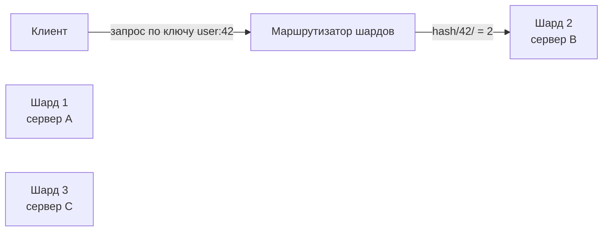

Когда объём данных или нагрузка на отдельный экземпляр базы данных превышают возможности одного сервера, встаёт вопрос о разделении данных на несколько физических узлов. Эту задачу решают **партиционирование** и **шардирование** — техники, лежащие в основе горизонтального масштабирования хранилищ. Для Go-разработчика, строящего высоконагруженный бэкенд, понимание этих механик критически важно: именно на уровне приложения часто принимается решение о том, как маршрутизировать запрос к нужному шарду и как обрабатывать неизбежные компромиссы, вытекающие из CAP-теоремы ([[30. CAP теорема и реальные компромиссы]]).

В этой статье мы разберём, что такое партиционирование и шардирование, какие стратегии используются, как они влияют на архитектуру Go-сервисов и с какими «граблями» сталкиваются разработчики.

### Партиционирование vs Шардирование

Термины часто используют как синонимы, но между ними есть нюанс:

- **Партиционирование** — логическое разделение данных в пределах одного экземпляра СУБД. Таблица разбивается на физические сегменты, но SQL-запросы по-прежнему адресуются к одной базе, которая сама маршрутизирует их к нужной партиции. Пример: `PARTITION BY RANGE` в PostgreSQL.
- **Шардирование** — физическое распределение данных по нескольким независимым экземплярам СУБД (шардам), каждый из которых может находиться на отдельном сервере. Приложение или промежуточный слой должны знать, на каком шарде лежат нужные данные.

Обе техники направлены на горизонтальное масштабирование данных ([[6. Вертикальное и горизонтальное масштабирование]]), но требуют разного уровня вовлечённости приложения.



### Стратегии шардирования

Выбор стратегии определяет, насколько равномерно распределятся данные и как легко будет добавлять новые шарды.

#### 1. Шардирование по диапазону ключей

Данные распределяются по непрерывным диапазонам значений ключа. Например, пользователи с ID от 1 до 1000000 на шарде 1, от 1000001 до 2000000 на шарде 2 и т.д.

**Плюсы:**
- Простота понимания и реализации.
- Запросы по диапазону эффективны (можно направлять на один шард).

**Минусы:**
- Неравномерная нагрузка: новые пользователи часто создаются в конце диапазона, перегружая последний шард.
- Требуется ручная ребалансировка при добавлении шардов.

#### 2. Хэш-шардирование

Ключ прогоняется через хэш-функцию (например, `crc32`, `md5`, `murmur3`), результат по модулю числа шардов определяет целевой шард.

**Плюсы:**
- Равномерное распределение данных при хорошей хэш-функции.
- Детерминизм: всегда можно вычислить шард по ключу.

**Минусы:**
- Диапазонные запросы затрагивают все шарды.
- Добавление нового шарда требует перераспределения всех данных, так как меняется модуль.

#### 3. Консистентное хэширование

Узлы и ключи располагаются на хэш-кольце. Ключ назначается ближайшему по часовой стрелке узлу. При добавлении нового узла перераспределяется только часть данных с соседних узлов.

**Плюсы:**
- Минимальная ребалансировка при изменении числа шардов.
- Подходит для динамических кластеров.

**Минусы:**
- Сложнее в реализации.
- Возможна неравномерность, которую сглаживают виртуальные узлы.

### Реализация в Go: маршрутизация на уровне приложения

В Go-сервисе маршрутизатор шардов обычно представляет собой структуру, вычисляющую целевое соединение с БД по ключу.

```go
type ShardRouter struct {
    shards []*sql.DB
    hash   func(key string) uint32
}

func NewShardRouter(shards []*sql.DB) *ShardRouter {
    return &ShardRouter{
        shards: shards,
        hash:   crc32.ChecksumIEEE,
    }
}

func (r *ShardRouter) GetShard(key string) *sql.DB {
    h := r.hash([]byte(key))
    idx := int(h) % len(r.shards)
    return r.shards[idx]
}

// Использование
func (s *Service) GetUser(ctx context.Context, userID string) (*User, error) {
    db := s.router.GetShard(userID)
    row := db.QueryRowContext(ctx, "SELECT ... FROM users WHERE id = $1", userID)
    // ...
}
```

> [!info] Под капотом
> При хэш-шардировании важно, чтобы хэш-функция была быстрой и не создавала лишних аллокаций. Функции из пакета `hash/crc32` или `hash/fnv` хорошо подходят, так как работают на уровне байтов и не выделяют память в куче. Использование криптографических хэшей (SHA256) избыточно и добавляет CPU-нагрузку.

### Проблемы шардирования и их решение в Go

#### 1. Кросс-шардовые запросы

Запрос, затрагивающий несколько шардов (например, «найти всех пользователей с именем Иван»), нужно отправлять на все шарды и мерджить результаты. В Go это реализуется через рассылку горутин и сбор ответов в канал.

```go
func (s *Service) SearchUsersByName(ctx context.Context, name string) ([]*User, error) {
    var wg sync.WaitGroup
    results := make(chan *User, 100)
    errCh := make(chan error, len(s.router.shards))

    for _, db := range s.router.shards {
        wg.Add(1)
        go func(db *sql.DB) {
            defer wg.Done()
            rows, err := db.QueryContext(ctx, "SELECT ... WHERE name = $1", name)
            if err != nil {
                errCh <- err
                return
            }
            defer rows.Close()
            for rows.Next() {
                var u User
                rows.Scan(&u.ID, &u.Name)
                results <- &u
            }
        }(db)
    }

    go func() {
        wg.Wait()
        close(results)
        close(errCh)
    }()

    var users []*User
    for u := range results {
        users = append(users, u)
    }
    if len(errCh) > 0 {
        return users, <-errCh
    }
    return users, nil
}
```

> [!warning] Ловушка / Gotcha
> Кросс-шардовые запросы резко увеличивают задержку и расходуют ресурсы: каждая горутина открывает отдельное соединение к своему шарду. При большом числе шардов это может исчерпать пул соединений. Также агрегация в памяти может создать значительную нагрузку на GC.

#### 2. Обеспечение глобальной уникальности

Автоинкрементные ID в каждом шарде начинаются с 1, что ведёт к коллизиям. Решения:
- **Snowflake** (Twiter) — распределённые ID, кодирующие timestamp, machine ID, sequence. Легко реализуется на Go с использованием `sync/atomic`.
- **UUID** — глобально уникален, но не упорядочен, что плохо для B-tree индексов.
- **Централизованный сервис ID** — единая точка отказа.

```go
// Простейший генератор Snowflake-like ID
var counter uint64
var machineID = uint64(os.Getpid()) % 32

func GenerateID() uint64 {
    ts := uint64(time.Now().UnixMilli()) << 23
    seq := atomic.AddUint64(&counter, 1) & 0x7FFFF
    return ts | (machineID << 18) | seq
}
```

#### 3. Ребалансировка

При добавлении шарда в схему с хэш-шардированием по модулю все данные нужно переложить. Консистентное хэширование смягчает проблему, но и оно требует перемещения части ключей. В высоконагруженных системах ребалансировка делается постепенно, с двойной записью на старый и новый шарды, и фоновым переносом исторических данных.

### Mechanical Sympathy: влияние шардирования на рантайм Go

**Сеть и системные вызовы.** Каждый запрос к шарду — это сетевое соединение (TCP). При кросс-шардовых запросах горутины одновременно ожидают ответа от многих БД. Планировщик Go эффективно переключает их, но каждая горутина потребляет память под стек. При сотнях одновременных кросс-шардовых запросов общее потребление может быть значительным.

**GC и аллокации.** Мерджинг результатов из нескольких шардов создаёт временные структуры, порождающие мусор. Используйте `sync.Pool` для часто создаваемых объектов (срезы, буферы строк), чтобы снизить давление на GC.

**Кэш-локальность.** Данные, разнесённые по разным серверам, не могут быть эффективно кэшированы в L3-кэше процессора. Это плата за горизонтальное масштабирование.

### Связь с другими архитектурными концепциями

- **CAP теорема** ([[30. CAP теорема и реальные компромиссы]]): шардирование разносит данные, что увеличивает вероятность сетевых разделений. При отказе части шардов система должна выбрать: отвечать частичными данными (AP) или возвращать ошибку (CP).
- **Репликация** ([[32. Репликация. Leader Follower и Multi Leader]]): часто каждый шард дополнительно реплицируется для отказоустойчивости. Получается двухуровневая схема: шардирование + репликация.
- **Кэширование** ([[28. Кэширование. Cache Aside, Write Through, Write Back]]): кэш часто ставится перед шардированной БД для снижения нагрузки и маскировки задержек кросс-шардовых запросов.

### Шардирование на уровне инфраструктуры

Многие современные БД предоставляют встроенное шардирование (Citus для PostgreSQL, MongoDB sharded cluster, CockroachDB). Тогда приложение на Go работает с единым endpoint, а прозрачную маршрутизацию берёт на себя драйвер или прокси. Для Go это означает упрощение кода, но архитектору всё равно необходимо понимать внутренние механизмы для диагностики проблем производительности.

```go
// Подключение к Citus через стандартный pgx
conn, _ := pgxpool.Connect(ctx, "postgres://citus-coordinator:5432/db")
// Все запросы прозрачно шардируются координатором
```

### Антипаттерны

- **Шардирование ради шардирования.** Если данных на 1 ГБ и нагрузка 100 RPS, один мощный сервер с репликой решает задачу проще.
- **Использование разных схем на шардах.** Усложняет миграции и запросы.
- **Отсутствие мониторинга дисбаланса.** Hotspot-шард может тормозить всё приложение.

> [!tip] Собеседование
> **Вопрос:** У нас есть таблица заказов, которая растёт на 1 ТБ в месяц. Как вы предложите её шардировать в Go-приложении?
> **Ответ:** Я бы использовал шардирование по ID заказа с консистентным хэшированием, чтобы минимизировать ребалансировку при добавлении шардов. В приложении маршрутизатор на основе библиотеки `hashring`. Для запросов, требующих поиска по дате, я бы реализовал фоновую синхронизацию в аналитическое хранилище или использовал отдельную индексную таблицу, отображающую диапазоны дат в список шардов. Кросс-шардовые запросы выполнял бы параллельно с ограничением числа горутин через семафор.

### Итог

Партиционирование и шардирование — фундаментальные техники горизонтального масштабирования данных. Они превращают единую базу в распределённую систему, что автоматически поднимает вопросы CAP-теоремы, ребалансировки и маршрутизации. Go-сервис, работающий с шардированным хранилищем, должен быть спроектирован так, чтобы эффективно использовать горутины для параллельных запросов, минимизировать аллокации при агрегации и корректно обрабатывать частичные отказы.

Следующая статья посвящена тому, как обеспечить надёжность данных, разложенных по узлам, — [[32. Репликация. Leader Follower и Multi Leader]].