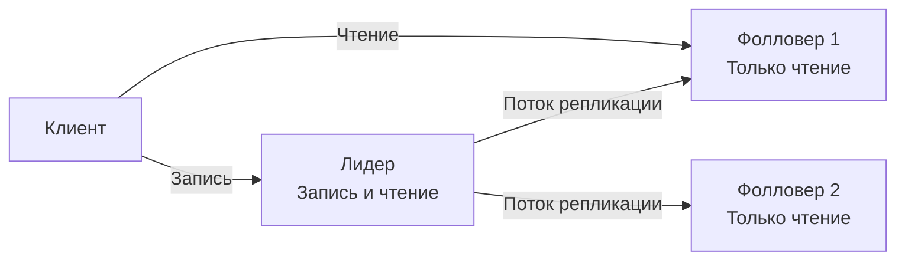
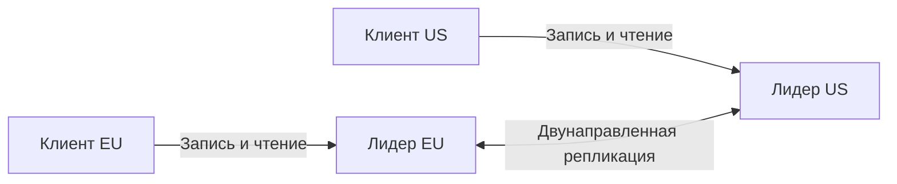

## Репликация как основа надёжности и масштабирования

В предыдущей статье мы разделили данные по шардам, чтобы справиться с объёмом и нагрузкой. Но каждый шард — это всё ещё один физический сервер, уязвимый к отказам. **Репликация** решает проблему надёжности, создавая копии данных на нескольких узлах. Кроме отказоустойчивости, репликация позволяет масштабировать операции чтения, распределяя их между репликами. В мире Go это напрямую влияет на то, как приложение управляет соединениями к базам данных и как обрабатывает устаревшие данные.

### Модели репликации

Существует три фундаментальные топологии репликации: **Leader-Follower** (один ведущий), **Multi-Leader** (несколько ведущих) и **Leaderless** (без ведущего). В бэкенд-разработке на Go наиболее распространены первые две, поэтому сосредоточимся на них.

#### Leader-Follower (Ведущий-Ведомый)

Один узел назначается **лидером** (primary, master). Все операции записи (`INSERT`, `UPDATE`, `DELETE`) направляются строго на лидера. Остальные узлы — **фолловеры** (replicas, standby) — получают изменения от лидера через поток репликации и обслуживают только запросы на чтение.



**Виды репликации в Leader-Follower:**

- **Синхронная:** лидер ждёт подтверждения от одного или нескольких фолловеров, прежде чем закоммитить транзакцию. Гарантирует, что данные не потеряны, но увеличивает задержку записи.
- **Асинхронная:** лидер фиксирует изменения немедленно и передаёт их фолловерам в фоне. Минимальная задержка, но риск потери данных при сбое лидера до того, как репликация завершилась.

**Реализация в Go-приложении:**

Необходимо разделять соединения для записи и чтения.

```go
type DB struct {
    leader  *sql.DB
    followers []*sql.DB
}

// Запись всегда в лидер
func (db *DB) CreateOrder(ctx context.Context, order *Order) error {
    _, err := db.leader.ExecContext(ctx,
        "INSERT INTO orders (...) VALUES (...)", order.ID, ...)
    return err
}

// Чтение — с одного из фолловеров (round-robin или случайный)
func (db *DB) GetOrder(ctx context.Context, id string) (*Order, error) {
    follower := db.followers[rand.Intn(len(db.followers))]
    row := follower.QueryRowContext(ctx,
        "SELECT ... FROM orders WHERE id = $1", id)
    // ...
}
```

> [!info] Под капотом
> В Go стандартный `database/sql` не поддерживает автоматическое разделение ролей. Необходимо явно создавать два пула соединений: один для лидера, другой для фолловеров. Библиотеки вроде `pgxpool` позволяют создавать несколько пулов, каждый со своей строкой подключения. Важно настроить таймауты и максимальное количество соединений в пулах: запись обычно обслуживается меньшим числом горутин, чем чтение.

#### Multi-Leader (Несколько ведущих)

Все узлы могут принимать записи. Каждый узел является лидером и реплицирует изменения на другие узлы. Эта топология применяется, когда узлы географически разнесены и необходима локальная запись с низкой задержкой, или когда требуется offline-работа с последующей синхронизацией.



**Проблема конфликтов:** два клиента могут одновременно изменить одну и ту же запись на разных лидерах. Разрешение конфликтов — ключевая сложность Multi-Leader.

**Способы разрешения конфликтов:**

- **Last Write Wins (LWW):** побеждает запись с более поздней временной меткой. Просто, но возможна потеря данных.
- **Версионирование и явное слияние:** каждая запись хранит векторные часы; при конфликте возвращаются обе версии, клиент или сервер выполняют слияние.
- **CRDT (Conflict-free Replicated Data Types):** специальные структуры данных, которые гарантируют схождение без конфликтов (счётчики, множества).
- **Политика на уровне приложения:** бизнес-логика Go-сервиса решает, как объединить конфликтующие изменения.

```go
// Пример разрешения конфликта на уровне приложения (LWW)
type Order struct {
    ID        string
    Status    string
    UpdatedAt time.Time
}

func MergeOrders(local, remote *Order) *Order {
    if remote.UpdatedAt.After(local.UpdatedAt) {
        return remote
    }
    return local
}
```

> [!warning] Ловушка / Gotcha
> Временные метки ненадёжны: часы на разных серверах могут расходиться. Даже с NTP погрешность может вызвать потерю корректного обновления. Предпочтительнее использовать причинные метаданные (векторные часы) или полагаться на CRDT, если это возможно.

### Репликация в конкретных базах данных: взгляд со стороны Go

**PostgreSQL:** встроенная потоковая репликация (streaming replication). Параметр `synchronous_commit` управляет уровнем синхронности. В Go-приложении можно использовать `pgxpool` с разными строками подключения: для лидера и для реплик (часто указывается `target_session_attrs=read-only` для автоматического выбора реплики).

```go
leaderPool, _ := pgxpool.Connect(ctx, "postgres://leader-host/db")
replicaPool, _ := pgxpool.Connect(ctx, "postgres://replica-host/db?target_session_attrs=read-only")
```

**Redis:** Leader-Follower с асинхронной репликацией. `go-redis` позволяет настроить Sentinel или Cluster для автоматического обнаружения ролей.

```go
rdb := redis.NewFailoverClient(&redis.FailoverOptions{
    MasterName:    "mymaster",
    SentinelAddrs: []string{":26379", ":26380"},
})
// Клиент автоматически направляет запись в мастер, чтение может быть настроено на реплики
```

### Mechanical Sympathy: репликация и Go-рантайм

**Влияние синхронной репликации.** Каждая запись ждёт ответа от реплик — это дополнительные системные вызовы (`write`/`read` на сокетах) и сетевая задержка. Горутина, выполняющая транзакцию, остаётся заблокированной на I/O. Планировщик Go открепляет её от потока ОС, но её стек (минимум 2 КБ) и структуры остаются в памяти. При тысячах синхронных записей в секунду это приводит к заметному потреблению памяти и может снизить пропускную способность.

**Асинхронная репликация** не блокирует горутину записи, что увеличивает throughput и уменьшает latency. Однако возникает окно несогласованности: горутина, читающая с реплики сразу после записи, может не увидеть свои изменения. Для решения этой проблемы используют стратегию **read-your-own-writes**: после критичной записи последующие чтения направляют на лидера, пока репликация не догонит.

```go
func (s *Service) ConfirmOrder(ctx context.Context, id string) error {
    err := s.db.leader.ExecContext(ctx, "UPDATE orders SET status = 'confirmed' WHERE id = $1", id)
    if err != nil {
        return err
    }
    // Read-your-own-writes: следующий GetOrder для этого ID пойдёт в лидер
    cached := s.cache.SetWithFlag(ctx, "order:"+id, "read-from-leader", 2*time.Second)
    return nil
}
```

**Netpoller и пулы соединений.** При использовании реплик Go-приложение открывает множество TCP-соединений (к лидеру и репликам). Netpoller (epoll/kqueue) управляет этими соединениями асинхронно, что позволяет обслуживать тысячи конкурентных запросов без выделения потоков ОС на каждое соединение. Однако важно контролировать размер пулов (`SetMaxOpenConns`, `SetMaxIdleConns`), чтобы не исчерпать лимиты файловых дескрипторов.

### Репликация и CAP

Репликация — прямое следствие CAP-теоремы ([[30. CAP теорема и реальные компромиссы]]):
- **Синхронная репликация** обеспечивает строгую согласованность (CP), жертвуя доступностью при сбое реплик.
- **Асинхронная репликация** обеспечивает доступность (AP), допуская eventual consistency.

Go-разработчик должен осознанно выбирать уровень консистентности в зависимости от бизнес-требований и учитывать это в коде (например, готовность к `stale reads`).

### Антипаттерны и распространённые ошибки

1. **Чтение с лидера, когда можно с реплики.** Лидер должен заниматься записью, иначе он перегружается, ухудшая latency записи.
2. **Игнорирование лага репликации.** Пользователь создал заказ, а список заказов пуст, потому что чтение попало на отстающую реплику. Решение: read-your-own-writes или критичные чтения с лидера.
3. **Отсутствие мониторинга лага.** Лаг репликации — ключевая метрика для обнаружения проблем. Экспортируйте её в Prometheus и настройте алерты.
4. **Использование одного пула соединений для всего.** В Go нельзя смешивать запись и чтение в одном пуле без маршрутизации; создавайте отдельные пулы.

> [!tip] Собеседование
> **Вопрос:** У нас PostgreSQL с Leader-Follower репликацией. Как организовать код на Go, чтобы обеспечить строгую консистентность после записи?
> **Ответ:** После выполнения операции записи клиенту возвращается идентификатор или токен. Для критичных чтений сразу после записи я бы использовал `read-your-own-writes`: либо временно направил бы запрос на лидера, либо подождал бы, пока реплика догонит лидера (например, с помощью `pg_current_wal_lsn()` и ожидания на реплике `pg_last_wal_receive_lsn()`). Для менее критичных ситуаций полагался бы на короткий TTL кэша и eventual consistency.

### Итог

Репликация — фундаментальный механизм обеспечения надёжности и масштабируемости чтения. Выбор между синхронной и асинхронной репликацией, а также между топологиями Leader-Follower и Multi-Leader, определяет, как Go-приложение управляет соединениями, обрабатывает устаревшие данные и разрешает конфликты. Архитектор обязан проектировать сервис так, чтобы он корректно работал в условиях лага репликации и явно отделял операции записи от чтения.

Теперь, когда данные надёжно реплицированы, встаёт вопрос о распределении входящего трафика между узлами — эту задачу решает [[33. Load Balancing на уровне архитектуры]].