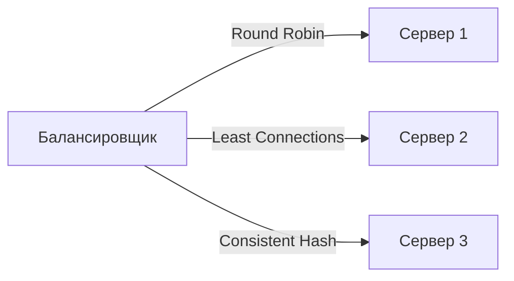

Балансировка нагрузки — это связующее звено, которое превращает набор отдельных инстансов сервиса, реплик базы данных и шардов в единую отказоустойчивую систему. После того как мы реплицировали данные и распределили их по шардам, входящий трафик должен быть равномерно распределён по доступным узлам, а отказавшие узлы — исключены из обработки. В этой статье мы разберём архитектурные уровни балансировки, ключевые алгоритмы, реализацию в Go и влияние на производительность и наблюдаемость.

### Уровни балансировки нагрузки

Балансировка может выполняться на разных уровнях сетевой модели, и каждый уровень имеет свои компромиссы.

**Уровень 4 — транспортный (TCP/UDP):**
- Решение о маршрутизации принимается на основе IP-адресов и портов без анализа содержимого пакетов.
- Минимальная задержка, так как балансировщик не терминирует соединение.
- Примеры: HAProxy (режим TCP), AWS NLB, IPVS.
- В Go на этом уровне можно использовать библиотеки вроде `netlink` для управления виртуальными IP, но чаще инфраструктурные прокси.

**Уровень 7 — прикладной (HTTP/gRPC):**
- Балансировщик терминирует HTTP/HTTPS-соединение, анализирует заголовки, cookies, URI и принимает решение о маршрутизации.
- Позволяет реализовывать sticky sessions, A/B тестирование, canary деплой, терминирование TLS.
- Примеры: Nginx, Envoy, Traefik, а также встроенный `net/http/httputil.ReverseProxy` в Go.
- Дополнительная задержка из-за терминирования и инспекции трафика.

**DNS-балансировка:**
- Клиент получает IP-адрес из DNS-записи с несколькими A-записями.
- Минимальная задержка введения балансировщика, но плохое переключение при отказах из-за кэширования DNS.
- В Go используется системный резолвер (`net.Resolver`), TTL управляет частотой обновлений.

### Алгоритмы балансировки

Выбор алгоритма напрямую влияет на равномерность загрузки и стабильность системы.

- **Round Robin** — запросы по очереди направляются на каждый сервер. Прост, но не учитывает текущую загрузку узлов.
- **Least Connections** — запрос направляется на узел с наименьшим количеством активных соединений. Хорошо подходит для долгих соединений (WebSocket, gRPC стримы).
- **Weighted Round Robin / Least Connections** — узлам назначается вес в зависимости от мощности сервера.
- **Consistent Hashing** — запросы с одним ключом (например, ID пользователя) всегда попадают на один узел. Минимизирует перемаппинг при изменении числа узлов. Полезна для кэширования и sticky sessions.
- **Power of Two Choices (P2C)** — выбираются два случайных узла, и запрос направляется на менее загруженный. Даёт отличное распределение без глобального счётчика соединений.



### Балансировка в Go-сервисах

Go позволяет реализовать балансировку как на стороне сервера (reverse proxy), так и на стороне клиента.

**Серверная балансировка с Reverse Proxy:**

```go
rp := httputil.NewSingleHostReverseProxy(targetURL)
http.HandleFunc("/", func(w http.ResponseWriter, r *http.Request) {
    rp.ServeHTTP(w, r)
})
```

Более сложный пример с пулом бэкендов и round robin:

```go
type LoadBalancer struct {
    mu      sync.Mutex
    backends []*url.URL
    idx     int
}

func (lb *LoadBalancer) ServeHTTP(w http.ResponseWriter, r *http.Request) {
    lb.mu.Lock()
    backend := lb.backends[lb.idx%len(lb.backends)]
    lb.idx++
    lb.mu.Unlock()
    
    proxy := httputil.NewSingleHostReverseProxy(backend)
    proxy.ServeHTTP(w, r)
}
```

**Клиентская балансировка в gRPC:**

gRPC-клиент может использовать встроенный `round_robin` резолвер и балансировщик, что позволяет распределять запросы по нескольким бэкендам без внешнего прокси.

```go
conn, err := grpc.Dial(
    "dns:///myservice:8080",
    grpc.WithDefaultServiceConfig(`{"loadBalancingConfig": [{"round_robin":{}}]}`),
)
```

Для более сложных стратегий подключается `clientconn` с кастомным `balancer.Builder`.

### Client-Side vs Server-Side Discovery

С балансировкой тесно связан **Service Discovery** ([[34. Service Discovery. Client side и Server side]]). Клиентская балансировка предполагает, что клиент знает адреса всех бэкендов (обычно получает их из Service Registry). Серверная балансировка скрывает бэкенды за единым VIP или DNS-именем.

В Go для клиентской балансировки часто используют библиотеки, интегрирующие Service Discovery (Consul, etcd) и предоставляющие `resolver` для gRPC или HTTP-клиента.

### Mechanical Sympathy: влияние на рантайм Go

**Reverse Proxy и горутины.** При использовании `httputil.ReverseProxy` на каждый входящий запрос создаётся горутина, которая устанавливает соединение с бэкендом. Если бэкенд медленный, горутины накапливаются, потребляя память и увеличивая давление на планировщик. Важно настраивать таймауты на `http.Transport` (IdleConnTimeout, ResponseHeaderTimeout).

**Буферизация и копирование данных.** Reverse Proxy в Go копирует тело запроса и ответа через буфер (`io.Copy`). Это создаёт аллокации. Для уменьшения нагрузки можно использовать `http.Hijacker` интерфейс для прямого проброса TCP-соединения (L4 прокси), но тогда теряется возможность инспектировать HTTP.

**Netpoller и исходящие соединения.** Каждый исходящий запрос к бэкенду использует TCP-соединение из пула `http.Transport`. В Linux netpoller управляет этими сокетами, не блокируя потоки ОС. Но при большом количестве бэкендов и высоком RPS важно тюнинговать `MaxIdleConnsPerHost`, чтобы избежать лавинного создания соединений.

### Health Checks и исключение узлов

Балансировщик должен быстро исключать отказавшие узлы. Обычно используется активный health check (периодические запросы на `/health` endpoint) и пассивный (анализ ответов, например, 5xx ошибок).

В Go-сервисе health check endpoint реализуется минималистично:

```go
http.HandleFunc("/health", func(w http.ResponseWriter, r *http.Request) {
    w.WriteHeader(http.StatusOK)
    w.Write([]byte("OK"))
})
```

На уровне балансировщика можно использовать `gobreaker` или собственный подсчёт ошибок для отключения деградировавшего бэкенда.

### Балансировка и observability

Балансировщик — ключевая точка сбора метрик: RPS, latency, статусы ответов. В Go можно инструментировать прокси, добавляя middleware с метриками Prometheus. Трассировка (distributed tracing) позволяет отследить путь запроса от балансировщика до конкретного бэкенда. См. [[39. Observability в архитектуре. Metrics, Logs, Traces]] и [[40. Distributed Tracing и корреляция запросов]].

### Антипаттерны и частые ошибки

- **Sticky sessions без крайней необходимости.** Сессионная привязка разрушает равномерность распределения и усложняет масштабирование. Используйте stateless-сервисы ([[7. Stateless vs Stateful сервисы]]).
- **Балансировка на уровне приложения без health checks.** Если прокси не проверяет живость бэкенда, запросы будут уходить в чёрную дыру.
- **Игнорирование backpressure.** Балансировщик должен иметь лимиты на очередь входящих запросов и отбрасывать их с `503` при перегрузке, иначе все ресурсы уйдут на ожидание.

> [!tip] Собеседование
> **Вопрос:** Как организовать балансировку gRPC-запросов в Go-микросервисах без внешнего прокси?
> **Ответ:** Использовать клиентскую балансировку с Service Discovery. gRPC-клиент настраивается с `balancer` (например, `round_robin`) и `resolver`, который динамически получает адреса бэкендов из etcd/Consul. Это позволяет убрать единую точку отказа в виде внешнего балансировщика и снизить задержку на один хоп.

### Итог

Балансировка нагрузки — это не просто распределение запросов, а архитектурный механизм, который связывает масштабирование, отказоустойчивость и наблюдаемость. В экосистеме Go балансировка может быть реализована на уровне reverse proxy, клиентских библиотек gRPC или внешних прокси (Envoy, Nginx). Правильный выбор алгоритма и тщательная настройка таймаутов и пулов соединений напрямую определяют способность системы держать высокий RPS в рамках заданных SLO.

Теперь, когда трафик равномерно распределён, встаёт вопрос: как клиенты узнают, какие узлы сейчас живы? Ответ — в следующей статье: [[34. Service Discovery. Client side и Server side]].