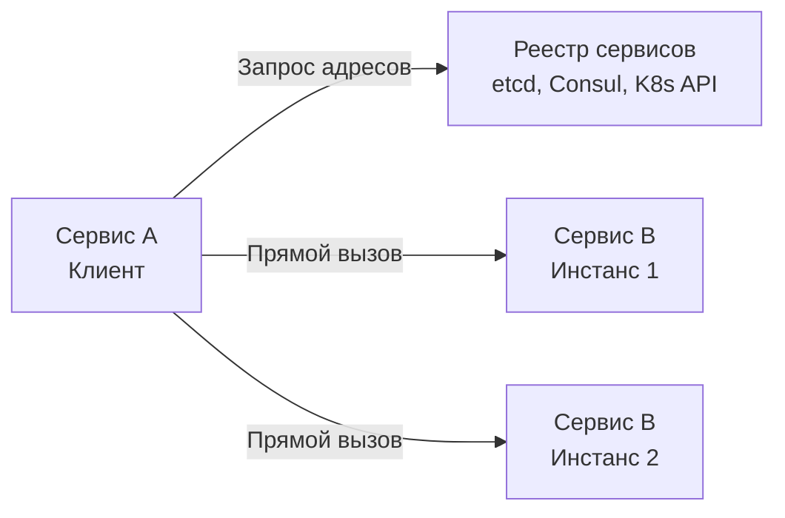
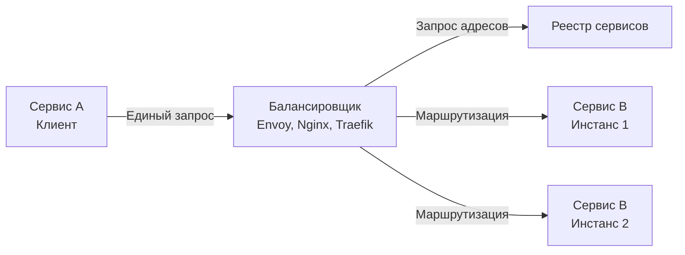

Балансировка нагрузки распределяет трафик по известным узлам, но в динамических средах — облаках, Kubernetes, автоскейлинге — список узлов постоянно меняется: инстансы добавляются, падают, переезжают на другие IP. **Service Discovery** решает задачу обнаружения актуальных адресов сервисов. Без него балансировщик становится слепым, а клиентские вызовы ломаются при первой же смене топологии.

Для Go-разработчика Service Discovery — это не просто «где взять IP», а механика, влияющая на архитектуру межсервисного взаимодействия, надёжность и потребление ресурсов. В этой статье мы разберём две основные модели — **Client-Side** и **Server-Side Discovery**, их реализацию в Go и физические последствия для рантайма.

### Зачем нужен Service Discovery

В эпоху монолита адрес базы данных или другого сервиса прописывался в конфигурационном файле и менялся редко. В микросервисной архитектуре с оркестрацией контейнеров инстансы сервисов появляются и исчезают за секунды. Жёстко заданные IP-адреса больше не работают. Service Discovery обеспечивает:

- **Динамическое обнаружение** — клиент или прокси всегда знает текущий список живых узлов.
- **Устойчивость к отказам** — упавшие узлы исключаются из пула.
- **Масштабируемость** — новые узлы автоматически становятся доступными без изменения клиентского кода.

### Модели Service Discovery

#### Client-Side Discovery

Клиент самостоятельно обращается к **реестру сервисов** (Consul, etcd, ZooKeeper, Kubernetes API), получает список конечных точек и сам выбирает, на какой узел отправить запрос. Балансировка выполняется на стороне клиента.



**Преимущества:**
- Нет дополнительного сетевого хопа (прокси), ниже задержка.
- Нет единой точки отказа в виде балансировщика (реестр может быть отказоустойчивым).
- Гибкий выбор алгоритма балансировки на клиенте.

**Недостатки:**
- Каждый клиент должен реализовывать логику обнаружения, балансировки, повторных попыток.
- Связывает клиента с конкретным реестром и его SDK (например, `consul-api`).
- Рост сложности клиентского кода.

#### Server-Side Discovery

Клиент отправляет запрос на известный адрес **балансировщика** (или API Gateway), который обращается к реестру и маршрутизирует запрос к подходящему бэкенду.



**Преимущества:**
- Клиент ничего не знает о реестре и топологии, проще в реализации.
- Балансировщик может предоставлять дополнительные функции: TLS-терминация, аутентификация, лимитирование.
- Удобно для внешних клиентов (API Gateway).

**Недостатки:**
- Дополнительная сетевая задержка (прокси-хоп).
- Прокси — потенциальная точка отказа, требует кластеризации.
- Балансировщик должен обновлять информацию о бэкендах.

### Реализация в Go

Go предоставляет отличные примитивы для обеих моделей, а его статическая компиляция и легковесные горутины делают клиентскую балансировку эффективной.

#### Client-Side Discovery с gRPC

gRPC имеет встроенную поддержку client-side discovery через интерфейс `resolver.Resolver`. Библиотеки для Consul, etcd, Kubernetes DNS предоставляют готовые резолверы.

```go
import (
    "google.golang.org/grpc"
    _ "github.com/mbobakov/grpc-consul-resolver" // инициализация резолвера
)

conn, err := grpc.Dial(
    "consul://consul-server:8500/service-name",
    grpc.WithDefaultServiceConfig(`{"loadBalancingConfig": [{"round_robin":{}}]}`),
    grpc.WithInsecure(),
)
```

Резолвер периодически опрашивает Consul и обновляет список адресов. gRPC-клиент автоматически подхватывает изменения и перераспределяет стримы.

#### Server-Side Discovery с Envoy и xDS

В Service Mesh (Istio) используется server-side discovery: Envoy-прокси получает конфигурацию от control plane (Istiod) по протоколу xDS и балансирует запросы. Приложению на Go достаточно отправлять запросы на `localhost:15001`.

#### Прямое использование etcd

Для не-gRPC сервисов можно напрямую использовать etcd для регистрации и обнаружения, применяя `clientv3`:

```go
// Регистрация сервиса с TTL
lease, _ := client.Grant(ctx, 10)
client.Put(ctx, "/services/my-service/instance1", "10.0.0.1:8080", clientv3.WithLease(lease.ID))

// Обнаружение
resp, _ := client.Get(ctx, "/services/my-service/", clientv3.WithPrefix())
for _, kv := range resp.Kvs {
    // адреса доступных инстансов
}
```

> [!warning] Ловушка / Gotcha
> При использовании etcd с краткосрочной арендой (lease) упавший сервис исключается после истечения TTL. Но если горутина, продлевающая lease, зависнет из-за блокировки или GC, инстанс будет удалён из реестра, хотя он всё ещё обслуживает запросы. Всегда продлевайте lease в отдельной горутине с контролем `context.Context`.

### Mechanical Sympathy: Service Discovery и рантайм Go

**Сетевые запросы к реестру.** Каждый запрос к etcd или Consul — это HTTP/gRPC вызов. При client-side discovery клиент выполняет периодический опрос (poll) или подписывается на watch (long polling). При long polling горутина удерживает открытое соединение, но блокируется на чтении из сокета. Планировщик Go открепляет её от потока ОС (hand-off), поэтому сотни таких горутин не парализуют систему, но каждая потребляет память (стек ~2 КБ + структуры).

**DNS-запросы.** Некоторые системы discovery полагаются на DNS (SRV-записи, Kubernetes headless services). `net.Resolver` в Go по умолчанию использует системный резолвер (cgo или чистый Go), который кэширует результаты в соответствии с TTL записи. Частые DNS-запросы — это системные вызовы (`getaddrinfo` или прямые UDP-пакеты к DNS-серверу), которые добавляют задержку. Кэширование результатов в локальном in-memory кэше (`sync.Map`) с учётом TTL снижает нагрузку.

**Аллокации при обновлении списка.** При получении нового списка бэкендов происходит десериализация JSON/Protobuf и построение новых структур. Это порождает временные объекты, которые затем собираются GC. В высоконагруженных системах стоит обновлять список инкрементально и переиспользовать объекты через `sync.Pool`.

> [!info] Под капотом
> Стандартный `net.Resolver` в Go имеет внутренний кэш, но он ограничен одним значением на хост. При использовании Kubernetes DNS с большим количеством бэкендов за одной головной службой (headless service) DNS-запрос возвращает множество A-записей, которые кэшируются на время TTL. В это время все горутины, выполняющие `Dial`, видят один и тот же набор адресов, что снижает число системных вызовов.

### Health Checks и исключение узлов

Service Discovery обязан быстро удалять упавшие узлы. В client-side модели это делается на основе пассивных проверок (ошибки соединения, таймауты) или активных health checks. В Go часто используют комбинацию:

- **Пассивный мониторинг**: gRPC автоматически переводит проблемные subconn в состояние `TRANSIENT_FAILURE` и исключает их из балансировки.
- **Активный health check**: фоновая горутина периодически вызывает `/health` или gRPC Health Checking protocol и помечает недоступные узлы.

```go
// Простейший health-check эндпоинт
http.HandleFunc("/health", func(w http.ResponseWriter, r *http.Request) {
    w.WriteHeader(http.StatusOK)
})
```

### Связь с архитектурой и CAP

Service Discovery — это распределённая система. Реестр сам должен быть отказоустойчивым. etcd (Raft) выбирает строгую консистентность (CP), жертвуя доступностью при сетевом разделении. Consul с дефолтными настройками также стремится к CP, но может работать в режиме AP для некоторых операций. DNS-based discovery, напротив, является AP: записи могут временно устаревать, но система всегда доступна. Выбор реестра влияет на поведение всей системы (см. [[30. CAP теорема и реальные компромиссы]]).

### Сравнение Client-Side и Server-Side

| Критерий | Client-Side | Server-Side |
|----------|-------------|-------------|
| **Сложность клиента** | Высокая | Низкая |
| **Сетевая задержка** | Нет лишнего хопа | Дополнительный хоп через прокси |
| **Точка отказа** | Реестр (распределённый) | Балансировщик + реестр |
| **Гибкость балансировки** | Максимальная | Ограничена возможностями прокси |
| **Типичный Go-инструмент** | gRPC resolver, `go-micro` | Envoy, Nginx, `httputil.ReverseProxy` |

> [!tip] Собеседование
> **Вопрос:** В каких случаях вы выберете client-side discovery вместо server-side в Go-проекте?
> **Ответ:** Client-side discovery предпочтителен, когда важна минимальная задержка и нет внешнего API Gateway. Например, внутренние gRPC-сервисы с высоким RPS могут использовать `grpc-go` с резолвером на etcd/Consul, чтобы избежать лишнего сетевого хопа и исключить прокси как точку отказа. Server-side discovery лучше для внешних REST API, где нужен единый вход, терминирование TLS и централизованные политики безопасности.

### Итог

Service Discovery — это неотъемлемый элемент распределённой архитектуры, позволяющий сервисам находить друг друга без жёсткой привязки к адресам. Client-Side Discovery снижает задержку и даёт больше контроля, но переносит сложность в код. Server-Side Discovery упрощает клиентов ценой дополнительной инфраструктуры. В экосистеме Go оба подхода хорошо поддержаны: gRPC резолверы для client-side и reverse-прокси / Service Mesh для server-side. При проектировании важно учитывать влияние на рантайм: периодические запросы к реестру создают горутины и аллокации, а кэширование уменьшает накладные расходы.

Теперь, когда сервисы умеют находить друг друга, встаёт вопрос о том, как управлять внешним трафиком и разграничивать API для разных клиентов. Об этом — в следующей статье: [[35. API Gateway и BFF]].