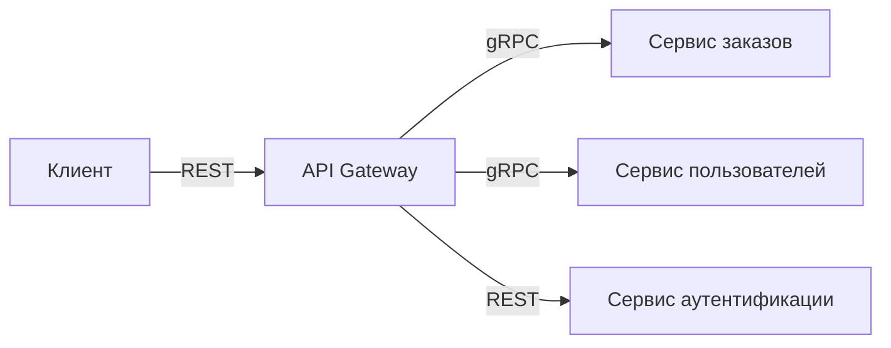
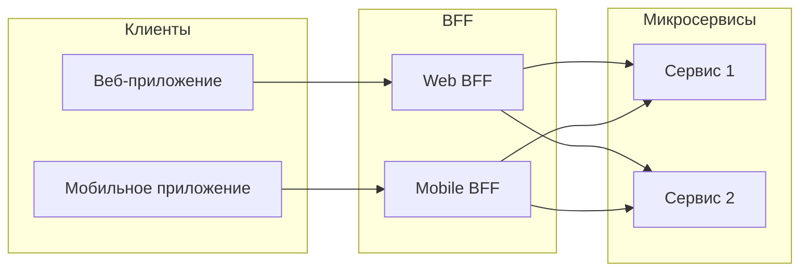

## Единая точка входа и специализированные бэкенды

В предыдущих статьях мы разобрали, как сервисы находят друг друга через Service Discovery и как трафик распределяется между ними с помощью балансировки. Но внешние клиенты — браузеры, мобильные приложения, сторонние API — не должны знать о внутренней топологии системы. Им нужен единый, стабильный и безопасный вход. Эту роль выполняют **API Gateway** и **Backend for Frontend**.

В этой статье мы сравним оба подхода, покажем, как реализовать их на Go с учётом производительности и надёжности, и выясним, какой из них лучше подходит для разных архитектурных сценариев.

### API Gateway: единый парадный вход

API Gateway — это reverse proxy, который принимает все внешние запросы, маршрутизирует их к соответствующим внутренним сервисам и возвращает ответ клиенту. Он является центральной точкой входа и может выполнять сквозные функции:

- **Маршрутизация**: `/orders` → сервис заказов, `/users` → сервис пользователей.
- **Аутентификация и авторизация**: проверка JWT, OAuth2 токенов.
- **Rate Limiting**: защита от DDoS и fair use.
- **Агрегация ответов**: объединение данных из нескольких сервисов в один ответ.
- **Трансформация протоколов**: внешний REST/JSON, внутренний gRPC/Protobuf.
- **Логирование, трассировка, сбор метрик**.



API Gateway уменьшает сложность клиентов, изолирует внутреннюю архитектуру от внешнего мира и упрощает внедрение сквозной функциональности. Однако он может стать узким местом и единой точкой отказа, если не масштабирован и не настроены таймауты.

### Backend for Frontend: специализированный шлюз

**Backend for Frontend (BFF)** — это разновидность API Gateway, заточенная под нужды конкретного клиентского интерфейса: веб-приложения, iOS, Android, публичного API. Идея в том, что разные клиенты требуют разную форму данных и разную логику. Мобильное приложение хочет получать компактные ответы и меньше раундов, веб-приложение может загружать больше данных, а внешний партнёрский API требует строгой документации и стабильности.

BFF разрабатывается и поддерживается той же командой, что и фронтенд. Он выполняет:

- **Агрегацию и фильтрацию данных** специфично под UI.
- **Форматирование ответов** (например, JSON-поля, адаптированные под экраны).
- **Управление сессиями** и токенами, привязанными к конкретному клиенту.
- **Обход ограничений браузеров** (CORS, куки).



BFF снижает связанность между фронтендом и микросервисами: изменение API внутреннего сервиса не ломает клиентов, а требует лишь адаптации BFF.

### Сравнение и выбор

| Критерий | API Gateway | BFF |
|----------|-------------|-----|
| **Количество** | Один на систему (или один на класс трафика) | По одному на тип клиента |
| **Ответственность** | Инфраструктурная команда | Команда фронтенда |
| **Агрегация** | Общая, переиспользуемая | Специфичная под UI |
| **Риск раздувания** | Высокий (становится монолитом) | Низкий (маленький, заточен под задачу) |
| **Производительность** | Централизованная оптимизация | Оптимизация под клиента |

На практике паттерны часто комбинируют: общий API Gateway для сквозной функциональности (TLS, аутентификация, rate limiting), а за ним — BFF для конкретных клиентов.

### Реализация в Go

Go отлично подходит для создания как API Gateway, так и BFF благодаря эффективной работе с сетью, легковесным горутинам и встроенному `httputil.ReverseProxy`.

**Простейший API Gateway на `net/http`:**

```go
type Gateway struct {
    routes map[string]*url.URL
    client *http.Client
}

func (g *Gateway) ServeHTTP(w http.ResponseWriter, r *http.Request) {
    target, ok := g.routes[r.URL.Path]
    if !ok {
        http.NotFound(w, r)
        return
    }
    proxy := httputil.NewSingleHostReverseProxy(target)
    proxy.Transport = g.client.Transport // переиспользуем пул соединений
    proxy.ServeHTTP(w, r)
}
```

Для production-уровня добавляются middleware: аутентификация, rate limiting, circuit breaker (см. [[36. Circuit Breaker, Retry, Timeout и Backoff]]).

**BFF с агрегацией на Go:**

```go
type WebBFF struct {
    ordersClient  *grpc.ClientConn
    usersClient   *grpc.ClientConn
}

func (b *WebBFF) GetDashboard(ctx context.Context, userID string) (*DashboardResponse, error) {
    var (
        orders []*Order
        user   *User
    )
    g, ctx := errgroup.WithContext(ctx)
    
    g.Go(func() error {
        var err error
        orders, err = b.ordersClient.GetRecentOrders(ctx, userID)
        return err
    })
    g.Go(func() error {
        var err error
        user, err = b.usersClient.GetUser(ctx, userID)
        return err
    })

    if err := g.Wait(); err != nil {
        return nil, err
    }
    return &DashboardResponse{User: user, Orders: orders}, nil
}
```

Пакет `golang.org/x/sync/errgroup` позволяет выполнять запросы параллельно и отменять их при первой ошибке, что сокращает задержку.

> [!warning] Ловушка / Gotcha
> При агрегации через параллельные запросы необходимо установить таймаут на общий контекст (`context.WithTimeout`). Иначе медленный бэкенд заставит горутины висеть бесконечно, исчерпывая пул соединений и память.

### Mechanical Sympathy: влияние Gateway и BFF на рантайм Go

**Дополнительный сетевой хоп.** Каждый запрос от клиента к Gateway и от Gateway к бэкенду добавляет задержку. При терминировании HTTP/1.1 и установлении нового соединения это особенно заметно. Использование HTTP/2 или gRPC между Gateway и бэкендами с мультиплексированием снижает накладные расходы.

**Пул горутин.** Reverse Proxy на каждый запрос создаёт горутину, которая копирует тело запроса в бэкенд и тело ответа обратно. Это задействует `io.Copy`, аллоцируя буферы. На высоких RPS это создаёт давление на GC. Важно настроить `http.Transport`:

```go
transport := &http.Transport{
    MaxIdleConns:        100,
    IdleConnTimeout:     90 * time.Second,
    DisableCompression:  false,
}
```

**Netpoller.** Исходящие соединения к бэкендам управляются netpoller'ом, что позволяет обрабатывать тысячи конкурентных запросов без выделения потоков ОС. Но при очень большом количестве бэкендов может потребоваться увеличение лимитов файловых дескрипторов.

**BFF и агрегация.** Параллельные запросы в BFF порождают несколько горутин, каждая из которых удерживает соединение до получения ответа. При росте числа агрегируемых источников растёт потребление памяти. Рекомендуется ограничивать параллелизм через семафор.

### Готовые решения на Go и не только

- **Go-библиотеки и фреймворки для Gateway**: `Lura` (бывший KrakenD) — высокопроизводительный API Gateway с поддержкой плагинов; `Easegress` от MegaEase; собственные реализации на `gin` с middleware.
- **Service Mesh**: Istio/Envoy выполняет роль распределённого gateway, но для внешнего трафика обычно требуется Ingress Gateway.
- **BFF**: как правило, пишется вручную, так как тесно связан с UI.

### Антипаттерны

- **Gateway как монолит**: размещение сложной бизнес-логики внутри gateway превращает его в новое узкое место. Gateway должен быть тонким слоем агрегации и сквозной функциональности.
- **Игнорирование таймаутов**: gateway или BFF без явных таймаутов становятся причиной каскадных отказов (см. [[36. Circuit Breaker, Retry, Timeout и Backoff]]).
- **Единый Gateway для всех**: если команды разные, а gateway один, его эволюция замедляется. Лучше использовать несколько специализированных шлюзов или BFF.

### Связь с другими концепциями

- **Rate Limiting** ([[38. Rate Limiting и защита системы]]) и **Circuit Breaker** ([[36. Circuit Breaker, Retry, Timeout и Backoff]]) обычно реализуются на уровне Gateway.
- **Service Discovery** ([[34. Service Discovery. Client side и Server side]]) и **Load Balancing** ([[33. Load Balancing на уровне архитектуры]]) используются Gateway для поиска бэкендов.
- **Observability** ([[39. Observability в архитектуре. Metrics, Logs, Traces]]): Gateway — идеальная точка для сбора метрик и начала трейсов.

> [!tip] Собеседование
> **Вопрос:** Когда вы выберете BFF вместо общего API Gateway?
> **Ответ:** Если у меня несколько сильно отличающихся клиентов — например, веб-приложение с богатым UI и мобильное приложение с экономией трафика — я предпочту BFF. Это позволит оптимизировать API под каждого клиента, уменьшить размер ответов, сократить число запросов и независимо релизить шлюзы без риска сломать других потребителей. Общий API Gateway я бы оставил для сквозной функциональности вроде аутентификации, TLS и защиты от DDoS.

### Итог

API Gateway и BFF — паттерны организации внешнего входа в микросервисную систему. Они снижают сложность клиентов, изолируют внутреннюю архитектуру и централизуют сквозную функциональность. Go позволяет эффективно реализовывать оба подхода благодаря легковесным горутинам, netpoller'у и встроенным средствам реверс-проксирования. Главное — избегать раздувания шлюза бизнес-логикой и всегда задавать явные таймауты.

Следующая статья посвящена ключевым механизмам отказоустойчивости, которые обязательно должны быть в каждом шлюзе и сервисе: [[36. Circuit Breaker, Retry, Timeout и Backoff]].