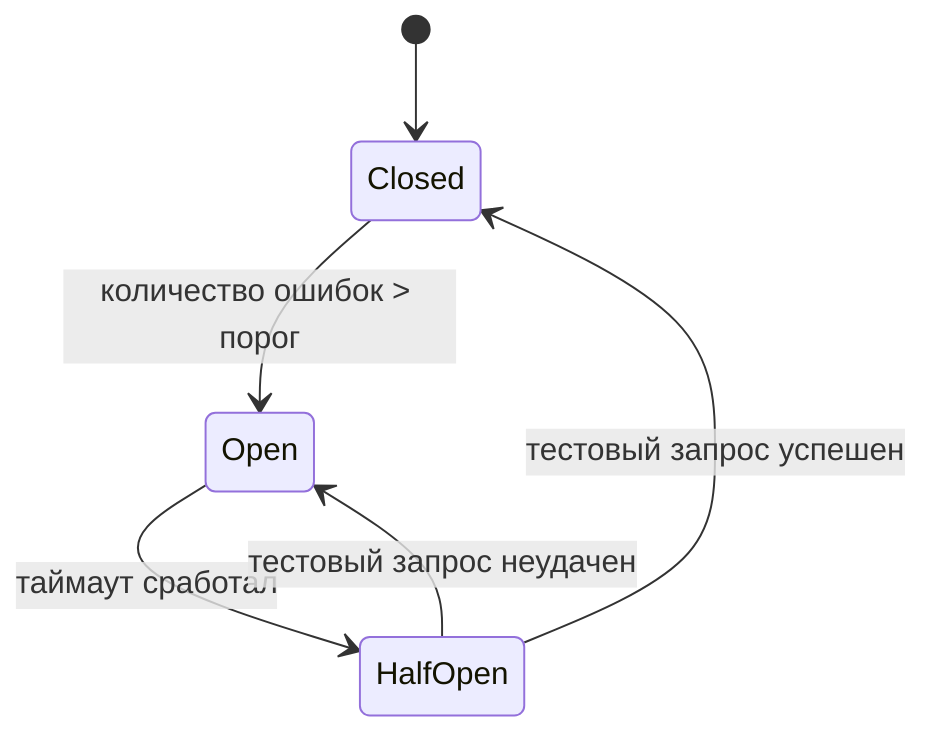

В распределённых системах отказы неизбежны. Сеть дропает пакеты, база данных перегружается, downstream-сервис на секунду подвисает из-за сборки мусора. Без защитных механизмов один точечный сбой может запустить цепную реакцию и положить всю систему. **Таймауты (Timeout), повторные попытки (Retry), откат (Backoff) и автоматический выключатель (Circuit Breaker)** — четыре столпа устойчивости, которые обязан знать и применять каждый Senior Go-разработчик.

Эти паттерны не независимы: они работают в связке, дополняя друг друга. В этой статье мы разберём каждый из них по отдельности, а затем покажем, как они объединяются в боевых Go-сервисах.

### Timeout: не ждать бесконечно

**Timeout** — это максимальное время, в течение которого операция должна завершиться. Если дедлайн превышен, вызов прерывается с ошибкой. Без таймаутов горутина может висеть вечно, удерживая ресурсы (соединение с БД, память, файловый дескриптор).

В Go таймауты реализуются через `context.Context`:

```go
ctx, cancel := context.WithTimeout(context.Background(), 2*time.Second)
defer cancel()

resp, err := httpClient.Do(req.WithContext(ctx))
if err != nil {
    if errors.Is(err, context.DeadlineExceeded) {
        // превышен таймаут
    }
}
```

**Правила хорошего тона:**
- Каждый сетевой вызов (HTTP, gRPC, SQL) должен иметь таймаут.
- Таймауты должны быть каскадными: upstream устанавливает дедлайн, downstream его наследует и, возможно, уменьшает.
- В Go `http.DefaultClient` **не имеет таймаута** — всегда создавайте кастомный клиент.

```go
var httpClient = &http.Client{
    Timeout: 10 * time.Second,
}
```

**Влияние на архитектуру:** таймаут должен быть частью SLO ([[4. SLA, SLO, SLI и как они влияют на дизайн]]). Если сервис обещает P99 latency ≤ 200 мс, таймаут на вызов внешнего API не может быть больше 150 мс.

### Retry: повторить при ошибке

Не каждая ошибка должна приводить к немедленному возврату клиенту. Временный сбой (сетевой всплеск, рассинхронизация лидера в etcd) можно переждать и попробовать снова. **Retry** — это повторная отправка запроса после неудачи.

**Ключевые правила:**
- Повторять только **идемпотентные** операции или операции с гарантией идемпотентности на сервере ([[27. Idempotency и exactly once семантика]]).
- Ограничивать общее время попыток, чтобы не нарушить общий таймаут запроса.
- Использовать **Backoff** между попытками, чтобы не усугубить перегрузку.

```go
func retry(ctx context.Context, maxRetries int, fn func() error) error {
    for i := 0; i <= maxRetries; i++ {
        err := fn()
        if err == nil {
            return nil
        }
        if i == maxRetries {
            return err
        }
        // простой backoff
        select {
        case <-time.After(time.Duration(1<<i) * 100 * time.Millisecond):
        case <-ctx.Done():
            return ctx.Err()
        }
    }
    return nil
}
```

### Backoff: умная пауза между попытками

**Backoff** — стратегия увеличения задержки между повторными попытками. Без неё retry-шторм может добить и без того перегруженный сервис.

**Стратегии:**
- **Constant Backoff**: одинаковая пауза (плохо для защиты downstream).
- **Linear Backoff**: пауза растёт линейно.
- **Exponential Backoff**: пауза удваивается после каждой попытки (`100ms, 200ms, 400ms...`). Стандарт де-факто.
- **Exponential Backoff with Jitter**: к паузе добавляется случайный шум, чтобы пики повторных попыток от множества клиентов не совпали во времени.

Библиотека `github.com/cenkalti/backoff/v4` предоставляет готовые реализации:

```go
b := backoff.NewExponentialBackOff()
b.InitialInterval = 100 * time.Millisecond
b.MaxElapsedTime = 5 * time.Second

err := backoff.Retry(func() error {
    return doSomething()
}, backoff.WithContext(b, ctx))
```

> [!warning] Ловушка / Gotcha
> Не используйте `time.After` в цикле с большим числом итераций без учёта утечки таймеров. Лучше применять `time.NewTimer` и сбрасывать его. Высокоуровневые библиотеки вроде `cenkalti/backoff` уже делают это правильно.

### Circuit Breaker: предотвращение лавины

Когда downstream-сервис стабильно отвечает ошибками или таймаутами, повторные попытки только ухудшают ситуацию, расходуя ресурсы вызывающего. **Circuit Breaker** отслеживает статистику сбоев и на время «размыкает» цепь, выбрасывая ошибку немедленно, без реального вызова.

Три состояния:



- **Closed**: запросы проходят. При накоплении ошибок выше порога переходит в Open.
- **Open**: запросы немедленно фейлятся. Через заданный таймаут переходит в Half-Open.
- **Half-Open**: пропускается пробный запрос. Если он успешен — возврат в Closed, иначе — снова Open.

**Реализация на Go с `sony/gobreaker`:**

```go
cb := gobreaker.NewCircuitBreaker(gobreaker.Settings{
    Name:        "inventory-service",
    MaxRequests: 1,
    Timeout:     10 * time.Second,
    ReadyToTrip: func(counts gobreaker.Counts) bool {
        failureRatio := float64(counts.TotalFailures) / float64(counts.Requests)
        return counts.Requests >= 3 && failureRatio >= 0.6
    },
})

result, err := cb.Execute(func() (interface{}, error) {
    return callInventoryService(ctx, req)
})
```

**Настройка порогов:**
- Порог должен быть адаптирован под нагрузку. Не 3 ошибки подряд при 100 RPS.
- Таймаут в Open должен быть достаточно долгим для восстановления downstream (обычно секунды или десятки секунд).

> [!info] Под капотом
> Circuit Breaker не должен добавлять значительных накладных расходов. В Go внутренние счётчики обновляются атомарно (`sync/atomic`), а сам `Execute` — это почти бесплатная проверка флага.

### Mechanical Sympathy: нагрузка на рантайм Go

**Горутины и таймауты.** Каждый `context.WithTimeout` запускает внутренний таймер. После истечения таймер отправляет сигнал в канал `ctx.Done()`. Это не создаёт дополнительных горутин, но использует кучу и GC для объекта таймера (в Go 1.23 таймеры улучшены). Важно не создавать миллионы таймаутов в секунду без необходимости.

**Retry и аллокации.** Каждый повтор порождает новые запросы, сериализацию, десериализацию — мусор. `sync.Pool` для буферов и переиспользование структур снижают давление на GC.

**Netpoller.** Таймауты и повторные попытки увеличивают число сетевых операций. Планировщик Go и netpoller (epoll/kqueue) справляются, но важно ограничивать максимальное количество одновременных вызовов через семафор или worker pool, чтобы не перегрузить сетевой стек.

### Интеграция четырёх механизмов

В реальном Go-сервисе они комбинируются:

```go
func callWithRetryAndBreaker(ctx context.Context, cb *gobreaker.CircuitBreaker, client *http.Client, req *http.Request) (*http.Response, error) {
    return cb.Execute(func() (interface{}, error) {
        var resp *http.Response
        err := backoff.Retry(func() error {
            var e error
            resp, e = client.Do(req.WithContext(ctx))
            if e != nil {
                if isRetryable(e) {
                    return e
                }
                return backoff.Permanent(e)
            }
            if resp.StatusCode >= 500 {
                return fmt.Errorf("server error: %d", resp.StatusCode)
            }
            return nil
        }, backoff.WithContext(backoff.NewExponentialBackOff(), ctx))
        return resp, err
    })
}
```

**Порядок:** Timeout ограничивает каждую попытку и общее время → Retry с Backoff пытается преодолеть временный сбой → Circuit Breaker защищает от устойчивого отказа.

### Связь с другими архитектурными паттернами

- **Idempotency** ([[27. Idempotency и exactly once семантика]]): Retry без идемпотентности — источник дублей. Все повторяемые запросы должны быть идемпотентными.
- **Bulkhead** ([[37. Bulkhead и изоляция отказов]]): Circuit Breaker изолирует проблемный компонент, но Bulkhead дополнительно ограничивает число одновременных вызовов к нему.
- **Rate Limiting** ([[38. Rate Limiting и защита системы]]): Rate Limiter предотвращает перегрузку, Circuit Breaker реагирует на уже возникшие ошибки.
- **Saga** ([[26. Saga Pattern. Оркестрация и хореография]]): каждая локальная транзакция в Saga может оборачиваться в таймауты и ретраи.

### Антипаттерны

- **Бесконечный Retry:** без лимита попыток или общего таймаута горутина никогда не завершится.
- **Retry для всех ошибок:** недопустимо повторять ошибки валидации или бизнес-логики (например, «товар не найден»).
- **Слишком короткий Timeout:** приводит к ложным срабатываниям и излишним ретраям.
- **Единый Circuit Breaker на всё:** разным downstream нужны разные пороги и таймауты.

> [!tip] Собеседование
> **Вопрос:** Зачем нужен Circuit Breaker, если уже есть Retry с Backoff?
> **Ответ:** Retry помогает при кратковременных сбоях, но если downstream упал надолго, повторные попытки будут лишь тратить ресурсы и увеличивать задержку. Circuit Breaker быстро обнаруживает устойчивый отказ, немедленно прерывает вызовы и даёт downstream время на восстановление, не забивая его повторными запросами.

### Итог

Timeout, Retry, Backoff и Circuit Breaker — обязательные элементы надёжного микросервиса. В Go они реализуются с помощью контекстов, стандартных библиотек и минимального набора внешних пакетов, без тяжёлых фреймворков. Главное — комбинировать их осмысленно, соблюдая идемпотентность и не нарушая SLO.

В следующей статье мы рассмотрим ещё один важный механизм изоляции отказов — [[37. Bulkhead и изоляция отказов]].