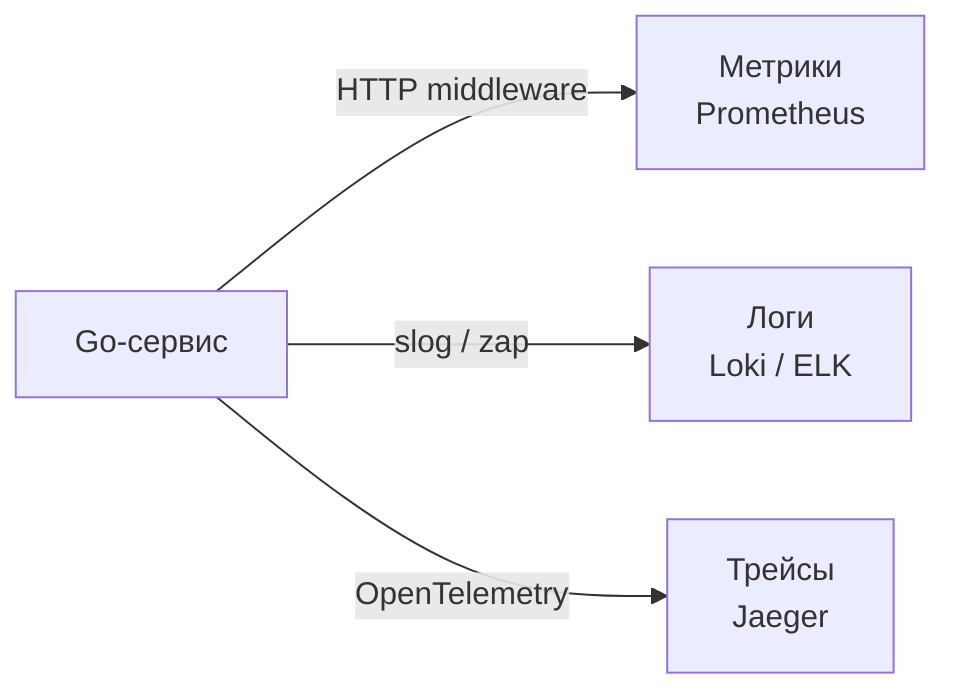

## Три столпа наблюдаемости

Rate Limiting, Circuit Breaker и Bulkhead делают систему устойчивой к перегрузкам и отказам, но устойчивость не означает отсутствие проблем. Рано или поздно что-то пойдёт не так: вырастет latency, увеличится процент ошибок, конкретный клиент начнёт получать таймауты. Без возможности **видеть и понимать**, что происходит внутри системы, мы обречены гадать и чинить симптомы, а не причины. Именно эту способность даёт **Observability (наблюдаемость)**.

В этой статье мы разберём три столпа observability — **метрики, логи и трейсы**, их роль в архитектуре, способы реализации в Go и то, как они влияют на производительность самого сервиса.

### Observability vs Monitoring

**Мониторинг** — это сбор предопределённых метрик и алертов. Он отвечает на вопрос «Что сломалось?». **Observability** — более широкая концепция: способность задавать системе произвольные вопросы о её поведении без необходимости заранее предсказывать, что может пойти не так. На практике это достигается комбинацией метрик, логов и распределённой трассировки.

- **Метрики** отвечают на вопрос «Сколько? Как быстро? Как часто?».
- **Логи** — «Что именно произошло в конкретный момент?».
- **Трейсы** — «Как запрос прошёл через систему? Где именно возникла задержка?».



### Метрики: числа, раскрывающие тренды

Метрики — это числовые временные ряды: количество запросов, длительность обработки, количество ошибок, потребление памяти. В Go-экосистеме стандартом де-факто стал **Prometheus** с библиотекой `prometheus/client_golang`.

#### RED-паттерн: Rate, Errors, Duration

Для любого сервиса критично измерять три величины:

- **Rate** — количество запросов в секунду.
- **Errors** — доля запросов, завершившихся ошибкой.
- **Duration** — распределение длительности обработки.

Вот минимальная инструментация HTTP-сервера на Go:

```go
var (
    httpRequestsTotal = prometheus.NewCounterVec(
        prometheus.CounterOpts{Name: "http_requests_total"},
        []string{"method", "path", "status"},
    )
    httpRequestDuration = prometheus.NewHistogramVec(
        prometheus.HistogramOpts{
            Name:    "http_request_duration_seconds",
            Buckets: prometheus.DefBuckets,
        },
        []string{"method", "path"},
    )
)

func MetricsMiddleware(next http.Handler) http.Handler {
    return http.HandlerFunc(func(w http.ResponseWriter, r *http.Request) {
        start := time.Now()
        rw := &responseWriter{ResponseWriter: w, statusCode: http.StatusOK}
        next.ServeHTTP(rw, r)
        duration := time.Since(start).Seconds()
        httpRequestsTotal.WithLabelValues(r.Method, r.URL.Path, strconv.Itoa(rw.statusCode)).Inc()
        httpRequestDuration.WithLabelValues(r.Method, r.URL.Path).Observe(duration)
    })
}
```

#### USE-паттерн: Utilisation, Saturation, Errors

Для инфраструктурных метрик (CPU, память, горутины) применяется USE:

```go
prometheus.MustRegister(prometheus.NewGoCollector()) // метрики рантайма Go
```

#### Экспорт метрик

Метрики отдаются через HTTP-эндпоинт `/metrics`, который опрашивает Prometheus:

```go
http.Handle("/metrics", promhttp.Handler())
```

### Логи: контекст и детали

Логи дают максимальный контекст о конкретном событии. В Go с версии 1.21 появился пакет `log/slog`, предоставляющий структурированное логирование из коробки. До этого стандартом был `uber-go/zap` или `rs/zerolog`.

Ключевой принцип — **структурированные логи в JSON**, которые легко парсить централизованными системами (Loki, ELK). Каждый лог должен содержать trace ID, span ID, уровень и сообщение.

```go
logger := slog.New(slog.NewJSONHandler(os.Stdout, &slog.HandlerOptions{Level: slog.LevelInfo}))
logger.InfoContext(ctx, "order created",
    "order_id", order.ID,
    "user_id", order.UserID,
    "duration_ms", duration.Milliseconds(),
)
```

> [!warning] Ловушка / Gotcha
> Не используйте `log.Printf` в production. Неструктурированные логи невозможно эффективно индексировать и искать. Переход на `slog` или `zap` — один из первых шагов к observability.

### Распределённая трассировка: путь запроса

В микросервисной архитектуре один пользовательский запрос может пройти через десяток сервисов. Трейс связывает все эти шаги в единую картину, показывая, где именно возникла задержка или ошибка. Стандарт в Go-мире — **OpenTelemetry** (OTel).

Трассировка строится на пробросе **контекста** через заголовки (обычно W3C Trace Context или B3). В Go контекст передаётся через `context.Context`. Каждый исходящий HTTP/gRPC-запрос должен инжектировать трейс-заголовки, а входящий — извлекать их.

```go
import (
    "go.opentelemetry.io/otel"
    "go.opentelemetry.io/contrib/instrumentation/net/http/otelhttp"
)

// Оборачиваем HTTP-хендлер
handler := otelhttp.NewHandler(mux, "server")

// Оборачиваем HTTP-клиент
client := &http.Client{Transport: otelhttp.NewTransport(http.DefaultTransport)}
```

В коде можно создавать спаны вручную для ключевых операций:

```go
tracer := otel.Tracer("order-service")
ctx, span := tracer.Start(ctx, "CreateOrder")
defer span.End()
// бизнес-логика...
```

Экспорт трейсов отправляется в коллектор (Jaeger, Grafana Tempo) через OTLP-протокол.

### Mechanical Sympathy: цена observability

Observability добавляет накладные расходы, и архитектор обязан их контролировать.

**Метрики.** Инструментация через `prometheus/client_golang` добавляет атомарные инкременты и сохранение значений в гистограммах. Это дёшево, но создание большого количества label'ов с высокой кардинальностью (например, `user_id`) взрывает потребление памяти. Никогда не используйте ID клиента или заказа как лейбл метрики.

**Логи.** Каждый вызов `slog.InfoContext` — это аллокация строк, сериализация в JSON и запись в `os.Stdout` (системный вызов `write`). В высоконагруженных системах запись в stdout может блокировать горутину. Используйте асинхронные буферизированные врайтеры (например, `zap` с `zapcore.NewSampler`).

**Трассировка.** Каждый спан — это аллокация структуры, запись атрибутов и экспорт по сети. Слишком детальная трассировка (на каждый SQL-запрос) может создавать огромный объём данных. Настраивайте сэмплирование: в production обычно семплируют 1-10% трейсов.

```go
sampler := sdktrace.ParentBased(sdktrace.TraceIDRatioBased(0.1))
```

> [!info] Под капотом
> Горутины, создающие спаны, добавляют их в `context.Context`. При экспорте спанов батчами используется фоновая горутина, которая отправляет их по OTLP. Всё это потребляет сеть и CPU, но планировщик Go эффективно управляет этими горутинами.

### Корреляция через единый идентификатор

Метрики, логи и трейсы объединяются через общий **trace ID**. В логи добавляется `trace_id` и `span_id`, в трейс — те же идентификаторы, в метрики — через exemplars. Это позволяет перейти от алерта («возросла доля ошибок») к конкретному трейсу и логам.

```go
func loggingMiddleware(next http.Handler) http.Handler {
    return http.HandlerFunc(func(w http.ResponseWriter, r *http.Request) {
        traceID := trace.SpanContextFromContext(r.Context()).TraceID().String()
        logger := slog.With("trace_id", traceID)
        ctx := context.WithValue(r.Context(), loggerKey, logger)
        next.ServeHTTP(w, r.WithContext(ctx))
    })
}
```

### Observability в архитектуре

Observability — это не библиотека, а сквозная функциональность, пронизывающая все слои ([[14. Clean Architecture и Dependency Rule]]). Она должна быть заложена в интерфейсы:

- Каждый адаптер (HTTP-хендлер, репозиторий БД, клиент к внешнему API) пробрасывает контекст и логирует ошибки.
- Метрики собираются на границах системы (входящие/исходящие запросы) и в ключевых точках бизнес-логики.
- Трейсы охватывают цепочку вызовов: Gateway → Service → Repository → DB.

### Связь с другими темами

- **Распределённая трассировка** детально разобрана в [[40. Distributed Tracing и корреляция запросов]].
- **Метрики** — основа для SLO и алертов ([[4. SLA, SLO, SLI и как они влияют на дизайн]]).
- **Логирование** интегрируется с централизованными системами, что обсуждалось в контексте инфраструктуры.

> [!tip] Собеседование
> **Вопрос:** Как вы организуете observability в новом Go-микросервисе с нуля?
> **Ответ:** Я начну с трёх вещей. 1) Метрики: `promhttp` для HTTP, `NewGoCollector` для рантайма, кастомные метрики для бизнес-логики (счётчики заказов, ошибок, гистограммы latency). 2) Логи: `slog` с JSON-хендлером, добавление `trace_id` в каждый лог. 3) Трассировка: OpenTelemetry SDK с OTLP-экспортёром в Jaeger, инструментация HTTP и gRPC через `otelhttp` и `otelgrpc`, создание спанов в ключевых бизнес-операциях. Всё это заверну в middleware, пробрасывающие контекст.

### Итог

Observability — это не роскошь, а инженерная необходимость. Метрики дают агрегированную картину и алерты, логи — детальный контекст, трейсы — сквозной путь запроса. Вместе они позволяют быстро диагностировать проблемы, не превращая инциденты в гадание. Go предоставляет все необходимые примитивы для observability, но архитектор должен осознанно настраивать сэмплирование, контролировать кардинальность метрик и минимизировать накладные расходы на рантайм.

В следующей статье мы углубимся в самый сложный из трёх столпов: [[40. Distributed Tracing и корреляция запросов]].