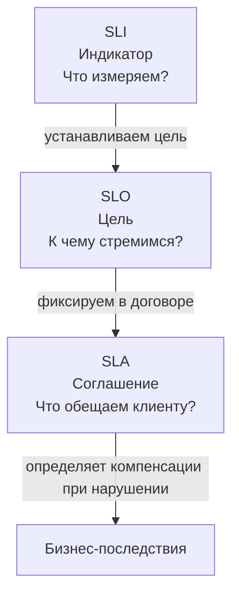

В предыдущей статье мы разделили требования на функциональные и нефункциональные. Теперь мы переходим к конкретным измеримым показателям, с помощью которых инженеры и бизнес договариваются о качестве работы системы. Без этих метрик невозможно понять, справляется ли архитектура с нагрузкой, пора ли масштабироваться и насколько критичен очередной инцидент.

**SLI, SLO и SLA** — три кита, на которых держится управление надёжностью в современном бэкенде. Для Go-разработчика уровня Senior+ понимание этих концепций обязательно: они напрямую влияют на выбор архитектурных паттернов, настройку таймаутов, стратегии ретраев и даже на структуру кода.

### Определения: SLI, SLO, SLA

Эти три термина образуют иерархию от конкретных измерений до бизнес-обязательств.

| Аббревиатура | Расшифровка | Суть | Пример |
|--------------|-------------|------|--------|
| **SLI** | Service Level Indicator | Конкретная числовая метрика, характеризующая аспект работы сервиса. **Измеряем.** | P99 latency = 45ms, error rate = 0.05% |
| **SLO** | Service Level Objective | Целевое значение SLI за определённый период. **Целимся.** | P99 latency ≤ 100ms за 28 дней |
| **SLA** | Service Level Agreement | Юридически обязывающий договор с клиентом, включающий SLO и компенсации при нарушении. **Обещаем.** | Доступность 99.9% ежемесячно, иначе штраф 10% от оплаты |



> [!info] Под капотом
> SLI — это сырые данные, которые ваш Go-сервис экспортирует в виде метрик (Prometheus, Datadog). SLO — это конфигурация алертов и дашбордов. SLA — это строчка в контракте. Внутренние сервисы обычно ограничиваются SLI и SLO; SLA появляется, когда сервис предоставляется внешним платящим клиентам.

### SLI для Go-сервиса: четыре золотых сигнала

В Site Reliability Engineering (Google) выделяют **Four Golden Signals** — четыре ключевых SLI, применимых практически к любому сервису.

#### 1. Latency (Задержка)

Время обработки запроса. Для веб-сервиса на Go это время от получения HTTP-запроса до отправки ответа.

**Как измерять в Go:**
Middleware, замеряющий длительность с помощью `time.Since()` и экспортирующий гистограмму в Prometheus.

```go
func MetricsMiddleware(next http.Handler) http.Handler {
    return http.HandlerFunc(func(w http.ResponseWriter, r *http.Request) {
        start := time.Now()
        defer func() {
            duration := time.Since(start).Seconds()
            httpRequestDuration.WithLabelValues(r.Method, r.URL.Path).Observe(duration)
        }()
        next.ServeHTTP(w, r)
    })
}
```

> [!warning] Ловушка / Gotcha
> **Усреднение логарифмическое vs линейное.** Не используйте среднее арифметическое (avg) для latency! Оно скрывает выбросы. Используйте процентили: P50 (медиана), P90, P99. В Prometheus гистограмма с buckets позволяет вычислять процентили с помощью `histogram_quantile()`.

#### 2. Traffic (Трафик)

Количество запросов к сервису. Измеряется в RPS (Requests Per Second) или RPM.

**Как измерять:** Counter метрика, инкрементируемая в том же middleware.

```go
httpRequestsTotal.WithLabelValues(r.Method, r.URL.Path).Inc()
```

#### 3. Errors (Ошибки)

Доля запросов, завершившихся ошибкой. Важно разделять ошибки клиента (4xx) и ошибки сервера (5xx). Для SLO обычно учитываются только 5xx как индикатор проблем в самом сервисе.

**Как измерять:** Условный инкремент счетчика ошибок при `statusCode >= 500`.

```go
if statusCode >= 500 {
    httpRequestErrors.WithLabelValues(r.Method, r.URL.Path).Inc()
}
```

#### 4. Saturation (Насыщение)

Насколько сервис близок к пределу своих возможностей. Для Go-сервиса это может быть:
- Количество активных горутин.
- Использование CPU (`GOMAXPROCS`).
- Давление GC (pause duration, частота циклов).
- Заполненность очередей каналов.

**Как измерять:** Экспорт runtime-метрик через `prometheus.NewGoCollector()` или кастомные метрики из `runtime.MemStats`.

```go
// Регистрация стандартных метрик Go runtime
prometheus.MustRegister(prometheus.NewGoCollector())
```

### SLO и Error Budget

**SLO** — это цель, выраженная через SLI. Например: «99.9% запросов к эндпоинту `/api/order` за последние 30 дней должны обрабатываться быстрее 200 мс».

Из SLO вытекает ключевое понятие — **Error Budget (Бюджет ошибок)**.

**Error Budget = 1 - SLO**

Если SLO по доступности = 99.9%, то допустимое время недоступности в месяц составляет `(100% - 99.9%) * 30 * 24 * 60 = 43.2 минуты`. Это «бюджет», который команда может «тратить» на:
- Плановые деплои с риском.
- Эксперименты с новой фичей.
- Неизбежные инциденты.

Пока бюджет ошибок не исчерпан, команда может двигаться быстро. Когда бюджет на исходе, приоритет смещается в сторону стабильности: деплои замораживаются, все силы брошены на устранение корневых причин.

> [!tip] Собеседование
> **Вопрос:** Зачем нужен Error Budget и как он влияет на процесс разработки?
> **Ответ:** Error Budget превращает надёжность из абстрактного «мы должны быть стабильны» в конкретный измеримый ресурс. Он даёт команде право на риск в пределах бюджета и служит объективным критерием для остановки релизов. Например, если за две недели мы уже исчерпали 80% бюджета из-за двух инцидентов, новые фичи откладываются до исправления проблем.

### Как SLO и Error Budget влияют на архитектурный дизайн

SLO — не просто цифры в дашборде. Они напрямую диктуют архитектурные решения.

#### Таймауты и дедлайны

Если SLO по latency = 200 мс, то все downstream-вызовы должны иметь таймауты, укладывающиеся в этот бюджет. В Go это реализуется через `context.WithTimeout`.

```go
func (s *OrderService) CreateOrder(ctx context.Context, req *CreateOrderRequest) (*Order, error) {
    // SLO сервиса 200ms, выделяем 50ms на проверку наличия во внешнем API
    stockCtx, cancel := context.WithTimeout(ctx, 50*time.Millisecond)
    defer cancel()

    available, err := s.stockClient.CheckAvailability(stockCtx, req.Items)
    if err != nil {
        if errors.Is(err, context.DeadlineExceeded) {
            // Таймаут — логируем и, возможно, используем fallback
            metrics.StockTimeout.Inc()
            return nil, ErrTemporaryUnavailable
        }
        return nil, err
    }
    // ...
}
```

> [!warning] Ловушка / Gotcha
> В Go дефолтный HTTP-клиент **не имеет таймаута**! `http.DefaultClient` будет висеть бесконечно. Всегда создавайте кастомный клиент с явным `Timeout` или используйте `context`.

```go
var httpClient = &http.Client{
    Timeout: 10 * time.Second,
}
```

#### Ретраи и Circuit Breaker

При недоступности downstream-сервиса автоматические ретраи могут быстро съесть Error Budget, если их делать бездумно. Необходимы:
- **Exponential backoff** с jitter.
- **Ограничение количества попыток**.
- **Circuit Breaker**, предотвращающий лавину запросов к упавшему сервису.

Эти паттерны будут детально рассмотрены в статье [[36. Circuit Breaker, Retry, Timeout и Backoff]].

#### Репликация и Multi-Region

Если SLO требует доступности 99.99% (допустимый простой ~52 минуты в год), то одного дата-центра недостаточно — любой сбой сети или питания выбьет бюджет. Архитектура должна включать:
- Развёртывание в нескольких регионах.
- Геораспределённый балансировщик.
- Репликацию данных с учётом CAP-теоремы ([[30. CAP теорема и реальные компромиссы]]).

Для Go-сервиса это означает, что код должен быть **stateless** ([[7. Stateless vs Stateful сервисы]]), а состояние вынесено во внешние хранилища с поддержкой репликации.

#### Управление горутинами и пулами соединений

Неограниченное создание горутин или открытие соединений к БД может привести к saturation и нарушению SLO по latency.

```go
// Ограничение количества одновременных запросов с помощью семафора
sem := make(chan struct{}, 100) // максимум 100 конкурентных операций

func (h *Handler) HeavyOp(ctx context.Context) error {
    select {
    case sem <- struct{}{}:
        defer func() { <-sem }()
        // выполнение операции
    case <-ctx.Done():
        return ctx.Err()
    }
}
```

Настройка пула соединений к PostgreSQL через `database/sql`:

```go
db.SetMaxOpenConns(25)
db.SetMaxIdleConns(10)
db.SetConnMaxLifetime(5 * time.Minute)
```

### Mechanical Sympathy: GC и хвостовые задержки

Для Go-сервисов с жёсткими SLO по latency (P99 < 50ms) критическое значение приобретает поведение сборщика мусора.

Даже при субмиллисекундных паузах GC в Go, эти паузы могут случаться достаточно часто при интенсивных аллокациях. Если ваш сервис аллоцирует много памяти на каждый запрос, то GC будет запускаться чаще, и отдельные запросы могут «залипать» на паузе, выбиваясь из P99.

**Что с этим делать:**
1. **Минимизировать аллокации** — переиспользовать объекты через `sync.Pool`.
2. **Профилировать** с `go tool pprof -alloc_space`.
3. **Настраивать GC** через `GOGC` и `GOMEMLIMIT` (Go 1.19+).
4. **Использовать value-типы вместо указателей**, где это возможно, чтобы снизить давление на кучу.

```go
// Плохо: аллокация на каждый запрос
type Response struct {
    Data []byte
}

func handler(w http.ResponseWriter, r *http.Request) {
    resp := &Response{Data: make([]byte, 1024)} // аллокация
    // ...
}

// Хорошо: переиспользование через Pool
var responsePool = sync.Pool{
    New: func() interface{} { return &Response{Data: make([]byte, 0, 1024)} },
}

func handlerOptimized(w http.ResponseWriter, r *http.Request) {
    resp := responsePool.Get().(*Response)
    defer responsePool.Put(resp)
    resp.Data = resp.Data[:0] // сброс длины
    // ...
}
```

### Практический пример: расчёт бюджета ошибок для Go-сервиса

Допустим, у нас есть HTTP-сервис на Go, обрабатывающий заказы.

**SLI:**
- Availability = доля успешных (2xx) ответов к общему числу запросов.
- P99 Latency = 99-й процентиль времени ответа.

**SLO:**
- Availability ≥ 99.95% за 30 дней.
- P99 Latency ≤ 100 мс за 30 дней.

**Бюджет ошибок (по доступности):**
- 30 дней * 24 * 60 = 43200 минут.
- Допустимый простой = 0.05% * 43200 = **21.6 минуты** в месяц.

**Что это значит для архитектуры:**
- Деплой новой версии, занимающий 2 минуты простоя (если без graceful shutdown и rolling update), съедает ~10% бюджета.
- Инцидент с 5-минутным даунтаймом — это 23% бюджета.
- После двух таких инцидентов бюджет исчерпан, новые релизы блокируются.

**Реализация в коде:**
Чтобы не выходить за бюджет, мы внедряем:
- **Graceful shutdown** (как показано в предыдущей статье).
- **Readiness/Liveness probes** в Kubernetes.
- **Rolling update** с `maxUnavailable: 0` и `maxSurge: 1`.

### SLA: когда метрики становятся деньгами

SLA — это уже не внутренний инженерный инструмент, а бизнес-документ. Пример формулировки:

> «Сервис обеспечивает доступность 99.9% ежемесячно. В случае недоступности более 43.2 минут в месяц, клиент получает кредит в размере 10% от месячной платы за каждый последующий час простоя».

Инженерное следствие: **SLO должно быть строже SLA**. Если SLA обещает 99.9%, внутренний SLO команда может установить на уровне 99.95% или даже 99.99%, чтобы иметь буфер на случай непредвиденных инцидентов и не платить штрафы.

> [!tip] Собеседование
> **Вопрос:** Почему внутренний SLO часто строже внешнего SLA?
> **Ответ:** Это создаёт **буфер безопасности**. Если команда целится в SLO 99.95%, а клиенту обещано 99.9%, у команды есть запас в ~21 минуту простоя, прежде чем начнут действовать финансовые санкции. Также это учитывает погрешности измерений и человеческий фактор.

### Итог

- **SLI** — конкретные числовые метрики (latency, error rate, saturation). В Go измеряются через middleware и экспорт в системы мониторинга.
- **SLO** — цели по SLI, задающие допустимый уровень качества и определяющие **Error Budget**.
- **SLA** — бизнес-договор, нарушение которого влечёт финансовые последствия.
- SLO напрямую влияют на архитектурные решения: таймауты, ретраи, масштабирование, управление горутинами и настройку GC.
- В Go особенно важно контролировать хвостовые задержки из-за влияния GC, что требует профилирования и осознанной работы с памятью.

Понимание SLA/SLO/SLI превращает архитектуру из набора субъективных «хороших практик» в систему, управляемую данными. Вы точно знаете, какой ценой даётся каждая фича и когда пора остановиться и чинить стабильность.

Теперь, вооружившись метриками, мы готовы разобрать фундаментальные компромиссы, лежащие в основе любого System Design. В следующей статье: [[5. Latency, Throughput, Availability и Trade-offs]].