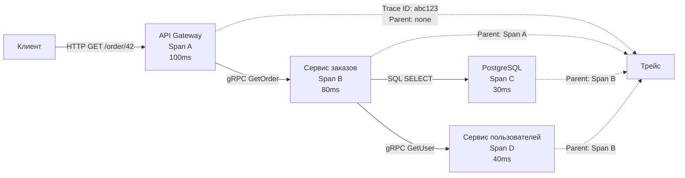

## Распределённая трассировка под микроскопом

Метрики сообщают, что P99 latency вырос до 500 мс, а доля ошибок подскочила до 2%. Логи отдельных сервисов показывают, что у каждого своя маленькая задержка, но общая картина отсутствует. Где именно запрос провёл лишние 300 мс? На каком сервисе возникла ошибка, породившая каскад 500-х ответов? Ответы на эти вопросы даёт **распределённая трассировка** — третий, самый детальный столп observability ([[39. Observability в архитектуре. Metrics, Logs, Traces]]).

В микросервисной архитектуре один пользовательский запрос может пройти через десяток сервисов, каждый из которых генерирует свои логи и метрики. Трассировка связывает эти разрозненные события в единую причинно-следственную цепочку, позволяя увидеть **полный путь запроса** и время, потраченное на каждом шаге.

### Trace, Span и контекст

**Trace (трейс)** — это направленный ациклический граф, описывающий путь одного запроса через систему. Трейс состоит из одного или нескольких **Span (спанов)**.

**Span** — это именованный временной интервал, представляющий одну логическую операцию (обработчик HTTP, вызов базы данных, запрос к соседнему сервису). Спан содержит:
- **Trace ID** — идентификатор всего трейса, общий для всех спанов.
- **Span ID** — уникальный идентификатор самого спана.
- **Parent Span ID** — идентификатор родительского спана (если есть).
- **Timestamp** и **Duration** — время начала и длительность.
- **Attributes** — пары ключ-значение (URL, HTTP-статус, название сервиса).
- **Events** — временные метки внутри спана (например, «начало сериализации»).
- **Status** — успех или ошибка.



### Как контекст путешествует между сервисами

Для построения трейса необходимо, чтобы Trace ID и Parent Span ID передавались вместе с запросом через все сервисы. Это называется **контекстной пропагацией (Context Propagation)**. Современный стандарт — **W3C Trace Context**, который определяет HTTP-заголовки `traceparent` и `tracestate`.

Заголовок `traceparent` имеет формат:
```
traceparent: 00-{trace_id}-{span_id}-{trace_flags}
```

В Go контекст трейса хранится в `context.Context`. При получении входящего запроса middleware извлекает заголовки, восстанавливает `SpanContext` и кладёт его в `ctx`. При исходящем запросе — инжектирует заголовки из `ctx`.

```go
import (
    "go.opentelemetry.io/otel"
    "go.opentelemetry.io/otel/propagation"
)

// Инжектирование контекста в HTTP-запрос
func injectTraceContext(ctx context.Context, req *http.Request) {
    otel.GetTextMapPropagator().Inject(ctx, propagation.HeaderCarrier(req.Header))
}

// Извлечение контекста из входящего запроса
func extractTraceContext(r *http.Request) context.Context {
    return otel.GetTextMapPropagator().Extract(r.Context(), propagation.HeaderCarrier(r.Header))
}
```

> [!info] Под капотом
> W3C Trace Context работает на уровне прикладного протокола. Альтернативный формат B3 (от Zipkin) использует заголовки `X-B3-TraceId` и `X-B3-SpanId`. OpenTelemetry SDK поддерживает оба формата, но W3C является стандартом и должен использоваться во всех новых системах.

### Инструментация Go-сервиса с OpenTelemetry

OpenTelemetry (OTel) — это CNCF-проект, предоставляющий SDK, API и инструментарий для сбора трейсов, метрик и логов. В Go для HTTP и gRPC существуют готовые пакеты-врапперы, которые автоматически создают спаны для входящих и исходящих запросов.

#### Инструментация HTTP-сервера

```go
import (
    "go.opentelemetry.io/contrib/instrumentation/net/http/otelhttp"
    "go.opentelemetry.io/otel"
    "go.opentelemetry.io/otel/exporters/otlp/otlptrace/otlptracegrpc"
    sdktrace "go.opentelemetry.io/otel/sdk/trace"
)

func initTracer() (*sdktrace.TracerProvider, error) {
    exporter, err := otlptracegrpc.New(ctx, otlptracegrpc.WithEndpoint("jaeger:4317"))
    if err != nil {
        return nil, err
    }
    tp := sdktrace.NewTracerProvider(
        sdktrace.WithBatcher(exporter),
        sdktrace.WithSampler(sdktrace.AlwaysSample()),
    )
    otel.SetTracerProvider(tp)
    otel.SetTextMapPropagator(propagation.NewCompositeTextMapPropagator(
        propagation.TraceContext{}, propagation.Baggage{}))
    return tp, nil
}

func main() {
    tp, _ := initTracer()
    defer tp.Shutdown(context.Background())

    mux := http.NewServeMux()
    mux.HandleFunc("/order", CreateOrderHandler)
    // otelhttp оборачивает стандартный хендлер и создаёт span
    http.ListenAndServe(":8080", otelhttp.NewHandler(mux, "order-service"))
}
```

#### Создание спанов в бизнес-логике

```go
func CreateOrderHandler(w http.ResponseWriter, r *http.Request) {
    // Контекст уже содержит span от otelhttp
    ctx := r.Context()
    tracer := otel.Tracer("order-service")

    // Создаём дочерний span для сохранения в БД
    ctx, span := tracer.Start(ctx, "SaveOrderToDB")
    defer span.End()

    if err := saveOrder(ctx, order); err != nil {
        span.SetStatus(codes.Error, err.Error())
        span.RecordError(err)
        http.Error(w, "internal error", http.StatusInternalServerError)
        return
    }
    span.SetAttributes(attribute.String("order.id", order.ID))
    w.WriteHeader(http.StatusCreated)
}
```

#### Инструментация gRPC

Для gRPC используются аналогичные врапперы: `otelgrpc.NewServerHandler()` для сервера и `otelgrpc.NewClientConn()` для клиента.

```go
s := grpc.NewServer(
    grpc.UnaryInterceptor(otelgrpc.UnaryServerInterceptor()),
)
```

### Корреляция логов и трейсов

Настоящая сила распределённой трассировки раскрывается, когда Trace ID попадает в логи. Тогда от алерта в Grafana можно за секунду перейти к конкретному трейсу и посмотреть все логи этого запроса.

В Go это делается через middleware, который добавляет `trace_id` и `span_id` в контекст и в логгер:

```go
func LoggingMiddleware(logger *slog.Logger) func(http.Handler) http.Handler {
    return func(next http.Handler) http.Handler {
        return http.HandlerFunc(func(w http.ResponseWriter, r *http.Request) {
            span := trace.SpanFromContext(r.Context())
            if span.IsRecording() {
                traceID := span.SpanContext().TraceID().String()
                logger = logger.With("trace_id", traceID)
            }
            ctx := context.WithValue(r.Context(), loggerKey, logger)
            next.ServeHTTP(w, r.WithContext(ctx))
        })
    }
}
```

Теперь каждый вызов `slog.InfoContext(ctx, ...)` автоматически включает `trace_id`.

### Mechanical Sympathy: влияние трейсинга на рантайм Go

Трассировка не бесплатна. Каждый спан — это аллокация структуры, сериализация атрибутов и экспорт по сети. Без контроля это может создать значительную нагрузку на продакшен-сервис.

**Аллокации.** Создание спана через OTel SDK порождает несколько объектов: `SpanContext`, `Span`, срез атрибутов. Если семплировать 100% запросов в высоконагруженном сервисе, количество мусора может возрасти на десятки процентов, вызывая более частые циклы GC.

**Экспорт трейсов.** SDK накапливает спаны в батчи и отправляет асинхронно через OTLP/gRPC. Экспортёр работает в фоновой горутине, потребляя сеть и CPU. Необходимо настраивать размер батча и таймауты, чтобы не забивать сеть.

**Сэмплирование** — ключевой механизм контроля. Head-based sampling принимает решение о сохранении трейса в первом же сервисе, не зная, будет ли этот запрос интересен. Tail-based sampling сохраняет все трейсы в буфер и принимает решение постфактум (оставив только те, где была ошибка или высокая задержка). Tail-based дороже, но позволяет не пропустить аномалии.

Вот конфигурация сэмплера для head-based:

```go
sampler := sdktrace.ParentBased(
    sdktrace.TraceIDRatioBased(0.05), // 5% всех запросов
)
```

> [!warning] Ловушка / Gotcha
> Никогда не используйте `AlwaysSample()` в продакшене для высоконагруженных систем. Это не только создаёт гигабайты трейсов в Jaeger, но и может замедлить сам сервис из-за аллокаций и экспорта. Всегда настраивайте сэмплирование.

### Типичные проблемы и их решение

1. **Обрыв контекста.** Если в цепочке вызовов есть HTTP-клиент без `otelhttp.NewTransport`, контекст не будет передан, и следующий сервис создаст новый трейс, разъединив цепочку.

2. **Слишком детальные спаны.** Оборачивать каждый вызов `fmt.Sprintf` в спан — перебор. Руководствуйтесь правилом: спан создаётся на границе сервиса (HTTP, gRPC) и вокруг значимых операций (запрос в БД, обращение к внешнему API).

3. **Потеря спанов из-за таймаутов.** Если запрос к downstream обрывается по таймауту, спан всё равно должен быть завершён и отправлен. `defer span.End()` делает это автоматически, но убедитесь, что экспортёр успевает отправить данные до завершения процесса (graceful shutdown с `tp.Shutdown()`).

### Связь с архитектурой

- **API Gateway** и **BFF** — идеальные точки для старта трейса ([[35. API Gateway и BFF]]).
- **Контекст** пронизывает все слои Clean Architecture ([[14. Clean Architecture и Dependency Rule]]), не нарушая правило зависимостей.
- **SLO** ([[4. SLA, SLO, SLI и как они влияют на дизайн]]) по latency можно проверять через трейсы: сколько времени реально занимает каждый шаг.

> [!tip] Собеседование
> **Вопрос:** У вас в кластере 50 микросервисов, каждый логирует trace_id. Как вы организуете сэмплирование трейсов, чтобы поймать все ошибочные запросы и не перегрузить Jaeger?
> **Ответ:** Я бы использовал tail-based sampling с помощью OpenTelemetry Collector. Collector получает все спаны (head-based 100%) и буферизует их в памяти короткое время. При получении спана с ошибкой или превышением latency он сохраняет весь трейс, остальные отбрасывает. Это даёт гарантию, что все проблемные запросы будут трассированы, а объём хранимых данных будет небольшим. Для сервисов с очень высоким RPS можно применить head-based семплирование в 10% на входе, а затем tail-based — чтобы снизить нагрузку на Collector.

### Итог

Распределённая трассировка превращает «чёрный ящик» микросервисного взаимодействия в прозрачную карту, где видна каждая миллисекунда. OpenTelemetry в Go делает инструментацию простой, но требует осознанного управления сэмплированием и накладными расходами. Корреляция с логами через trace_id замыкает цикл observability, позволяя за минуты диагностировать то, на что раньше уходили часы.

Теперь, когда мы умеем видеть путь данных через систему, пора разобраться в том, как эти данные обрабатываются в реальном времени и пакетно. В следующей статье мы погружаемся в: [[41. Data Pipeline и потоковая обработка]].