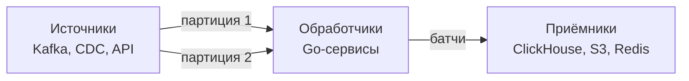

Данные в современном бэкенде не лежат на месте: они непрерывно генерируются пользовательскими действиями, финансовыми транзакциями, показаниями датчиков. Чтобы извлечь из этого потока пользу — аналитику, алерты, обучение моделей — нужен **Data Pipeline**. Это архитектурный каркас, объединяющий сбор, транспортировку, обработку и доставку данных от источников к потребителям.

В этой статье мы разберём, что такое Data Pipeline, как он соотносится с потоковой обработкой и batch-процессингом ([[42. Batch vs Stream processing]]), какие ключевые компоненты входят в его состав и как Go помогает строить эффективные, отказоустойчивые пайплайны.

### Pipeline против ETL

Термины часто путают. **ETL (Extract, Transform, Load)** — это классический шаблон batch-обработки: данные извлекаются из источника, трансформируются в аналитический формат и загружаются в хранилище данных (DWH). ETL работает с батчами по расписанию и ориентирован на аналитику.

**Data Pipeline** — более широкое понятие, охватывающее как batch, так и real-time обработку. Пайплайн может быть непрерывным, движимым событиями, и не обязательно включать трансформацию (иногда достаточно доставки). Современные пайплайны часто строятся на Kafka ([22. Pub Sub, Queue, Stream модели]]) и стриминговых движках, обеспечивая доставку данных за секунды.

### Основные компоненты Data Pipeline



#### Источники (Sources)

Данные могут поступать из:
- **Брокеров сообщений:** Kafka, NATS, RabbitMQ.
- **Change Data Capture (CDC):** Debezium, Kafka Connect — захват изменений из PostgreSQL, MySQL в стрим.
- **Внешних API:** периодический polling или WebSocket-стримы.

В Go источниками занимаются consumer'ы брокеров ([[22. Pub Sub, Queue, Stream модели]]), клиенты API или специализированные CDC-библиотеки.

#### Транспортный слой

Обычно это распределённый брокер, персистентно хранящий события и обеспечивающий гарантии доставки. Kafka — основной выбор для высоконагруженных пайплайнов благодаря возможности перечитывать историю, масштабированию партиций и хранению на диске.

#### Обработчики (Processors)

Сердце пайплайна, где данные очищаются, валидируются, обогащаются, агрегируются. Обработчики могут быть:

- **Stateless:** трансформация одного сообщения, обогащение из кэша (`OrderCreated` → `OrderEnriched`).
- **Stateful:** оконные агрегации, подсчёт метрик, сессии пользователей. Требует хранения промежуточного состояния.

В Go обработчик реализуется как consumer, который читает из Kafka, выполняет логику и пишет результат в другой топик или сразу в Sink.

#### Приёмники (Sinks)

Аналитические базы данных (ClickHouse, Apache Druid), хранилища данных (S3, HDFS), Redis для кэширования, поисковые индексы (Elasticsearch), системы алертов.

### Типы обработки

- **Filter/Map:** простейшие операции — отбросить ненужные поля, преобразовать формат, обогатить.
- **Aggregation:** подсчёт событий за окно времени, суммирование, группировка. Требует хранения промежуточного состояния (in-memory или в RocksDB).
- **Join:** объединение нескольких потоков по ключу (например, события клика и показа рекламы).
- **Complex Event Processing (CEP):** обнаружение паттернов («три неудачных логина за 5 минут»).

### Потоковая обработка в Go

Go не имеет встроенного стримингового движка, но легко интегрируется с готовыми решениями или позволяет строить самодельные пайплайны на горутинах и каналах.

**Самодельный пайплайн на каналах:**

```go
func runPipeline(ctx context.Context, input <-chan RawEvent, output chan<- EnrichedEvent) {
    for {
        select {
        case <-ctx.Done():
            return
        case raw, ok := <-input:
            if !ok {
                return
            }
            enriched, err := enrich(ctx, raw)
            if err != nil {
                log.Error("enrichment failed", "error", err)
                continue
            }
            output <- enriched
        }
    }
}
```

Плюсы: простота, полный контроль. Минусы: сложность stateful-обработки, отсутствие отказоустойчивости «из коробки».

**Интеграция с Kafka Streams-подобными библиотеками:** Для Go есть библиотеки вроде `goka` — имплементация Kafka Streams API, которая управляет состоянием в локальном RocksDB, балансирует партиции и гарантирует восстановление после сбоев.

```go
group := goka.DefineGroup("order-aggregator",
    goka.Input(goka.Stream("orders"), new(OrderCodec), func(ctx goka.Context, msg interface{}) {
        order := msg.(*Order)
        count := ctx.Value()
        if count == nil {
            count = 0
        }
        ctx.SetValue(count.(int) + order.Quantity)
    }),
    goka.Persist(new(IntCodec)),
    goka.Output(goka.Stream("order-counts"), new(IntCodec)),
)
```

Для более сложных задач (окна, джойны) Go пока уступает Java/Kafka Streams и Flink, но Benthos (Redpanda Connect) — мощный инструмент для быстрой сборки пайплайнов на Go.

### Управление состоянием

При stateful-обработке (агрегации, джойны) состояние может быть утеряно при падении сервиса. Варианты сохранения:
- **In-memory с бэкапом в ченджлог (Changelog):** Goka сохраняет состояние в RocksDB и реплицирует изменения в отдельный топик Kafka. При падении инстанса другой подхватывает партицию и восстанавливает состояние из ченджлога.
- **Внешнее хранилище (Redis, PostgreSQL):** медленнее, но проще для отладки и не зависит от локального диска (важно в Kubernetes).

> [!warning] Ловушка / Gotcha
> Локальное состояние in-memory без персистентности и репликации — потеря данных при любом рестарте. Даже для прототипов храните критичное состояние во внешнем хранилище или используйте ченджлог.

### Обработка ошибок и Dead Letter Queue

Ошибки в пайплайне неизбежны: битые сообщения, таймауты внешних API, сбои при записи в Sink. Нельзя просто игнорировать ошибку — данные будут потеряны, а обработка может застопориться.

Паттерн: ошибочное сообщение (после исчерпания попыток) отправляется в **Dead Letter Queue (DLQ)** — отдельный топик Kafka, где его можно позже изучить, исправить и переотправить.

```go
func processWithRetry(ctx context.Context, msg kafka.Message) error {
    for i := 0; i < maxRetries; i++ {
        err := process(msg)
        if err == nil {
            return nil
        }
        if isRetryable(err) {
            time.Sleep(backoff(i))
            continue
        }
        // невосстановимая ошибка — сразу в DLQ
        return dlqProducer.Publish(ctx, msg)
    }
    // после исчерпания попыток — в DLQ
    return dlqProducer.Publish(ctx, msg)
}
```

### Exactly-once семантика в пайплайнах

Exactly-once в потоковой обработке ([[27. Idempotency и exactly once семантика]]) достигается комбинацией:
- Транзакционного продюсера Kafka (идемпотентная запись).
- Чтения в изоляции `read_committed`.
- Атомарного коммита оффсета и записи результата в рамках одной транзакции Kafka.

Библиотеки вроде `goka` и `kafka-go` поддерживают транзакционный API.

### Mechanical Sympathy: влияние на рантайм Go

**Горутины и обработка сообщений.** Типичный consumer создаёт горутину на каждую партицию, что гарантирует порядок в рамках партиции. Число партиций Kafka определяет, сколько горутин будет занято постоянно. С увеличением числа партиций растёт потребление памяти (каждая горутина ~2 КБ стека + структура consumer'а).

**Аллокации при десериализации.** Каждое входящее сообщение — это байтовый слайс, который нужно распарсить в структуру (JSON, Protobuf, Avro). При высокой частоте сообщений это создаёт значительную нагрузку на GC. Использование `sync.Pool` для структур и Protobuf вместо JSON даёт ощутимый выигрыш.

**Сеть и системные вызовы.** Consumer постоянно делает `poll` к Kafka (или long poll), что задействует netpoller. Producer отправляет батчи через `sendfile`/`writev`, минимизируя число syscall.

### Связь с другими архитектурными концепциями

- **Event-Driven Architecture** ([[21. Event Driven Architecture]]): Data Pipeline — это конкретная реализация событийной архитектуры для обработки данных.
- **CQRS** ([[23. CQRS. Разделение чтения и записи]]): события из пишущей стороны пайплайн обогащает и поставляет в Read Model.
- **Event Sourcing** ([[24. Event Sourcing. Хранение событий вместо состояния]]): пайплайн обрабатывает события, строя проекции.
- **Backpressure** ([[43. Backpressure и контроль нагрузки]]): при медленной записи в Sink consumer замедляет чтение, создавая обратное давление на брокер.

### Антипаттерны

- **Единый монолитный пайплайн.** Не пытайтесь засунуть всю логику в один сервис. Разделите на независимые шаги (топики), которые можно отлаживать, масштабировать и переиспользовать.
- **Игнорирование DLQ.** Без DLQ ошибочные сообщения либо теряются, либо стопорят обработку.
- **Сохранение состояния только в памяти.** Рестарт или перебалансировка консьюмер-группы приводит к потере накопленных агрегатов.

> [!tip] Собеседование
> **Вопрос:** У вас есть поток событий заказов (50k в секунду). Требуется подсчёт выручки за последние 5 минут в реальном времени с точностью до событий. Как вы спроектируете этот пайплайн на Go?
> **Ответ:** Я бы использовал Kafka как стрим, Go-сервис с библиотекой `goka` для stateful-агрегации. Сервис в consumer group читает топик `orders`, в процессоре обновляет скользящее окно 5 минут с хранением в RocksDB (через `goka.Persist`). Результат пишется в топик `revenue-5min` и в Redis для быстрых дашбордов. Ошибки направляются в DLQ. Пайплайн масштабируется добавлением инстансов в consumer group, партиции перераспределяются, а состояние восстанавливается из ченджлога.

### Итог

Data Pipeline — это кровеносная система бэкенда, обеспечивающая доставку данных от источников к потребителям в реальном времени или с минимальной задержкой. Go, благодаря эффективной работе с сетью и конкурентностью, отлично подходит для построения высоконагруженных пайплайнов — от простых stateless-фильтров на каналах до сложных stateful-агрегаторов на основе Goka. Архитектор должен помнить об отказоустойчивости (персистентное состояние, DLQ) и влиянии на GC, выбирая форматы сериализации и стратегии управления памятью.

В следующей статье мы сравним два фундаментальных подхода к обработке данных — [[42. Batch vs Stream processing]] — и выясним, когда каждый из них необходим.