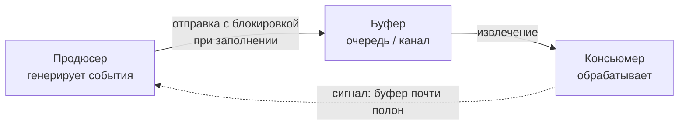

## Backpressure и контроль нагрузки

Потоковая обработка данных, рассмотренная в предыдущих статьях, создаёт неравномерную нагрузку: продюсеры могут генерировать события быстрее, чем консьюмеры успевают их обрабатывать. Без механизма обратной связи это приводит к переполнению буферов, росту задержек и, в конечном счёте, к исчерпанию памяти и падению сервиса. **Backpressure** — это способ, которым потребитель даёт понять поставщику: «Я перегружен, притормози». Это фундаментальный механизм контроля нагрузки, встроенный в философию Go на уровне каналов и горутин.

### Что такое Backpressure

Backpressure (обратное давление) — это динамическое управление темпом передачи данных от источника к приёмнику, при котором потребитель диктует максимально допустимую скорость. В отличие от статического Rate Limiting ([[38. Rate Limiting и защита системы]]), который отбрасывает запросы при превышении лимита, backpressure пытается сохранить все данные, заставляя продюсера ожидать.

Этот механизм критически важен для распределённых систем, построенных на асинхронной коммуникации ([[21. Event Driven Architecture]]), потоковой обработке ([[41. Data Pipeline и потоковая обработка]]) и при каскадных вызовах микросервисов.



### Backpressure в Go: каналы и горутины

Go предоставляет встроенный механизм backpressure через **буферизированные и небуферизированные каналы**. Небуферизированный канал обеспечивает строгую синхронизацию: продюсер блокируется, пока консьюмер не прочитает сообщение. Это максимальный backpressure, но он ограничивает пропускную способность.

Буферизированный канал позволяет продюсеру отправлять сообщения, пока буфер не заполнится. При заполнении отправка блокируется, создавая естественное обратное давление.

```go
ch := make(chan Message, 100) // буфер размером 100

// Продюсер
go func() {
    for _, msg := range messages {
        ch <- msg // блокируется, если буфер полон
    }
    close(ch)
}()

// Консьюмер
for msg := range ch {
    process(msg) // темп обработки определяет скорость продюсера
}
```

Такая модель реализует pull-based backpressure: потребитель вытягивает данные в своём темпе, а продюсер автоматически подстраивается.

### Семафор для ограничения конкурентности

В ситуациях, когда нужно ограничить не только очередь, но и количество одновременно обрабатываемых операций (например, число одновременных запросов к базе данных), применяется **семафор на основе канала**:

```go
sem := make(chan struct{}, maxConcurrency)

func handleRequest(r *http.Request) {
    select {
    case sem <- struct{}{}: // захватываем слот
        defer func() { <-sem }()
        process(r)
    case <-r.Context().Done():
        // таймаут или отмена
        http.Error(w, "too many requests", http.StatusServiceUnavailable)
    }
}
```

Здесь при заполнении семафора запросы не блокируются, а немедленно отклоняются с кодом 503, создавая явный сигнал клиенту.

### Backpressure в распределённых системах

В микросервисной архитектуре backpressure должен передаваться по цепочке: от самого медленного сервиса через вызывающих к конечному клиенту. Это реализуется несколькими способами:

- **HTTP 429 (Too Many Requests) и 503 (Service Unavailable)** — клиент получает явный сигнал перегрузки и должен уменьшить частоту запросов (Retry-After).
- **gRPC flow control** — HTTP/2 нативно поддерживает управление потоком: приёмник объявляет окно приёма, а отправитель не может превысить его.
- **Брокеры сообщений** (Kafka, RabbitMQ) — consumer не коммитит offset, пока не обработает сообщение; producer может блокироваться на отправке при заполнении локального буфера.

В Go gRPC-сервер автоматически соблюдает flow control, а для HTTP-серверов и клиентов backpressure нужно реализовывать вручную.

### Интеграция с Rate Limiting и Bulkhead

Backpressure, Rate Limiting и Bulkhead ([[37. Bulkhead и изоляция отказов]]) работают в связке:
- **Rate Limiting** — отбрасывает запросы при превышении заданного темпа, не сохраняя их.
- **Bulkhead** — изолирует ресурсы, предотвращая захват всех горутин одним медленным компонентом.
- **Backpressure** — не отбрасывает, а замедляет продюсера, сохраняя данные.

Правильная стратегия: на входе в систему Rate Limiter отсекает запросы от недобросовестных клиентов, Bulkhead изолирует типы задач, а backpressure передаётся по цепочке вызовов для предотвращения переполнения очередей.

### Mechanical Sympathy: влияние на рантайм Go

**Горутины и планировщик.** Блокировка продюсера на отправке в канал — это кооперативная остановка горутины. Планировщик Go (G-M-P) открепляет её от потока ОС, не расходуя CPU. При возобновлении (когда консьюмер освободит место) горутина возвращается в очередь. Это значительно эффективнее, чем активный опрос (spinning).

**Память и GC.** Буферизированные каналы хранят сообщения в куче. При значительном размере буфера и медленном консьюмере в канале могут накопиться тысячи сообщений, потребляя память и увеличивая время GC. Важно задавать разумный размер буфера и мониторить его длину (`len(ch)`).

**Системные вызовы.** При блокировке на отправке в канал не происходит системных вызовов — синхронизация реализована в рантайме Go через планировщик. Но при использовании сетевых операций (например, блокировка producer'а Kafka при заполнении внутреннего буфера) могут задействоваться `write`/`read` syscall'ы, за которыми следит netpoller.

### Практические рецепты для Go

**1. Ограничение очереди с таймаутом:**

```go
select {
case ch <- msg:
    // успешно отправлено
case <-time.After(100 * time.Millisecond):
    // таймаут, обрабатываем как превышение нагрузки
    metrics.BackpressureDropped.Inc()
    return ErrBufferFull
}
```

**2. Адаптивный буфер:** размер буфера канала можно изменять динамически или использовать `sync.Pool` для сообщений, чтобы снизить аллокации.

**3. Контекст с дедлайном:** передавайте `ctx` везде, чтобы backpressure не приводил к бесконечному ожиданию.

```go
select {
case ch <- msg:
case <-ctx.Done():
    return ctx.Err()
}
```

**4. Мониторинг длины очередей:** Prometheus-метрика:

```go
queueLength := prometheus.NewGaugeFunc(prometheus.GaugeOpts{
    Name: "channel_length",
}, func() float64 {
    return float64(len(ch))
})
```

### Антипаттерны и ошибки

- **Бесконечный буфер.** Неограниченный рост очереди (например, `slice` с append вместо канала) маскирует проблему, но в итоге приводит к OOM.
- **Игнорирование backpressure от downstream.** Если ваш сервис не реагирует на 429 или таймауты от вызываемого сервиса, а продолжает слать запросы, вы усугубляете перегрузку.
- **Отсутствие таймаутов.** Без таймаутов backpressure может привести к вечному блокированию горутины, утечке памяти и дедлоку.
- **Смешивание backpressure и retry без backoff'а.** Повторные попытки без задержки только усиливают давление (см. [[36. Circuit Breaker, Retry, Timeout и Backoff]]).

> [!tip] Собеседование
> **Вопрос:** Как вы реализуете backpressure в цепочке из трёх Go-микросервисов, общающихся по HTTP?
> **Ответ:** Каждый сервис должен ограничивать максимальное количество одновременных запросов к downstream через семафор (буферизированный канал). Если семафор заполнен, сервис либо блокируется с небольшим таймаутом, либо немедленно возвращает 429. Ingress Gateway или API Gateway ([[35. API Gateway и BFF]]) на входе в систему применяет Rate Limiting. Таким образом, перегрузка последнего сервиса передаётся обратно по цепочке в виде 429-х статусов и замедления отправителей.

### Итог

Backpressure — это не просто механика блокировки, а философия построения устойчивых систем: не пытаться обработать всё любой ценой, а честно сигнализировать о своих возможностях. Go с его каналами и горутинами даёт элегантный, встроенный в язык способ реализовать обратное давление без дополнительных библиотек. Правильно спроектированный backpressure — это залог того, что ваш Data Pipeline не превратится в чёрную дыру, пожирающую память и CPU.

Теперь, когда система умеет стабильно работать под нагрузкой, пора позаботиться о её защите от злоумышленников. В следующей статье мы начнём важнейший раздел: [[44. Безопасность архитектуры. Threat modeling]].