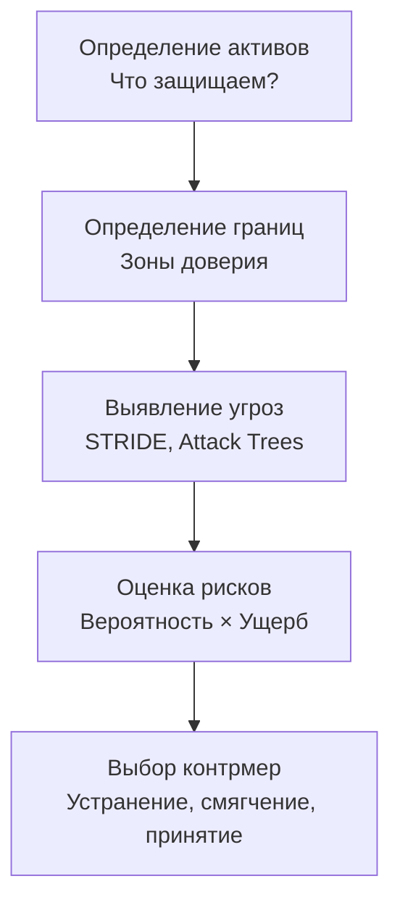

## Зачем архитектору думать как злоумышленник

Механизмы защиты, которые мы разбирали ранее — Rate Limiting, Bulkhead, Circuit Breaker — защищают систему от перегрузок и отказов, но не от целенаправленных атак. Злоумышленник не заботится о честном использовании ресурсов; он ищет уязвимости в архитектуре, коде и конфигурации, чтобы украсть данные, нарушить работу сервиса или получить контроль над инфраструктурой.

**Threat Modeling (моделирование угроз)** — это структурированный процесс выявления, оценки и приоритезации потенциальных угроз безопасности на ранних этапах проектирования системы. Для Senior/Lead Go-разработчика это не факультативная практика, а обязательная часть архитектурной работы, особенно в системах, работающих с чувствительными данными.

### Что такое Threat Modeling

Threat Modeling — это систематический анализ архитектуры с точки зрения безопасности. Он отвечает на четыре вопроса:

1. **Что мы защищаем?** (Assets — активы: данные пользователей, ключи API, инфраструктура).
2. **Кто может атаковать?** (Threat Actors — внешние хакеры, внутренние сотрудники, конкуренты).
3. **Как они могут атаковать?** (Threats — векторы атак: инъекции, перехват трафика, подделка токенов).
4. **Что мы с этим делаем?** (Mitigations — меры противодействия: шифрование, валидация, логирование).

Лучшее время для Threat Modeling — этап архитектурного проектирования, когда изменение дизайна стоит дёшево. Проводить его после деплоя в продакшен — значит играть в догонялки с уязвимостями.



### Методологии моделирования угроз

Существует несколько формальных подходов. Senior-инженер должен знать их и уметь применять к своей системе.

#### STRIDE

Самый популярный фреймворк от Microsoft, классифицирующий угрозы по шести категориям:

| Категория | Угроза | Пример в Go-сервисе |
|-----------|--------|---------------------|
| **S**poofing | Подмена личности | Использование чужого JWT; отсутствие валидации `issuer` |
| **T**ampering | Несанкционированное изменение данных | Изменение тела запроса без проверки HMAC |
| **R**epudiation | Отказ от действия | Отсутствие аудита операций; логирование без идентификации |
| **I**nformation Disclosure | Утечка информации | Незашифрованные секреты в логах; открытый эндпоинт `/debug/pprof` |
| **D**enial of Service | Отказ в обслуживании | Исчерпание горутин через медленные атаки (Slowloris) |
| **E**levation of Privilege | Повышение привилегий | Доступ к админским эндпоинтам без RBAC |

#### DREAD

Используется для количественной оценки риска: Damage (Ущерб), Reproducibility (Воспроизводимость), Exploitability (Эксплуатируемость), Affected Users (Затронутые пользователи), Discoverability (Обнаруживаемость). Каждый параметр оценивается по шкале, что даёт числовой приоритет.

#### Attack Trees

Древовидная структура, где корень — цель атакующего, а ветви — пути её достижения. Помогает продумать неочевидные цепочки атак.

### Процесс Threat Modeling'а на практике

1. **Выберите scope** — конкретный сервис, фичу или поток данных. Не пытайтесь охватить всю систему за раз.
2. **Нарисуйте Data Flow Diagram (DFD)** — покажите, как данные движутся между компонентами, где проходят границы доверия. В Go это: HTTP-хендлер → сервисный слой → репозиторий → БД.
3. **Примените STRIDE** к каждому элементу DFD. Для каждого взаимодействия спросите: возможен ли здесь Spoofing? А Tampering?
4. **Оцените риск** и приоритезируйте. Критичные баги требуют исправления до деплоя, средние могут попасть в бэклог.
5. **Задокументируйте контрмеры** и проверьте их реализацию на code review.

### Threat Modeling в контексте Go

Go имеет свою специфику безопасности, которую необходимо учитывать при моделировании угроз.

**Пакет `net/http/pprof`** — мощный инструмент профилирования, который по умолчанию вешается на `DefaultServeMux`. Если его не закрыть аутентификацией, злоумышленник получит доступ к трассировке горутин, аллокациям и даже содержимому памяти. Это классическая утечка информации (Information Disclosure).

**Обработка паник.** Неперехваченная паника в горутине роняет весь процесс, если не используется `recover`. Это вектор для DoS-атак через специально сформированные запросы.

**Race conditions.** Go-сервисы часто используют горутины для параллельной обработки. Неправильная синхронизация доступа к разделяемым данным может привести к гонкам, которые в некоторых случаях эксплуатационно уязвимы (например, проверка и затем действие — TOCTOU).

**Утечка горутин.** Забытые горутины, ожидающие каналов без таймаутов, могут бесконечно накапливаться, истощая память — ещё один вектор DoS.

> [!info] Под капотом
> Стандартная библиотека Go содержит пакет `crypto`, реализующий криптографические примитивы на чистом Go без зависимостей от OpenSSL. Это исключает целый класс уязвимостей, связанных с версиями системных библиотек. Однако `crypto/rand` использует системный источник энтропии (`getrandom(2)` на Linux), и его нехватка может блокировать горутины на старте.

### Mechanical Sympathy: цена безопасности

Каждая контрмера имеет свою стоимость в тактах CPU, задержке и памяти.

- **TLS-терминация** добавляет 1-3 мс к handshake при новом соединении и ~0.1-0.5 мс на симметричное шифрование каждого последующего сообщения. В Go реализация `crypto/tls` эффективна, но на 100k RPS эти микросекунды складываются.
- **Валидация JWT с проверкой подписи** — это криптографическая операция, которая может занимать десятки-сотни микросекунд в зависимости от алгоритма. Используйте `Ed25519` или `ES256` — они быстрее `RS256`.
- **Полная валидация входных данных** (каждого поля структуры) создаёт аллокации строк и слайсов. Для снижения нагрузки используйте библиотеки вроде `go-playground/validator`, которые оптимизированы под speed/memory trade-off.
- **Логирование безопасности** не должно записывать секреты и персональные данные. Маскирование или хэширование чувствительных полей добавляет CPU-нагрузку, но это необходимая цена.

```go
// Пример: маскирование email в логах
func maskEmail(email string) string {
    parts := strings.Split(email, "@")
    if len(parts) != 2 {
        return "***"
    }
    return parts[0][:min(3, len(parts[0]))] + "***@" + parts[1]
}
```

> [!warning] Ловушка / Gotcha
> Никогда не логируйте `r.Header` или тело запроса целиком на уровне Info. JWT-токены, сессионные куки и пароли могут попасть в логи и оттуда — в централизованное хранилище (ELK, Loki), доступное более широкому кругу лиц, чем ожидалось.

### Интеграция в жизненный цикл

Threat Modeling — не разовая акция, а непрерывный процесс:
- На этапе дизайна — первичный анализ.
- Перед каждым крупным релизом — пересмотр угроз для новых фич.
- При изменении инфраструктуры (смена облачного провайдера, новый тип БД) — переоценка.
- После инцидентов — post-mortem с проверкой, почему угроза не была предсказана.

В Go-проектах можно внедрить автоматизированные проверки:
- **`gosec`** — статический анализатор безопасности для Go.
- **`golangci-lint`** с плагинами безопасности.
- **`govulncheck`** — проверка известных уязвимостей в зависимостях.

### Связь с другими архитектурными концепциями

- **Zero Trust** ([[45. Zero Trust и сетевые границы]]) — прямое продолжение Threat Modeling: вместо доверия к внутренней сети каждый запрос аутентифицируется и авторизуется.
- **Observability** ([[39. Observability в архитектуре. Metrics, Logs, Traces]]) — без логов и алертов невозможно обнаружить атаку, даже если угрозы были промоделированы.
- **Rate Limiting** ([[38. Rate Limiting и защита системы]]) и **Bulkhead** ([[37. Bulkhead и изоляция отказов]]) — защищают от DoS, одной из букв STRIDE.
- **Clean Architecture** ([[14. Clean Architecture и Dependency Rule]]) — изоляция бизнес-логики от инфраструктуры упрощает анализ границ доверия.

### Антипаттерны

- **«У нас маленький стартап, кому мы нужны».** Автоматизированные атаки не выбирают жертв по размеру. Отсутствие Rate Limiting на эндпоинте `/login` приведёт к брутфорсу независимо от известности компании.
- **Threat Modeling ради галочки.** Провести воркшоп, нарисовать диаграмму и забыть — хуже, чем не проводить вообще, потому что создаёт ложное чувство безопасности.
- **Фокус только на внешние угрозы.** Инсайдерские атаки и утечки через CI/CD (скомпрометированные зависимости, секреты в коде) так же опасны.

> [!tip] Собеседование
> **Вопрос:** Как бы вы провели Threat Modeling для нового микросервиса обработки платежей на Go?
> **Ответ:** Я бы начал с Data Flow Diagram: клиент → API Gateway → Payment Service → Stripe API + БД. Затем применил STRIDE к каждому взаимодействию. Например, между Gateway и Payment Service — угроза Spoofing: поддельный JWT. Контрмера — проверка подписи и issuer'а в middleware. Угроза Tampering: изменение суммы платежа при передаче. Контрмера — HMAC на критичных полях или передача через Protobuf с валидацией. DoS: медленные запросы, исчерпывающие горутины — настраиваю Timeout (2 сек) и Rate Limiting. Отдельно проверю, что секреты Stripe не закоммичены и pprof закрыт аутентификацией. Результаты задокументирую и приоритезирую в бэклоге.

### Итог

Threat Modeling — это инженерная дисциплина, которая превращает безопасность из «магии» в управляемый, воспроизводимый процесс. Для Go-разработчика она опирается на знание специфики языка (горутины, pprof, `crypto/tls`) и экосистемы (gosec, vulncheck). Проведённый на этапе архитектуры анализ угроз экономит миллионы рублей и сломанных карьер на этапе продакшена.

В следующей статье мы углубим конкретный архитектурный подход, вытекающий из принципов Threat Modeling — Zero Trust: [[45. Zero Trust и сетевые границы]].