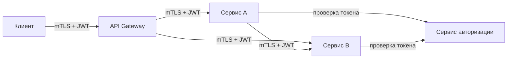

Моделирование угроз из предыдущей статьи ([[44. Безопасность архитектуры. Threat modeling]]) приводит к неутешительному выводу: классическая модель безопасности, построенная на разделении «внутренняя сеть = безопасно, внешняя = опасно», безнадёжно устарела. Современные атаки (фишинг, компрометация учётных записей, инсайдерские угрозы, боковое перемещение) легко преодолевают периметр. Ответом на эту реальность стала архитектурная парадигма **Zero Trust** — модель, в которой доверие не предоставляется по умолчанию никому: ни внутри сети, ни снаружи.

Для Go-разработчика, проектирующего микросервисную архитектуру, Zero Trust — это не просто модный термин, а конкретный набор правил, которым должен следовать каждый запрос, каждый сервис и каждый инстанс.

### Три принципа Zero Trust

1. **Never trust, always verify.** Каждый запрос аутентифицируется и авторизуется, независимо от того, откуда он пришёл — из внешнего интернета, из соседнего пода Kubernetes или из того же процесса.
2. **Assume breach.** Проектируйте систему, исходя из предположения, что злоумышленник уже находится внутри. Минимизируйте радиус поражения одного скомпрометированного сервиса.
3. **Least privilege.** Сервис должен иметь минимально необходимые права для выполнения своей функции и не более того.



### Zero Trust в микросервисной архитектуре на Go

В классической модели периметра сервисы внутри кластера часто общаются по HTTP без шифрования и аутентификации («внутри сети безопасно»). Zero Trust требует обратного:

- **Взаимная аутентификация (Mutual TLS, mTLS)** между всеми сервисами. Каждый сервис имеет собственный сертификат, и клиент также предъявляет сертификат серверу при соединении.
- **Аутентификация на уровне приложения** — каждый запрос несёт токен (JWT, OAuth2), который проверяется получателем, даже если это внутренний вызов.
- **Авторизация на каждом шаге** — недостаточно просто валидного токена; сервис проверяет, имеет ли данный субъект доступ к конкретной операции.

#### Реализация mTLS в Go

Go из коробки поддерживает mTLS через пакет `crypto/tls`. Настроить сервер и клиент на взаимную аутентификацию довольно просто.

```go
// Сервер с требованием клиентского сертификата
func newTLSServer(certFile, keyFile, caCertFile string) (*http.Server, error) {
    caCert, err := os.ReadFile(caCertFile)
    if err != nil {
        return nil, err
    }
    caCertPool := x509.NewCertPool()
    caCertPool.AppendCertsFromPEM(caCert)

    tlsConfig := &tls.Config{
        ClientAuth: tls.RequireAndVerifyClientCert,
        ClientCAs:  caCertPool,
        MinVersion: tls.VersionTLS13,
    }

    return &http.Server{
        Addr:      ":8443",
        TLSConfig: tlsConfig,
    }, nil
}

// Клиент, предъявляющий свой сертификат
func newTLSClient(certFile, keyFile, caCertFile string) (*http.Client, error) {
    cert, err := tls.LoadX509KeyPair(certFile, keyFile)
    if err != nil {
        return nil, err
    }
    caCert, err := os.ReadFile(caCertFile)
    if err != nil {
        return nil, err
    }
    caCertPool := x509.NewCertPool()
    caCertPool.AppendCertsFromPEM(caCert)

    tlsConfig := &tls.Config{
        Certificates: []tls.Certificate{cert},
        RootCAs:      caCertPool,
        MinVersion:   tls.VersionTLS13,
    }

    return &http.Client{
        Transport: &http.Transport{TLSClientConfig: tlsConfig},
        Timeout:   10 * time.Second,
    }, nil
}
```

#### Service Mesh как реализация Zero Trust

Вручную управлять сертификатами для сотен подов в Kubernetes — путь к хаосу. Service Mesh (Istio, Linkerd) автоматизирует mTLS, ротацию сертификатов и политику доступа. С точки зрения Go-приложения, оно может работать по HTTP на `localhost`, а sidecar-прокси (Envoy) перехватывает трафик и оборачивает его в mTLS. Приложение может фокусироваться на JWT-валидации и бизнес-авторизации.

#### JWT и авторизация на уровне приложения

Даже при работающем mTLS приложение должно проверять подпись, expiration, issuer и скоупы токена. В Go это реализуется middleware, которое работает с `context.Context`.

```go
func AuthMiddleware(publicKey *ecdsa.PublicKey) func(http.Handler) http.Handler {
    return func(next http.Handler) http.Handler {
        return http.HandlerFunc(func(w http.ResponseWriter, r *http.Request) {
            tokenStr := r.Header.Get("Authorization")
            if tokenStr == "" || !strings.HasPrefix(tokenStr, "Bearer ") {
                http.Error(w, "missing authorization", http.StatusUnauthorized)
                return
            }

            token, err := jwt.Parse(tokenStr[7:], func(t *jwt.Token) (interface{}, error) {
                if _, ok := t.Method.(*jwt.SigningMethodECDSA); !ok {
                    return nil, fmt.Errorf("unexpected signing method: %v", t.Header["alg"])
                }
                return publicKey, nil
            })
            if err != nil || !token.Valid {
                http.Error(w, "invalid token", http.StatusUnauthorized)
                return
            }

            claims := token.Claims.(jwt.MapClaims)
            ctx := context.WithValue(r.Context(), claimsKey, claims)
            next.ServeHTTP(w, r.WithContext(ctx))
        })
    }
}
```

> [!warning] Ловушка / Gotcha
> Валидация JWT без проверки алгоритма подписи (например, принятие `alg: none`) — классическая уязвимость. Всегда проверяйте `token.Method.Alg()` на соответствие ожидаемому алгоритму. Пакет `golang-jwt/jwt/v5` упрощает это через `jwt.ParseWithClaims`.

### Mechanical Sympathy: цена Zero Trust

Архитектор обязан понимать, какую цену платит система за повышенную безопасность.

**TLS handshake** — самая дорогая часть mTLS. Каждое новое TCP-соединение требует полного рукопожатия с обменом сертификатами и согласованием ключей, что может занимать 1-3 мс на современных процессорах. Однако:

- **Session Resumption** (TLS session tickets, session IDs) позволяет последующим соединениям между той же парой IP:порт обходиться без полного handshake, снижая задержку до ~0.1-0.5 мс.
- **HTTP/2 и HTTP/3** мультиплексируют множество запросов в одном соединении, амортизируя стоимость рукопожатия.
- **Пул соединений** в `http.Transport` переиспользует уже установленные TLS-туннели, минимизируя количество handshake'ов.

**CPU и криптография.** После установления соединения симметричное шифрование (AES-GCM) выполняется крайне быстро. Современные процессоры имеют аппаратные инструкции для AES (AES-NI), и Go использует их через ассемблерные оптимизации в стандартной библиотеке. На 100k RPS накладные расходы на симметричное шифрование заметны, но редко являются узким местом по сравнению с сетью и бизнес-логикой.

**JWT-валидация.** Проверка подписи токена — это криптографическая операция. Алгоритмы на эллиптических кривых (ES256, Ed25519) быстрее, чем RSA (RS256), и создают меньше аллокаций. Ed25519 в Go реализован через `crypto/ed25519` и является отличным выбором по соотношению скорость/безопасность.

> [!info] Под капотом
> При использовании mTLS между Go-сервисами, работающими в одном кластере Kubernetes с Istio, TLS-терминация происходит в sidecar-прокси Envoy, а не в самом приложении. Это снимает нагрузку с горутин приложения, но добавляет микро-задержку на коммуникацию через localhost. Envoy также реализует пул соединений и session resumption.

### Zero Trust и архитектура

Zero Trust влияет на все уровни архитектуры:

- **API Gateway** ([[35. API Gateway и BFF]]) становится точкой аутентификации внешних клиентов, но не единственной линией обороны. Каждый внутренний сервис также проверяет токен.
- **Service Discovery** ([[34. Service Discovery. Client side и Server side]]) должен предоставлять не только адреса, но и идентификаторы (SPIFFE ID), по которым сервисы опознают друг друга.
- **Observability** ([[39. Observability в архитектуре. Metrics, Logs, Traces]]) должна фиксировать каждую аутентификационную и авторизационную ошибку. Резкий всплеск 401/403 — сигнал атаки.
- **Threat Modeling** ([[44. Безопасность архитектуры. Threat modeling]]) даёт перечень угроз, для которых Zero Trust является контрмерой.
- **Data Pipeline** ([[41. Data Pipeline и потоковая обработка]]) требует шифрования данных на всём пути и аутентификации консьюмеров.

### Антипаттерны и ошибки

- **«У нас внутри Kubernetes безопасно, mTLS не нужен».** Компрометация одного пода или утечка service account токена даёт злоумышленнику полный доступ ко всем сервисам, если между ними нет mTLS.
- **Самоподписанные сертификаты с отключённой проверкой.** `InsecureSkipVerify: true` в production сводит на нет весь смысл TLS. Всегда используйте CA и проверяйте сертификаты.
- **JWT без expiration.** Токен, украденный однажды, должен перестать работать через разумное время (15-60 минут). Короткоживущие токены + refresh tokens.
- **Хранение секретов в коде или конфигах.** Секреты должны извлекаться из Vault, AWS Secrets Manager или монтироваться через CSI-драйвер.
- **Игнорирование сетевых политик (Network Policies).** mTLS и авторизация на уровне приложения должны дополняться ограничениями на уровне сети: сервису A запрещено инициировать соединение к БД, даже если у него есть валидный сертификат.

> [!tip] Собеседование
> **Вопрос:** В чём разница между Zero Trust и традиционной perimeter-based безопасностью? Как бы вы внедрили Zero Trust в Go-микросервисах?
> **Ответ:** Традиционная модель доверяет внутренней сети: если запрос пришёл из внутренней подсети, он считается безопасным. Zero Trust отказывается от этого предположения и требует аутентификации и авторизации каждого запроса, независимо от источника. В Go-микросервисах я бы реализовывал это через: 1) mTLS между всеми сервисами с автоматической ротацией сертификатов через cert-manager или Istio; 2) проверку JWT в middleware на каждом сервисе, а не только на Gateway; 3) политики авторизации на основе RBAC, проверяемые в том же middleware; 4) логирование и метрики всех отказов в доступе для обнаружения атак.

### Итог

Zero Trust — не конкретный продукт или протокол, а архитектурный принцип, требующий, чтобы каждый компонент системы проверял легитимность каждого запроса. Для Go-разработчика это означает обязательное внедрение mTLS, JWT-валидации и авторизации на уровне каждого сервиса, а не только на периметре. Платой за повышенную безопасность являются дополнительные миллисекунды задержки и усложнение управления сертификатами, которые амортизируются правильной настройкой пулов соединений, session resumption и использованием Service Mesh.

В следующей статье мы обсудим, как безопасно эволюционировать систему, не ломая клиентов: [[46. Версионирование сервисов и API]].