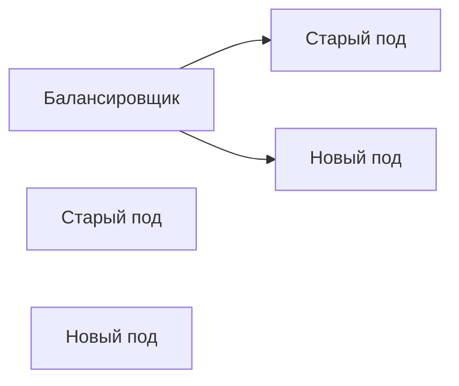

## Непрерывность как архитектурное требование

Версионирование API ([[46. Версионирование сервисов и API]]) решает проблему контролируемого изменения контрактов, но не отвечает на вопрос: как физически развернуть новую версию сервиса или изменить схему базы данных, не останавливая обслуживание пользователей? Для систем с жёсткими SLO ([[4. SLA, SLO, SLI и как они влияют на дизайн]]) даже несколько минут простоя могут означать нарушение SLA и бизнес-потери. **Миграция без downtime** — это совокупность техник, позволяющих менять код, данные и инфраструктуру «на лету», пока система продолжает принимать трафик.

Эта статья охватывает ключевые стратегии и Go-специфичные реализации, от Graceful Shutdown до Expand/Contract для баз данных.

### Стратегии развёртывания без простоя

Прежде чем говорить о миграции данных, важно понимать, как новые версии кода попадают в продакшен, не роняя сервис.

#### Rolling Update

Новые инстансы постепенно заменяют старые. Обычно выполняется оркестратором (Kubernetes). В каждый момент времени часть подов обслуживает трафик по старой логике, часть — по новой.



Ключевое требование: **старая и новая версии должны быть совместимы**. Если новая версия меняет формат ответа, балансировщик не поможет — клиенты будут получать разные данные. Поэтому Rolling Update опирается на дисциплину обратной совместимости из предыдущей статьи.

#### Blue-Green Deployment

Разворачивается полный новый кластер (green), параллельно со старым (blue). После проверки балансировщик переключается на green целиком. Проще откат: переключить балансировщик обратно. Минус — двойной расход ресурсов.

#### Canary Deployment

Новая версия получает малую долю трафика (например, 5%). Метрики сравниваются со старой версией. Если всё хорошо, доля постепенно увеличивается до 100%. В Go это не требует специальных библиотек, достаточно конфигурации Service Mesh или умного балансировщика.

### Безопасная остановка: Graceful Shutdown в Go

При любом из сценариев старые инстансы должны быть остановлены без обрыва текущих запросов. Go предоставляет для этого `http.Server.Shutdown()`.

```go
func gracefulShutdown(srv *http.Server) {
    stop := make(chan os.Signal, 1)
    signal.Notify(stop, syscall.SIGTERM, syscall.SIGINT)
    <-stop

    log.Println("shutting down gracefully, waiting for active requests...")
    ctx, cancel := context.WithTimeout(context.Background(), 30*time.Second)
    defer cancel()

    if err := srv.Shutdown(ctx); err != nil {
        log.Printf("forced shutdown after timeout: %v", err)
    }
}
```

Как это работает: `Shutdown()` закрывает слушающий сокет, чтобы новые соединения не принимались, но не обрывает уже установленные. Он ждёт завершения активных запросов или истечения контекста.

> [!info] Под капотом
> `Shutdown()` вызывает `Close()` на `net.Listener`, затем в цикле проверяет счётчик активных соединений. Когда счётчик достигает нуля, горутина `Shutdown` завершается. Активные соединения — это те, которые не были обслужены до закрытия сокета. Важно, что долгие соединения (WebSocket, долгие HTTP-запросы) будут удерживать процесс до таймаута контекста, а затем принудительно оборвутся.

Для gRPC-серверов аналог — `s.GracefulStop()`:

```go
s := grpc.NewServer()
// ...
go func() {
    <-stop
    s.GracefulStop()
}()
```

### Миграция схемы базы данных без простоя

Самая сложная часть — изменение структуры данных. Блокирующие операции (`ALTER TABLE ... LOCK`) могут остановить запись на минуты. Вместо этого применяется паттерн **Expand/Contract**.

#### Expand/Contract

1. **Expand (Расширение).** Сначала добавляется новое поле/таблица, старое сохраняется. Код пишет в оба места (старое и новое).
2. **Перенос данных.** Фоновая миграция копирует исторические данные из старой схемы в новую.
3. **Contract (Сжатие).** Когда все потребители переведены на новую схему, удаляются старые поля и код двойной записи.

Пример: переименование колонки `phone` в `contact_phone`.

```sql
-- Шаг 1: добавляем новую колонку (не блокирует)
ALTER TABLE users ADD COLUMN contact_phone TEXT;

-- Код пишет в обе колонки, читает из новой, если есть, иначе из старой
```

```go
func (r *UserRepo) UpdatePhone(ctx context.Context, userID string, phone string) error {
    _, err := r.db.ExecContext(ctx,
        "UPDATE users SET phone = $1, contact_phone = $1 WHERE id = $2",
        phone, userID)
    return err
}
```

```sql
-- Шаг 2: фоновый перенос
UPDATE users SET contact_phone = phone WHERE contact_phone IS NULL;
```

```go
// Шаг 3: через месяц, когда только новое поле используется
// Удаляем двойную запись из кода, затем:
// ALTER TABLE users DROP COLUMN phone;
```

> [!warning] Ловушка / Gotcha
> Не все `ALTER TABLE` неблокирующие. В PostgreSQL добавление колонки с `DEFAULT` до версии 11 блокировало таблицу. Используйте подходящие инструменты (`pt-online-schema-change` для MySQL, `gh-ost`) или добавляйте без DEFAULT, затем обновляйте батчами.

### Feature Flags и точечное включение

Миграция не обязательно означает новую версию всего бинарника. **Feature Flags** позволяют включать и выключать новую логику на лету, без передеплоя.

В Go Feature Flag может быть реализован через конфигурацию, Redis или специализированные сервисы (LaunchDarkly, Unleash).

```go
func (s *Service) ProcessOrder(ctx context.Context, order *Order) error {
    if s.features.IsEnabled(ctx, "new-pricing-engine") {
        return s.processWithNewPricing(ctx, order)
    }
    return s.processWithOldPricing(ctx, order)
}
```

Это даёт возможность выкатить код с новой логикой, но активировать её только после миграции данных, или быстро откатить проблемную фичу без отката всего деплоя.

### Mechanical Sympathy: цена zero-downtime

Миграции без простоя потребляют дополнительные ресурсы, и это нужно закладывать в архитектуру.

**Двойная запись.** Период, когда код пишет и в старую, и в новую схему, увеличивает нагрузку на БД. Каждая операция записи выполняет два запроса вместо одного (или два UPDATE в одном запросе), что увеличивает latency и нагрузку на CPU базы данных. В Go это означает, что горутины дольше удерживают соединения с БД, что может потребовать увеличения пула (`SetMaxOpenConns`).

**Память и старые соединения.** При Rolling Update одновременно работают поды старой и новой версий. Если они используют разные схемы кэширования в Redis или in-memory, это удваивает потребление памяти на переходный период. Планируйте ресурсы с запасом.

**GC и две структуры.** Если в коде одновременно существуют старые и новые модели данных, количество типов и структур удваивается. Это увеличивает время компиляции (незначительно) и может немного повысить нагрузку на GC, если обе версии активно используются в рантайме. После завершения Contract'а старые структуры удаляются.

### Инфраструктурные миграции

Переезд на новую версию Kubernetes, замену Ingress-контроллера, миграцию из одного облака в другое — всё это требует zero-downtime стратегий:

- **DNS-переключение с длительным TTL:** сначала уменьшается TTL, затем меняется запись, старый кластер держится активным, пока не истечёт кэш.
- **Репликация данных между кластерами:** на время миграции данные синхронизируются асинхронно, клиенты переводятся постепенно.

### Антипаттерны

- **Бесконечное ожидание в Graceful Shutdown.** Если какой-то обработчик завис навечно (например, ждёт ответа от упавшего downstream без таймаута), процесс никогда не завершится. Всегда устанавливайте `context.WithDeadline`.
- **Миграция БД через одну тяжёлую транзакцию.** `ALTER TABLE` на огромной таблице может блокировать все записи на часы. Делите миграции на мелкие шаги, используйте батчи.
- **Отсутствие обратной совместимости при Rolling Update.** Старые и новые поды должны сосуществовать. Если новый код требует новое поле в БД, а старый код не знает о нём, старый код может сломаться. Сначала добавляете поле, затем деплоите код, который его использует.
- **Преждевременное удаление данных.** Не удаляйте старую колонку сразу после деплоя. Оставьте окно хотя бы в один релизный цикл для возможности отката.

> [!tip] Собеседование
> **Вопрос:** Вы хотите разбить колонку `address TEXT` на отдельные поля `city`, `street`, `zip`. Как провести миграцию без простоя?
> **Ответ:** Я применю Expand/Contract:
> 1. Добавлю новые колонки `city`, `street`, `zip` (неблокирующий ALTER).
> 2. Изменю код записи, чтобы он писал и в старую `address`, и в новые поля.
> 3. Запущу фоновую задачу на Go, которая батчами читает `address`, парсит и заполняет новые поля.
> 4. Переведу все чтения на новые поля.
> 5. Через релизный цикл удалю запись в `address` и, наконец, удалю саму колонку.

### Итог

Zero-downtime миграции — это не роскошь, а инженерная необходимость для систем, живущих по SLO. Go предоставляет базовые строительные блоки: `Shutdown`, `GracefulStop`, контексты с таймаутами — но реальная сложность лежит в координации изменений кода и данных. Паттерн Expand/Contract в сочетании с Feature Flags и дисциплиной обратной совместимости позволяет модернизировать архитектуру без ночных окон и панических откатов.

Когда система меняется, критически важно убедиться, что всё работает как задумано. В следующей статье мы рассмотрим, как тестировать архитектурные решения: [[48. Тестирование архитектуры. Contract и Integration testing]].