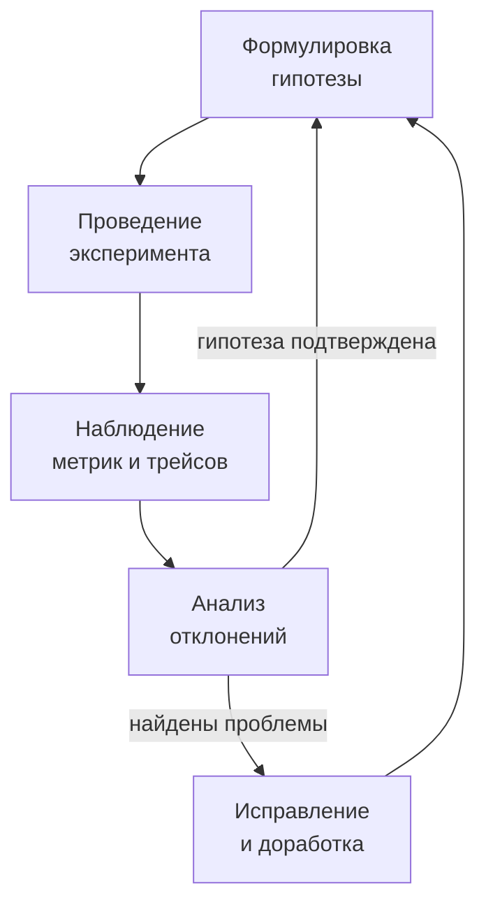

## Почему тестов недостаточно

Модульные тесты проверяют логику функций. Интеграционные — взаимодействие компонентов в изолированной среде. Контрактные — соблюдение API. Но ни один из этих видов тестирования не отвечает на вопрос: **выдержит ли система реальный хаос продакшена?** Сетевые задержки, внезапное падение подов, исчерпание дискового пространства, скачки нагрузки — это не баги, а неизбежные условия эксплуатации распределённых систем.

**Chaos Engineering** — это практика проведения управляемых экспериментов над системой для проверки её устойчивости к отказам. Вместо того чтобы ждать аварию, инженеры намеренно вносят контролируемый хаос и наблюдают, как система с ним справляется. Для Senior/Lead Go-разработчика это не развлечение, а способ проверить, что паттерны устойчивости ([[36. Circuit Breaker, Retry, Timeout и Backoff]], [[37. Bulkhead и изоляция отказов]], [[38. Rate Limiting и защита системы]]) действительно работают в условиях, приближенных к реальности.

### Принципы Chaos Engineering

1. **Формулируйте гипотезу.** Не «убью под и посмотрю, что будет», а «если упадёт один под сервиса заказов, Circuit Breaker на Gateway должен переключить трафик на оставшиеся поды, и P99 latency не превысит 200 мс».
2. **Минимизируйте взрывной радиус.** Начинайте с малого: один под, один регион, 1% трафика. Постепенно расширяйте, когда система докажет устойчивость.
3. **Автоматизируйте остановку.** Если эксперимент вызвал деградацию, он должен быть немедленно прекращён. Алерты ([[39. Observability в архитектуре. Metrics, Logs, Traces]]) должны сработать раньше, чем пострадают пользователи.
4. **Проводите в продакшене.** Только реальный трафик и реальные условия выявляют настоящие проблемы. Стейджинг-окружение никогда не идентично боевому.



### Инструменты для Go-инфраструктуры

В Kubernetes-окружениях, где чаще всего разворачиваются Go-микросервисы, популярны:

- **Chaos Mesh** — CNCF-проект, внедряющий хаос в Kubernetes: убийство подов, сетевые задержки, потерю пакетов, нагрузку на CPU/память.
- **Litmus** — аналогичный инструмент с GitOps-подходом.
- **Gremlin** — коммерческое решение для сложных сценариев.

Пример конфигурации Chaos Mesh для внедрения сетевой задержки в 200 мс для одного пода:

```yaml
apiVersion: chaos-mesh.org/v1alpha1
kind: NetworkChaos
metadata:
  name: order-service-delay
spec:
  action: delay
  mode: one
  selector:
    namespaces:
      - production
    labels:
      app: order-service
  delay:
    latency: "200ms"
    correlation: "100"
    jitter: "50ms"
  duration: "5m"
```

### Ручные эксперименты на уровне Go-кода

Не всегда нужен оркестратор хаоса. Иногда достаточно внедрить контролируемый сбой в самом Go-сервисе через Feature Flag ([[47. Миграции архитектуры без downtime]]) или специальный эндпоинт.

**Искусственная задержка:**

```go
func ChaosMiddleware(next http.Handler) http.Handler {
    return http.HandlerFunc(func(w http.ResponseWriter, r *http.Request) {
        if delay := r.Header.Get("X-Chaos-Delay"); delay != "" {
            d, _ := time.ParseDuration(delay)
            time.Sleep(d)
        }
        next.ServeHTTP(w, r)
    })
}
```

**Искусственная ошибка (Chaos Monkey внутри сервиса):**

```go
if os.Getenv("CHAOS_ERROR_RATE") == "0.1" {
    if rand.Float64() < 0.1 {
        http.Error(w, "chaos error", http.StatusInternalServerError)
        return
    }
}
```

Это позволяет проверить, как вызывающие сервисы обрабатывают ретраи и Circuit Breaker без вмешательства в инфраструктуру.

### Типичные эксперименты

#### Убийство пода (Pod Kill)

Самый простой и показательный тест. Если убить один под сервиса, балансировщик ([[33. Load Balancing на уровне архитектуры]]) должен перестать отправлять на него трафик, а оставшиеся поды — обработать нагрузку без превышения SLO.

**Что проверяем в Go:**
- Graceful Shutdown (`http.Server.Shutdown()`) — не обрываются ли текущие запросы.
- Health checks — исключается ли под из Service Discovery ([[34. Service Discovery. Client side и Server side]]) вовремя.
- Перераспределение партиций Kafka — корректно ли consumer group перебалансируется.

#### Сетевые задержки (Network Delay)

Внедрение искусственной задержки между сервисами (например, 500 мс вместо обычных 2 мс) проверяет, не вызывают ли таймауты каскадные отказы.

**Что проверяем в Go:**
- Правильно ли настроены таймауты на HTTP-клиентах и gRPC-вызовах ([[36. Circuit Breaker, Retry, Timeout и Backoff]]).
- Не блокируются ли горутины навечно, исчерпывая пул.

> [!info] Под капотом
> При сетевых задержках горутины, ожидающие ответа от downstream, остаются заблокированными на I/O. Планировщик Go (G-M-P) открепляет их от потока ОС, но память (стек ~2 КБ + структуры) остаётся занятой. Chaos-тест с 500 мс задержкой при 5000 одновременных запросах создаст ~10-15 МБ дополнительного потребления памяти, что можно отследить через `pprof` и метрики `go_goroutines`.

#### Потеря пакетов (Packet Loss)

10% потери пакетов эмулируют нестабильную сеть между дата-центрами.

**Что проверяем в Go:**
- Срабатывают ли ретраи с exponential backoff.
- Не приводят ли повторные запросы к дублированию (идемпотентность, [[27. Idempotency и exactly once семантика]]).
- Не забивает ли повторный трафик сеть ещё больше.

#### Нагрузка на CPU и память (Stress Chaos)

Внедрение искусственной нагрузки на CPU (например, загрузка 80% ядра) или утечки памяти в одном поде проверяет, как система деградирует.

**Что проверяем в Go:**
- Как GC справляется с дефицитом памяти (GOMEMLIMIT).
- Как планировщик распределяет горутины при нехватке CPU.
- Как ведёт себя `sync.Pool` и переиспользование объектов под давлением.

### Mechanical Sympathy: Chaos Engineering и Go-рантайм

Хаос-тесты особенно ценны для Go-сервисов, потому что многие проблемы рантайма проявляются только под реальной нагрузкой с отказами:

- **GC Pauses.** В нормальных условиях паузы GC незаметны (субмиллисекунды). Но при эксперименте с отказом downstream и накоплением тысяч ожидающих горутин, работающих с большими объёмами данных, GC может встать на десятки миллисекунд. Хаос-тест выявит, не нарушают ли эти паузы SLO по P99 latency.
- **Утечка горутин.** Хаос с обрывом сети может привести к тому, что горутины, ожидающие ответа без таймаутов, навсегда зависнут. Мониторинг `go_goroutines` во время эксперимента покажет тренд.
- **Исчерпание файловых дескрипторов.** Открытие тысяч одновременных TCP-соединений при ретраях может исчерпать лимит ОС. Хаос-тест с потерей пакетов проверяет, не происходит ли этого.

### Интеграция в культуру и CI/CD

Chaos Engineering — это не разовая акция, а часть инженерной культуры. В идеале хаос-эксперименты должны проводиться регулярно:

- **Игровые дни (Game Days)** — выделенное время, когда команда целенаправленно ломает систему и учится реагировать.
- **Автоматизированные тесты в CI/CD** — после деплоя в стейджинг автоматически запускается Chaos Mesh, и если SLO нарушаются, релиз блокируется.

### Связь с другими архитектурными концепциями

- **Circuit Breaker, Retry, Timeout** ([[36. Circuit Breaker, Retry, Timeout и Backoff]]) — это то, что проверяют хаос-тесты. Без них эксперимент провалится.
- **Bulkhead** ([[37. Bulkhead и изоляция отказов]]) — хаос-тест изолированного компонента не должен затронуть остальные.
- **Rate Limiting** ([[38. Rate Limiting и защита системы]]) — должен защитить перегруженный сервис от лавины ретраев.
- **Observability** ([[39. Observability в архитектуре. Metrics, Logs, Traces]]) — без метрик и трейсов хаос-тест не имеет смысла, потому что вы не увидите, что именно сломалось.
- **SLA/SLO** ([[4. SLA, SLO, SLI и как они влияют на дизайн]]) — успешность эксперимента определяется тем, уложилась ли система в SLO.

### Антипаттерны и ошибки

- **Хаос без observability.** Если вы не видите, как система реагирует, вы просто ломаете продакшен вслепую.
- **Слишком большой взрывной радиус с первого раза.** Начинайте не с убийства целого кластера, а с одного пода.
- **Эксперименты в рабочее время без предупреждения.** Команда должна знать, что проводится хаос-тест, и быть готова к алертам.
- **Отсутствие автоматической остановки.** Если эксперимент пошёл не так, он должен быть прекращён автоматически (например, при срабатывании критического алерта).

> [!tip] Собеседование
> **Вопрос:** Как бы вы внедрили Chaos Engineering в компанию, где Go-микросервисы работают в Kubernetes?
> **Ответ:** Я бы начал с малого: выбрал некритичный сервис, настроил Chaos Mesh и провёл первый Game Day с гипотезой «убийство одного пода сервиса X не вызывает ошибок у клиентов». Перед этим убедился бы, что observability покрывает этот сервис (метрики, трейсы, алерты). Затем автоматизировал бы регулярные эксперименты в стейджинге в пайплайне CI. Постепенно расширял бы сценарии — задержки, потеря пакетов, stress chaos — и переносил бы их в продакшен с минимальным радиусом.

### Итог

Chaos Engineering — это вершина пирамиды надёжности. Он проверяет не код, а **архитектурные решения** в бою: работают ли таймауты, срабатывает ли Circuit Breaker, не каскадирует ли отказ, не утекают ли горутины. Для Go-разработчика это способ убедиться, что прекрасные паттерны из статей этого раздела не просто нарисованы на диаграммах, а реально защищают систему в час ночи, когда всё идёт не по плану.

Следующая статья завершает раздел практическими соображениями о том, как архитектурные решения влияют на бюджет: [[50. Cost optimization в архитектуре]].