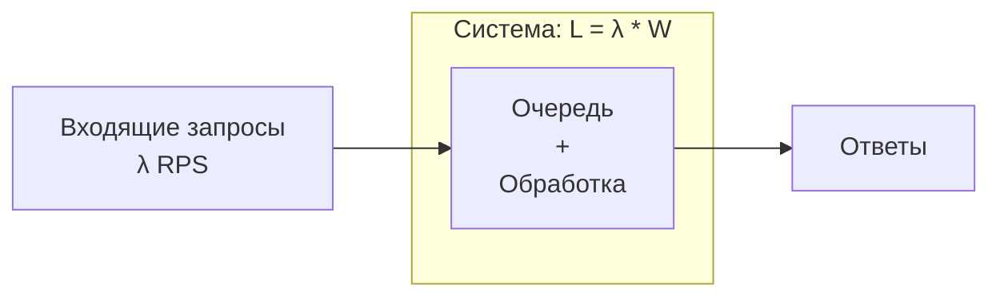

В предыдущих статьях мы определили нефункциональные требования и научились измерять их с помощью SLI/SLO. Теперь мы погружаемся в три фундаментальные метрики, вокруг которых строится любой системный дизайн: **Latency**, **Throughput** и **Availability**. Именно они лежат в основе компромиссов, которые архитектор принимает ежедневно.

Понимание этих метрик и их взаимосвязи — не просто теория. В контексте Go они напрямую влияют на выбор примитивов конкурентности, настройку пулов соединений, размеры буферов каналов и даже на структуру кода.

### Определения в контексте Go-бэкенда

#### Latency (Задержка)

**Latency** — время, необходимое для обработки одного запроса от момента его получения до момента отправки ответа. Измеряется в миллисекундах, микросекундах.

Для HTTP-сервера на Go latency складывается из:
- Времени чтения запроса из сокета (`read()` syscall).
- Времени декодирования JSON/Protobuf.
- Времени выполнения бизнес-логики.
- Времени запросов к базе данных или другим сервисам.
- Времени сериализации ответа и записи в сокет (`write()` syscall).
- Времени ожидания в очередях (каналы, мьютексы, планировщик горутин).

> [!info] Под капотом
> С точки зрения железа и ОС, latency — это сумма:
> - Тактов CPU, потраченных на выполнение инструкций вашего кода.
> - Времени ожидания данных из памяти (cache misses).
> - Времени системных вызовов и переключений контекста (Ring 3 ↔ Ring 0).
> - Сетевых задержек (RTT между сервисами).
> - Времени, потраченного в очередях (например, ожидание свободного соединения к БД).

#### Throughput (Пропускная способность)

**Throughput** — количество запросов, которые система может обработать за единицу времени. Обычно измеряется в RPS (Requests Per Second).

Throughput зависит от:
- Количества одновременно обрабатываемых запросов (конкурентность).
- Среднего времени обработки одного запроса (latency).
- Доступных ресурсов: CPU, память, сетевой канал, соединения с БД.

Для Go-сервиса ключевой фактор — модель конкурентности. Горутины позволяют обрабатывать тысячи одновременных запросов при небольшом количестве потоков ОС, что даёт высокий потенциальный throughput.

#### Availability (Доступность)

**Availability** — доля времени, в течение которого сервис способен успешно обрабатывать запросы. Обычно выражается в процентах: 99.9%, 99.99%.

В распределённой системе доступность отдельного Go-сервиса зависит от:
- Отказоустойчивости самого кода (паники, утечки горутин).
- Доступности зависимостей (БД, другие сервисы).
- Инфраструктуры (сеть, балансировщики, оркестрация).

> [!tip] Собеседование
> **Вопрос:** В чём разница между latency и response time?
> **Ответ:** Latency — это время, которое запрос проводит в системе (обработка). Response time — это время с точки зрения клиента, включающее network round-trip. В распределённых системах latency сервиса — лишь часть общего response time.

### Закон Литтла и его применение

Фундаментальная взаимосвязь между Latency, Throughput и конкурентностью описывается **Законом Литтла** (Little's Law):

```
L = λ * W
```

Где:
- **L** — среднее количество запросов, находящихся в системе одновременно (concurrency).
- **λ** — средняя интенсивность поступления запросов (throughput).
- **W** — среднее время обработки одного запроса (latency).

Эта формула кажется простой, но её следствия глубоки.

**Пример:** Если сервис обрабатывает запрос за 100 мс (W = 0.1 сек), и мы хотим держать throughput 1000 RPS (λ = 1000), то в системе одновременно будет находиться в среднем `L = 1000 * 0.1 = 100` запросов. Это означает, что пул горутин или соединений должен быть рассчитан минимум на 100 конкурентных операций.



**Практический вывод для Go:**
Если у вас фиксированный пул воркеров (например, 50 горутин), и каждый запрос занимает 200 мс, максимальный throughput, который может выдержать сервис без роста очереди, равен `λ = L / W = 50 / 0.2 = 250 RPS`. Если входящий трафик превысит 250 RPS, очередь начнёт расти, а latency — увеличиваться (за счёт ожидания в очереди).

```go
// Worker pool с фиксированным количеством воркеров
func workerPool(numWorkers int, jobs <-chan Job, results chan<- Result) {
    for i := 0; i < numWorkers; i++ {
        go worker(jobs, results)
    }
}
```

### Фундаментальные Trade-offs

Улучшение одной метрики почти всегда происходит за счёт ухудшения другой. Архитектор должен осознанно выбирать компромисс, исходя из бизнес-требований.

#### Latency vs Throughput

**Парадокс:** Увеличение конкурентности может повысить throughput, но одновременно увеличить latency из-за contention (конкуренции за ресурсы).

- **Увеличение числа горутин** повышает параллелизм → больше RPS. Но каждая горутина потребляет память (стек ~2KB+), создаёт нагрузку на планировщик, может вызывать contention на мьютексах или каналах. При превышении оптимального уровня latency начинает расти из-за возросших накладных расходов.
- **Батчинг (объединение запросов)** снижает количество сетевых вызовов и системных вызовов → повышает throughput. Но первый запрос в батче ждёт накопления остальных → увеличивается latency.
- **Буферизация в каналах** сглаживает пики и повышает throughput. Но данные задерживаются в буфере → latency растёт.

```go
// Пример: буферизированный канал увеличивает пропускную способность,
// но добавляет задержку доставки.
ch := make(chan Message, 1000) // большой буфер
```

> [!warning] Ловушка / Gotcha
> В Go неограниченное создание горутин под каждый входящий запрос (`go handle(conn)`) даёт хороший throughput до определённого предела, после которого планировщик начинает тратить больше времени на переключение контекста горутин, чем на полезную работу. Для высоконагруженных сервисов лучше использовать пул воркеров или ограничение через семафор.

#### Latency vs Consistency

В распределённых системах синхронная репликация гарантирует strong consistency, но добавляет задержку на подтверждение от реплик. Асинхронная репликация даёт низкую latency записи, но читатели могут получить устаревшие данные (eventual consistency). Этот компромисс — суть CAP-теоремы ([[30. CAP теорема и реальные компромиссы]]).

Для Go-сервиса это выражается в выборе:
- Использовать транзакции с уровнем изоляции `SERIALIZABLE` (медленнее, но гарантирует ACID).
- Использовать кэш с TTL (быстро, но данные могут быть устаревшими).

#### Availability vs Performance

Повышение доступности часто требует дополнительных проверок и репликации, что снижает производительность:
- Добавление Circuit Breaker ([[36. Circuit Breaker, Retry, Timeout и Backoff]]) увеличивает latency на несколько миллисекунд (проверка состояния).
- Health checks добавляют нагрузку на сервис.
- Распределённые транзакции (Saga) требуют дополнительных запросов и компенсаций.

#### Cost vs Everything

Инфраструктура стоит денег. Можно купить более мощные серверы (вертикальное масштабирование) для снижения latency, но это дорого. Можно добавить больше дешёвых инстансов (горизонтальное масштабирование), но тогда вырастет сложность управления и сетевое взаимодействие.

### Влияние архитектурных паттернов на Latency, Throughput и Availability

Выбор архитектурного стиля напрямую влияет на эти метрики.

| Архитектурный выбор | Влияние на Latency | Влияние на Throughput | Влияние на Availability |
|---------------------|--------------------|-----------------------|-------------------------|
| **Монолит** | Минимальная (вызовы функций) | Ограничен ресурсами одного сервера | Низкая (отказ процесса валит всё) |
| **Микросервисы (синхронные)** | Высокая (сетевые вызовы) | Высокий (независимое масштабирование) | Высокая (частичная деградация) |
| **Асинхронное взаимодействие** | Высокая (latency доставки) | Очень высокий (очереди сглаживают пики) | Высокая (отказ consumer не влияет на publisher) |
| **Кэширование** | Снижает (hit) / Увеличивает (miss) | Повышает (разгрузка БД) | Может снизить (stale data) |
| **Репликация (sync)** | Увеличивает (ждём реплик) | Снижает (ждём реплик) | Повышает (данные не потеряны) |
| **Репликация (async)** | Не влияет | Не влияет | Повышает, но с риском потери |

### Mechanical Sympathy: Go под капотом

#### Планировщик горутин и GOMAXPROCS

Планировщик Go (G-M-P) распределяет горутины по потокам ОС. Ключевой параметр `GOMAXPROCS` определяет количество параллельно выполняющихся потоков (обычно равен числу ядер CPU).

- Если все горутины выполняют CPU-bound работу, увеличение `GOMAXPROCS` свыше числа ядер не даст прироста throughput, но увеличит contention на планировщике.
- Если горутины много времени проводят в блокирующих системных вызовах (I/O), планировщик эффективно «отцепляет» их от потоков и подключает другие горутины. Это позволяет обрабатывать тысячи I/O-bound запросов на небольшом количестве ядер.

> [!info] Под капотом
> Когда горутина делает сетевой вызов (`conn.Read()`), рантайм Go использует **netpoller** — механизм, основанный на epoll/kqueue, который асинхронно ожидает готовности сокета, не блокируя поток ОС. Это позволяет одной горутине «спать» на сокете, в то время как поток выполняет другую горутину. Когда данные приходят, netpoller пробуждает горутину и ставит её в очередь планировщика.

#### Влияние GC на Latency

Сборщик мусора в Go — параллельный и конкурентный, но он всё равно создаёт короткие паузы (stop-the-world) для некоторых фаз. В latency-sensitive системах эти паузы могут стать проблемой для P99.

**Как GC влияет на метрики:**
- Частые аллокации → частые циклы GC → паузы → рост хвостовых задержек.
- Большой объём живучих объектов → длительные фазы сканирования → потенциальное замедление.

**Стратегии смягчения:**
- Минимизация аллокаций (`sync.Pool`, переиспользование объектов).
- Увеличение `GOGC` (жертвуем памятью ради меньшей частоты GC).
- Использование `GOMEMLIMIT` в Go 1.19+ для мягкого ограничения памяти и предсказуемого GC.

#### Системные вызовы и переключения контекста

Каждый системный вызов (например, `write()` в сокет) требует переключения из user space в kernel space. Хотя планировщик Go обрабатывает это эффективно (hand-off), слишком частые syscall'ы (например, побайтовая запись без буферизации) резко снижают throughput и увеличивают latency из-за накладных расходов.

**Решение:** буферизация на уровне приложения (`bufio.Writer`), батчинг операций.

### Практический пример: выбор размера буфера канала в Go

Рассмотрим пайплайн обработки данных: один продюсер генерирует задачи, несколько воркеров обрабатывают.

```go
tasks := make(chan Task, bufferSize)

// Продюсер
go func() {
    for _, task := range allTasks {
        tasks <- task
    }
    close(tasks)
}()

// Воркеры
for i := 0; i < numWorkers; i++ {
    go worker(tasks)
}
```

**Как выбор `bufferSize` влияет на метрики:**

- **bufferSize = 0 (небуферизированный канал):**
  - Продюсер блокируется, пока воркер не начнёт получать задачу.
  - Throughput ограничен синхронностью передачи.
  - Latency задачи минимальна (сразу передаётся воркеру).

- **bufferSize > 0:**
  - Продюсер может «забросить» задачи в буфер и идти дальше → Throughput растёт.
  - Задачи могут накапливаться в буфере → Latency растёт (время ожидания в очереди).
  - При переполнении буфера продюсер снова блокируется, создавая backpressure.

> [!warning] Ловушка / Gotcha
> Слишком большой буфер канала может скрыть проблемы с производительностью воркеров: задачи будут накапливаться, потребляя память, а latency будет расти. В production-коде следует мониторить длину очереди канала (`len(ch)`) и устанавливать алерты.

### Вывод: нет серебряной пули

Latency, Throughput и Availability — три вершины треугольника компромиссов. Невозможно одновременно получить минимальную задержку, максимальную пропускную способность и стопроцентную доступность при ограниченном бюджете.

**Senior/Lead Go-разработчик должен:**
1. **Измерять** фактические SLI своего сервиса (latency P99, throughput, error rate).
2. **Понимать**, какой компромисс заложен в текущую архитектуру.
3. **Принимать осознанные решения** о рефакторинге или масштабировании, основываясь на данных, а не на интуиции.

В следующей статье мы перейдём к конкретным стратегиям масштабирования, которые позволяют управлять этими компромиссами на практике: [[6. Вертикальное и горизонтальное масштабирование]].