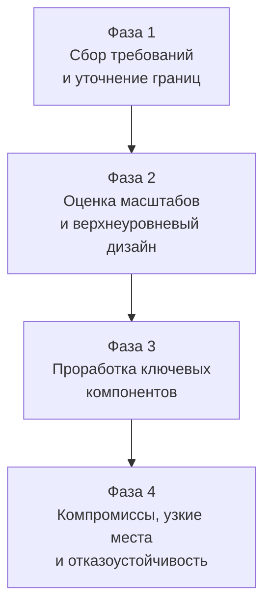

## Фреймворк для System Design интервью

Предыдущие 49 статей этого раздела дали вам инструментарий: от паттернов устойчивости до распределённых транзакций и cost optimization. Но на собеседовании знания сами по себе не обеспечивают успех — нужно уметь **структурированно мыслить** и **коммуницировать** решение. System Design интервью проверяет не то, знаете ли вы конкретную технологию, а то, как вы подходите к открытой, неоднозначной задаче и какие компромиссы выбираете.

Эта статья даёт пошаговый фреймворк для решения System Design задач, адаптированный под реалии Go-разработчика, и подсвечивает типичные ошибки, которые губят даже опытных кандидатов.

### Четыре фазы успешного интервью

Любое System Design интервью можно разбить на четыре фазы. Дисциплинированное следование им экономит время и демонстрирует зрелость.

#### Фаза 1: Сбор требований (3–5 минут)

Самая частая ошибка — бросаться рисовать диаграммы, не поняв, что именно нужно построить. Начните с вопросов:

- **Функциональные требования:** Что система делает? Кто пользователи? Какие основные сценарии? ([[3. Функциональные и нефункциональные требования]])
- **Нефункциональные требования:** Ожидаемый RPS? Допустимая задержка? Доступность (99.9% или 99.99%)? Объём данных? ([[5. Latency, Throughput, Availability и Trade-offs]])
- **Ограничения:** Есть ли требования по стеку? Мобильные клиенты? Гео-распределение?

**Пример для «спроектируйте сервис сокращения ссылок»:**
- Пользователь вставляет URL → получает короткую ссылку.
- При переходе по короткой ссылке → редирект на оригинальный URL.
- Нагрузка: 10 млн новых ссылок в месяц, 100 млн переходов в месяц.
- Задержка: редирект < 50 мс.

#### Фаза 2: Верхнеуровневый дизайн (5–10 минут)

Набросайте архитектуру «на салфетке». Определите основные компоненты и их взаимодействие. На этом этапе важны протоколы и стиль взаимодействия ([[20. RPC vs REST vs Messaging]]).

- Разделите систему на **stateless** сервисы (API) и **stateful** хранилища ([[7. Stateless vs Stateful сервисы]]).
- Выберите тип хранилища: реляционное или NoSQL, кэш, очереди ([[41. Data Pipeline и потоковая обработка]]).
- Продумайте, как сервисы находят друг друга ([[34. Service Discovery. Client side и Server side]]) и как балансируется нагрузка ([[33. Load Balancing на уровне архитектуры]]).

**В контексте Go:** явно проговорите, что API-сервисы будут написаны на Go, используют gRPC для внутренних взаимодействий и HTTP для внешних, а развёртываются как минимальные контейнеры. Это покажет, что вы думаете о реальной реализации.

#### Фаза 3: Проработка ключевых компонентов (15–20 минут)

Выберите 2–3 самых интересных или сложных компонента и углубитесь в них. Интервьюер ожидает, что вы продемонстрируете глубину.

- **Модель данных:** Как выглядят таблицы? Какие индексы? Как шардируете данные ([[31. Partitioning и Sharding]])?
- **Алгоритмы:** Как генерируется короткий ключ? Хэш? Snowflake?
- **Устойчивость:** Что при падении подов? Какие таймауты, ретраи, Circuit Breaker ([[36. Circuit Breaker, Retry, Timeout и Backoff]])?
- **Кэширование:** Что и как кэшируете ([[28. Кэширование. Cache Aside, Write Through, Write Back]])?

**Mechanical Sympathy на собеседовании:** упомяните, что Go-сервис с in-memory кэшем должен учитывать GC (использовать `ristretto` или `bigcache`), а для утилизации ядер — `automaxprocs`. Это выделит вас среди кандидатов, мыслящих только диаграммами.

#### Фаза 4: Компромиссы, узкие места и масштабирование (5 минут)

Покажите, что видите слабые места своего же дизайна:

- Где единая точка отказа? Как её устранить (репликация [[32. Репликация. Leader Follower и Multi Leader]], кластеризация)?
- Что будет узким горлышком при росте в 10 раз? Как масштабировать ([[6. Вертикальное и горизонтальное масштабирование]])?
- Как обеспечивается консистентность данных? Жертвуем ли мы ей в пользу доступности ([[30. CAP теорема и реальные компромиссы]])?

### Как применять Go-специфику

Знание внутренностей Go превращает абстрактную архитектуру в осязаемую.

- **Горутины и каналы:** для конкурентной обработки большого числа соединений не нужен отдельный пул потоков — Go делает это нативно. Упомяните, что HTTP-сервер на `net/http` spawn'ит горутину на запрос, а netpoller эффективно обрабатывает I/O.
- **Стандартная библиотека:** `net/http/httputil.ReverseProxy` для API Gateway, `database/sql` для пула соединений, `crypto/tls` для mTLS без внешних зависимостей. Это показывает умение обходиться малой кровью.
- **Контексты:** дедлайны и отмена операций через `context.Context` — основа надёжности в Go, о которой стоит упомянуть, обсуждая таймауты.
- **Protobuf/gRPC:** для внутренних высоконагруженных коммуникаций. Упомяните, что `grpc-go` использует HTTP/2 с мультиплексированием, снижая число соединений.

> [!info] Под капотом
> Если интервьюер спрашивает, как Go-сервис справляется с 10k одновременных соединений, объясните модель G-M-P и роль netpoller'а, который через epoll ожидает события на сокетах, не блокируя потоки ОС. Это знание выделяет Senior-кандидата.

### Коммуникация и типичные ошибки

- **Молчание убивает.** Думайте вслух. Интервьюер не читает мысли — объясняйте, что вы рассматриваете и почему отвергаете.
- **Не зацикливайтесь на деталях.** Выбор конкретного алгоритма хэширования не так важен, как общая архитектура. Если сомневаетесь — скажите «я бы выбрал murmur3 для равномерности, но точную реализацию можно уточнить позже».
- **Не игнорируйте нефункциональные требования.** Интервьюер часто намекает на них: «а что если у вас миллиард ссылок?». Переспросите и адаптируйте дизайн.
- **Не бойтесь сказать «я не знаю».** Честность с предложением «рассмотрю это как область для дальнейшего анализа» лучше, чем выдумывание на ходу.

> [!tip] Собеседование
> **Вопрос:** Как бы вы оценили количество серверов для сервиса с нагрузкой 100k RPS и P99 latency ≤ 100 мс?
> **Ответ:** Я бы исходил из того, что один хорошо настроенный Go-сервис на среднем сервере (4 vCPU) может обрабатывать 5–10k RPS в зависимости от сложности. Возьмём консервативно 5k RPS на инстанс. Значит, нужно 20 инстансов. Плюс запас 30% на пики и rolling update — около 25–30. Это базовая оценка, которую можно уточнить нагрузочным тестированием.

### Связь с другими темами раздела

В следующей статье мы применим этот фреймворк к конкретным задачам, которые чаще всего встречаются на собеседованиях, и разберём эталонные решения: [[52. Разбор типичных System Design задач]].

### Итог

System Design интервью — это не экзамен на знание Kafka или Kubernetes, а проверка инженерного мышления: умения слышать требования, структурировать проблему, выбирать компромиссы и аргументировать решения. Go-разработчик, владеющий фреймворком из этой статьи и понимающий Mechanical Sympathy своего языка, имеет преимущество — его архитектура не останется на бумаге, а будет эффективна в продакшене с первого дня.