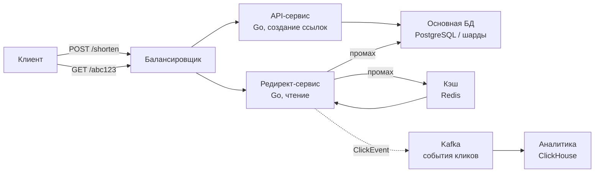
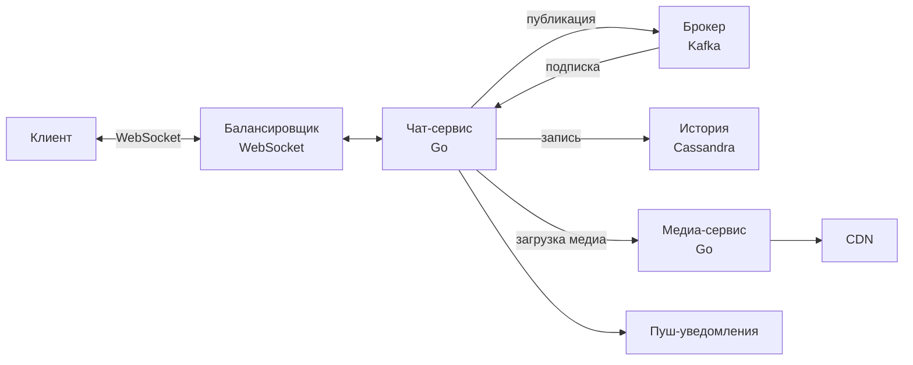
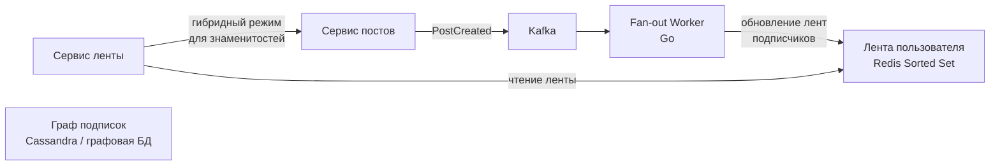
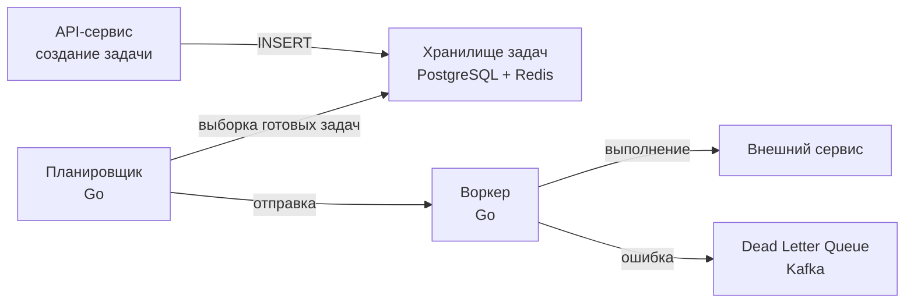
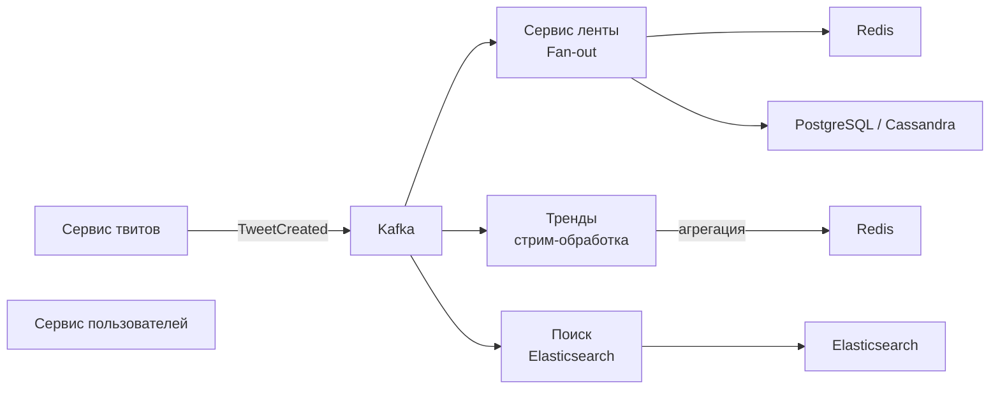
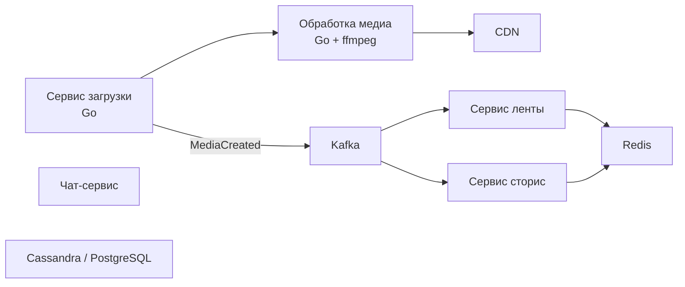
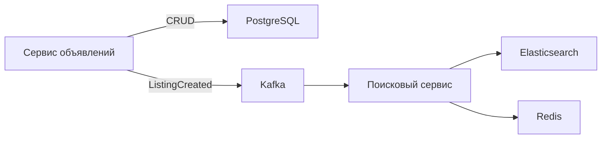
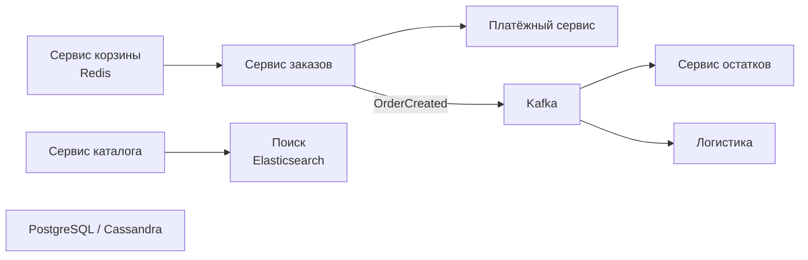
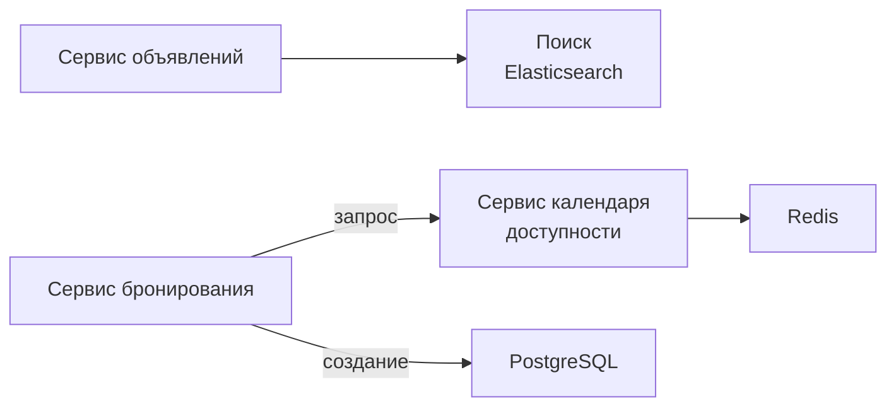
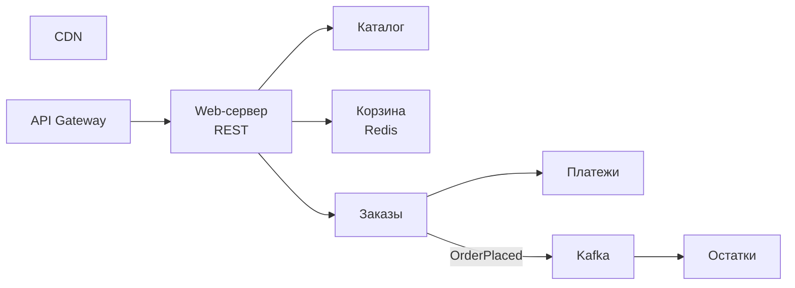

Фреймворк из предыдущей статьи ([[51. System Design интервью. Как подходить к задаче]]) даёт структуру. Теперь наполним её практикой — детально разберём десять классических и реальных систем, от простого URL Shortener до высоконагруженного маркетплейса и социальной сети. По каждой задаче пройдём четыре фазы, подсвечивая архитектурные компромиссы и Go-специфику, а также типичные ошибки и решения.

### 1. Сервис сокращения ссылок (URL Shortener)

**Функциональные требования:**
- Пользователь создаёт короткую ссылку из длинной (возможно, с кастомным алиасом и сроком жизни).
- При переходе по короткой — редирект на оригинал.
- Аналитика по кликам (гео, referrer, временные ряды).

**Нефункциональные требования:**
- 100 млн новых ссылок в месяц, 1 млрд переходов в день.
- Задержка редиректа < 50 мс (P99).
- Доступность 99.95%.

#### Верхнеуровневый дизайн

Разделение на API (запись) и Redirect (чтение) в духе CQRS ([[23. CQRS. Разделение чтения и записи]]). Редирект-сервис stateless, легко масштабируется горизонтально.

#### Ключевые решения

**Генерация короткого ключа:**
- Snowflake-подобный ID (64 бита), кодированный в base62. Go-генератор: `sync/atomic`, машинный ID из переменной окружения.
- Для предотвращения коллизий: уникальный constraint в БД, при конфликте — повторная генерация.

**Хранение:**
- Таблица `urls(id BIGINT PRIMARY KEY, short_key VARCHAR(10) UNIQUE, original_url TEXT, created_at TIMESTAMPTZ, expires_at TIMESTAMPTZ, user_id UUID)`.
- Шардирование по `short_key` через консистентное хэширование при росте > нескольких ТБ ([[31. Partitioning и Sharding]]). В начале — один инстанс с репликацией ([[32. Репликация. Leader Follower и Multi Leader]]).

**Кэширование:**
- Cache-Aside ([[28. Кэширование. Cache Aside, Write Through, Write Back]]): Redis с TTL 24 часа для горячих ссылок. При создании прогреваем кэш (ожидаемый всплеск переходов).
- Локальный in-memory кэш (`ristretto`) на инстансах Redirect для супергорячих ключей (top 1%), снижая задержку до микросекунд и нагрузку на Redis.

**Аналитика:**
- Асинхронная запись событий кликов в Kafka. Consumer пишет в ClickHouse для аналитических запросов ([[41. Data Pipeline и потоковая обработка]]). Это не влияет на latency редиректа.

**Устойчивость:**
- Rate Limiting на создание ссылок (Token Bucket, `golang.org/x/time/rate`).
- Circuit Breaker на Redis: при отказе читаем напрямую из БД, latency растёт, но система жива ([[36. Circuit Breaker, Retry, Timeout и Backoff]]).

**Mechanical Sympathy:**
- Редирект-сервис делает минимальную работу: разбор пути, запрос в кэш, ответ 301/302. На Go это укладывается в десятки микросекунд.
- Локальный кэш должен учитывать GC: используем `ristretto` с политикой LFU, минимизирующей аллокации. Не забываем про `GOMEMLIMIT` для контроля памяти.

### 2. Чат-сервер (Messaging)

**Требования:**
- Обмен сообщениями в реальном времени (1 на 1, групповые чаты до 1000 участников).
- Хранение истории, офлайн-доставка.
- Поддержка отправки медиа (сжатие, CDN).
- 100 млн активных пользователей, 1 млрд сообщений в день.

#### Архитектура

Чат-сервис **stateful** по WebSocket-соединениям, но **stateless** по бизнес-логике: после получения сообщения публикует его в Kafka, и подписанные инстансы доставляют своим клиентам. История хранится в Cassandra для высокой записи и горизонтального масштабирования.

#### Ключевые решения

**Протокол:**
- WebSocket с fallback на Long Polling. Go-сервер на `gorilla/websocket` или `nhooyr.io/websocket`, эффективно использующий горутины: одна горутина на чтение, одна на запись на каждого клиента. При масштабе 100 млн пользователей, но одновременно онлайн, скажем, 10 млн — это 20 млн горутин, что невозможно на одном сервере. Следовательно, Chat-сервис разбит на кластер из сотен узлов, каждый держит ~50–100 тыс. соединений.

**Брокер сообщений:**
- Kafka для гарантированной доставки и повторного чтения истории. Партиционирование по `chat_id`, чтобы все сообщения одного чата попадали в одну партицию (гарантия порядка).

**Хранение истории:**
- Cassandra: таблица `messages(chat_id UUID, message_id TIMEUUID, sender_id UUID, content text, media_ids list<UUID>, PRIMARY KEY (chat_id, message_id))` с кластеризацией по времени.

**Медиа:**
- Загрузка через отдельный сервис, который сжимает (Go + `imaging`), сохраняет в S3-совместимое хранилище, отдаёт через CDN. Ссылка на медиа в сообщении.

**Офлайн-сообщения:**
- При недоступности клиента сообщение сохраняется в Redis List на 7 дней и доставляется при подключении.

**Mechanical Sympathy:**
- Горутины, удерживающие WebSocket-соединения, потребляют память (~4-8 КБ стека + буферы). На 1 млн соединений — около 4-8 ГБ RAM только на горутины. Нужен мониторинг `go_goroutines` и тюнинг `GOMEMLIMIT`.
- Использование буферизированных каналов для исходящих сообщений клиентам: если клиент медленный, сообщения накапливаются, создавая backpressure ([[43. Backpressure и контроль нагрузки]]). Устанавливаем лимит и отключаем клиента при превышении.

### 3. Новостная лента (News Feed) — аналог ленты Твиттера/Фейсбука

**Требования:**
- Пользователь видит ленту постов от друзей/подписок, сортированную по времени или релевантности.
- Поддержка текста, изображений, видео.
- 200 млн активных пользователей, каждый читает ленту 10 раз в день.
- Задержка от публикации до появления в ленте < 2 сек.

#### Архитектура: Fan-out on Write с гибридом для знаменитостей

- **Fan-out on Write:** при публикации пост проталкивается в ленты всех подписчиков (до 10k). Чтение — быстрый запрос «моя лента».
- **Знаменитости** (свыше 1 млн подписчиков): их посты не раскидываются при записи, а лента подписчика собирается при чтении из отдельного кэша знаменитостей.

#### Ключевые решения

**Хранение ленты:**
- Redis Sorted Set (`ZADD timeline:userID timestamp postID`), ограниченный последними 1000 постами. Каждый пост — JSON с краткой информацией.
- Долговременное хранение — Cassandra: таблица `user_feed(user_id UUID, post_id UUID, timestamp, PRIMARY KEY (user_id, timestamp))`.

**Fan-out Worker на Go:**
- Consumer Kafka, пул горутин. Для обычного пользователя — читает граф подписок из Cassandra и обновляет Redis пайплайном (`go-redis pipeline`), минимизируя сетевые задержки.
- Для знаменитостей — worker помечает их флагом, и сервис ленты при чтении собирает посты знаменитостей отдельным запросом к Cassandra и мерджит в ленту.

**Консистентность:**
- Eventual consistency ([[29. Consistency модели. Strong, Eventual, Causal]]): пост может появиться в ленте с задержкой 1-2 сек. Приемлемо для пользовательского опыта.

**Кэширование:**
- Горячие ленты (активные пользователи) кэшируются в локальном `ristretto` на инстансах Feed-сервиса, снижая нагрузку на Redis.

**Mechanical Sympathy:**
- Worker должен обрабатывать всплески (знаменитость опубликовала пост — миллионы обновлений). Используем семафор на канале для ограничения одновременных записей в Redis, чтобы не перегрузить его.
- Пайплайны в `go-redis` позволяют отправлять пачку команд за один системный вызов, экономя CPU и сеть.

### 4. Система отложенных задач (Job Queue / Scheduler)

**Требования:**
- Планирование задач на будущее (например, отправить email через 1 час, сгенерировать отчёт).
- Гарантированное выполнение (at-least-once).
- Миллионы задач в день, пики до 50k задач в секунду.

#### Архитектура

**Хранилище:**
- PostgreSQL с таблицей `jobs(id UUID, payload JSONB, scheduled_at TIMESTAMPTZ, status VARCHAR, retry_count INT, ...)` и составным индексом `(status, scheduled_at)`.
- Для быстрого опроса используем `SELECT ... FOR UPDATE SKIP LOCKED LIMIT 1000`, что позволяет нескольким планировщикам не блокировать друг друга.

**Планировщик:**
- Go-сервис с тикером 1 сек. Масштабируется горизонтально: несколько экземпляров, каждый забирает порцию задач.
- Для задач с коротким горизонтом (секунды) — дополнительно Redis Sorted Set, откуда планировщик забирает через `ZPOPMIN`.

**Воркер:**
- Пул горутин фиксированного размера (настраиваемый). Каждая задача выполняется с таймаутом через `context.WithTimeout`.
- При ошибке — экспоненциальный backoff и увеличение `retry_count`. После N попыток — в DLQ (Kafka), где разбирается вручную или автоматически.

**Идемпотентность:**
- Каждая задача имеет уникальный `idempotency_key`. Если задача уже выполнена, повторный запуск игнорируется ([[27. Idempotency и exactly once семантика]]).

**Mechanical Sympathy:**
- `SKIP LOCKED` — конкурентный доступ к БД без блокировок. Несколько планировщиков могут работать параллельно.
- Пул воркеров с семафором на канале, чтобы не создавать неограниченное количество горутин.

### 5. Аналог Твиттера

**Требования:**
- Публикация твитов (текст, медиа), лента, ретвиты, лайки, подписки.
- 200 млн активных пользователей, 500 млн твитов в день.
- Быстрая доставка твитов подписчикам (лента), тренды, поиск.

#### Архитектура

**Лента:** аналогично News Feed, гибридный fan-out.

**Поиск:** индексация твитов в Elasticsearch. Поиск по тексту, хэштегам. Асинхронная запись в ES через Kafka Connect.

**Тренды:** стрим-обработка на Go (или Kafka Streams) — подсчёт частоты хэштегов за скользящие окна (1 час, 24 часа). Результаты в Redis для быстрой выдачи.

**Медиа:** отдельный сервис сжатия изображений и видео, загрузка в S3 и CDN.

**Граф подписок:** Cassandra (быстрое чтение подписчиков и подписок).

#### Ключевые решения

**Шардирование:** твиты шардируются по `tweet_id`, лента — по `user_id`. Cassandra для истории твитов и графа.

**Консистентность:** eventual. Лента обновляется с задержкой до 2 сек.

**Механическая симпатия:**
- Fan-out worker на Go: обработка большого количества обновлений, пайплайны в Redis, контроль памяти.
- Поиск: индексация через consumer Kafka, запись в Elasticsearch батчами для снижения нагрузки.

### 6. Аналог Инстаграма

**Требования:**
- Загрузка фото и видео, лента, сторис, директ-месседжинг, лайки, комментарии.
- 1 млрд пользователей, миллиарды загрузок в день.
- Быстрая загрузка и просмотр медиа, низкая задержка.

#### Архитектура

**Обработка медиа:** при загрузке изображения/видео Go-сервис создаёт множество разрешений (responsiveness) и форматов, сохраняет в S3, метаданные в БД. Используем `imaging` для изображений, для видео — вызов `ffmpeg` через `os/exec`.

**Лента:** аналогично Твиттеру, но с предпочтением недавних постов, плюс рекомендательная система на основе машинного обучения (отдельный сервис на Python/Go).

**Сторис:** временные посты (24 часа). Хранение в Redis с TTL + Cassandra для резерва.

**Директ:** чат-сервер на WebSocket (см. выше).

**Кэширование:** агрессивное кэширование лент, профилей, популярных медиа. CDN для статики.

**Mechanical Sympathy:**
- Загрузка файлов в Go: потоковая обработка multipart, ограничение размера, запись в S3 через `minio-go` или AWS SDK. Не держим файл в памяти целиком.
- Генерация миниатюр: временные файлы в `/tmp`, избегаем аллокаций больших буферов.

### 7. Аналог Авито (Доска объявлений)

**Требования:**
- Публикация объявлений (текст, фото, категория, цена, местоположение).
- Поиск с фильтрами (категория, цена, гео), сортировка по дате/цене.
- Просмотр объявления, контакты продавца.
- 10 млн объявлений, 50 млн просмотров в день.

#### Архитектура

**Хранение объявлений:** PostgreSQL с полями (`id, title, description, price, category_id, location GEO, user_id, status, created_at`). Индексы по категории, дате.

**Поиск:** Elasticsearch для полнотекстового поиска по заголовку и описанию, фильтрация по цене, категории, гео-радиусу. Индексация асинхронная через Kafka.

**Кэширование:** горячие объявления (просматриваемые) в Redis, локальный кэш для поисковых запросов (автодополнение).

**Изображения:** отдельный сервис загрузки, хранение в S3, миниатюры через CDN.

**Механическая симпатия:**
- Поисковой сервис на Go: при высоком RPS используем пул горутин для параллельного запроса к Elasticsearch и Redis, ограничивая таймаут.
- Гео-запросы: Elasticsearch поддерживает geo-distance, что эффективнее ручной реализации.

### 8. Аналог Озона (Маркетплейс)

**Требования:**
- Каталог товаров (миллионы SKU), поиск, фильтры.
- Корзина, оформление заказа, платежи.
- Управление заказами, статусы, логистика.
- Высокая нагрузка в пики (Чёрная пятница).

#### Архитектура

**Каталог:** PostgreSQL для мастер-данных, Elasticsearch для поиска. Кэширование Redis.

**Корзина:** Redis (сессионный кэш) с TTL. Не требует транзакционной гарантии до оформления заказа.

**Заказ:** Saga ([[26. Saga Pattern. Оркестрация и хореография]]) с оркестратором: резервирование товара → списание денег → создание заказа. Компенсации при сбоях.

**Остатки:** отдельный сервис с кэшем Redis и периодической синхронизацией с основной БД склада.

**Высокие нагрузки:** горизонтальное масштабирование всех сервисов, Rate Limiting на входе, предварительный прогрев кэша перед акциями.

**Mechanical Sympathy:**
- Оркестратор Saga на Go: используем Temporal для надёжности или самодельный на основе конечного автомата с состоянием в PostgreSQL. Это удерживает горутины на длительное время, поэтому важно не блокировать их бесконечно.
- Платёжный сервис: интеграция с внешними API через клиентов с таймаутами и ретраями.

### 9. Аренда квартир/машин (Booking-like)

**Требования:**
- Поиск доступных предложений по датам, гео, фильтрам (цена, тип).
- Бронирование с блокировкой календаря.
- Управление объявлениями хозяев.
- Миллионы объявлений, высокие пики в сезон.

#### Архитектура

**Календарь доступности:** для каждой квартиры/машины хранится набор дат (битовая карта или строки) в Redis (быстрый доступ) и долгосрочно в PostgreSQL.

**Бронирование:** оптимистическая блокировка: проверка доступности дат в Redis, если свободно — резервирование с установкой TTL, затем создание записи в PostgreSQL и подтверждение.

**Поиск:** Elasticsearch с индексацией по гео, цене, доступным датам. При поиске фильтруем предложения, где нет пересечения занятых дат, запрашивая календарь из Redis.

**Механическая симпатия:**
- Календарь может быть реализован как Redis Bitmap (`SETBIT`) для каждого объекта, что очень компактно и быстро проверяется.
- При бронировании используем Lua-скрипты в Redis для атомарной проверки и резервирования.

### 10. Интернет-магазин (High-Load E-commerce)

**Требования:**
- Каталог, поиск, корзина, оформление заказа, оплата, учёт остатков в реальном времени.
- Выдерживать нагрузку Чёрной пятницы (10x нормальной).
- 1 млн товаров, 100k заказов в час в пике.

#### Архитектура

**Каталог:** кэшируется на нескольких уровнях: CDN для статики, Redis для данных товаров, локальный кэш для горячих SKU.

**Корзина:** Redis Cluster с репликацией.

**Заказы:** Saga с оркестрацией через Temporal для надёжности. При пиках нагрузок включаем деградацию: асинхронная обработка заказов, очередь на входе.

**Остатки:** in-memory Redis с Lua-скриптами для атомарного резервирования и списания.

**Подготовка к пикам:** предварительное масштабирование подов, прогрев кэша, отключение ресурсоёмких функций (рекомендации), увеличение пулов соединений.

**Mechanical Sympathy:**
- Кэширование на всех уровнях минимизирует запросы к БД.
- Использование `singleflight` для предотвращения лавины запросов к БД при истечении горячего кэша.

### Общие выводы

Разбор десяти систем демонстрирует, что не существует «идеальной» архитектуры — есть компромиссы, которые вы аргументированно выбираете, опираясь на требования, масштаб и Go-специфику. Ключевые инварианты:

- **Разделение чтения и записи** там, где нагрузка асимметрична.
- **Асинхронная коммуникация** для развязывания сервисов и повышения надёжности.
- **Кэширование** на всех уровнях, от CDN до локального in-memory.
- **Готовность к пикам** через горизонтальное масштабирование и деградацию.
- **Mechanical Sympathy** с Go: минимизация аллокаций, контроль горутин, использование пайплайнов и батчинга.

Следующая статья завершает раздел и собирает главные ошибки проектирования, которых следует избегать: [[53. Антипаттерны архитектуры]].