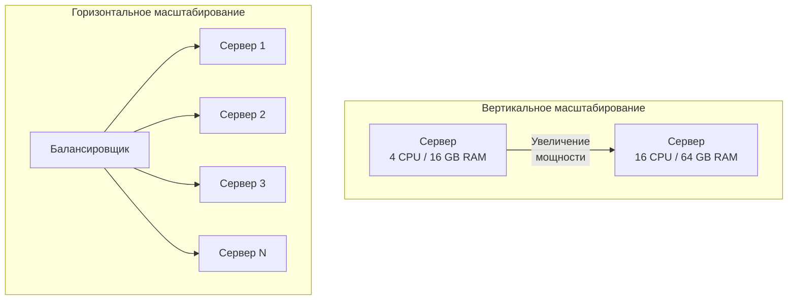

Когда ваш Go-сервис перестаёт справляться с нагрузкой — растёт latency, падает throughput, а SLO трещит по швам — приходит время масштабирования. Но слово «масштабирование» скрывает за собой два принципиально разных подхода, каждый со своими компромиссами, стоимостью и последствиями для архитектуры.

В этой статье мы разберём вертикальное и горизонтальное масштабирование, их физические ограничения, влияние на рантайм Go и практические стратегии выбора.

### Два пути роста

**Вертикальное масштабирование (Vertical Scaling, Scale Up)** — увеличение мощности существующего сервера: больше CPU, больше RAM, более быстрые диски (NVMe вместо SSD), более пропускная сетевая карта. Ваш Go-сервис продолжает работать на одной машине, но эта машина становится мощнее.

**Горизонтальное масштабирование (Horizontal Scaling, Scale Out)** — увеличение количества серверов, на которых работает ваш сервис. Вместо одного мощного сервера вы запускаете множество экземпляров приложения за балансировщиком нагрузки.



### Вертикальное масштабирование: простота и ограничения

#### Преимущества

- **Отсутствие изменений в коде.** Ваш Go-сервис не обязан быть stateless — локальный кэш в памяти, in-memory состояние, всё работает как прежде.
- **Нет сетевых задержек между экземплярами.** Все горутины работают в одном адресном пространстве, обмениваясь данными через каналы или мьютексы, а не через сеть. Latency межсервисных вызовов равна времени вызова функции.
- **Простота эксплуатации.** Один процесс, один конфиг, один лог-файл. Деплой — замена бинарника и перезапуск.

#### Недостатки и физические пределы

- **Железо имеет потолок.** Вы не можете бесконечно наращивать CPU на одной машине. Современные серверы ограничены ~128–256 ядрами, и даже такие машины стоят экспоненциально дороже.
- **Единая точка отказа.** Если сервер падает, сервис полностью недоступен.
- **Ограничения операционной системы и рантайма.** Даже на мощном железе Go-рантайм сталкивается с внутренними ограничениями.

> [!info] Под капотом
> **NUMA и планировщик Go.** На серверах с большим количеством ядер память физически разделена на несколько узлов (Non-Uniform Memory Access). Доступ к «чужой» памяти медленнее. Планировщик Go (G-M-P) не всегда оптимально учитывает NUMA-топологию, что может привести к деградации производительности при масштабировании на 64+ ядер. В Go 1.21+ появились улучшения в этой области, но полной NUMA-awareness нет.

- **Garbage Collector.** В Go один GC на весь процесс. С ростом объёма живущих объектов (live heap) время фаз сканирования увеличивается, что может привести к росту хвостовых задержек. Настройки `GOGC` и `GOMEMLIMIT` помогают, но не устраняют проблему полностью.

### Горизонтальное масштабирование: эластичность и сложность

#### Преимущества

- **Теоретически неограниченное масштабирование.** Добавляйте столько инстансов, сколько нужно (и сколько позволяет бюджет).
- **Отказоустойчивость.** Падение одного инстанса не валит весь сервис — балансировщик перестаёт слать на него трафик.
- **Эластичность.** В облачных средах можно автоматически добавлять и убирать инстансы в зависимости от нагрузки (autoscaling).
- **Географическое распределение.** Можно размещать инстансы в разных дата-центрах, снижая latency для пользователей из разных регионов.

#### Недостатки и вызовы

- **Сложность.** Требуется балансировщик нагрузки, service discovery, распределённая трассировка, централизованное логирование.
- **Состояние должно быть вынесено.** Сервис обязан быть stateless ([[7. Stateless vs Stateful сервисы]]). Сессия пользователя, кэш, временные данные должны храниться в Redis, базе данных или передаваться в каждом запросе.
- **Сетевые задержки.** Взаимодействие между сервисами идёт через сеть, добавляя миллисекунды к каждому вызову.
- **Консистентность данных.** При наличии нескольких инстансов, пишущих в одну БД, возникают проблемы гонок, требующие транзакций или распределённых блокировок.

### Mechanical Sympathy: как масштабирование влияет на Go-приложение

#### Горутины и GOMAXPROCS

При вертикальном масштабировании вы добавляете ядра CPU, и Go-рантайм автоматически использует их для параллельного выполнения горутин (если `GOMAXPROCS` установлен в `runtime.NumCPU()`). Это даёт практически линейный рост производительности для CPU-bound задач до тех пор, пока не упрётесь в contention на общих структурах данных.

При горизонтальном масштабировании каждый инстанс работает со своим `GOMAXPROCS`, изолированно от других. Это устраняет contention на уровне рантайма, но добавляет contention на уровне базы данных или других общих ресурсов.

#### Память и GC

Вертикальное масштабирование по памяти даёт больше пространства для кучи, что позволяет реже запускать GC (если `GOGC` фиксирован). Однако большой объём живущих объектов увеличивает время сканирования, и паузы GC могут стать заметными. Горизонтальное масштабирование распределяет память между инстансами, каждый GC работает с меньшей кучей, что даёт более предсказуемые паузы.

```go
// Пример: как проверить текущие настройки GC
import "runtime"

func printGCStats() {
    var m runtime.MemStats
    runtime.ReadMemStats(&m)
    log.Printf("HeapAlloc: %d MB", m.HeapAlloc/1024/1024)
    log.Printf("NumGC: %d", m.NumGC)
    log.Printf("GOMAXPROCS: %d", runtime.GOMAXPROCS(0))
}
```

#### Системные вызовы и файловые дескрипторы

При горизонтальном масштабировании каждый инстанс открывает свои соединения к базе данных, Redis, внешним API. Суммарное количество соединений растёт линейно с числом инстансов, что может перегрузить downstream-сервисы. Необходимо тщательно настраивать пулы соединений и использовать ограничения на стороне клиента.

```go
db.SetMaxOpenConns(20)      // ограничение на инстанс
db.SetMaxIdleConns(10)
```

### Практические паттерны масштабирования в Go

#### Worker Pool для CPU-bound задач

Если ваш Go-сервис выполняет тяжёлые вычисления, вертикальное масштабирование эффективно до определённого предела. Для полной утилизации всех ядер используйте пул воркеров с количеством горутин, равным `GOMAXPROCS`.

```go
func workerPool(numWorkers int) {
    jobs := make(chan Job, numWorkers*2)
    for i := 0; i < numWorkers; i++ {
        go func() {
            for job := range jobs {
                process(job)
            }
        }()
    }
    // продюсер отправляет в jobs
}
```

#### Семафор для ограничения конкурентности I/O-bound задач

Для I/O-bound сервисов (много сетевых вызовов) горутин может быть гораздо больше, чем ядер. Но бесконтрольное создание горутин под каждый запрос может привести к исчерпанию памяти или перегрузке сети. Используйте семафор для ограничения одновременных операций.

```go
sem := make(chan struct{}, maxConcurrent)

func handleRequest(w http.ResponseWriter, r *http.Request) {
    select {
    case sem <- struct{}{}:
        defer func() { <-sem }()
        // обработка запроса
    case <-r.Context().Done():
        http.Error(w, "timeout", http.StatusServiceUnavailable)
    }
}
```

#### Graceful Shutdown при горизонтальном масштабировании

При уменьшении количества инстансов (scale in) оркестратор отправляет сигнал SIGTERM. Ваш Go-сервис должен корректно завершить работу, не обрывая текущие запросы.

```go
srv := &http.Server{Addr: ":8080"}

go func() {
    if err := srv.ListenAndServe(); err != http.ErrServerClosed {
        log.Fatal(err)
    }
}()

stop := make(chan os.Signal, 1)
signal.Notify(stop, syscall.SIGTERM, syscall.SIGINT)
<-stop

ctx, cancel := context.WithTimeout(context.Background(), 30*time.Second)
defer cancel()
if err := srv.Shutdown(ctx); err != nil {
    log.Printf("shutdown error: %v", err)
}
```

> [!warning] Ловушка / Gotcha
> При горизонтальном масштабировании убедитесь, что ваш сервис **идемпотентен**. Если балансировщик отправит повторный запрос на другой инстанс из-за таймаута, операция не должна выполниться дважды. Подробнее в [[27. Idempotency и exactly once семантика]].

### Когда выбирать вертикальное, а когда горизонтальное масштабирование

| Критерий | Вертикальное | Горизонтальное |
|----------|--------------|-----------------|
| **Состояние** | Сервис stateful или хранит локальный кэш | Сервис stateless или состояние легко вынести |
| **Нагрузка** | Умеренный, предсказуемый рост | Высокий, пиковый, непредсказуемый рост |
| **Бюджет** | Малый стартовый, нежелание усложнять | Готовность инвестировать в инфраструктуру |
| **Отказоустойчивость** | Некритично (например, внутренний инструмент) | Критично (SLA 99.9%+) |
| **Команда** | Небольшая, DevOps-компетенции ограничены | Выделенная инфраструктурная команда |
| **Физические ограничения** | Уперлись в потолок железа или NUMA | Возможность горизонтального роста есть |

> [!tip] Собеседование
> **Вопрос:** Ваш Go-сервис обрабатывает 5000 RPS, P99 latency = 120 мс при SLO 100 мс. Профилирование показывает, что 80% времени уходит на CPU внутри сервиса (сериализация JSON, валидация). Что выберете: вертикальное или горизонтальное масштабирование? Почему?
> **Ответ:** Это классический CPU-bound сценарий. Горизонтальное масштабирование добавит сетевых задержек на балансировщике и не решит проблему на уровне отдельного запроса — latency останется высокой. Вертикальное масштабирование (больше ядер CPU) позволит быстрее обрабатывать каждый запрос, снизив latency. Однако нужно проверить, не упирается ли код в contention на общих мьютексах. Если да, то сначала оптимизировать код (например, использовать `easyjson` вместо `encoding/json`, что снизит CPU-нагрузку на 30-50%), а затем уже масштабироваться.

### Эволюция масштабирования: от монолита к эластичности

На практике большинство проектов проходят путь от вертикального к горизонтальному масштабированию:

1. **Стартап / MVP:** Монолит на одном сервере (вертикальное масштабирование при необходимости). Go-бинарник потребляет мало памяти, хорошо утилизирует CPU. Этого хватает на первые сотни тысяч пользователей.

2. **Рост:** Упираемся в потолок одного сервера или нужна высокая доступность. Внедряем балансировщик, запускаем 2-3 инстанса (горизонтальное масштабирование). Выносим состояние в Redis/PostgreSQL.

3. **Гиперрост:** Дробим монолит на микросервисы, каждый масштабируется независимо (горизонтально). Используем оркестрацию (Kubernetes) и автоскейлинг по метрикам.

Go с его статической компиляцией, низким потреблением памяти и быстрым стартом идеально подходит для горизонтального масштабирования в контейнерах: образ занимает ~10-20 МБ, запускается за миллисекунды, что позволяет быстро реагировать на всплески трафика.

### Итог

- **Вертикальное масштабирование** — просто, дёшево на старте, но имеет физический потолок и единую точку отказа. Подходит для stateful-сервисов и умеренных нагрузок.
- **Горизонтальное масштабирование** — сложнее, требует stateless-архитектуры и инфраструктуры, но даёт эластичность и отказоустойчивость.
- Go эффективен в обоих сценариях: хорошо утилизирует многоядерные процессоры при вертикальном росте и создаёт легковесные, быстро стартующие контейнеры для горизонтального.
- Выбор стратегии масштабирования — это всегда компромисс между простотой, стоимостью и доступностью, который архитектор принимает на основе конкретных требований.

Теперь, когда мы понимаем, как расти вширь и вглубь, следующий логичный вопрос: как проектировать сервис, чтобы он мог масштабироваться горизонтально? Ответ кроется в различии между Stateless и Stateful сервисами, о чём поговорим в статье [[7. Stateless vs Stateful сервисы]].