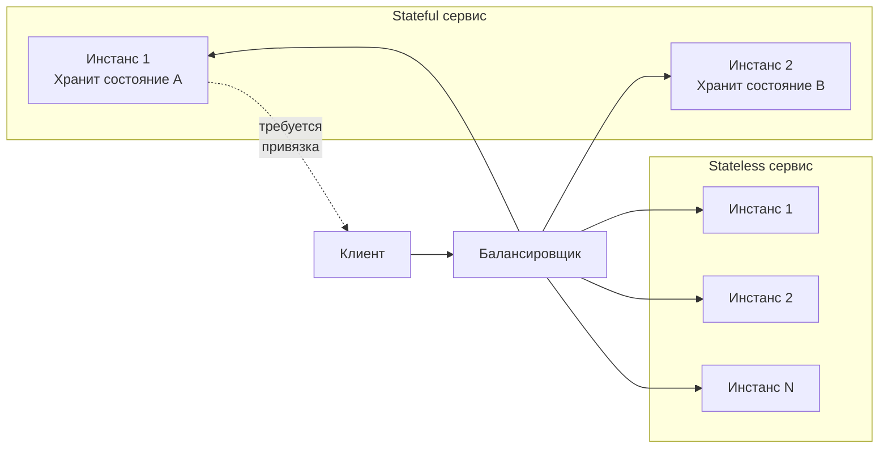

В предыдущей статье мы выяснили, что горизонтальное масштабирование требует от сервиса способности работать на множестве независимых инстансов. Ключевое свойство, определяющее эту способность, — отсутствие локального состояния. Разделение на **stateless** и **stateful** сервисы — один из фундаментальных архитектурных выборов, влияющий на масштабируемость, отказоустойчивость и сложность эксплуатации.

В этой статье мы разберём, что означают эти термины в контексте Go, как рантайм и конкурентная модель языка взаимодействуют с состоянием, и какие паттерны помогают проектировать сервисы, готовые к горизонтальному росту.

### Определения

**Stateless-сервис** не хранит никаких данных о клиенте или сессии между запросами. Каждый входящий запрос содержит всю информацию, необходимую для его обработки. Сервис может быть перезапущен, реплицирован или заменён в любой момент без потери контекста. Примеры: HTTP API, преобразующее JSON-запрос в ответ; функция-обработчик, читающая из очереди и пишущая в базу данных.

**Stateful-сервис** сохраняет информацию между запросами. Эта информация может быть критична для корректной работы: сессия пользователя, промежуточные результаты вычислений, кэш, состояние конечного автомата. Перезапуск или потеря инстанса приводит к потере состояния и, как следствие, к ошибкам или некорректному поведению. Примеры: базы данных, брокеры сообщений, игровые серверы с комнатами, сервисы с длительными бизнес-процессами.



### Почему Stateless — основа горизонтального масштабирования

При горизонтальном масштабировании трафик распределяется между множеством экземпляров сервиса. Балансировщик может отправить запрос от одного и того же клиента на разные инстансы в разное время. Если сервис stateless, это не имеет значения — любой инстанс способен обработать запрос, опираясь только на данные, переданные в нём.

Если сервис stateful, возникает проблема **привязки сессии** (session affinity, sticky sessions). Балансировщик должен гарантировать, что все запросы конкретного пользователя попадают на один и тот же инстанс. Это:
- Усложняет конфигурацию инфраструктуры.
- Снижает отказоустойчивость: при падении инстанса все связанные с ним сессии теряются.
- Препятствует равномерному распределению нагрузки.
- Затрудняет rolling updates и canary deployments.

> [!info] Под капотом
> Даже при использовании sticky sessions через cookie или хэш IP-адреса, вы не застрахованы от потери состояния. Инстанс может упасть, Kubernetes может его перезапустить с новым IP, балансировщик может пересчитать хэш-таблицу при добавлении/удалении нод. В распределённой системе **единственный надёжный способ сохранить состояние — вынести его во внешнее хранилище**, спроектированное быть stateful: Redis, PostgreSQL, Kafka.

### Go и Stateless: естественная пара

Go с его философией «не усложняй» и встроенными инструментами для конкурентности отлично подходит для построения stateless-сервисов.

#### Request-scoped контекст

Пакет `context` — краеугольный камень stateless-обработки в Go. Контекст передаётся от входящего HTTP-запроса через все слои приложения, неся дедлайны, таймауты, трассировочные ID и значения, специфичные для данного запроса. После завершения запроса контекст и все связанные с ним данные отбрасываются.

```go
func handleOrder(w http.ResponseWriter, r *http.Request) {
    ctx := r.Context()
    
    // Добавляем request-scoped значения
    ctx = context.WithValue(ctx, requestIDKey, generateRequestID())
    
    // Передаём дальше в бизнес-логику
    order, err := orderService.Create(ctx, req)
    // ...
}
```

> [!warning] Ловушка / Gotcha
> Не используйте `context.WithValue` для передачи данных, которые должны пережить запрос. Контекст — это не замена глобального состояния или кэша. Попытка использовать его для хранения состояния между запросами — антипаттерн.

#### Отсутствие глобальных переменных по умолчанию

Go не запрещает глобальные переменные, но идиоматичный код избегает их. Вместо `var globalCache map[string]User` предпочтительнее передавать зависимости явно через конструктор:

```go
type Service struct {
    cache *redis.Client
    db    *sql.DB
}

func NewService(cache *redis.Client, db *sql.DB) *Service {
    return &Service{cache: cache, db: db}
}
```

Такой подход автоматически делает сервис готовым к горизонтальному масштабированию: каждый инстанс получает свои соединения к внешним хранилищам состояния.

#### Горутины и локальное состояние

Горутины внутри одного процесса Go разделяют общее адресное пространство. Это может создавать иллюзию «дешёвого» внутреннего состояния. Например, можно запустить фоновую горутину, которая агрегирует метрики в памяти, или использовать `sync.Map` как in-memory кэш между запросами. Технически это работает, но **превращает сервис в stateful**.

```go
// Так делать не рекомендуется для horizontally scalable сервиса
var localCache sync.Map

func handler(w http.ResponseWriter, r *http.Request) {
    // Кэш хранится в памяти процесса
    if val, ok := localCache.Load(key); ok {
        json.NewEncoder(w).Encode(val)
        return
    }
    // ...
}
```

Такой сервис не может быть просто размножен за балансировщиком, потому что кэш одного инстанса невидим другому. Результаты будут различаться в зависимости от того, на какой инстанс попал запрос.

### Управление состоянием в Go: выносим наружу

Если бизнес-логика требует состояния, его необходимо делегировать специализированным stateful-сервисам.

#### Сессии пользователей → Redis

Вместо хранения сессии в памяти Go-сервиса (например, `map[sessionID]User`), используйте Redis с TTL. Каждый запрос приносит session cookie, по которому сервис достаёт данные из Redis.

```go
func (s *Service) GetUserFromSession(ctx context.Context, sessionID string) (*User, error) {
    data, err := s.redis.Get(ctx, "session:"+sessionID).Bytes()
    if err == redis.Nil {
        return nil, ErrSessionNotFound
    }
    if err != nil {
        return nil, err
    }
    var user User
    json.Unmarshal(data, &user)
    return &user, nil
}
```

#### Кэш → Redis или Memcached

Вместо `sync.Map` или `map` с мьютексом для кэширования результатов запросов к БД, используйте внешний кэш. Это не только решает проблему согласованности между инстансами, но и позволяет кэшу пережить рестарт сервиса.

#### Длительные операции и workflow → Temporal или очереди

Если ваш сервис управляет бизнес-процессом, который длится минуты или часы (например, оформление заказа с ожиданием оплаты), нельзя держать состояние процесса в памяти Go-приложения. Вместо этого используйте:
- **Базу данных** с таблицей состояний процесса.
- **Temporal.io** — движок workflow, который сохраняет состояние в БД и восстанавливает его после сбоев.
- **Очереди сообщений** с отсроченной доставкой (RabbitMQ, Kafka).

```go
// Плохо: состояние процесса в глобальной map
var orderProcesses = make(map[string]*OrderProcess)

// Хорошо: состояние в БД
type OrderProcess struct {
    ID        string
    Status    string
    CreatedAt time.Time
    // ...
}

func (s *Service) UpdateOrderStatus(ctx context.Context, orderID, status string) error {
    _, err := s.db.ExecContext(ctx, 
        "UPDATE orders SET status = $1 WHERE id = $2", status, orderID)
    return err
}
```

### Mechanical Sympathy: физическая цена состояния

Хранение состояния внутри процесса Go влияет не только на архитектуру, но и на производительность.

#### Память и Garbage Collector

Локальный кэш в виде `map` или `sync.Map` — это объекты в куче. Чем больше состояние, тем больше живучих объектов, тем дольше GC сканирует кучу и тем заметнее паузы. При горизонтальном масштабировании каждый инстанс держит свою копию кэша, что раздувает суммарное потребление памяти и множит нагрузку на GC. Вынос кэша в Redis снижает давление на GC Go-приложения.

#### Cache Locality и процессорные кэши

Данные, хранящиеся локально, могут быть быстрее доступны благодаря кэшам L1/L2 процессора. Однако это преимущество нивелируется при масштабировании: инвалидация кэша между инстансами через сеть, необходимость синхронизации, риск гонок. Для подавляющего большинства бэкенд-задач сетевая задержка до Redis (~0.5-1 мс) приемлема, а выгода от упрощения эксплуатации перевешивает.

#### Системные вызовы и сеть

Stateful-сервис, полагающийся на локальные файлы (например, хранение загруженных изображений на диске), при горизонтальном масштабировании вынужден использовать сетевую файловую систему (NFS, EFS) или объектное хранилище (S3). Локальный диск быстрее, но не масштабируется. Сетевое хранилище медленнее, но доступно всем инстансам. Это классический компромисс между производительностью и масштабируемостью.

### Когда Stateful оправдан

Не всё должно быть stateless. Существуют классы систем, где состояние — не баг, а фича:

- **Базы данных** (PostgreSQL, Cassandra). Они по определению хранят состояние и реализуют сложные протоколы репликации и консенсуса.
- **Брокеры сообщений** (Kafka, RabbitMQ). Хранят сообщения на диске для гарантированной доставки.
- **Распределённые кэши** (Redis Cluster). Сами решают проблему партиционирования и репликации.
- **Игровые серверы реального времени**. Низкая задержка критична, состояние комнаты или матча может храниться в памяти конкретного инстанса с возможностью быстрой миграции при отказе.

В таких случаях Go всё ещё может использоваться, но архитектура должна предусматривать механизмы репликации, шардирования и восстановления после сбоев (см. [[31. Partitioning и Sharding]], [[32. Репликация. Leader Follower и Multi Leader]]).

> [!tip] Собеседование
> **Вопрос:** Вы проектируете сервис чатов. Сообщения должны доставляться мгновенно, а история храниться вечно. Как вы организуете хранение состояния?
> **Ответ:** Активные соединения WebSocket и список участников комнаты — это краткосрочное состояние, которое может храниться в памяти конкретного инстанса сервера (stateful). При отказе инстанса клиенты переподключаются к другому, а состояние комнаты восстанавливается из внешнего хранилища (например, Redis с Pub/Sub). История сообщений — долгосрочное состояние — хранится в базе данных (stateless-сервис записи). Таким образом, мы разделяем разные типы состояния с разными требованиями к надёжности и задержке.

### Паттерны проектирования Stateless сервисов в Go

#### Dependency Injection через конструктор

Все внешние зависимости (клиенты БД, Redis, gRPC) внедряются при создании структуры сервиса. Это делает тестирование тривиальным и исключает глобальное состояние.

```go
type OrderService struct {
    repo      OrderRepository
    payment   PaymentClient
    cache     *redis.Client
}

func NewOrderService(repo OrderRepository, payment PaymentClient, cache *redis.Client) *OrderService {
    return &OrderService{repo: repo, payment: payment, cache: cache}
}
```

#### Middleware для извлечения контекста запроса

Аутентификация, трассировка, логирование — всё это должно быть реализовано через middleware, которые добавляют данные в `context.Context`, а не в глобальные переменные.

```go
func AuthMiddleware(next http.Handler) http.Handler {
    return http.HandlerFunc(func(w http.ResponseWriter, r *http.Request) {
        user, err := extractUserFromToken(r)
        if err != nil {
            http.Error(w, "unauthorized", http.StatusUnauthorized)
            return
        }
        ctx := context.WithValue(r.Context(), userKey, user)
        next.ServeHTTP(w, r.WithContext(ctx))
    })
}
```

#### Graceful Shutdown без потери запросов

Даже stateless-сервис должен корректно завершать текущие запросы. Используйте `http.Server.Shutdown()` с контекстом, как показано в [[6. Вертикальное и горизонтальное масштабирование]].

### Связь с CAP-теоремой и распределёнными системами

Выбор между stateless и stateful напрямую влияет на доступность и консистентность системы ([[30. CAP теорема и реальные компромиссы]]). Stateless-сервисы легко реплицируются, что повышает доступность (AP-сторона). Stateful-сервисы, такие как реляционные БД с синхронной репликацией, жертвуют доступностью ради консистентности (CP). Понимание этой связи помогает принимать взвешенные архитектурные решения.

### Итог

- **Stateless-сервисы** не хранят клиентское состояние между запросами. Они идеальны для горизонтального масштабирования, отказоустойчивы и просты в эксплуатации. Go поощряет такой дизайн через `context.Context`, DI и отсутствие глобальных переменных.
- **Stateful-сервисы** хранят состояние, что усложняет масштабирование и повышает риск потери данных. В Go их следует реализовывать с осторожностью, вынося долгоживущее состояние во внешние специализированные хранилища.
- Локальное состояние в памяти Go-процесса (кэш, сессии) кажется привлекательным из-за скорости, но создаёт проблемы при масштабировании и увеличивает нагрузку на GC.
- Используйте stateless-паттерны по умолчанию. Переходите к stateful только когда требования к задержке или специфика задачи делают это неизбежным, и всегда планируйте стратегию восстановления после сбоев.

Следующая статья посвящена классической отправной точке многих проектов — монолиту. Мы разберём, когда монолит является разумным выбором, а когда превращается в проблему: [[8. Монолит. Когда он хорош и когда становится проблемой]].