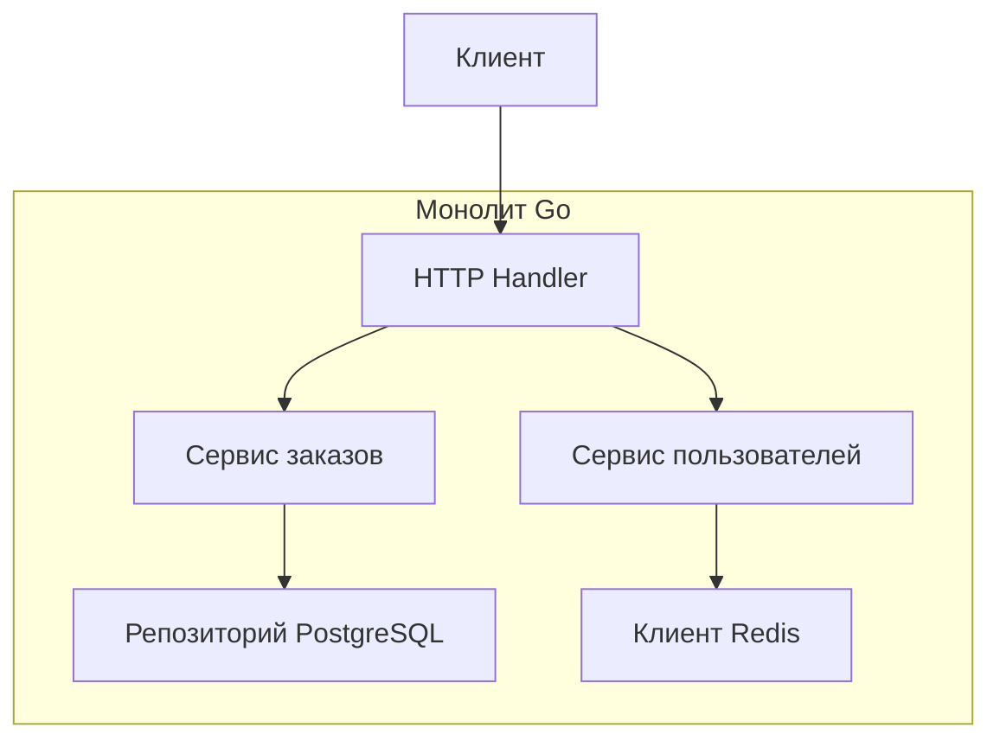

Монолит — самая естественная и исторически первая архитектурная форма программного обеспечения. В эпоху хайпа вокруг микросервисов легко забыть, что большинство успешных проектов начинали именно как монолиты, а некоторые так и остаются ими, обслуживая миллионы пользователей. Цель этой статьи — дать взвешенный, инженерный взгляд на монолитную архитектуру: когда она является оптимальным выбором, а когда превращается в тормозящий развитие «большой ком грязи». Мы рассмотрим монолит через призму Go, его рантайма и экосистемы.

### Что такое монолит

**Монолит** — это архитектурный стиль, при котором весь код приложения собирается в единый исполняемый файл (или небольшое число тесно связанных файлов) и разворачивается как один процесс. Все модули — работа с заказами, пользователями, платежами, уведомлениями — живут в одном адресном пространстве и общаются через вызовы функций, а не через сеть.

Важно различать подвиды:

- **Single-process монолит** — классика: один бинарник на Go, один процесс, все зависимости внутри.
- **Модульный монолит** — тот же процесс, но код строго разделён на модули с явными границами и интерфейсами. Это уже осознанный архитектурный выбор, а не отсутствие структуры.
- **Распределённый монолит** (Distributed Monolith) — антипаттерн, когда сервисы формально разделены, но настолько сильно связаны, что не могут разворачиваться и масштабироваться независимо. Обладает недостатками обоих миров без их преимуществ.

В Go-мире монолит часто ассоциируется с одним `func main()` и набором пакетов, слинкованных в один бинарник.



### Преимущества монолита

#### 1. Простота разработки и отладки

Один репозиторий, одна кодовая база, одна среда выполнения. Разработчик может запустить всё приложение локально командой `go run ./cmd/app`. Отладка тривиальна — стек вызовов не прерывается сетевыми границами. Поиск по коду (`grep`, `go-to-definition`) работает на всю систему сразу.

#### 2. Низкая задержка (Latency)

Вызов функции в Go — это несколько наносекунд и передача управления через стек. Вызов другого сервиса по HTTP/gRPC — это минимум сотни микросекунд, сериализация, сетевой стек, десериализация. В монолите все взаимодействия внутри процесса, что критически важно для сценариев с жёсткими требованиями к задержке.

#### 3. Транзакционная целостность «из коробки»

В монолите ACID-транзакции базы данных могут охватывать несколько бизнес-операций в рамках одного сервиса. Например, списание денег и создание заказа легко завернуть в `sql.Tx`. В микросервисной архитектуре это превращается в сложные распределённые транзакции с Saga или 2PC ([[25. Distributed Transactions. 2PC и проблемы]], [[26. Saga Pattern. Оркестрация и хореография]]).

```go
func (s *OrderService) CreateOrder(ctx context.Context, req *CreateOrderReq) error {
    tx, _ := s.db.BeginTx(ctx, nil)
    defer tx.Rollback()
    
    // Списание денег и создание заказа — одна транзакция
    if err := s.paymentRepo.Debit(ctx, tx, req.UserID, req.Amount); err != nil {
        return err
    }
    if err := s.orderRepo.Create(ctx, tx, req); err != nil {
        return err
    }
    return tx.Commit()
}
```

#### 4. Простой деплой и эксплуатация

Один бинарник Go — это один файл для развёртывания. Нет необходимости в сложной оркестрации, service mesh, распределённой трассировке. Для стартапа или внутреннего инструмента это колоссальная экономия времени и нервов.

#### 5. Эффективное использование ресурсов

В монолите на Go один процесс обслуживает все запросы, разделяя пул горутин, соединения к БД и память. Нет накладных расходов на сериализацию/десериализацию между десятками микросервисов. Сборщик мусора работает на общей куче, а не на десятке изолированных.

> [!info] Под капотом
> В Go монолит позволяет максимально использовать преимущества рантайма. Планировщик горутин (G-M-P) эффективно мультиплексирует всю нагрузку на потоки ОС. Кэши CPU утилизируются лучше, так как код и данные разных «модулей» находятся в одном адресном пространстве и могут попадать в одни и те же кэш-линии. Системные вызовы совершаются централизованно через `netpoller`.

### Когда монолит становится проблемой

#### 1. Масштабирование разработки (Закон Конвея)

Когда над проектом работает 20+ разработчиков, единая кодовая база становится узким горлышком. Слияния изменений приводят к конфликтам, релизы блокируются, а ответственность за код размывается. Команды начинают наступать друг другу на пятки. Микросервисы решают эту проблему, позволяя разным командам независимо владеть своими сервисами.

#### 2. Связанность кода и «большой ком грязи»

Без строгой дисциплины и модульности монолит превращается в запутанный клубок зависимостей, где изменение в одной части приложения вызывает каскад ошибок в совершенно неожиданных местах. Go с его циклическими зависимостями пакетов (запрещены на уровне компилятора) частично дисциплинирует, но не спасает от логической связанности.

```go
// Пример нежелательной связанности в монолите
package user

import "myapp/order" // user знает про order

func (u *User) LastOrders() []order.Order {
    return order.FindByUserID(u.ID) // прямой вызов чужого пакета
}
```

#### 3. Масштабирование производительности

Монолит масштабируется только вертикально ([[6. Вертикальное и горизонтальное масштабирование]]). Если один из модулей требует больше ресурсов (например, генерация отчётов нагружает CPU), вы вынуждены масштабировать всё приложение целиком, даже если остальные модули простаивают. Это ведёт к перерасходу ресурсов и денег.

#### 4. Технологический lock-in и замедление инноваций

В монолите сложно экспериментировать с новыми технологиями. Если вы хотите попробовать другую БД для модуля аналитики или переписать часть логики на Rust, это затрагивает весь проект. Микросервисы позволяют изолированно обновлять стек.

#### 5. Деплой как бутылочное горлышко

Даже небольшое изменение требует пересборки и перезапуска всего монолита. При частых релизах это становится болезненным. Время перезапуска Go-приложения обычно мало (миллисекунды), но прогревание кэшей, установление соединений с БД могут занимать секунды, вызывая просадку доступности.

> [!warning] Ловушка / Gotcha
> **Go-монолит и деплой без даунтайма.** Перезапуск монолита Go неизбежно разрывает все WebSocket-соединения, долгие HTTP-запросы и фоновые горутины. Graceful shutdown помогает завершить текущие запросы, но не сохраняет состояние длительных процессов. Если ваш сервис держит постоянные соединения с клиентами (чат, стриминг), плавный перезапуск монолита становится сложной задачей, решаемой через проксирование соединений (например, с помощью `SO_REUSEPORT` или внешнего балансировщика с draining).

### Mechanical Sympathy: Go-монолит под нагрузкой

Понимание работы рантайма помогает спроектировать монолит, который долго остаётся производительным.

- **Горутины и общая куча.** В монолите все горутины разделяют одну кучу. Это означает, что утечка горутин в одном модуле (например, забытый `for { ... }`) влияет на всё приложение. Необходим строгий мониторинг `runtime.NumGoroutine()`.
- **GC Pressure.** Если один модуль генерирует много мусора (например, парсинг больших JSON), GC запускается чаще, влияя на latency всех остальных модулей. В микросервисах такая нагрузка изолирована. В монолите приходится профилировать и оптимизировать аллокации глобально.
- **Contention на общих ресурсах.** Если несколько модулей используют один и тот же `sync.Mutex` или канал, неоптимальная блокировка в одном месте может замедлить всё приложение. В Go легко не заметить такую связь, если модули разрабатываются разными людьми.

### Модульный монолит: золотая середина

Многие недостатки классического монолита устраняются внедрением чётких внутренних границ — **модульного монолита**. В Go для этого есть отличные инструменты:

#### Организация кода по доменам

Структура проекта отражает бизнес-поддомены, а не технические слои:

```
cmd/
  app/
    main.go
internal/
  order/
    handler.go
    service.go
    repository.go
  user/
    handler.go
    service.go
    repository.go
  shared/
    db.go
    redis.go
pkg/
  events/
    bus.go
```

Каждый модуль (`order`, `user`) экспортирует только необходимый публичный API, скрывая детали за `internal`.

#### Инверсия зависимостей через интерфейсы

Модули взаимодействуют не напрямую, а через интерфейсы, определённые в вызывающем модуле (как в Clean Architecture, [[14. Clean Architecture и Dependency Rule]]):

```go
// internal/order/service.go
package order

type UserService interface {
    GetUser(ctx context.Context, userID string) (*User, error)
}

type OrderService struct {
    userService UserService
    repo        Repository
}
```

Модуль `user` реализует этот интерфейс, но `order` не знает о деталях реализации. Это позволяет в будущем легко вынести `user` в отдельный микросервис, заменив локальную реализацию на gRPC-клиент.

#### Событийная шина внутри процесса

Для асинхронной коммуникации между модулями можно использовать внутрипроцессную событийную шину на основе каналов или простого Observer. В Go это делается в десяток строк:

```go
type EventBus struct {
    mu     sync.RWMutex
    subs   map[string][]chan Event
}

func (b *EventBus) Publish(event Event) {
    b.mu.RLock()
    defer b.mu.RUnlock()
    for _, ch := range b.subs[event.Name] {
        select {
        case ch <- event:
        default: // non-blocking
        }
    }
}
```

Это даёт слабую связанность и возможность в будущем заменить внутрипроцессную шину на Kafka/NATS без изменения бизнес-логики.

### Когда выбирать монолит

Резюмируем критерии в пользу монолита (особенно модульного):

- **Ранняя стадия продукта.** Вы ищете product-market fit, требования меняются быстро. Скорость важнее идеальной архитектуры.
- **Небольшая команда** (до 10-15 разработчиков). Коммуникационные накладные расходы малы.
- **Низкие требования к независимому масштабированию модулей.** Пиковые нагрузки можно покрыть вертикальным масштабированием или добавлением 2-3 реплик монолита за балансировщиком.
- **Жёсткие требования к консистентности данных.** Транзакции ACID покрывают несколько операций.
- **Сложная предметная область**, которую ещё предстоит разбить на Bounded Contexts ([[12. Domain Driven Design. Bounded Context и Aggregate]]). Монолит позволяет отложить это разбиение до лучшего понимания домена.

### Когда пора переходить на микросервисы

- **Рост команды > 20 человек.** Закон Конвея требует разделения на независимые команды со своими зонами ответственности.
- **Разные требования к масштабированию.** Один модуль должен обрабатывать 10k RPS, другой — 100 RPS, но с большим потреблением памяти.
- **Разные технологические стеки.** Например, модуль аналитики лучше написать на Python, а высоконагруженное ядро оставить на Go.
- **Требования к изоляции отказов.** Падение одного модуля не должно валить всю систему ([[37. Bulkhead и изоляция отказов]]).
- **Частые независимые релизы.** Команда A хочет деплоить каждый день, команда B — раз в месяц.

> [!tip] Собеседование
> **Вопрос:** Вам нужно спроектировать новую систему для стартапа. Бизнес-требования размыты, ожидается быстрая итерация. Какую архитектуру вы выберете и почему?
> **Ожидаемый ответ:** Я начну с модульного монолита на Go. Это даст максимальную скорость разработки и простоту изменений на этапе поиска product-market fit. Я заложу чёткие границы между модулями через интерфейсы и DI, чтобы при необходимости можно было легко вычленить любой модуль в отдельный микросервис. Переход к микросервисам буду рассматривать при росте команды > 15 человек или появлении явных узких мест в масштабировании.

### Итог

Монолит — не ругательство и не «legacy по определению». Это проверенная временем архитектурная форма, которая для многих проектов остаётся оптимальной на годы. Go с его простотой, статической компиляцией и лёгкой конкурентностью особенно хорош для построения производительных монолитов. Ключ к успеху — дисциплина и явные внутренние границы, превращающие монолит в модульный. Когда эти границы становятся слишком дороги в поддержке, а независимость команд и масштабирование выходят на первый план, приходит время рассмотреть микросервисы — о чём пойдёт речь в следующей статье: [[9. Микросервисы. Преимущества, недостатки и мифы]].