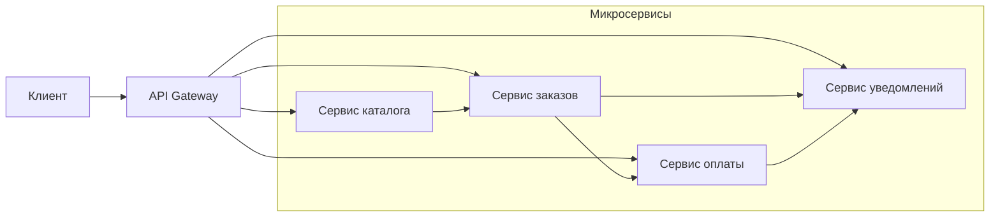

После обсуждения монолита и модульного монолита логично перейти к архитектурному стилю, который доминирует в дискурсе последнего десятилетия — микросервисам. Вокруг них сложилось множество мифов: от «серебряной пули» до «абсолютного зла». Задача этой статьи — дать трезвую, инженерную оценку микросервисной архитектуре, выделить её реальные преимущества и неизбежные недостатки, а также развенчать популярные заблуждения. Всё это мы рассмотрим через призму Go и его рантайма.

### Определение микросервиса

**Микросервис** — это небольшой, автономный сервис, который работает в собственном процессе, развёртывается независимо и взаимодействует с другими сервисами по сети через легковесные протоколы (обычно HTTP/REST, gRPC или асинхронный обмен сообщениями). Каждый микросервис отвечает за ограниченный бизнес-контекст (Bounded Context, [[12. Domain Driven Design. Bounded Context и Aggregate]]).

Ключевое слово — **независимость**. Именно способность изменять, развёртывать и масштабировать один сервис, не затрагивая другие, является главным обещанием микросервисной архитектуры.



### Реальные преимущества микросервисов

#### 1. Независимое развёртывание (Deployability)

Главное преимущество, ради которого часто и затевают переход. В монолите изменение одной строки требует пересборки и перезапуска всего приложения. В микросервисах вы деплоите только изменённый сервис. Это ускоряет цикл обратной связи, снижает риски (меньше кода меняется за раз) и позволяет разным командам иметь собственный релизный цикл.

В Go это преимущество усиливается статической компиляцией: каждый микросервис — самодостаточный бинарник без внешних зависимостей, легко упаковываемый в минимальный Docker-контейнер (scratch или distroless) размером 5-20 МБ.

#### 2. Независимое масштабирование (Scalability)

Если модуль генерации отчётов в монолите потребляет много CPU, вы вынуждены масштабировать весь монолит. В микросервисной архитектуре вы добавляете инстансы только для сервиса отчётов, экономя ресурсы. Это особенно ценно в Go, где инстанс сервиса потребляет мало памяти и может быть быстро запущен в ответ на всплеск трафика.

#### 3. Изоляция отказов (Fault Isolation)

Падение сервиса уведомлений не должно валить сервис заказов. При правильной реализации (Circuit Breaker, таймауты, fallback) система деградирует частично, а не полностью. В монолите необработанная паника в одной горутине (без `recover`) роняет весь процесс.

#### 4. Технологическая свобода

Теоретически разные микросервисы могут быть написаны на разных языках и использовать разные базы данных, оптимальные для их задач (polyglot persistence). На практике в Go-проектах это редко востребовано — Go достаточно универсален для большинства бэкенд-задач. Но возможность есть.

#### 5. Соответствие структуре команд (Закон Конвея)

Микросервисы позволяют разным командам владеть разными частями системы, минимизируя координацию. Команда, отвечающая за сервис оплаты, может работать автономно, имея собственный бэклог и цикл релизов.

### Недостатки и вызовы микросервисов

#### 1. Сложность распределённых систем

Микросервисы превращают ваше приложение в распределённую систему со всеми вытекающими проблемами: сетевая ненадёжность, задержки, частичные отказы, распределённая трассировка. Код, который в монолите был вызовом функции, становится сетевым запросом с таймаутами, ретраями и обработкой ошибок соединения.

```go
// Монолит: простой вызов
user, err := userService.GetUser(ctx, userID)

// Микросервисы: сетевой вызов со всей обвязкой
ctx, cancel := context.WithTimeout(ctx, 200*time.Millisecond)
defer cancel()
user, err := userClient.GetUser(ctx, &pb.GetUserRequest{Id: userID})
if err != nil {
    // Обработка: таймаут? временная ошибка? retry?
}
```

#### 2. Сетевые задержки

Каждый межсервисный вызов добавляет сетевую задержку (RTT) и расходы на сериализацию/десериализацию. В Go сериализация JSON через `encoding/json` медленнее и аллоцирует больше, чем специализированные библиотеки (easyjson, goccy/go-json) или Protobuf. gRPC с Protobuf снижает накладные расходы, но всё равно остаётся на порядки медленнее вызова функции внутри процесса.

#### 3. Распределённые транзакции и консистентность

Транзакция, охватывающая несколько сервисов, требует сложных паттернов: Saga ([[26. Saga Pattern. Оркестрация и хореография]]), 2PC ([[25. Distributed Transactions. 2PC и проблемы]]), Eventual Consistency. Это усложняет код и требует нового мышления от разработчиков, привыкших к ACID.

#### 4. Операционная сложность

Вместо одного приложения нужно разворачивать, мониторить и отлаживать десятки (или сотни) сервисов. Требуется оркестрация (Kubernetes), service mesh, централизованное логирование (Loki, ELK), распределённая трассировка (Jaeger), сбор метрик (Prometheus). Для стартапа это может быть непозволительной роскошью.

#### 5. Сложность тестирования

Интеграционное тестирование микросервисов значительно сложнее, чем монолита. Нужно поднимать либо реальные зависимости, либо их моки, управлять версионированием API ([[46. Версионирование сервисов и API]]). Контрактное тестирование (Pact) становится необходимостью.

### Mechanical Sympathy: микросервисы на Go

Go предоставляет отличные строительные блоки для микросервисов, но понимание низкоуровневых аспектов критично.

- **Горутины и сетевое взаимодействие.** В Go каждый входящий HTTP-запрос обрабатывается в отдельной горутине. При вызове другого микросервиса текущая горутина блокируется на сетевом I/O, но планировщик Go открепляет её от потока ОС (hand-off), позволяя потоку выполнять другие горутины. Это позволяет эффективно обслуживать тысячи конкурентных клиентских соединений и исходящих запросов. Однако большое количество блокирующихся горутин увеличивает потребление памяти и нагрузку на планировщик.
- **Netpoller.** Go использует неблокирующий I/O на основе epoll/kqueue. Это ключевой компонент для высокопроизводительных микросервисов. Когда горутина делает HTTP-запрос к другому сервису, netpoller регистрирует файловый дескриптор и «усыпляет» горутину, не блокируя поток ОС.
- **Пулы соединений.** Для эффективного взаимодействия между Go-сервисами необходимо использовать пулы соединений (gRPC по умолчанию использует HTTP/2 с мультиплексированием, что снижает потребность в пуле на уровне TCP, но для HTTP/1.1 клиентов пул обязателен). В `net/http` по умолчанию пул соединений включён через `http.DefaultTransport`.
- **Сериализация и GC.** JSON-сериализация в Go аллоцирует много временных объектов, что создаёт давление на GC. Для высоконагруженных внутренних сервисов предпочтительнее Protobuf/gRPC, который генерирует код с минимальными аллокациями.

### Мифы о микросервисах

#### Миф 1: «Микросервисы всегда ускоряют разработку»

**Реальность:** На начальном этапе микросервисы замедляют разработку из-за необходимости настройки инфраструктуры, определения контрактов, обработки сетевых ошибок. Ускорение наступает только при росте команды и системы, когда монолит становится тормозом.

#### Миф 2: «Микросервисы проще для понимания»

**Реальность:** Отдельный микросервис действительно проще для понимания, чем весь монолит. Но **система в целом** становится значительно сложнее для понимания из-за распределённых взаимодействий, которые не видны в коде.

#### Миф 3: «Микросервисы повышают надёжность»

**Реальность:** Микросервисы повышают **изоляцию отказов**, но **не общую надёжность системы**. Если не реализованы паттерны устойчивости (Circuit Breaker, Retry, Timeout), каскадные отказы могут быть даже более разрушительными, чем в монолите.

#### Миф 4: «Микросервисы должны быть микро»

**Реальность:** Термин «микро» вводит в заблуждение. Размер сервиса должен определяться бизнес-контекстом (Bounded Context), а не количеством строк кода или числом эндпоинтов. Слишком мелкое дробление ведёт к наносервисам и распределённому монолиту.

### Антипаттерны при переходе на микросервисы

#### Распределённый монолит

Система, в которой сервисы формально разделены, но сильно связаны: изменение одного сервиса требует одновременного деплоя другого, сервисы разделяют одну БД, вызовы синхронные и образуют длинные цепочки. Такой дизайн наследует недостатки обоих миров — сложность микросервисов и связанность монолита.

#### Наносервисы

Сервисы, отвечающие за одну функцию (например, «сервис валидации email»). Они создают огромный сетевой оверхед и операционную нагрузку без преимуществ независимого масштабирования.

### Когда микросервисы оправданы

- **Крупная распределённая команда** (20+ разработчиков).
- **Высокие требования к масштабируемости разных компонентов** независимо друг от друга.
- **Необходимость частых независимых релизов** разных частей системы.
- **Сложная система**, где изоляция отказов критична для бизнеса.

> [!tip] Собеседование
> **Вопрос:** Вы — технический лидер в компании с 50 разработчиками и монолитом, который стал проблемой. Как вы подойдёте к внедрению микросервисов?
> **Ожидаемый ответ:** Я не буду делать «большой взрыв». Я идентифицирую Bounded Contexts в существующем коде (например, «Заказы», «Пользователи», «Каталог»). Затем выберу один контекст, который:
> 1) наиболее независим по данным,
> 2) имеет высокие требования к масштабированию или частым релизам,
> 3) не является критичным для старта (чтобы снизить риски).
> Реализую его как отдельный Go-микросервис, наладив взаимодействие с монолитом через API и, возможно, события. Постепенно, итеративно, вычленяю другие контексты, используя паттерн Strangler Fig.

### Итог

Микросервисы — мощный архитектурный стиль, решающий проблемы масштабирования разработки и эксплуатации крупных систем. Но эта мощь достигается ценой значительного усложнения инфраструктуры и кода. Go, благодаря своей эффективности и простоте, является отличным выбором для построения микросервисов, снижая некоторые операционные издержки (маленькие контейнеры, быстрый старт, низкое потребление памяти). Однако выбор в пользу микросервисов должен быть осознанным и основываться на реальных проблемах, а не на хайпе.

Мы рассмотрели два крайних полюса — монолит и микросервисы. Но есть ли компромисс, позволяющий совместить простоту монолита с гибкостью микросервисов? Да, и об этом в следующей статье: [[10. Модульный монолит как компромисс]].