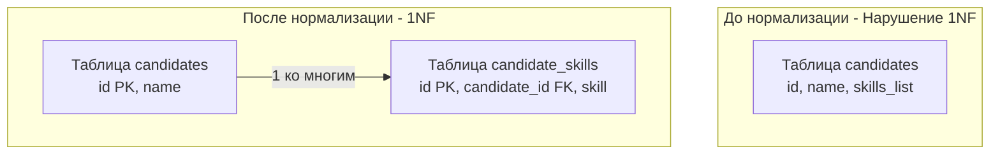

## Фундамент реляционной строгости

В предыдущей статье [[9. Нормализация. Введение]] мы выяснили, что неструктурированные ("плоские") данные ведут к аномалиям и деградации производительности. Чтобы навести порядок, мы должны пропустить нашу схему через фильтры — **Нормальные формы (Normal Forms)**. 

Первая нормальная форма (1NF) — это абсолютный фундамент. Если таблица не находится в 1NF, она вообще не может считаться реляционной. Математически, 1NF определяет границу между "просто файлом с текстом" и "отношением" (Relation) в терминах реляционной алгебры.

## Четыре правила 1NF

Чтобы база данных признала вашу таблицу находящейся в Первой нормальной форме, она должна соответствовать четырем жестким правилам:

1. **Атомарность атрибутов (Скалярность):** В каждой ячейке (на пересечении строки и столбца) должно храниться только *одно* логически неделимое значение. Никаких массивов, списков через запятую или вложенных структур.
2. **Однородность домена:** Все значения в одном столбце должны принадлежать к одному типу данных. Нельзя хранить строку "неизвестно" в колонке типа `INTEGER`.
3. **Уникальность кортежей:** В таблице не должно быть двух абсолютно одинаковых строк. Это правило автоматически выполняется, если вы используете Первичный ключ (см. [[6. Первичные и внешние ключи]]).
4. **Независимость от порядка:** Логика работы приложения не должна зависеть от того, в каком порядке строки лежат на диске или в каком порядке объявлены столбцы. 

Самое часто нарушаемое разработчиками правило — это первое: **Атомарность**.

## Антипаттерн: Мультизначные атрибуты

Представим систему найма. Junior-разработчик создает таблицу кандидатов и, мысля категориями структур Go (где есть слайсы `[]string`), переносит это в базу данных в виде строки, разделенной запятыми:

| id | name | skills (Нарушение 1NF!) |
| :--- | :--- | :--- |
| 1 | Alice | Go, PostgreSQL, Docker |
| 2 | Bob | PHP, MySQL, Redis, Go |

С точки зрения Go-кода, распарсить эту строку через `strings.Split(skills, ",")` не составит труда. Но с точки зрения архитектуры базы данных — это катастрофа.

### Mechanical Sympathy: Почему списки убивают БД

Представьте, что вам нужно найти всех кандидатов, знающих `Go`. SQL-запрос будет выглядеть так:
`SELECT * FROM candidates WHERE skills LIKE '%Go%';`

> [!info] Под капотом
> Классический B-Tree индекс (см. [[2. B Tree индекс под капотом]]) работает как телефонный справочник. Он может быстро найти значения, начинающиеся с определенной буквы (например, `LIKE 'Go%'`).
> Но когда вы используете паттерн `LIKE '%Go%'` (поиск подстроки с подстановочным знаком в начале), **B-Tree индекс становится абсолютно бесполезен**.
> 
> Базе данных придется выполнить **Sequential Scan (Full Table Scan)**:
> 1. СУБД делает системные вызовы для чтения *всех* страниц таблицы с диска в Buffer Pool.
> 2. Если поле `skills` большое (TOAST), данные декомпрессируются в памяти.
> 3. CPU посимвольно (алгоритмами поиска подстроки) проверяет каждую строку на совпадение.
> На миллионе записей этот простейший запрос сожжет все ядра процессора и вызовет чудовищный рост I/O, парализовав остальные транзакции.

## Приведение к 1NF: Разделяй и властвуй

Чтобы привести таблицу к 1NF, мы обязаны избавиться от повторяющихся групп (массивов/списков) внутри ячейки. Для этого мы выносим мультизначный атрибут в отдельную, дочернюю таблицу, и связываем их через Foreign Key.



Теперь, чтобы найти кандидатов со знанием `Go`, оптимизатор БД использует индекс:
`SELECT candidate_id FROM candidate_skills WHERE skill = 'Go';`
Этот запрос выполнится за микросекунды (Index Scan) и потребует чтения буквально 1-2 страниц памяти.

## Impedance Mismatch: Маппинг 1NF в Go

Здесь возникает классическая проблема объединения миров: в базе данных данные теперь "размазаны" по строкам (1NF), а в Go мы хотим получить единый структурированный объект со слайсом `[]string`.

Идиоматичный подход в Go при работе с пакетом `database/sql` требует от нас правильно агрегировать строки после `JOIN`.

```go
package main

import (
	"context"
	"database/sql"
)

// Candidate представляет собой агрегат из двух нормализованных таблиц
type Candidate struct {
	ID     int64
	Name   string
	Skills []string
}

func fetchCandidates(ctx context.Context, db *sql.DB) ([]Candidate, error) {
	// JOIN нормализованных данных (1 ко многим)
	query := `
		SELECT c.id, c.name, s.skill 
		FROM candidates c
		LEFT JOIN candidate_skills s ON c.id = s.candidate_id
		ORDER BY c.id
	`
	
	rows, err := db.QueryContext(ctx, query)
	if err != nil {
		return nil, err
	}
	defer rows.Close()

	// Используем мапу для агрегации слайса навыков (устранение дубликатов строк кандидата)
	lookup := make(map[int64]*Candidate)
	var result []Candidate

	for rows.Next() {
		var id int64
		var name string
		var skill sql.NullString // Учитываем LEFT JOIN (навыков может не быть)

		if err := rows.Scan(&id, &name, &skill); err != nil {
			return nil, err
		}

		cand, exists := lookup[id]
		if !exists {
			// Создаем нового кандидата
			lookup[id] = &Candidate{ID: id, Name: name, Skills: make([]string, 0)}
			cand = lookup[id]
		}

		if skill.Valid {
			cand.Skills = append(cand.Skills, skill.String)
		}
	}

	if err := rows.Err(); err != nil {
		return nil, err
	}

	// Переливаем из мапы в итоговый слайс (теряя порядок мапы, но сохраняя логику)
	for _, c := range lookup {
		result = append(result, *c)
	}

	return result, nil
}
```

> [!tip] Собеседование
> **Вопрос:** Если правило 1NF запрещает хранить списки и массивы, значит ли это, что использование типа `JSONB` или `TEXT[]` (массивов) в PostgreSQL нарушает Первую нормальную форму?
> **Ответ:** Да, строго академически — это грубое нарушение 1NF, так как колонка перестает быть атомарной (она содержит вложенную структуру). 
> *Но почему мы тогда это используем?* Это прагматичный компромисс. PostgreSQL предоставляет специальные механизмы (такие как **GIN индексы**), которые умеют "заглядывать" внутрь JSONB и массивов, индексируя их элементы. Это позволяет искать по массивам быстро, без Sequential Scan. Мы используем денормализацию (JSONB/Массивы), когда схема вложенных данных часто меняется и не требует участия в строгих реляционных связях с другими таблицами.

## Итог

1. **Первая нормальная форма (1NF)** — это база. Она требует скалярности (атомарности) данных в ячейках. Никаких списков через запятую.
2. Несоблюдение 1NF ломает работу B-Tree индексов, приводя к Sequential Scan и фатальным перегрузкам CPU/Диска при поиске.
3. Исправление нарушения 1NF заключается в выделении повторяющейся группы в дочернюю таблицу со связью "один-ко-многим".
4. В Go-коде мы компенсируем 1NF ручной агрегацией строк из `JOIN` в слайсы структур.
5. Использование `JSONB` или нативных массивов базы данных является осознанным нарушением 1NF (денормализацией), которое оправдано только при наличии специализированных индексов (GIN).

Мы избавились от массивов в ячейках, но наша таблица все еще может таить в себе скрытое дублирование данных, зависящих от сложных ключей. В следующей статье мы очистим схему от частичных зависимостей: переходим к [[11. Вторая нормальная форма 2NF]].