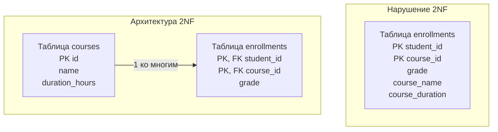

## Анатомия составных ключей и частичных зависимостей

В статье [[10. Первая нормальная форма 1NF]] мы навели базовый порядок: избавились от массивов в ячейках и сделали данные атомарными. Но 1NF решает только проблему *внутренней* структуры колонки. Она никак не защищает нас от дублирования данных на уровне всей таблицы. 

Следующий шаг к построению строгой архитектуры — **Вторая нормальная форма (2NF)**. 

Правило 2NF звучит академически сухо: *Таблица находится во второй нормальной форме, если она находится в 1NF, и каждый неключевой атрибут неприводимо зависит от всего первичного ключа.*

Для инженера это означает следующее: **если у вас составной Первичный ключ (Primary Key, PK), состоящий из нескольких колонок, то все остальные данные в строке должны зависеть от обеих этих колонок вместе, а не только от одной из них.**

Если Первичный ключ таблицы состоит всего из одной колонки (например, `id BIGINT`), таблица, находящаяся в 1NF, **автоматически** находится и в 2NF. Вся сложность 2NF проявляется именно в архитектуре связей «Многие-ко-многим» (Many-to-Many).

---

## Проблема: Частичная зависимость

Рассмотрим классическую задачу: студенты записываются на курсы. Junior-архитектор решает создать таблицу (уже в 1NF, без массивов), чтобы фиксировать успеваемость:

| student_id (PK) | course_id (PK) | grade | course_name | course_duration_hours |
| :--- | :--- | :--- | :--- | :--- |
| 1 | 101 | A | Go Backend | 40 |
| 1 | 102 | B | System Design | 20 |
| 2 | 101 | C | Go Backend | 40 |

Первичный ключ здесь составной: `(student_id, course_id)`. Только эта пара уникально идентифицирует конкретную оценку (`grade`). 

**Где здесь нарушение 2NF?**
* Атрибут `grade` (оценка) зависит от *всего* составного ключа. Оценка ставится конкретному студенту за конкретный курс. Всё верно.
* Атрибут `course_name` (и `course_duration_hours`) зависит **только** от `course_id`. Как называется курс и сколько он длится, никак не зависит от того, какой студент на него записался.

Это и называется **Частичной зависимостью (Partial Dependency)**. Мы зависим от части составного ключа.

### Mechanical Sympathy: Почему это убивает базу?

Казалось бы, ну дублируется название курса "Go Backend" и длительность "40" в тысячах строк для разных студентов. В чем проблема для базы данных?

1.  **Write Penalty (Штраф на запись):** Если мы решим увеличить длительность курса "Go Backend" с 40 до 50 часов, нам придется обновить тысячи строк `UPDATE enrollments SET course_duration_hours = 50 WHERE course_id = 101`. Это сгенерирует огромный объем изменений в журнале [[8. WAL. Write Ahead Log]], нагрузит сеть при репликации и заставит базу данных эксклюзивно заблокировать (Row-level Lock) тысячи строк.
2.  **I/O Вамппиризм:** Лишние текстовые поля `course_name` раздувают размер строки (кортежа). На одну страницу памяти ОС (8 КБ) поместится меньше записей об успеваемости. База будет чаще ходить на диск (Cache Miss) для подсчета среднего балла по факультету.

---

## Приведение к 2NF: Выделение сущностей

Чтобы достичь 2NF, мы обязаны "отрезать" все атрибуты, которые зависят только от части ключа, и вынести их в отдельную таблицу. В нашем случае мы создаем таблицу `courses`, а исходная таблица становится чистой таблицей связи (Join Table / Junction Table).



Теперь таблица `enrollments` хранит только то, что зависит от связи (оценку). Названия курсов лежат в `courses` в единственном экземпляре. Обновление длительности курса теперь — это молниеносный `UPDATE` ровно одной строки.

---

> [!info] Под капотом: Составные ключи и B-Tree индексы
> Когда вы создаете составной первичный ключ `PRIMARY KEY (student_id, course_id)`, база данных не создает два отдельных индекса. Она создает **один** составной B-Tree индекс, в котором ключи склеены вместе.
> 
> Порядок колонок в составном ключе критически важен. B-Tree индексы работают по правилу **Самого левого префикса (Leftmost Prefix Rule)**. 
> * Если ваш ключ `(student_id, course_id)`, база отсортирует дерево сначала по `student_id`, а внутри каждого студента — по `course_id`.
> * Запрос `WHERE student_id = 1` будет использовать индекс (молниеносно).
> * Запрос `WHERE course_id = 101` **не сможет** использовать этот индекс! Базе придется делать полное сканирование дерева.
> 
> *Вывод архитектора:* Если вам нужно искать и по курсам, и по студентам, вам придется создать второй, инвертированный индекс: `CREATE INDEX idx_course_student ON enrollments (course_id, student_id)`. Мы подробнее разберем эту механику в [[5. Composite индексы]].

---

## Архитектура Many-to-Many в Go

Работая с 2NF в Go, мы сталкиваемся с паттерном "Многие-ко-многим". Как правило, мы хотим получить агрегированные данные. Например: "Дай мне все курсы для студента с ID = 1". 

Для этого мы используем `JOIN` таблиц `enrollments` и `courses`.

```go
package main

import (
	"context"
	"database/sql"
	"fmt"
)

// CourseRecord - структура, отражающая данные из связи Многие-ко-многим
type CourseRecord struct {
	CourseID   int64
	CourseName string
	Grade      sql.NullString // Оценки может еще не быть
}

func GetStudentCourses(ctx context.Context, db *sql.DB, studentID int64) ([]CourseRecord, error) {
	// Декларативный SQL-запрос, собирающий нормализованные данные
	// Оптимизатор использует индекс (student_id, course_id) в таблице enrollments
	query := `
		SELECT c.id, c.name, e.grade
		FROM enrollments e
		JOIN courses c ON e.course_id = c.id
		WHERE e.student_id = $1
	`
	
	rows, err := db.QueryContext(ctx, query, studentID)
	if err != nil {
		return nil, fmt.Errorf("ошибка запроса курсов: %w", err)
	}
	defer rows.Close()

	var records []CourseRecord
	for rows.Next() {
		var rec CourseRecord
		// Маппим данные прямо в структуру
		if err := rows.Scan(&rec.CourseID, &rec.CourseName, &rec.Grade); err != nil {
			return nil, fmt.Errorf("ошибка сканирования: %w", err)
		}
		records = append(records, rec)
	}

	if err := rows.Err(); err != nil {
		return nil, fmt.Errorf("ошибка итерации: %w", err)
	}

	return records, nil
}
```

---

> [!warning] Ловушка / Gotcha: Иллюзия Суррогатного ключа
> Часто неопытные разработчики думают: "Правило 2NF касается только составных ключей. Я просто добавлю суррогатный `id BIGINT PRIMARY KEY` в таблицу `enrollments`, ключ перестанет быть составным, и таблица автоматически окажется в 2NF!".
> 
> ```sql
> -- ПСЕВДО-РЕШЕНИЕ:
> CREATE TABLE enrollments (
>     id BIGINT PRIMARY KEY, -- Искусственный ключ
>     student_id BIGINT,
>     course_id BIGINT,
>     grade VARCHAR,
>     course_name VARCHAR -- Оставили дублирование
> );
> ```
> Технически (академически), да — таблица теперь в 2NF, так как `course_name` зависит от всего `id`. 
> **Но логически — это катастрофа.** Вы обманули математику базы данных, но не решили физическую проблему дублирования данных. `course_name` всё так же будет повторяться тысячи раз, расходуя диск и провоцируя аномалии обновления. 
> 
> *Правило:* Добавление искусственного ID (суррогатного ключа) в таблицу связей не отменяет необходимости выносить зависимые сущности в отдельные таблицы.

## Итог

1.  **Вторая нормальная форма (2NF)** решает проблему частичной зависимости: неключевые поля не должны зависеть от части составного первичного ключа.
2.  Нарушение 2NF приводит к избыточности (redundancy), перерасходу RAM (Buffer Pool) и тяжелым `UPDATE` транзакциям.
3.  Чтобы выполнить 2NF, необходимо выделить частично зависимые атрибуты в новую таблицу. В результате появляются классические таблицы связей (Many-to-Many).
4.  Суррогатный первичный ключ `id` в таблице связей не избавляет вас от необходимости правильно нормализовать бизнес-логику.

Мы устранили зависимости от "кусочков" ключа. Но что, если неключевой атрибут зависит от всего ключа, но делает это... через посредника? В следующей статье мы разберем последний обязательный шаг нормализации для большинства Highload-систем: переходим к [[12. Третья нормальная форма 3NF]].