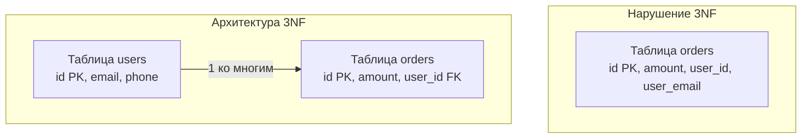

## Клятва Кодда и транзитивные зависимости

В предыдущих статьях мы разобрались с массивами в ячейках ([[10. Первая нормальная форма 1NF]]) и устранили зависимости от кусочков составного ключа ([[11. Вторая нормальная форма 2NF]]). Но в нашей базе данных всё еще может скрываться коварное дублирование.

Третья нормальная форма (3NF) — это золотой стандарт проектирования реляционных баз данных. В 95% случаев архитекторы останавливают процесс нормализации OLTP-систем именно на этом этапе.

Американский ученый Билл Кент (Bill Kent) сформулировал правило 3NF в виде знаменитой фразы, пародирующей судебную клятву:
> *«Каждый неключевой атрибут должен зависеть от ключа, от всего ключа и **ни от чего, кроме ключа**. Да поможет мне Кодд».*

(Эдгар Кодд — создатель реляционной модели).

Смысл 3NF сводится к устранению **Транзитивных зависимостей (Transitive Dependencies)**.

---

## Что такое транзитивная зависимость?

Транзитивная зависимость возникает, когда атрибут `C` зависит от атрибута `B`, который, в свою очередь, зависит от первичного ключа `A` (`A -> B -> C`). То есть `C` зависит от `A` через посредника.

Рассмотрим пример таблицы `orders` (заказы), где `order_id` — это первичный ключ (PK).

| order_id (PK) | amount | user_id | user_email | user_phone |
| :--- | :--- | :--- | :--- | :--- |
| 1 | 1500 | 42 | bob@go.dev | 555-01 |
| 2 | 300 | 42 | bob@go.dev | 555-01 |
| 3 | 900 | 88 | alice@go.dev | 555-02 |

**Анализируем зависимости:**
1.  `amount` зависит от `order_id`. Сумма относится к конкретному заказу.
2.  `user_id` зависит от `order_id`. Заказ принадлежит конкретному пользователю.
3.  `user_email` и `user_phone` зависят от `user_id`! Они **не зависят** напрямую от `order_id`.

Мы получили цепочку: `order_id` -> `user_id` -> `user_email`. Это прямое нарушение 3NF.

### Mechanical Sympathy: Почему транзитивность опасна?

Мы снова сталкиваемся с аномалиями обновления и избыточным потреблением ресурсов.

1.  **Write Amplification (Усиление записи):** Если Боб сменит email, нам придется обновить все его исторические заказы. В Highload-системе исторические данные часто лежат на "холодных" жестких дисках или в архивных партициях. Обновление архивных строк вызовет бессмысленный дисковый I/O и раздует журнал транзакций.
2.  **Потеря консистентности:** Если из-за сетевого сбоя или дедлока транзакция обновления упадет на середине, в базе окажутся заказы одного и того же `user_id`, но с разными `user_email`. Какой из них правильный? База данных больше не является единым источником истины (Single Source of Truth).
3.  **Data Bloat:** Текстовые поля `user_email` и `user_phone` дублируются в миллионах заказов, вытесняя из оперативной памяти (Buffer Pool) полезные данные.

---

## Приведение к 3NF: Разрубание узла

Чтобы удовлетворить 3NF, мы должны вынести все транзитивно зависимые атрибуты в новую таблицу, а в исходной таблице оставить только внешний ключ (Foreign Key) для связи.



Теперь `user_email` зависит исключительно от `id` в таблице `users`. База данных приведена в идеальный порядок. Обновление email-а — это изменение одной строки, которое выполняется за микросекунды.

---

## 3NF в архитектуре микросервисов на Go

В монолитном приложении вы просто делаете `JOIN` таблиц `orders` и `users`. Но что происходит, когда вы переходите к микросервисной архитектуре и используете паттерн Database per Service?

В микросервисах таблица `orders` лежит в базе данных сервиса `OrderService`, а таблица `users` — в базе `UserService`. 

> [!warning] Ловушка / Gotcha
> Вы не можете сделать реляционный `JOIN` между базами разных микросервисов. Транзитивная зависимость (`user_id`) превращается в распределенную ссылку.

Как идиоматично собрать данные для клиента (например, мобильного приложения), которому нужен список заказов с email-ами пользователей?

**Паттерн API Composition (Композиция на уровне API)**
В Go это решается конкурентными запросами через `errgroup` на уровне API Gateway или BFF (Backend for Frontend).

```go
package main

import (
	"context"
	"fmt"
	"golang.org/x/sync/errgroup"
)

// DTO для ответа клиенту
type OrderView struct {
	OrderID   int64
	Amount    int
	UserID    int64
	UserEmail string // Данные из другого микросервиса
}

// Псевдо-клиенты микросервисов
type OrderClient interface { GetOrders(ctx context.Context) ([]Order, error) }
type UserClient interface { GetUsersByIDs(ctx context.Context, ids []int64) (map[int64]User, error) }

func GetEnrichedOrders(ctx context.Context, ordersClient OrderClient, usersClient UserClient) ([]OrderView, error) {
	// 1. Получаем заказы
	orders, err := ordersClient.GetOrders(ctx)
	if err != nil { return nil, err }

	if len(orders) == 0 { return []OrderView{}, nil }

	// 2. Собираем уникальные user_id (устраняем дублирование запросов)
	userIDsMap := make(map[int64]struct{})
	for _, o := range orders {
		userIDsMap[o.UserID] = struct{}{}
	}
	var userIDs []int64
	for id := range userIDsMap {
		userIDs = append(userIDs, id)
	}

	// 3. Асинхронно идем в сервис пользователей (в реальном коде можно делать параллельно с другими задачами)
	var users map[int64]User
	g, gCtx := errgroup.WithContext(ctx)
	g.Go(func() error {
		var uErr error
		users, uErr = usersClient.GetUsersByIDs(gCtx, userIDs)
		return uErr
	})

	if err := g.Wait(); err != nil {
		return nil, fmt.Errorf("ошибка обогащения данных: %w", err)
	}

	// 4. In-memory JOIN (Склейка данных в памяти Go)
	var result []OrderView
	for _, o := range orders {
		email := "unknown" // Fallback если юзер удален
		if u, exists := users[o.UserID]; exists {
			email = u.Email
		}
		
		result = append(result, OrderView{
			OrderID:   o.ID,
			Amount:    o.Amount,
			UserID:    o.UserID,
			UserEmail: email,
		})
	}

	return result, nil
}
```

Этот код демонстрирует, как строгая 3NF на уровне баз данных переносит сложность композиции данных на уровень вычислительных узлов (Go-приложений), что позволяет базам данных оставаться маленькими, быстрыми и консистентными.

> [!tip] Собеседование
> **Вопрос:** В чем разница между 2NF и 3NF?
> **Ответ:** 2NF борется с **частичной зависимостью** (когда неключевой атрибут зависит только от части составного первичного ключа). 3NF борется с **транзитивной зависимостью** (когда неключевой атрибут зависит от другого неключевого атрибута). Суть обеих форм — устранить дублирование данных и аномалии модификации.

## Итог

1.  **Трехзначная нормальная форма (3NF)** запрещает транзитивные зависимости. Все поля должны зависеть только от первичного ключа напрямую.
2.  Наличие 3NF — это стандарт де-факто для любых OLTP (транзакционных) баз данных. Она гарантирует, что любое бизнес-свойство (например, email пользователя или название отдела) хранится в базе ровно в одном экземпляре.
3.  Оборотная сторона 3NF — необходимость связывать таблицы. В рамках одного монолита это делается через SQL `JOIN`, в микросервисах — через In-memory композицию в Go.

Для подавляющего большинства систем приведения схемы к 3NF более чем достаточно. Однако существуют редкие, специфические краевые случаи (корнер-кейсы), при которых даже в 3NF возможны аномалии. Для их решения академическая наука предлагает еще более строгие фильтры. В следующей статье мы разберем эти редкие кейсы: переходим к [[13. BCNF и более высокие нормальные формы]].