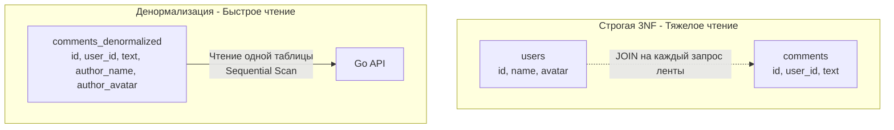

## Осознанное разрушение идеальной схемы

На протяжении предыдущих статей, начиная с [[9. Нормализация. Введение]] и заканчивая [[13. BCNF и более высокие нормальные формы]], мы учились наводить строгий математический порядок. Мы дробили сущности, боролись с дублированием и выстраивали идеальные реляционные связи. 

Но в мире суровой инженерии и Highload-систем идеальная академическая теория часто разбивается о физические ограничения железа. **Денормализация** — это процесс *осознанного* нарушения нормальных форм с целью значительного повышения производительности чтения (Read Performance) за счет усложнения записи (Write Penalty) и избыточности хранения.

Важное правило: денормализация — это инструмент Senior-инженера. Ее нельзя применять "по умолчанию". Сначала вы проектируете базу в строгой 3NF, а затем, опираясь на метрики профилирования и анализ узких мест, точечно денормализуете самые горячие участки.

---

## Mechanical Sympathy: Почему JOIN становится врагом

Реляционные базы данных прекрасно делают JOIN-ы. Оптимизатор строит эффективные деревья выполнения, используя Hash Join или Nested Loop. Но когда ваша система вырастает до сотен миллионов записей и десятков тысяч RPS (запросов в секунду), классическая 3NF начинает "тормозить" по трем причинам:

1. **CPU и RAM Overhead:** Чтобы собрать страницу профиля пользователя (имя, аватарка, 10 последних постов, количество лайков, названия тегов), СУБД должна прочитать данные из 5-6 разных таблиц. Это требует загрузки множества страниц с диска в Buffer Pool, вычисления хэшей для слияния и аллокации памяти под результирующее множество.
2. **Проблема Random I/O:** В нормализованной базе данные разбросаны по разным файлам (Heap-файлам таблиц). Сборка одной бизнес-сущности может спровоцировать десятки случайных чтений с диска (Random Read), что в сотни раз медленнее последовательного чтения (Sequential Read).
3. **Шардирование (Sharding):** Если таблица `users` лежит на сервере в дата-центре А, а таблица `posts` — на сервере в дата-центре Б (см. [[4. Sharding]]), вы физически не можете сделать быстрый SQL `JOIN`. Выход один — денормализация.

---

## Паттерны денормализации

Разберем самые популярные техники, которые используются в современных бэкенд-архитектурах.

### 1. Кэширование агрегаций (Счетчики)

**Проблема (3NF):** Чтобы показать количество комментариев под постом, база выполняет `SELECT COUNT(*) FROM comments WHERE post_id = 42`. На вирусном посте с 50 000 комментариев этот запрос (даже с индексом) будет сжигать CPU при каждом обновлении страницы тысячами пользователей.

**Решение:** Нарушаем 2NF/3NF и добавляем поле `comments_count BIGINT` прямо в таблицу `posts`. Мы дублируем информацию (количество можно вычислить), но теперь чтение поста и счетчика — это $O(1)$ и чтение ровно одной строки с диска.

> [!warning] Ловушка / Gotcha
> Плата за этот паттерн — усложнение записи. Теперь при каждом добавлении комментария мы обязаны обновить счетчик. Если мы забудем это сделать в Go-коде, данные разъедутся.

### 2. Дублирование атрибутов для избежания JOIN

**Проблема (3NF):** При рендеринге ленты комментариев нам нужно показывать имя автора и его аватарку. Это требует `JOIN users ON comments.user_id = users.id`.

**Решение:** Хранить `author_name` и `author_avatar_url` прямо в таблице `comments`. 
Лента комментариев теперь читается простым плоским `SELECT * FROM comments WHERE post_id = 42 ORDER BY created_at DESC`, без единого JOIN.



### 3. Материализованные поля (Снапшоты)

Иногда денормализация диктуется самим бизнесом.
В таблице `orders` (заказы) мы должны хранить цену товара на *момент покупки*. Если мы оставим нормализованную связь `orders.product_id -> products.id` и будем всегда делать JOIN для получения цены, то изменение цены в каталоге `products` задним числом изменит стоимость всех исторических заказов! 
Поэтому мы обязаны скопировать (денормализовать) поле `price` в таблицу связи `order_items`.

### 4. Использование JSONB для связей "Один-ко-многим"

Вместо создания отдельной таблицы для слабоструктурированных характеристик товара (размер, цвет, материал), которые редко меняются, но всегда читаются вместе с товаром, мы "схлопываем" их в одну колонку `attributes JSONB`. Это намеренное нарушение [[10. Первая нормальная форма 1NF]], которое радикально снижает нагрузку на Buffer Pool базы данных.

---

## Денормализация в Go: Управление консистентностью

Главная головная боль архитектора при денормализации — это **Data Inconsistency** (рассинхрон данных).
Если пользователь изменил аватарку, как обновить миллион его старых комментариев, где эта аватарка продублирована?

Есть два архитектурных подхода, которые мы реализуем на Go:

### Подход 1: Синхронное обновление (Транзакции)

Подходит для быстрых операций (например, обновление счетчика комментариев). Мы используем ACID-транзакции пакета `database/sql` для обеспечения атомарности.

```go
package main

import (
	"context"
	"database/sql"
	"fmt"
)

// AddComment добавляет комментарий и атомарно обновляет денормализованный счетчик
func AddComment(ctx context.Context, db *sql.DB, postID int64, text string) error {
	tx, err := db.BeginTx(ctx, nil)
	if err != nil {
		return err
	}
	// Важно: defer Rollback безопасен, если tx.Commit() уже прошел успешно, 
	// Rollback просто вернет ошибку sql.ErrTxDone, которую мы игнорируем.
	defer tx.Rollback()

	// 1. Вставляем комментарий
	_, err = tx.ExecContext(ctx, "INSERT INTO comments (post_id, text) VALUES ($1, $2)", postID, text)
	if err != nil {
		return fmt.Errorf("ошибка вставки комментария: %w", err)
	}

	// 2. Обновляем денормализованный счетчик.
	// Используем атомарный инкремент на уровне БД (post_id = post_id + 1), 
	// избегая Race Condition и необходимости делать SELECT FOR UPDATE в Go.
	res, err := tx.ExecContext(ctx, "UPDATE posts SET comments_count = comments_count + 1 WHERE id = $1", postID)
	if err != nil {
		return fmt.Errorf("ошибка обновления счетчика: %w", err)
	}
	
	rowsAffected, _ := res.RowsAffected()
	if rowsAffected == 0 {
		return fmt.Errorf("пост с id %d не найден", postID)
	}

	return tx.Commit()
}
```

### Подход 2: Асинхронное обновление (Eventual Consistency)

Если нужно обновить аватарку пользователя в 5 миллионах его комментариев, синхронная SQL-транзакция заблокирует базу и упадет по таймауту. 

В Highload-системах мы принимаем парадигму **Eventual Consistency (Согласованность в конечном счете)**.
1. В Go-коде (или триггере БД) обновляется аватарка в таблице `users`.
2. Публикуется событие `UserAvatarUpdated` в брокер сообщений (Kafka/RabbitMQ) через паттерн Outbox (см. [[11. Outbox pattern]]).
3. Фоновые воркеры (Background Workers) на Go неспешно, батчами (порциями по 1000 строк) обновляют денормализованное поле `author_avatar_url` в таблице `comments`. Некоторое время система будет в неконсистентном состоянии (в новых комментах новая аватарка, в старых - старая), но бизнес обычно готов с этим мириться ради стабильности системы.

> [!tip] Собеседование
> **Вопрос:** Если JOIN-ы так плохи под нагрузкой, почему бы не использовать NoSQL базу (MongoDB, Cassandra), которая по умолчанию денормализована?
> **Ответ:** NoSQL действительно решает эту проблему "из коробки" за счет Document или Column-family моделей. Но мы теряем мощь ACID-транзакций на несколько сущностей, гибкость ad-hoc аналитики и строгую валидацию констрейнтами (см. [[7. Ограничения целостности данных]]). В сложных проектах часто используют гибридный подход: мастер-данные живут в строгой 3NF в PostgreSQL, а денормализованные "представления" (Views/Aggregates) асинхронно переливаются в Elasticsearch, Redis или MongoDB для быстрого чтения клиентами (паттерн CQRS).

## Итог

1.  **Денормализация** — это умышленное введение избыточности в схему БД для оптимизации I/O и CPU при тяжелых операциях чтения.
2.  Применяется точечно: дублирование полей, хранение предварительно вычисленных агрегаций (счетчиков) и использование JSONB для вложенных сущностей.
3.  Оборотная сторона денормализации — **аномалии модификации**. Инженер обязан реализовывать механизмы синхронизации (синхронные ACID-транзакции или асинхронные воркеры) в приложении на Go.
4.  Денормализация — это всегда шаг навстречу архитектуре Eventual Consistency.

Мы закончили блок, посвященный математической и физической структуре таблиц. Теперь мы умеем проектировать как идеально чистые (3NF), так и экстремально быстрые (Денормализованные) схемы. Но как передать эти знания другим разработчикам в команде? Схему из сотен таблиц невозможно держать в голове. В следующей статье мы научимся визуализировать наши архитектурные решения: переходим к [[15. ER диаграммы и моделирование данных]].