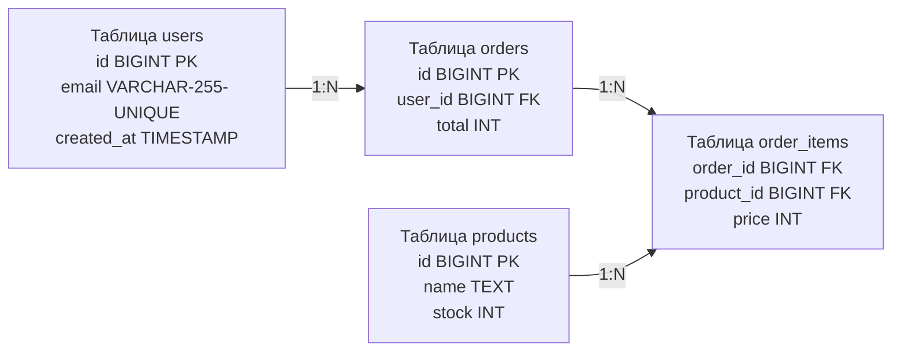

## Карта территории данных

К этому моменту мы прошли огромный путь. Мы научились структурировать данные с помощью нормализации (от [[9. Нормализация. Введение]] до [[13. BCNF и более высокие нормальные формы]]) и узнали, когда эти правила нужно осознанно нарушать ради производительности ([[14. Денормализация и когда она оправдана]]). 

Но база данных реального Highload-проекта — это не три таблицы. Это десятки, сотни, а иногда и тысячи связанных сущностей. Пытаться держать такую архитектуру в голове или изучать её, читая структуры Go-кода — самоубийство для инженера. Структуры в Go часто отражают агрегированные DTO (Data Transfer Objects) или интерфейсы контрактов, а не реальную физику хранения.

Единственный способ управлять хаосом и коммуницировать архитектуру команде — это **Моделирование данных** и создание **ER-диаграмм (Entity-Relationship Diagrams)**.

---

## Три уровня моделирования

Проектирование схемы базы данных — это не написание `CREATE TABLE` в консоли. Это итеративный процесс трансляции бизнес-требований в физические байты на диске. Архитекторы выделяют три уровня моделей:

### 1. Концептуальная модель (Conceptual Model)
Это вид с высоты птичьего полета. Здесь мы общаемся с бизнесом (Product Managers, аналитиками). На этом этапе нет никаких типов данных, ключей или индексов. Есть только бизнес-сущности и то, как они связаны.
* *Пример:* "Пользователь оформляет Заказ", "Заказ содержит Товары".

### 2. Логическая модель (Logical Model)
Здесь мы применяем правила реляционной алгебры. Мы определяем атрибуты (колонки) для каждой сущности и решаем, как будут реализованы связи. На этом этапе мы проводим нормализацию до [[12. Третья нормальная форма 3NF]]. Мы понимаем, что связь "Многие-ко-многим" (Заказы и Товары) невозможна без промежуточной таблицы.
* *Пример:* Сущность "Пользователь" получает атрибуты `email` и `phone`. Добавляется промежуточная таблица `order_items`.

### 3. Физическая модель (Physical Model)
Это территория хардкорной инженерии. Модель привязывается к конкретной СУБД (например, PostgreSQL 16). Здесь мы определяем физические типы данных (размер домена), ограничения ([[7. Ограничения целостности данных]]) и индексы.

> [!info] Под капотом: Mechanical Sympathy Физической модели
> Разница между Логической и Физической моделью — это разница между абстракцией и железом.
> В логической модели у вас есть атрибут "Уникальный идентификатор".
> В физической модели вы должны решить: это будет `UUID` или `BIGINT`? Ваш выбор определит, как данные лягут на страницы памяти (8 КБ), как будет происходить фрагментация B-Tree индекса и сколько I/O операций потребуется для `INSERT`. 
> Также именно на физическом уровне вы определяете **порядок столбцов**, чтобы минимизировать мусорный padding (выравнивание памяти), о котором мы говорили в [[5. Таблицы, строки, столбцы и ключи]].

---

## Анатомия ER-диаграммы

**ER-диаграмма (Модель сущность-связь)** — это стандартный визуальный язык для проектирования баз данных. Она состоит из трех базовых элементов:

1. **Сущность (Entity):** Физический или логический объект (таблица).
2. **Атрибут (Attribute):** Свойство сущности (колонка).
3. **Связь (Relationship):** Взаимодействие между сущностями (Foreign Keys).

Самое важное в моделировании связей — это **Кардинальность (Cardinality)**. Она определяет, сколько экземпляров одной сущности может быть связано с экземплярами другой.

### Типы кардинальности

1. **Один-к-Одному (1:1):** Например, `Пользователь` и `Паспортные данные`. Обычно реализуется так: Primary Key одной таблицы является Foreign Key и Primary Key для другой.
2. **Один-ко-Многим (1:N):** Самая частая связь. `Пользователь` имеет много `Заказов`. Реализуется через Foreign Key в дочерней таблице, ссылающийся на Primary Key родительской (см. [[6. Первичные и внешние ключи]]).
3. **Многие-ко-Многим (M:N):** Например, `Студенты` и `Курсы`.

> [!warning] Ловушка / Gotcha: Физика Много-ко-Многим
> На концептуальном уровне вы можете нарисовать линию напрямую между Студентами и Курсами.
> На физическом (и логическом) уровне **реляционные базы данных не поддерживают связи Многие-ко-Многим**. 
> Вы обязаны создать промежуточную таблицу (Junction / Join Table), превратив одну связь `M:N` в две связи `1:N`. Непонимание этого механизма приводит к катастрофическим нарушениям [[11. Вторая нормальная форма 2NF]].

### Визуализация физической ER-модели

В индустрии для описания связей часто используется "Нотация ворон лапок" (Crow's Foot notation). Ниже представлен пример физической ER-модели простого интернет-магазина, выраженный через стандартный флоучарт.

В этой архитектуре таблица `order_items` физически реализует логическую связь `M:N` между Заказами и Товарами, а также спасает нас от аномалий изменения цен в будущем, дублируя цену (`price`) на момент покупки.

---

## Архитектура: Code-First vs Database-First

Существует два фундаментально разных подхода к созданию схемы базы данных и генерации ER-моделей. Выбор подхода радикально отличает экосистему Go от языков вроде PHP (Doctrine), C# (Entity Framework) или Python (Django).

### 1. Code-First (Мышление объектами)
Разработчик описывает сущности в виде структур в коде (например, используя ORM GORM), расставляет теги, а затем ORM сама генерирует и выполняет `CREATE TABLE` и `ALTER TABLE`. ER-диаграмма в этом случае становится просто вторичным отчетом.

* **Минусы для Highload:** Разработчик отдаляется от базы данных. ORM может сгенерировать неэффективные индексы, неправильные типы (например, `TEXT` вместо `VARCHAR` там, где это важно), или проигнорировать тонкие настройки Storage Engine.

### 2. Database-First (Мышление множествами и контрактами)
Это **идиоматичный путь в Go**. Вы проектируете базу данных как отдельную независимую систему. Вы рисуете ER-диаграмму (в инструментах вроде DataGrip, dbdiagram.io или PlantUML), затем пишете чистый SQL (DDL) для миграций. 

А Go-код (структуры) либо пишется вручную, либо генерируется из ваших SQL-запросов с помощью инструментов вроде `sqlc`.

> [!tip] Собеседование
> **Вопрос:** Почему в архитектуре микросервисов ER-диаграмма часто не содержит внешних ключей (Foreign Keys) для связи сущностей?
> **Ответ:** В микросервисной архитектуре база данных разделена. Сервис Заказов имеет свою БД, а сервис Пользователей — свою. Между ними нет физической связи на уровне СУБД. В ER-диаграмме сервиса заказов поле `user_id` будет просто атрибутом (например, типа BIGINT или UUID), но не Foreign Key. Целостность данных в таких системах обеспечивается асинхронно через паттерны вроде Saga или Outbox, а не констрейнтами СУБД.

## Итог

1.  **Моделирование данных** — это перевод бизнес-требований на язык физики СУБД через три этапа: Концептуальный, Логический и Физический.
2.  **ER-диаграмма** — это главный документ архитектора БД. Она описывает таблицы (сущности), их колонки (атрибуты) и физические связи между ними (через ключи).
3.  **Кардинальность** определяет характер связей. Запомните: связь M:N на уровне базы данных всегда реализуется через дополнительную таблицу-посредника.
4.  В экосистеме Go предпочтителен подход **Database-First**, когда схема БД и ER-модель являются первичными источниками истины, а Go-код подстраивается под них.

Изучив правила хорошего тона (нормализацию) и научившись их визуализировать (ER), пора посмотреть на темную сторону архитектуры. Существуют паттерны проектирования схем, которые гарантированно приведут вашу систему к катастрофе под высокой нагрузкой. В следующей статье мы разберем эти ошибки и научимся их избегать: переходим к [[16. Anti patterns проектирования схем]].