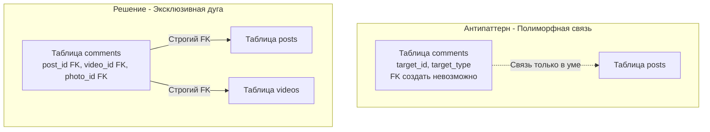

## Темная сторона архитектуры баз данных

Мы завершаем фундаментальный раздел по проектированию схем. Вы уже знаете, как строить идеальные реляционные связи ([[12. Третья нормальная форма 3NF]]) и как грамотно их нарушать ради производительности ([[14. Денормализация и когда она оправдана]]). 

Но на пути бэкенд-инженера вас будут подстерегать "гениальные" идеи. Чаще всего они рождаются из желания сделать систему максимально "гибкой" и "универсальной", чтобы реже писать SQL-миграции. В 99% случаев эта "гибкость" оборачивается катастрофой под нагрузкой.

В этой статье мы разберем классические антипаттерны проектирования баз данных, почему они убивают производительность на уровне железа и как правильно решать эти задачи в Go.

---

## 1. Entity-Attribute-Value (EAV): Убийца производительности

Это самый популярный антипаттерн, который Junior-разработчики приносят из мира e-commerce. Задача: у нас есть товары, и у каждого товара свой уникальный набор характеристик (у ноутбука — ОЗУ и процессор, у футболки — размер и цвет).

**Как выглядит EAV:**
Вместо того чтобы создавать колонки, разработчик создает универсальную таблицу: `(entity_id, attribute_name, attribute_value)`.

| entity_id (Товар) | attribute_name | attribute_value |
| :--- | :--- | :--- |
| 42 | color | Red |
| 42 | size | XL |
| 42 | cpu_cores | 8 |

### Почему это катастрофа? (Mechanical Sympathy)

1. **Уничтожение типов (Domain Integrity):** Колонка `attribute_value` вынуждена быть строкой (`VARCHAR` или `TEXT`). База данных не может проверить, что `cpu_cores` — это число. Ваша защита от мусора полностью ложится на Go-код.
2. **Адские JOIN-ы:** Чтобы достать один товар с 5 характеристиками и собрать его в структуру Go, базе данных придется сделать 5 `JOIN`-ов одной и той же таблицы саму на себя.
3. **Крах кэша (Buffer Pool Thrashing):** Поскольку данные размазаны по миллионам строк EAV-таблицы, сборка одной сущности вызывает лавину случайных чтений с диска (Random I/O). Оптимизатор СУБД сойдет с ума, пытаясь построить план выполнения для 10 `JOIN`-ов таблицы на 100 ГБ.

> [!tip] Собеседование
> **Вопрос:** Если EAV это так плохо, как хранить товары с динамическими характеристиками в реляционной БД?
> **Ответ:** Абсолютный стандарт сегодня — использование типа `JSONB` (в PostgreSQL). Вы сохраняете реляционную строгость для базовых полей (цена, остаток на складе, `id`), а весь "плавающий" payload кладете в `JSONB`. В Postgres есть GIN-индексы, которые умеют быстро искать ключи внутри бинарного JSON, избегая полного сканирования таблицы (Sequential Scan).

---

## 2. Полиморфные связи (Polymorphic Associations)

Вам нужно реализовать систему комментариев. Комментарии можно оставлять к Статьям (`posts`), к Видео (`videos`) и к Фотографиям (`photos`).

**Антипаттерн:**
Создать таблицу `comments` с колонками `target_id` и `target_type`.

| id | text | target_type | target_id |
| :--- | :--- | :--- | :--- |
| 1 | Супер! | posts | 42 |
| 2 | Смешно | videos | 10 |

### Почему это катастрофа?
Вы **не можете** создать внешний ключ (Foreign Key) на колонку, таблица назначения которой определяется строковым значением в другой колонке! 

Нарушается фундаментальный принцип [[6. Первичные и внешние ключи]]. 
База данных теряет контроль над ссылочной целостностью. Если кто-то удалит `post` с `id = 42`, комментарий останется висеть в базе навсегда (Orphaned Row), так как каскадное удаление не работает без FK.

### Решение: Эксклюзивная дуга (Exclusive Arc)

Мы создаем настоящие внешние ключи для каждой возможной цели и жестко контролируем их через [[7. Ограничения целостности данных]].



В SQL это решается добавлением ограничения `CHECK`, которое математически гарантирует, что заполнен *только один* FK, а остальные равны `NULL`:

```sql
CREATE TABLE comments (
    id BIGINT PRIMARY KEY,
    text TEXT,
    post_id BIGINT REFERENCES posts(id),
    video_id BIGINT REFERENCES videos(id),
    photo_id BIGINT REFERENCES photos(id),
    
    -- Гарантируем, что комментарий привязан ровно к одной сущности
    CONSTRAINT chk_exclusive_arc CHECK (
        (post_id IS NOT NULL)::int + 
        (video_id IS NOT NULL)::int + 
        (photo_id IS NOT NULL)::int = 1
    )
);
```

---

## 3. "The Blob" или Единая таблица справочников (OTLT)

"Зачем нам плодить 50 таблиц для мелких справочников (Статусы заказов, Роли юзеров, Категории товаров)? Давайте создадим одну таблицу `dictionaries (domain, code, value)`!" — говорит разработчик, желая сэкономить время.

### Механика катастрофы:

1.  **Потеря строгой типизации:** Вы больше не можете сделать `FOREIGN KEY (status_id) REFERENCES order_statuses(id)`. Вы можете сделать FK только на `dictionaries`, и база не помешает вам случайно записать `status_id`, который ссылается на категорию товара, а не на статус заказа.
2.  **Lock Contention (Борьба за блокировки):** Вся система постоянно читает эту таблицу. Любое обновление (добавление нового статуса) может вызвать блокировки страниц памяти, замедляя не связанные между собой транзакции (см. [[1. ACID. Основы]]).

*Идиоматичный подход:* Таблицы ничего не стоят. Создавайте отдельную крошечную таблицу для каждого справочника. СУБД легко поместит их целиком в оперативную память (Cache Hit 100%), а вы получите железную гарантию Foreign Keys.

---

## 4. Soft Deletes по умолчанию (is_deleted = true)

Удалять данные физически — страшно. Бизнес всегда просит: "Ничего не удаляйте, просто помечайте как удаленное". Разработчик добавляет колонку `is_deleted BOOLEAN` во *все* таблицы проекта.

> [!warning] Ловушка / Gotcha: MVCC и индексы
> В базах данных вроде PostgreSQL обновление (`UPDATE is_deleted = true`) физически работает как `DELETE` старой версии строки и `INSERT` новой версии. Это механизм MVCC (Multi-Version Concurrency Control).
> 
> "Мягкое удаление" приносит огромные проблемы:
> 1. **Уникальные индексы ломаются.** Если юзер "удалил" аккаунт `bob@go.dev` (`is_deleted=true`), он больше не сможет зарегистрироваться с этим же email, потому что `UNIQUE(email)` все еще видит старую строку. (Придется писать костыли вроде `CREATE UNIQUE INDEX ON users (email) WHERE is_deleted = false`).
> 2. **Раздувание B-Tree.** Ваш индекс по таблице `users` будет на 90% состоять из мертвых аккаунтов. Поиск живых юзеров будет замедляться из-за того, что процессор будет прогонять I/O по бесполезным веткам дерева.

**Решение для Highload:** Если вам нужно хранить историю, используйте паттерн **Archive Tables (Теневые таблицы)**. 
Пишите в основную таблицу, а при `DELETE` триггер (или код на Go) физически переносит строку в архивную таблицу `users_archive`. Ваша основная («горячая») таблица остается маленькой, индексы летают, а аналитики всё еще могут делать выборки по архиву.

---

## 5. Использование рандомных UUIDv4 как Primary Key

Мы уже касались этой темы, но в контексте антипаттернов ее нужно закрепить.

Использование `UUID` v4 (полностью случайных строк) в качестве Первичного ключа — это выстрел в ногу для дисковой подсистемы. B-Tree индексы оптимизированы под вставку *в конец* дерева (монотонно возрастающие ключи). 

Если ключ рандомный, каждая вставка (`INSERT`) происходит в случайное место дерева. СУБД вынуждена прочитать случайную страницу с диска в RAM, вставить ключ, и если страница переполнена, выполнить дорогую операцию **Page Split** (разделение страницы на две). Это вызывает чудовищный Write Amplification (умножение записи).

*Решение:* Если вам нужен UUID (например, для защиты от перебора ID в REST API), используйте **UUID v7** (в нем первые биты — это timestamp, поэтому он растет монотонно) или оставьте внутренний PK как `BIGINT`, а наружу (на фронтенд) отдавайте вторичный ключ `public_id UUID`, по которому будет построен отдельный индекс. (Подробности работы индексов будут в [[2. B Tree индекс под капотом]]).

---

## Итог и Чек-лист архитектора

Проектируя схему базы данных для Go-бэкенда, задавайте себе следующие вопросы:

1. **Нет ли у меня таблиц-мусорных корзин?** (EAV). Если структура данных плавает — используйте `JSONB`.
2. **Могу ли я нарисовать физические стрелки от таблицы к таблице?** (Polymorphic Associations). Если нет — используйте Эксклюзивные дуги с `CHECK`.
3. **Не смешиваю ли я разные домены в одной куче?** (OTLT). Для каждого справочника — своя таблица.
4. **Не раздуваю ли я "горячие" таблицы мертвыми данными?** (Soft Deletes). Переносите удаленные записи в архивные таблицы.
5. **Дружит ли мой Primary Key с B-Tree индексом?** (UUIDv4). Используйте `BIGINT` или монотонные версии UUID (v7).

Мы завершили огромный путь по изучению того, как думать о данных, как их структурировать и как физически хранить. Фундамент заложен. Теперь пришло время научиться разговаривать с базой данных на ее родном языке, чтобы извлекать, изменять и анализировать эти данные. В следующем разделе мы начнем погружение в язык структурированных запросов: переходим к [[1. Введение в SQL]].