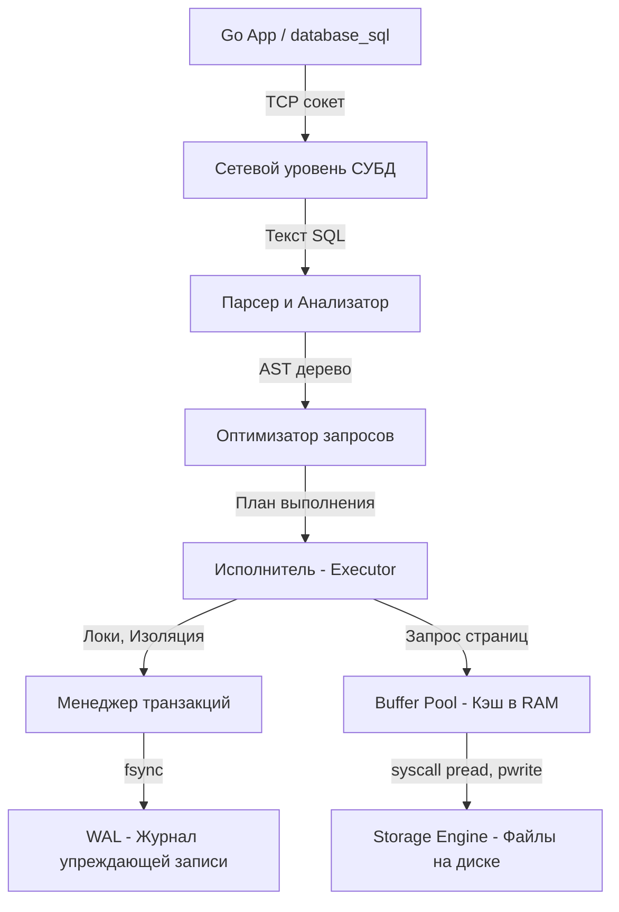

## База данных vs СУБД. Разделяем понятия

В повседневном общении разработчики часто говорят: «Мы используем базу данных PostgreSQL» или «Надо сходить в базу». Это устоявшийся сленг, но технически он абсолютно некорректен. Для инженера, проектирующего сложные системы, критически важно разделять эти два понятия на уровне физики и архитектуры.

* **База данных (БД, Database)** — это просто структурированный набор данных. На физическом уровне (на жестком диске) база данных — это набор обычных файлов, содержащих байты. 
* **СУБД (Система Управления Базами Данных, DBMS)** — это сложнейший комплекс программного обеспечения, который работает поверх этих файлов. Он предоставляет интерфейс для безопасного, конкурентного и быстрого доступа к данным. 

PostgreSQL, MySQL, Redis, ClickHouse — всё это **СУБД**, а не базы данных. Ваша программа на Go общается по сети именно с СУБД, а СУБД уже управляет базой данных на диске.

## Почему мы не используем просто файлы?

Каждый Junior-разработчик когда-нибудь задавался вопросом: зачем разворачивать тяжелую СУБД, писать сложные SQL-запросы, если можно просто сохранять структуры Go в JSON или CSV файлы?

Посмотрим на типичный наивный подход записи в файл на Go:

```go
func saveUser(u User) error {
    // Открываем файл в режиме добавления
    file, err := os.OpenFile("users.csv", os.O_APPEND|os.O_CREATE|os.O_WRONLY, 0644)
    if err != nil {
        return err
    }
    defer file.Close()
    
    line := fmt.Sprintf("%d,%s,%d\n", u.ID, u.Name, u.Age)
    _, err = file.WriteString(line) // syscall write
    return err
}
```

Что не так с этим кодом в контексте Highload-бэкенда?

1.  **Конкурентность (Concurrency):** Если 1000 горутин одновременно вызовут `saveUser`, байты в файле перемешаются (Data Corruption). Можно добавить `sync.Mutex`, но тогда все 1000 горутин выстроятся в очередь, и пропускная способность упадет до нуля. А если у вас 5 экземпляров приложения (подов в Kubernetes)? Мьютекс внутри одного процесса Go вас уже не спасет.
2.  **Частичная запись (Partial Write):** Что если в момент выполнения системного вызова `write` сервер потеряет питание? Вы запишете половину строки `15,Ale`, и файл будет навсегда поврежден.
3.  **Поиск (Search Complexity):** Чтобы найти пользователя по имени, вам придется прочитать весь файл целиком от начала до конца (Full Scan — $O(N)$). Для файла в 10 ГБ это убьет и диск, и CPU, и память, так как нужно десериализовать каждый байт.

> [!tip] Собеседование
> **Вопрос:** Зачем нужна СУБД, если есть мощная файловая система ОС?
> **Ответ:** Файловая система предоставляет абстракцию "файл как поток байтов" (stream of bytes) и решает базовые задачи доступа. СУБД решает задачи высокого уровня: изоляцию конкурентных транзакций (чтобы запросы не мешали друг другу), обеспечение атомарности (всё или ничего), защиту от сбоев питания (через [[8. WAL. Write Ahead Log]]) и обеспечение $O(\log N)$ или $O(1)$ поиска с помощью индексов.

## Архитектура СУБД под капотом

Чтобы решить вышеописанные проблемы, современные реляционные СУБД строятся как монолитные операционные системы внутри операционной системы. 

Когда ваш Go-код выполняет запрос `db.QueryContext(ctx, "SELECT * FROM users WHERE id = 1")`, запрос проходит через несколько слоев абстракции внутри СУБД:



1.  **Сетевой уровень (Transport):** СУБД слушает TCP-порт (например, 5432 для Postgres) и управляет тысячами клиентских соединений.
2.  **Парсер и Оптимизатор:** Текст SQL превращается в абстрактное синтаксическое дерево (AST), проверяются права доступа, а оптимизатор (Cost-Based Optimizer) решает, какой индекс использовать и в каком порядке соединять таблицы (JOIN).
3.  **Исполнитель (Executor):** Получает готовый план запроса и начинает его выполнять, оперируя структурами данных СУБД.
4.  **Менеджер транзакций:** Отвечает за требования [[1. ACID. Основы]]. Он гарантирует, что если база сказала "сохранено", данные не пропадут при выдергивании шнура из розетки.
5.  **Buffer Pool (или Shared Buffers):** Это сердце базы данных. Самый большой кусок оперативной памяти (обычно выделяют от 25% до 75% всей RAM сервера), где СУБД хранит закэшированные куски файлов данных.

## Mechanical Sympathy. Страничная организация

СУБД почти никогда не работает с отдельными строками (rows) при обращении к диску. Это слишком дорого. Дисковые подсистемы (даже самые быстрые NVMe SSD) оптимизированы для блочного чтения.

СУБД разбивает все файлы данных на блоки фиксированного размера — **Страницы (Pages)**. В PostgreSQL размер страницы по умолчанию равен 8 КБ, в InnoDB (MySQL) — 16 КБ. 

> [!info] Под капотом
> Когда вы просите СУБД вернуть строку `id = 42` размером всего в 100 байт, происходит следующее:
> 1. СУБД понимает, на какой именно странице лежит эта строка.
> 2. Она проверяет, есть ли страница в оперативной памяти (Buffer Pool).
> 3. Если её там нет (Cache Miss), СУБД делает системный вызов `pread` и читает с диска **целиком 8 КБ (или 16 КБ)**.
> 4. Страница помещается в Buffer Pool, строка извлекается из памяти и отправляется по сети в ваше Go-приложение.

Это знание критически важно для производительности. Если вы проектируете схему так, что данные, которые нужны запросу одновременно, разбросаны по разным страницам, вы заставите диск совершать огромное количество случайных чтений (Random IO), и база «встанет». И наоборот, если часто запрашиваемые данные лежат плотно (на одной странице), СУБД прочитает их с диска ровно одним системным вызовом.

> [!warning] Ловушка / Gotcha
> Вы не можете просто добавить оперативную память (RAM), чтобы база стала работать в 2 раза быстрее, если ваши SQL запросы заставляют сканировать миллионы страниц с диска (Full Table Scan). База данных будет постоянно "вымывать" полезные данные из Buffer Pool, чтобы загрузить туда ненужные страницы для сканирования (Cache Thrashing).

## Итог

1.  **БД** — это файлы на диске. **СУБД** — это умный и тяжелый софт, который эти файлы читает и пишет.
2.  СУБД решает сложнейшие задачи конкурентного доступа, отказоустойчивости и оптимизации поиска, которые невозможно или слишком дорого реализовать силами самого бэкенд-приложения на Go.
3.  Основа производительности реляционных баз данных — это кэширование страниц памяти (Buffer Pool) и минимизация обращений к медленному диску.

Теперь, когда мы понимаем, что из себя представляет СУБД как программа и почему она нам необходима, нужно разобраться с тем, какими они бывают, так как инструменты для разных задач радикально отличаются. В следующей статье мы рассмотрим эту классификацию: [[3. Типы баз данных. OLTP vs OLAP]].