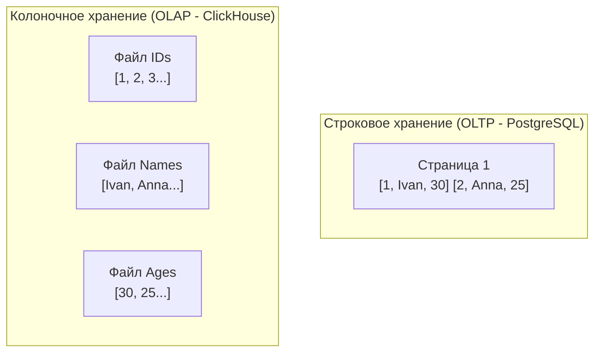

## Великий раскол баз данных

В мире архитектуры данных существует фундаментальное правило: **невозможно создать единую структуру данных, которая бы одинаково быстро работала и с точечными транзакциями, и с тяжелой аналитикой**. 

По мере роста вашего Go-бэкенда вы неизбежно столкнетесь с тем, что основная база данных (например, PostgreSQL) начнет "задыхаться" от тяжелых отчетов или выгрузок. Чтобы понять, почему это происходит и как это лечить, нам нужно разобрать два главных паттерна нагрузки на СУБД: **OLTP** и **OLAP**.

---

## OLTP (Online Transaction Processing)

**OLTP** — это транзакционная нагрузка. Это сердце любого современного приложения: интернет-магазина, банковского процессинга, социальной сети. Ваш микросервис на Go в 95% случаев реализует именно OLTP-паттерн.

**Характеристики OLTP:**
* **Тип запросов:** Короткие, быстрые операции (CRUD — Create, Read, Update, Delete). Затрагивают одну или несколько строк.
* **Конкурентность:** Огромная. Тысячи или десятки тысяч запросов в секунду (RPS / TPS) от тысяч разных пользователей.
* **Изоляция:** Критически важна надежность и консистентность. Требуется строгое соблюдение [[1. ACID. Основы]].
* **Объем данных в запросе:** Минимальный (Килобайты). Запрос `SELECT * FROM users WHERE id = 42` возвращает конкретную микро-сущность.

### Mechanical Sympathy: Строковое хранение (Row-Oriented)

Чтобы быстро обновлять конкретную сущность (например, списать деньги со счета), все данные этой сущности должны лежать физически рядом на жестком диске. Поэтому OLTP-базы (PostgreSQL, MySQL, Oracle) используют **строковое хранение (Row-Oriented Storage)**.

Данные на диске (в страницах по 8 КБ) записываются подряд: `[ID1, Имя1, Возраст1, Баланс1] [ID2, Имя2, Возраст2, Баланс2]...`

> [!info] Под капотом
> Когда СУБД нужно обновить `Баланс1`, она читает в Buffer Pool одну страницу (8 КБ), находит там кортеж (Tuple) пользователя, блокирует его, меняет байты баланса и помечает страницу как "грязную" (dirty page). Поскольку все поля пользователя лежат рядом, операция обновления максимально локализована в памяти и требует минимум I/O операций.

---

## OLAP (Online Analytical Processing)

**OLAP** — это аналитическая нагрузка. Это царство Data Science, аналитиков и бизнес-отчетов (BI). На уровне архитектуры сюда выгружаются данные из OLTP-баз для исторического анализа (например, СУБД ClickHouse, Greenplum).

**Характеристики OLAP:**
* **Тип запросов:** Тяжелые агрегации (`SUM`, `AVG`, `GROUP BY`) по миллионам или миллиардам записей.
* **Конкурентность:** Низкая. Десятки или сотни одновременно работающих аналитиков, но каждый запрос загружает систему по максимуму.
* **Изоляция:** Транзакции почти не нужны. Данные в OLAP обычно только дописываются (Append-Only) и читаются.
* **Объем данных в запросе:** Гигантский (Гигабайты и Терабайты).

### Mechanical Sympathy: Колоночное хранение (Column-Oriented)

Представьте аналитический запрос к OLTP-базе: `SELECT SUM(balance) FROM users`. 
В строковой базе процессору придется прочитать с диска в память **все** данные пользователей (их имена, аватарки, адреса), чтобы выцепить только одно поле `balance`. Диск будет "задыхаться", передавая гигабайты мусора ради пары мегабайт полезной нагрузки.

OLAP-базы используют **колоночное хранение (Columnar Storage)**. Каждый столбец таблицы хранится в отдельном физическом файле.



> [!info] Под капотом: Магия кэш-линий и SIMD
> Колоночное хранение творит чудеса на уровне "железа" по двум причинам:
> 
> 1. **Дисковый ввод-вывод:** Запрос `SUM(balance)` прочитает только файл с балансами. Никаких лишних байт с диска не поднимется. Кроме того, одинаковые типы данных (массив из миллионов чисел) идеально сжимаются алгоритмами (например, LZ4). Диск читает сжатый поток данных со скоростью в десятки раз выше.
> 2. **L1/L2 Кэш процессора:** Когда CPU запрашивает данные из RAM, он читает их блоками по 64 байта (Cache Line). При строковом хранении в эти 64 байта попадет имя и адрес (мусор для `SUM`). При колоночном хранении в 64 байта идеально влезают 16 значений `int32` баланса. Процессор может использовать векторные инструкции **SIMD** (Single Instruction, Multiple Data), складывая по 16 чисел за один такт CPU! Это называется *векторизованным выполнением (Vectorized Execution)*.

---

## Архитектурные паттерны в Go: Как писать в разные СУБД

Понимание разницы между OLTP и OLAP диктует то, как ваш Go-код должен с ними взаимодействовать.

### 1. Работа с OLTP (PostgreSQL / MySQL)
В OLTP мы пишем консистентно и быстро, транзакция за транзакцией. Используем стандартный пакет `database/sql` с пулом соединений.

```go
// OLTP-стиль: атомарная быстрая вставка одной сущности
func CreateOrder(ctx context.Context, db *sql.DB, order Order) error {
    query := `INSERT INTO orders (user_id, total) VALUES ($1, $2) RETURNING id`
    return db.QueryRowContext(ctx, query, order.UserID, order.Total).Scan(&order.ID)
}
```

### 2. Работа с OLAP (ClickHouse)
**Никогда не пишите в OLAP по одной строке!** Колоночные базы данных используют архитектуру LSM-дерева или похожие структуры (подробнее в [[12. ClickHouse под капотом]]). Если вы будете слать `INSERT` на каждую строку, база создаст миллионы крошечных файлов колонок на диске, фоновый процесс слияния (Merge) сломается, и сервер "упадет" под нагрузкой IOPS.

> [!warning] Ловушка / Gotcha
> Частая ошибка мидлов: использовать стандартный подход `INSERT` в цикле для отправки логов или событий в ClickHouse. 

Правильный паттерн на Go — это **Батчинг (Batching)**. Вы копите события в памяти (или читаете пачками из Kafka) и отправляете их массивным куском.

```go
// OLAP-стиль: буферизация и массовая вставка (Batch Insert)
// В реальности лучше использовать драйвер clickhouse-go и его метод PrepareBatch
func FlushAnalyticsToOLAP(ctx context.Context, conn driver.Conn, events []Event) error {
    batch, err := conn.PrepareBatch(ctx, "INSERT INTO user_events")
    if err != nil { return err }

    for _, e := range events {
        // Мы добавляем строки в локальный буфер драйвера, а не шлем по сети
        if err := batch.Append(e.UserID, e.EventType, e.Timestamp); err != nil {
            return err
        }
    }
    // Отправляем 10 000 строк одним TCP-пакетом и одним сжатым блоком на диск
    return batch.Send() 
}
```
Более детально этот паттерн мы разберем в статье [[16. Batch запросы]].

---

> [!tip] Собеседование
> **Вопрос:** Что такое HTAP и возможно ли объединить OLTP и OLAP?
> **Ответ:** HTAP (Hybrid Transactional/Analytical Processing) — это современный тренд в архитектуре БД. Инженеры пытаются создать СУБД, которая держит и то, и другое. Примеры: TiDB или AlloyDB. Обычно это достигается за счет сложной внутренней репликации: мастер-нода хранит данные в строковом формате (для быстрых мутаций), а реплики "на лету" перепаковывают эти данные в колоночный формат (для аналитики в реальном времени).

## Итог

1.  **OLTP (Row-Oriented):** Оптимизировано для быстрых записей и чтения целых строк. Идеально для бизнес-логики и CRUD. (PostgreSQL, MySQL).
2.  **OLAP (Column-Oriented):** Оптимизировано для агрегации огромных объемов данных по нескольким колонкам. Идеально для аналитики. Требует векторизации и пакетной вставки (ClickHouse, Greenplum).
3.  **Mechanical Sympathy:** Разница в производительности обусловлена тем, как данные ложатся на страницы диска и кэш-линии процессора. Выбирайте инструмент, чья физическая архитектура соответствует вашей задаче.

Теперь, когда мы понимаем фундаментальное разделение в мире СУБД, пришло время нырнуть в самую популярную категорию — транзакционные базы данных. В следующей статье мы разберем математическую основу, на которой они построены: [[4. Реляционная модель данных. Основы]].