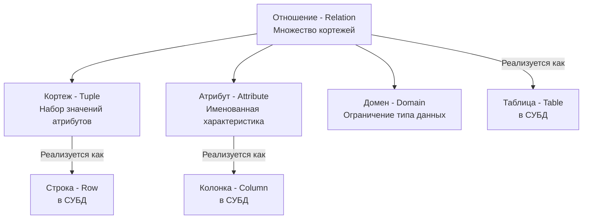

## Математика, изменившая мир бэкенда

До 1970 года базы данных напоминали путешествие по графам и деревьям (иерархические и сетевые БД). Разработчику приходилось писать код, который буквально говорил базе: «перейди к записи пользователя, затем по указателю перейди к первому заказу, затем ко второму». Это называлось *навигационным доступом*, и он был чудовищно негибким. Изменение структуры данных на диске ломало весь прикладной код.

Затем математик Эдгар Кодд (Edgar Codd), работая в IBM, опубликовал статью, которая перевернула индустрию. Он предложил **Реляционную модель данных** — абстракцию, основанную на теории множеств (Set Theory) и логике предикатов первого порядка.

Главная революция заключалась в следующем: **разработчик должен описывать ЧТО он хочет получить (декларативность), а СУБД сама решит, КАК это достать физически (императивность).**

Для Go-разработчика, привыкшего мыслить императивно (циклы, поинтеры, аллокации), реляционная модель требует серьезного сдвига парадигмы. Мы больше не итерируемся по структурам, мы оперируем *множествами*.

## Анатомия реляционной модели. Терминология

В реляционной алгебре нет понятий «таблица», «строка» или «колонка». Это физические абстракции, придуманные позже для удобства. СУБД (например, PostgreSQL) реализует реляционную модель, используя строгую математическую терминологию:

1.  **Отношение (Relation)** — это математическое представление того, что мы называем таблицей. Это множество уникальных элементов.
2.  **Кортеж (Tuple)** — это элемент отношения. В SQL это строка (Row). Важно: в классическом множестве нет порядка. Кортежи в таблице физически никак не упорядочены, если вы явно не укажете `ORDER BY`.
3.  **Атрибут (Attribute)** — это именованное свойство кортежа (колонка / Column).
4.  **Домен (Domain)** — это набор допустимых значений для атрибута (тип данных, например `INT`, `VARCHAR` или созданный вами кастомный тип). Домен гарантирует, что в атрибут «возраст» нельзя записать строку «собака».



> [!warning] Ловушка / Gotcha
> Самое частое заблуждение на собеседованиях: разработчики думают, что слово «реляционная» (от *relation*) означает наличие **связей** (relationships) между таблицами через внешние ключи (Foreign Keys). Это в корне неверно! Слово «реляционная» произошло от математического термина *Relation* (Отношение), то есть от самой таблицы. База данных является реляционной даже если в ней всего одна таблица и нет никаких связей вообще.

## Object-Relational Impedance Mismatch

Одна из главных болей бэкенд-инженерии — это «объектно-реляционное несоответствие» (Impedance Mismatch). 

Язык Go оперирует структурами, указателями, вложенными слайсами и мапами. Реляционная модель — плоская. Классический кортеж не может содержать в себе список (массив) других значений. Это фундаментальное правило, которое мы разберем в статье [[10. Первая нормальная форма 1NF]].

Посмотрим, как выглядит работа с плоскими кортежами на низком уровне через пакет `database/sql` в Go.

```go
package main

import (
	"context"
	"database/sql"
	"log"
)

// User - структура Go, которая должна принять данные из кортежа
type User struct {
	ID        int64
	Name      string
	Age       sql.NullInt16 // Защита от NULL значений домена
	IsActive  bool
}

func fetchActiveUsers(ctx context.Context, db *sql.DB) ([]User, error) {
	// Декларативный запрос: мы описываем ПРЕДИКАТ (is_active = true), 
	// но не пишем цикл по файлу.
	query := `SELECT id, name, age, is_active FROM users WHERE is_active = true`
	
	rows, err := db.QueryContext(ctx, query)
	if err != nil {
		return nil, err
	}
	defer rows.Close() // Критически важно для возврата коннекта в пул

	var users []User
	
	// Императивный Go-код обрабатывает результирующее множество кортежей
	for rows.Next() {
		var u User
		// Scan использует рефлексию (или кодогенерацию в драйверах) для маппинга
		// байт из сетевого буфера напрямую в память структуры Go.
		// Мы обязаны передавать указатели, чтобы Scan мог мутировать память.
		if err := rows.Scan(&u.ID, &u.Name, &u.Age, &u.IsActive); err != nil {
			return nil, err
		}
		users = append(users, u)
	}

	// Обязательно проверяем ошибки, которые могли возникнуть во время итерации
	if err := rows.Err(); err != nil {
		return nil, err
	}

	return users, nil
}
```

В этом примере `rows.Next()` — это итератор по потоку кортежей (Tuples Stream), который драйвер БД порциями (batches) вычитывает из TCP-сокета.

## Mechanical Sympathy: Кортежи под капотом ОС и памяти

Реляционная модель — это математика. Но база данных — это программа на C/C++, которая работает с физической памятью. Как абстрактный математический «кортеж» ложится на байты?

> [!info] Под капотом
> В PostgreSQL (и многих других СУБД) кортеж на диске (внутри 8-килобайтной страницы) состоит из двух частей:
> 1. **Заголовок кортежа (Tuple Header):** Занимает 23+ байта. В нем нет ваших данных! Там хранятся служебные поля: `t_xmin` и `t_xmax` (номера транзакций для MVCC), маска NULL-значений (Bitmap) и флаги.
> 2. **Полезная нагрузка (User Data):** Сами байты ваших колонок.
> 
> Как и структуры в Go (Struct Alignment), колонки в БД имеют **выравнивание (Padding)**. Если вы создадите таблицу `(char(1), int8, char(1))`, база добавит пустые байты между колонками, чтобы `int8` начинался с адреса, кратного 8. Неправильный порядок колонок в реляционной схеме может раздуть базу данных на диске на 20-30%, так же как неправильный порядок полей в `struct` раздувает потребление RAM в Go!

## Сила алгебры: почему не NoSQL?

Когда появились NoSQL базы (например, MongoDB), многие разработчики обрадовались: можно просто сохранять JSON-документы, которые идеально ложатся на структуры Go! Зачем нужны плоские реляционные кортежи?

Ответ кроется в **Реляционной алгебре** и **JOIN-ах**. 
Математическая основа реляционной модели позволяет СУБД делать то, чего не могут документо-ориентированные базы: *гарантированно и безопасно комбинировать данные из разных множеств за один проход*. 

СУБД использует алгебраические операции: Проекцию (Projection - выбор колонок), Селекцию (Selection - фильтрация строк `WHERE`) и Декартово произведение / Соединение (JOIN). Оптимизатор СУБД строит математические деревья этих операций и перестраивает их на лету. 

Например, выражение `A JOIN (B JOIN C)` математически эквивалентно `(A JOIN B) JOIN C`. База данных сама рассчитает статистику и решит, какое дерево выполнить будет дешевле для CPU и диска, опираясь на теорию графов и жадные алгоритмы. В NoSQL (документах) вам пришлось бы делать три разных запроса и склеивать эти данные прямо в памяти Go-приложения, сжигая CPU и сеть.

> [!tip] Собеседование
> **Вопрос:** В чем фундаментальная разница между навигационным доступом (графы/NoSQL) и реляционным?
> **Ответ:** Реляционный доступ описывает результат декларативно на основе предикатов (теория множеств), скрывая путь получения данных. Навигационный доступ требует императивного обхода связей (поинтеров) между сущностями прямо в коде, что делает архитектуру хрупкой при изменении схемы данных.

## Итог

1.  Реляционная модель построена на строгой математике: теории множеств. 
2.  **Отношение** = Таблица, **Кортеж** = Строка, **Атрибут** = Колонка, **Домен** = Тип данных.
3.  Термин «реляционная» означает «табличная», а не «база со связями (foreign keys)».
4.  Математика дает нам декларативность: мы пишем SQL-предикаты, а оптимизатор БД превращает их в императивные системные вызовы на чтение страниц с диска.

Математическая теория — это прекрасно, но в повседневной разработке мы оперируем более приземленными терминами и структурами. В следующей статье мы переведем академические понятия в плоскость инженерии и детально разберем: [[5. Таблицы, строки, столбцы и ключи]].