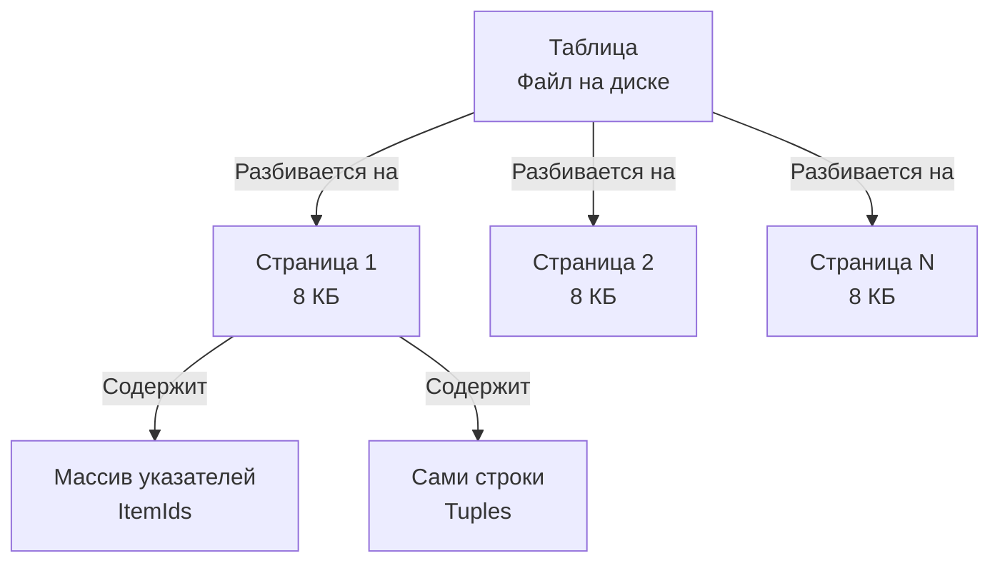

## От математики к железу: физика реляционной БД

В статье [[4. Реляционная модель данных. Основы]] мы рассматривали базу данных как идеальную математическую модель, состоящую из множеств и предикатов. Но СУБД — это суровая инженерная реальность, написанная на C/C++ (или Rust/Go), которая должна эффективно укладывать эти абстракции в оперативную память и на вращающиеся магнитные диски (или ячейки флеш-памяти SSD). 

В этой статье мы перейдем от терминов «отношение», «кортеж» и «атрибут» к их физическим воплощениям: **таблицам**, **строкам**, **столбцам** и **ключам**, и посмотрим, как они устроены под капотом.

---

## Таблица (Table) как структура хранения

На уровне языка SQL таблица — это просто именованный контейнер для строк. На уровне физического диска (на примере PostgreSQL, так как это де-факто стандарт для Go-бэкенда) таблица реализуется в виде структуры, называемой **Heap (Куча)**. 

Слово "Heap" здесь не имеет ничего общего с кучей в памяти Go (где аллоцируются переменные после Escape Analysis) или структурой данных "Двоичная куча" (Binary Heap). 
В контексте СУБД **Heap File** — это неупорядоченный файл данных. База просто дописывает новые строки туда, где есть свободное место на страницах памяти. В таблице *нет никакого встроенного порядка*. Без использования индексов поиск в Heap-файле всегда приводит к полному сканированию (`Seq Scan`), требующему прочитать с диска весь файл целиком.



---

## Строка (Row) под капотом. Анатомия кортежа

Мы привыкли думать, что строка в базе — это просто набор наших данных: `(id=1, name='Bob')`. На самом деле, СУБД хранит огромное количество метаинформации для каждой строки, чтобы обеспечивать конкурентный доступ и транзакционность.

В исходниках PostgreSQL структура, описывающая заголовок строки, называется `HeapTupleHeaderData`. Она занимает минимум 23 байта (а с учетом выравнивания — 24 байта) *до того*, как начнутся ваши реальные данные.

> [!info] Под капотом
> Что находится в этих 24 байтах заголовка (`HeapTupleHeader`)?
> * `t_xmin` (4 байта): ID транзакции, которая создала (INSERT) эту строку.
> * `t_xmax` (4 байта): ID транзакции, которая удалила (DELETE) или обновила (UPDATE) эту строку. Это основа механизма многоверсионности, который мы детально разберем в [[7. MVCC. Multi Version Concurrency Control]].
> * `t_ctid` (6 байт): Физический указатель на текущую версию строки (номер страницы + индекс на странице).
> * `t_infomask` (2 байта): Флаги состояния строки (например, есть ли в ней NULL-значения, заблокирована ли она).
> * **NULL Bitmap**: Если в строке есть хотя бы один `NULL`, добавляется битовая маска. Вместо хранения "пустоты" для каждого поля, СУБД просто ставит бит `1` в заголовке, что экономит место на диске.

### Mechanical Sympathy: Data Alignment (Выравнивание данных)

Здесь мы встречаем концепцию, которая одинаково работает и в рантайме Go, и в движке СУБД. Речь о **выравнивании памяти (Memory Alignment/Padding)**.

Процессору очень дорого читать данные (например, 8-байтный `int64`), если они начинаются с нечетного адреса в памяти. Поэтому компиляторы (в Go) и Storage Engines (в СУБД) добавляют пустые "мусорные" байты — *padding*, чтобы сдвинуть данные на кратные адреса (обычно кратные 4 или 8 байтам).

Сравним структуры в Go и DDL (Data Definition Language) в PostgreSQL:

```go
// ПЛОХАЯ СТРУКТУРА: Весит 24 байта из-за padding
type BadUser struct {
	IsActive bool   // 1 байт
	// 7 байт мусора (padding)
	ID       int64  // 8 байт
	RoleID   int8   // 1 байт
	// 7 байт мусора (padding)
}

// ХОРОШАЯ СТРУКТУРА: Весит 16 байт
type GoodUser struct {
	ID       int64  // 8 байт
	IsActive bool   // 1 байт
	RoleID   int8   // 1 байт
	// 6 байт мусора в конце для выравнивания всей структуры
}
```

**Абсолютно то же самое происходит в базе данных!**
Если вы создаете таблицу в плохом порядке: `(is_active BOOLEAN, id BIGINT, role_id SMALLINT)`, PostgreSQL добавит пустые байты между колонками. 

На миллионах строк этот невидимый *padding* может раздуть размер вашей таблицы на диске на 20-30%. Больше размер файла -> больше страниц читается с диска -> меньше страниц помещается в Buffer Pool (RAM) -> больше Cache Miss-ов -> **система тормозит**. 

> [!tip] Собеседование
> **Вопрос:** Как оптимизировать размер таблицы в PostgreSQL без удаления данных?
> **Ответ:** Расположить столбцы в DDL так же, как в структурах Go: от самых «тяжелых» фиксированных типов (8-байтные BIGINT, TIMESTAMP) к более легким (INT, SMALLINT, BOOLEAN), а поля переменной длины (VARCHAR, TEXT, JSONB) поместить в самый конец таблицы.

---

## Столбцы (Columns) и техника TOAST

Столбец в реляционной БД имеет строгий тип (домен). 
Но что происходит, когда вы сохраняете в колонку типа `JSONB` или `TEXT` гигантский payload от стороннего API размером в 1 Мегабайт? Мы помним, что размер страницы в Postgres — 8 КБ, и строка *обязана* поместиться в нее.

Для решения этой проблемы СУБД используют технику **TOAST (The Oversized-Attribute Storage Technique)**.

1. Если строка не влезает в страницу (~2 КБ предел после которого включается механизм), Postgres автоматически архивирует большую колонку (обычно алгоритмом pglz или lz4).
2. Если даже после сжатия данные огромные, Postgres вырезает эту колонку из основной таблицы, сохраняет её в отдельную скрытую TOAST-таблицу, а в основной строке оставляет только крошечный указатель (Pointer).

> [!warning] Ловушка / Gotcha
> Именно из-за TOAST использование `SELECT *` в Production-коде считается смертным грехом. Если вы пишете `SELECT * FROM users`, а колонка `metadata JSONB` лежит в TOAST, база данных совершит **дополнительные случайные чтения с диска (Random I/O)**, чтобы поднять этот JSONB, декомпрессировать его и отдать в Go-приложение. И всё это ради того, чтобы вы в Go-коде эту метадату даже не использовали! Запрашивайте только те колонки, которые маппите в `struct`.

---

## Ключи (Keys). Фундамент идентификации

Поскольку Heap — это неупорядоченная куча кортежей, нам нужен механизм для 100% точной идентификации конкретной строки. Эту задачу решают **Ключи**.

В реляционной теории есть строгая иерархия ключей:
1.  **Суперключ (Superkey):** Любой набор столбцов, который уникально идентифицирует строку. Например, `(ID, Email, Возраст)`. Это избыточно, но уникально.
2.  **Потенциальный ключ (Candidate Key):** Суперключ, из которого нельзя выкинуть ни один столбец без потери уникальности. Например, только `ID` или только `Email`.
3.  **Первичный ключ (Primary Key / PK):** Один из *потенциальных ключей*, который архитектор (вы) выбрал как главный для идентификации строк в этой таблице.

### Суррогатные vs Естественные ключи

Частый холивар при проектировании схемы БД: что использовать в качестве PK?

* **Естественный ключ (Natural Key):** Это бизнес-атрибут. Например, номер паспорта, СНИЛС или ИНН компании.
    * *Проблема:* Бизнес-требования меняются. У человека может смениться номер паспорта, или формат ИНН в другой стране окажется иным. Изменение естественного ключа повлечет каскадное обновление всех связанных таблиц, что почти невозможно сделать "на горячую" под Highload.
* **Суррогатный ключ (Surrogate Key):** Искусственно созданное значение, не имеющее никакого бизнес-смысла. Обычно это `BIGINT` (Sequence/Identity) или `UUID`.
    * *Именно это абсолютный стандарт индустрии.* Ключ существует только для того, чтобы база и приложение могли однозначно ссылаться на строку.

> [!tip] Собеседование
> **Вопрос:** Если мы используем суррогатные ключи, стоит ли выбирать UUID вместо обычного BIGINT (Sequence)?
> **Ответ:** Зависит от архитектуры. UUID (v4) идеален для распределенных систем и микросервисов: Go-клиент может сгенерировать ID без похода в БД (нет узкого места в виде Sequence генератора). Однако стандартный **UUID v4 (рандомный)** — это катастрофа для производительности дисковой подсистемы БД. Поскольку ключи не упорядочены, вставка (INSERT) будет вызывать постоянную фрагментацию и перестроение B-Tree индекса. 
> *Решение:* Использовать **UUID v7**, который начинается с timestamp-а и растет монотонно, комбинируя плюсы генерации на клиенте и дружелюбность к B-Tree индексам БД. Подробнее о том, как индексы ломаются от рандома, мы поговорим в [[2. B Tree индекс под капотом]].

## Итог

1.  **Таблица** — это абстракция; физически это чаще всего Heap-файл (куча), разбитый на страницы ОС (8 КБ).
2.  **Строка** содержит тяжелый служебный заголовок (MVCC) и требует правильного выравнивания типов данных при создании таблицы (Data Alignment) для экономии диска и RAM.
3.  **Столбцы** большого размера "вырезаются" из строки с помощью TOAST, что делает `SELECT *` крайне опасным для I/O.
4.  **Ключи** обеспечивают уникальность строки. В 99% случаев мы используем монотонно возрастающие суррогатные ключи (BIGINT или UUID v7).

Мы разобрали внутреннее устройство таблицы, но как разные таблицы взаимодействуют друг с другом? В следующей статье мы подробно изучим механизмы связи и целостности: переходим к [[6. Первичные и внешние ключи]].