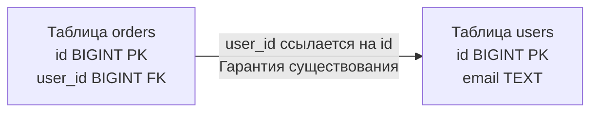

## Связывая изолированные острова данных

В предыдущей статье мы разобрали анатомию отдельной таблицы и выяснили, что физически это просто «куча» (Heap) байтов на диске. Но сила реляционных баз данных заключается не в изолированном хранении, а в возможности безопасно и эффективно связывать эти данные между собой. 

Связи строятся на двух фундаментальных концепциях: **Первичный ключ (Primary Key, PK)** и **Внешний ключ (Foreign Key, FK)**. Для бэкенд-разработчика понимание их работы под капотом — это граница между написанием медленного CRUD-приложения и проектированием Highload-системы, способной к шардированию.

---

## Первичный ключ (Primary Key): Якорь таблицы

**Первичный ключ** — это столбец (или набор столбцов), который уникально идентифицирует каждую строку в таблице. Математически это гарантирует, что в множестве нет двух абсолютно одинаковых кортежей.

Но что такое Primary Key физически, на уровне движка базы данных?

> [!info] Под капотом: PK и индексы
> Когда вы объявляете колонку как `PRIMARY KEY`, СУБД делает две вещи неявно:
> 1. Навешивает на колонку ограничения `NOT NULL` и `UNIQUE`.
> 2. **Создает B-Tree индекс** по этой колонке. 
> 
> В PostgreSQL таблица (Heap) и индекс PK хранятся в разных файлах. Индекс содержит отсортированные ключи и указатели (ctid) на физическое расположение строк в Heap-файле.
> 
> А вот в MySQL (с движком InnoDB) архитектура иная: там используется **Кластерный индекс (Clustered Index)**. В InnoDB сама таблица — это и есть B-Tree дерево, отсортированное по Primary Key. Листья этого дерева содержат не указатели, а *сами данные строки*. Это называется Index-Organized Table (IOT). Мы разберем эту разницу детально в статьях [[2. B Tree индекс под капотом]] и [[2. InnoDB storage engine]].

### Mechanical Sympathy: Почему тип PK критически важен?

Поскольку PK — это фундамент B-Tree индекса, выбор типа данных определяет, насколько часто базе придется "перестраивать" дерево на диске при вставках (`INSERT`).

1. **`BIGINT` (Sequence / Identity):** Идеально для БД. Значения монотонно возрастают (1, 2, 3...). Новые строки всегда дописываются в конец B-Tree индекса (в самую правую страницу), что дает 100% последовательный I/O (Sequential Write).
2. **`UUID v4` (Случайный):** Катастрофа для записи. Новые ключи генерируются хаотично. При вставке СУБД должна найти случайную страницу индекса, прочитать её в RAM, вставить туда ключ и записать обратно. Это вызывает *фрагментацию страниц (Page Split)* и убивает производительность диска (Random I/O). 
3. **`UUID v7` (Time-sorted):** Компромисс. Начинается с timestamp, поэтому растет монотонно, сохраняя плюсы `BIGINT` для диска, но позволяя генерировать ключи на стороне Go-клиента без похода в БД.

---

## Внешний ключ (Foreign Key): Мост и Контролер

**Внешний ключ (Foreign Key)** — это столбец в одной таблице, который ссылается на Primary Key другой таблицы. 

Главная задача FK — обеспечение **Ссылочной целостности (Referential Integrity)**. База данных математически гарантирует, что вы не сможете создать "Заказ" для пользователя, которого не существует, и не сможете удалить пользователя, если у него есть заказы.



> [!warning] Ловушка / Gotcha: Цена ссылочной целостности
> Многие разработчики воспринимают FK просто как метаданные для красивых связей в ORM. Но на физическом уровне **Foreign Key — это скрытый триггер**.
> 
> Когда ваш Go-код делает `INSERT INTO orders (user_id) VALUES (42)`, СУБД *обязана* сделать паузу, открыть таблицу `users`, выполнить `SELECT id FROM users WHERE id = 42` и только убедившись, что строка существует, разрешить вставку.
> Если страница с пользователем 42 сейчас не в оперативной памяти (Buffer Pool), этот простой `INSERT` внезапно потребует чтения с диска! На высоконагруженных системах (сотни тысяч RPS) эти скрытые проверки (и блокировки) становятся бутылочным горлышком.

### Архитектура Highload: Жизнь без Foreign Keys

Если вы посмотрите на схемы баз данных в Uber, GitHub, Pinterest или X (Twitter), вы с удивлением обнаружите, что там **нет Foreign Keys**. Вообще.

Почему Senior-инженеры их удаляют?
1. **Шардирование (Sharding):** Если таблица `users` лежит на сервере в Германии, а таблица `orders` — на сервере во Франции (см. [[4. Sharding]]), база данных физически не может проверить Foreign Key. СУБД не умеет делать кросс-серверные FK "из коробки".
2. **Блокировки (Locks):** При обновлении PK или удалении строки СУБД блокирует связанные записи в дочерних таблицах, чтобы избежать гонки данных, что может привести к дедлокам (Deadlocks).

В таких архитектурах ответственность за ссылочную целостность переносится на уровень бизнес-логики (в Go-код) или асинхронные воркеры, которые периодически очищают "осиротевшие" записи (Orphaned records).

---

## Работа с ключами в Go: Идиоматика и Обработка ошибок

Когда мы работаем с реляционными базами в Go (например, используя пакет `database/sql` и драйвер `pgx` для Postgres), мы обязаны правильно обрабатывать два аспекта: отсутствие связи (NULL FK) и нарушения целостности.

### 1. Опциональные связи и NULL
Внешний ключ может быть `NULL`, если бизнес-логика позволяет существовать сущности без родителя (например, задача без назначенного исполнителя). Реляционная модель обязывает нас использовать указатели или специальные типы-обертки в структурах Go.

```go
import (
    "database/sql"
)

type Task struct {
    ID         int64
    Title      string
    // Если assigned_user_id в БД может быть NULL, 
    // обычный int64 использовать нельзя (значение 0 может означать реальный ID).
    // Мы используем sql.NullInt64 или указатель *int64.
    AssigneeID sql.NullInt64 
}
```

### 2. Обработка Foreign Key Violation
Если вы попытаетесь вставить заказ для несуществующего пользователя, база отклонит транзакцию и вернет ошибку. Идиоматичный Go-код никогда не парсит строку ошибки через `strings.Contains()`. Мы используем type assertion для драйверо-специфичных ошибок.

```go
package main

import (
    "context"
    "errors"
    "fmt"
    "[github.com/jackc/pgx/v5/pgconn](https://github.com/jackc/pgx/v5/pgconn)"
    "database/sql"
)

const pgErrForeignKeyViolation = "23503" // Стандартный SQLSTATE код

func createOrder(ctx context.Context, db *sql.DB, userID int64, total int) error {
    query := `INSERT INTO orders (user_id, total) VALUES ($1, $2)`
    _, err := db.ExecContext(ctx, query, userID, total)
    if err != nil {
        // Проверяем, является ли ошибка ошибкой PostgreSQL
        var pgErr *pgconn.PgError
        if errors.As(err, &pgErr) {
            // Сравниваем SQLSTATE код ошибки
            if pgErr.Code == pgErrForeignKeyViolation {
                return fmt.Errorf("пользователь с ID %d не существует: нарушение внешнего ключа", userID)
            }
        }
        return fmt.Errorf("внутренняя ошибка БД: %w", err)
    }
    return nil
}
```

---

## Каскадные операции: Оружие массового поражения

При создании FK можно указать поведение при удалении родительской строки: `ON DELETE CASCADE`. Это значит, что если вы удалите пользователя, СУБД автоматически, под капотом, удалит все его заказы, его комментарии, его сессии и т.д.

> [!tip] Собеседование
> **Вопрос:** Почему DBA и архитекторы ненавидят `ON DELETE CASCADE` на больших проектах?
> **Ответ:** Это неконтролируемая транзакция. Удаление одного "жирного" пользователя может каскадно затронуть миллионы строк в десятках таблиц. 
> 1. Это вызовет гигантскую транзакцию, которая эксклюзивно заблокирует множество страниц памяти.
> 2. Журнал транзакций (WAL) раздуется на гигабайты за секунды (см. [[8. WAL. Write Ahead Log]]), что может положить репликацию (реплики не успеют применить такой объем изменений).
> 
> *Решение:* Использовать `Soft Delete` (флаг `is_deleted = true`) или удалять связанные данные "батчами" (порциями) асинхронно через фоновые горутины (Go Workers).

## Итог

1. **Primary Key (PK)** — это идентификатор строки, который физически поддерживается B-Tree индексом (в PostgreSQL) или сам является B-Tree деревом (в MySQL). Всегда предпочитайте монотонно возрастающие ключи (Sequence/UUID v7) для предотвращения деградации диска.
2. **Foreign Key (FK)** — это констрейнт (ограничение), гарантирующий ссылочную целостность. Физически это скрытый триггер, который делает `SELECT` при каждой вставке.
3. В архитектурах с ультра-высокой нагрузкой (Highload) и микросервисах от FK часто отказываются в пользу управления целостностью на уровне приложения (в Go), чтобы избежать распределенных блокировок.

Первичные и внешние ключи — это лишь два самых известных механизма защиты данных. На самом деле база данных предлагает целый арсенал средств для поддержания порядка в байтах. В следующей статье мы расширим эту тему и разберем все остальные виды защит: переходим к [[7. Ограничения целостности данных]].