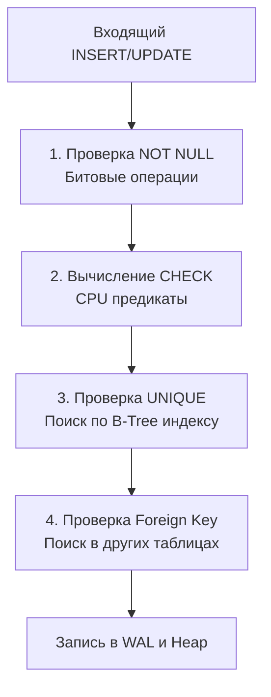

## Последний рубеж обороны данных

Частая ошибка, которую совершают разработчики при переходе на написание микросервисов — это вера в то, что код приложения полностью контролирует данные. Разработчик пишет красивую бизнес-логику в Go, валидирует структуры, использует паттерны Domain-Driven Design (DDD) и считает, что в базу гарантированно попадут только правильные байты.

Это иллюзия. В Highload-системе ваш код работает конкурентно. Десятки подов в Kubernetes могут одновременно пытаться изменить одни и те же данные. Если база данных не будет иметь собственных жестких правил, защищающих её от «мусора», вы неизбежно получите состояние гонки (Race Condition) и повреждение данных (Data Corruption).

**Ограничения целостности (Constraints)** — это железобетонные правила на уровне движка СУБД, которые проверяются *до* того, как транзакция будет зафиксирована на диске. Это финальный и самый надежный рубеж обороны вашей системы.

Мы уже разобрали два важнейших ограничения: Primary Key и Foreign Key в статье [[6. Первичные и внешние ключи]]. В этой статье мы сфокусируемся на трех оставшихся: **NOT NULL**, **UNIQUE** и **CHECK**, а также разберем, как они работают под капотом и как правильно их обрабатывать в Go.

---

## 1. NOT NULL: Отсутствие пустоты

Ограничение `NOT NULL` запрещает записывать в колонку неизвестное значение (NULL). С точки зрения реляционной модели, это ограничение домена (Domain Integrity). 

> [!info] Под капотом: Битовая маска
> Мы уже упоминали заголовок кортежа (`HeapTupleHeader`) в статье [[5. Таблицы, строки, столбцы и ключи]].
> Ограничение `NOT NULL` проверяется максимально быстро. Когда вы пытаетесь вставить `NULL`, СУБД даже не доходит до выделения памяти под ваши данные. Она проверяет битовую маску NULL-значений в заголовке будущего кортежа. Если колонка помечена как `NOT NULL` в системном каталоге БД, парсер запросов мгновенно отбрасывает транзакцию. Это операция, требующая всего несколько тактов процессора, без дорогостоящих I/O операций.

---

## 2. UNIQUE: Больше, чем просто правило

Ограничение `UNIQUE` гарантирует, что в колонке (или наборе колонок) не может быть двух одинаковых значений. Идеально для хранения email-адресов, номеров телефонов или идемпотентных ключей (Idempotency Keys).

Многие бэкендеры воспринимают `UNIQUE` как простую проверку, но на уровне физики базы данных это весьма "тяжелая" операция.

> [!warning] Ловушка / Gotcha: Скрытая цена UNIQUE
> Чтобы гарантировать уникальность за время $O(\log N)$, **база данных обязана создать B-Tree индекс под капотом**.
> Вы не можете иметь `UNIQUE` констрейнт без индекса. Когда вы пишете `ALTER TABLE users ADD UNIQUE (email)`, СУБД создает отдельный физический файл с отсортированным деревом email-ов. 
> 
> *Что это значит для инженера?* Каждая вставка (`INSERT`) или обновление (`UPDATE`) этого поля теперь требует не только записи в саму таблицу (Heap), но и обновления дерева индекса (Index Maintenance). Если вы делаете `UNIQUE` по длинным строкам (например, URL-адресам в 500 символов), размер индекса быстро превысит размер самой таблицы, а вставки станут медленными.

---

## 3. CHECK: Пользовательские предикаты на уровне CPU

Ограничение `CHECK` позволяет задать любое булево выражение, которое должно быть истинным для строки. 

* `CHECK (balance >= 0)` — защита от отрицательного баланса.
* `CHECK (role IN ('admin', 'user', 'guest'))` — защита домена без создания отдельной таблицы справочника.
* `CHECK (start_date < end_date)` — валидация зависимых полей.

Ограничения `CHECK` работают исключительно в оперативной памяти (в User Space процесса СУБД) и используют CPU для вычисления предиката перед записью в буфер (Buffer Pool). Они невероятно дешевы с точки зрения I/O, поэтому **всегда переносите бизнес-инварианты (например, баланс >= 0) из Go-кода в CHECK базы данных**.



---

## Архитектура: Иллюзия App-level валидации и Race Conditions

Пожалуй, самый важный урок для Senior Go-инженера в этой теме — это понимание проблемы **TOCTOU (Time-of-Check to Time-of-Use)** при конкурентной работе с БД.

Рассмотрим классическую ошибку регистрации пользователя. 
Разработчик пишет код: "Сначала проверю, есть ли такой email. Если нет — создам".

```go
// АНТИПАТТЕРН: Уязвимо к Race Condition
func registerUserBad(ctx context.Context, db *sql.DB, email string) error {
	var exists bool
	// 1. TIME OF CHECK (Время проверки)
	err := db.QueryRowContext(ctx, "SELECT exists(SELECT 1 FROM users WHERE email = $1)", email).Scan(&exists)
	if err != nil { return err }
	
	if exists {
		return errors.New("email уже занят")
	}

	// [!] СЮДА ВСТРАИВАЕТСЯ ГОНКА [!]
	// Если две горутины (или два разных сервиса) проверят email одновременно, 
	// обе получат exists = false и пойдут выполнять INSERT.

	// 2. TIME OF USE (Время использования)
	_, err = db.ExecContext(ctx, "INSERT INTO users (email) VALUES ($1)", email)
	return err
}
```

Если у вас нет `UNIQUE` ограничения на уровне базы данных, две одновременные транзакции создадут двух пользователей с одинаковым email. Ваша система аутентификации будет скомпрометирована. 

### Idiomatic Go: Delegation to Database (Делегирование базе)

Правильный, "пуленепробиваемый" подход (Mechanical Sympathy) заключается в том, чтобы **удалить предварительную проверку (SELECT) вообще**. Мы перекладываем работу на базу данных, делаем слепой `INSERT` и обрабатываем ошибку констрейнта от БД. 

Это экономит один сетевой поход к БД (Round Trip) и гарантированно защищает от Race Conditions.

```go
// ИДИОМАТИЧНЫЙ ПОДХОД: Пусть база данных защищает сама себя
package main

import (
	"context"
	"database/sql"
	"errors"
	"fmt"
	
	"[github.com/jackc/pgx/v5/pgconn](https://github.com/jackc/pgx/v5/pgconn)"
)

const pgErrUniqueViolation = "23505" // SQLSTATE для Postgres

var ErrEmailTaken = errors.New("email уже занят")

func registerUserGood(ctx context.Context, db *sql.DB, email string) error {
	// Сразу делаем INSERT. Ограничение UNIQUE в БД не пропустит дубликат.
	query := `INSERT INTO users (email) VALUES ($1) RETURNING id`
	
	var newID int64
	err := db.QueryRowContext(ctx, query, email).Scan(&newID)
	if err != nil {
		// Проверяем, является ли ошибка нарушением уникальности
		var pgErr *pgconn.PgError
		if errors.As(err, &pgErr) {
			if pgErr.Code == pgErrUniqueViolation {
				// В pgErr.ConstraintName также лежит имя нарушенного индекса,
				// если нужно отличить уникальность email от уникальности телефона.
				return ErrEmailTaken 
			}
		}
		// Логируем или возвращаем другие ошибки (таймауты, сбои сети)
		return fmt.Errorf("ошибка вставки в БД: %w", err)
	}

	return nil
}
```

> [!tip] Собеседование
> **Вопрос:** Зачем нужна валидация в коде (например, регулярка для email в Go), если база данных всё равно всё проверит через констрейнты?
> **Ответ:** Это концепция эшелонированной защиты (Defense in Depth). 
> 1. Валидация в Go экономит ресурсы БД. Если юзер прислал откровенный мусор (пустую строку вместо email), мы отбиваем запрос на уровне микросервиса, не расходуя TCP-пул БД, CPU парсера базы и сеть.
> 2. Валидация в БД (Constraints) гарантирует строгую целостность на случай багов в приложении, Race Conditions или ручных вмешательств аналитиков (через SQL-консоль). База — это финальная точка истины (Single Source of Truth).

## Итог

1.  **Констрейнты** — это железобетонные инварианты, которые СУБД гарантирует атомарно (с защитой от конкурентного доступа).
2.  `NOT NULL` и `CHECK` дешевы и быстры (работают в CPU). Выносите в `CHECK` бизнес-логику вроде недопустимости отрицательных балансов.
3.  `UNIQUE` дорогой, так как неявно создает B-Tree индекс, который необходимо поддерживать при каждой вставке/удалении.
4.  В Go никогда не пытайтесь защититься от гонки данных через схему `SELECT-then-INSERT` на уровне приложения. Делегируйте эту задачу констрейнтам СУБД и перехватывайте ошибки драйвера (например, `23505` в PostgreSQL).

Мы рассмотрели фундаментальные строительные блоки данных. Но в мире реляционных баз есть одно понятие, которое ломает классическую булеву алгебру и заставляет разработчиков часами сидеть над отладкой неочевидных SQL-запросов. В следующей статье мы переходим к самому коварному элементу реляционной модели: [[8. NULL и трехзначная логика]].