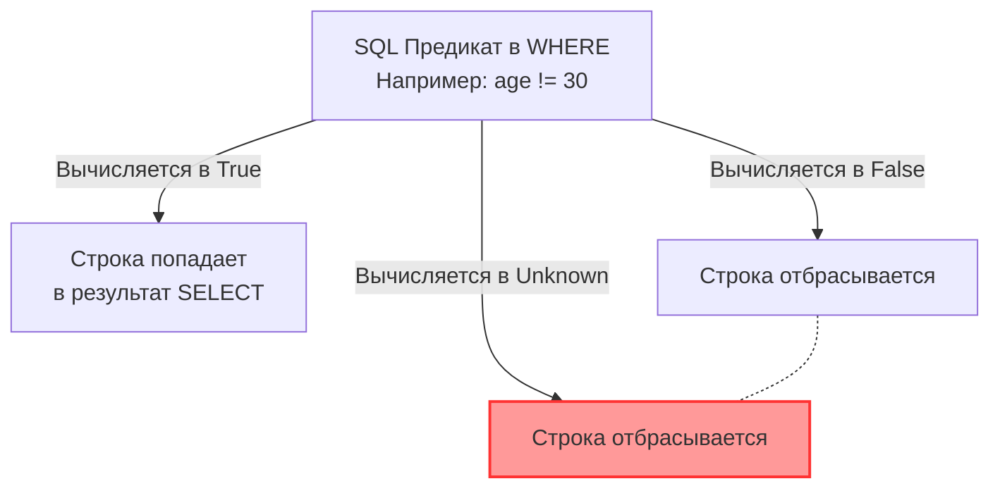

## Призрак реляционной модели

Для разработчика, который мыслит категориями языка Go, логика предельно ясна: переменная либо `true`, либо `false`. Указатель либо ссылается на адрес в памяти, либо он `nil`. Целое число не может быть "ничем", по умолчанию это `0` (Zero Value).

Но когда мы переходим в мир SQL, мы сталкиваемся с фундаментальным сдвигом парадигмы. Реляционная алгебра была спроектирована Эдгаром Коддом так, чтобы отражать реальный мир, а в реальном мире информация часто *отсутствует* или *неизвестна*. 

**`NULL` — это не ноль, не пустая строка и не `false`. Это специальный маркер, означающий «значение неизвестно» или «значение неприменимо».**

Именно введение этого маркера ломает классическую булеву логику и порождает так называемую **Трехзначную логику (Three-Valued Logic, 3VL)**. Непонимание 3VL — причина огромного количества неочевидных багов в сложных аналитических и бизнес-запросах.

---

## Трехзначная логика (3VL)

В SQL результатом любого логического выражения может быть одно из трех состояний:
1.  **True** (Истина)
2.  **False** (Ложь)
3.  **Unknown** (Неизвестно — результат применения `NULL`)

> [!warning] Ловушка / Gotcha: Сравнение с NULL
> Вы никогда не можете сказать `WHERE age = NULL`. 
> Поскольку `NULL` — это неизвестность, равно ли одно неизвестное другому неизвестному? Мы не знаем.
> Поэтому `NULL = NULL` вычисляется как **Unknown**. `NULL != 10` также вычисляется как **Unknown**.
> Для работы с `NULL` существуют специальные операторы: `IS NULL` и `IS NOT NULL`.

Как ведут себя логические операторы `AND` и `OR` при встрече с `Unknown`?

* `True OR Unknown` = **True** (Так как для `OR` достаточно хотя бы одной Истины).
* `False AND Unknown` = **False** (Так как для `AND` Ложь убивает всё остальное).
* `True AND Unknown` = **Unknown** (Мы не знаем второе значение, поэтому не можем гарантировать Истину).



> [!tip] Собеседование
> **Вопрос:** В таблице `users` 100 строк. У 30 из них `age = 20`, у 50 строк `age = 30`, и у 20 строк `age IS NULL`.
> Сколько строк вернет запрос: `SELECT * FROM users WHERE age != 30;`?
> **Ответ:** 30 строк. Строки с `NULL` будут вычислены как `Unknown`, а секция `WHERE` пропускает **только** строки, которые строго вычислились в `True`. `Unknown` отбрасывается. Это классическая ошибка, из-за которой теряются данные в отчетах.

### Смертельная ловушка: NOT IN и NULL

Это самый частый вопрос на собеседованиях уровня Middle+/Senior.

```sql
-- Хотим найти юзеров, чьего role_id нет в черном списке
SELECT * FROM users WHERE role_id NOT IN (1, 2, NULL);
```
Этот запрос **всегда вернет 0 строк (пустое множество)**, независимо от данных в таблице. Почему?

Оператор `NOT IN` разворачивается базой данных в серию проверок через `AND`:
`role_id != 1 AND role_id != 2 AND role_id != NULL`.

Если `role_id` равен 5, выражение выглядит так:
`True AND True AND Unknown` -> `Unknown`.
А так как `WHERE` отбрасывает `Unknown`, строка выпадает из выборки. Никогда не допускайте попадания `NULL` в список `NOT IN`. Используйте `NOT EXISTS` (разберем в [[10. EXISTS и IN]]).

---

## NULL в агрегатных функциях

Математика тоже страдает от контакта с неизвестностью:
* `10 + NULL` = `NULL`
* `CONCAT('Hello ', NULL)` = `NULL` (в некоторых СУБД, хотя Postgres делает исключения для строк).

Но агрегатные функции ведут себя иначе. Они **игнорируют** `NULL`.

* `COUNT(*)` — считает физические строки в таблице (кортежи).
* `COUNT(age)` — считает только те строки, где `age IS NOT NULL`.
* `SUM(balance)` — сложит балансы, игнорируя строки с `NULL` балансом.

Если вы хотите, чтобы `NULL` воспринимался как ноль в математике, вы обязаны явно привести его к значению с помощью функции `COALESCE`:
`SELECT SUM(COALESCE(balance, 0)) FROM accounts;`

---

## Mechanical Sympathy: Как NULL хранится на диске?

Кажется, что `NULL` (пустота) не должен занимать место на диске. Но база должна знать, что в этой колонке лежит `NULL`. Как это реализуется физически?

> [!info] Под капотом: NULL Bitmap
> В статье [[5. Таблицы, строки, столбцы и ключи]] мы упоминали заголовок кортежа (`HeapTupleHeader`).
> Если хотя бы одна колонка в строке содержит `NULL`, в 16-битном поле `t_infomask` заголовка выставляется специальный флаг `HEAP_HASNULL`. 
> 
> За заголовком сразу же размещается **NULL Bitmap** — битовая маска, где на каждую колонку таблицы выделяется ровно 1 бит (1 = не NULL, 0 = NULL, или наоборот, зависит от реализации). 
> Таким образом, если вы пишете `NULL` в колонку типа `BIGINT` (которая занимает 8 байт), то на диске эти 8 байт **вообще не аллоцируются** в полезной нагрузке кортежа (payload). Значение `NULL` хранится как один жалкий бит в заголовке! Это делает `NULL` невероятно эффективным для хранения разреженных данных (Sparse Data).

### Индексы и NULL

Стоит ли создавать индекс по колонке, в которой много `NULL` значений?
В PostgreSQL B-Tree индексы **включают** `NULL` значения. Это значит, что если у вас в таблице 10 миллионов строк, и из них 9 миллионов имеют `deleted_at IS NULL`, ваш индекс будет огромным и почти бесполезным.

В таких случаях Senior-инженеры используют **Частичные индексы (Partial Indexes)**:
`CREATE INDEX idx_active_users ON users (id) WHERE deleted_at IS NULL;`
Такой индекс займет сущие килобайты, так как в него попадут только "живые" записи, и он будет молниеносно работать для запросов активных пользователей. Мы подробнее поговорим об этом в [[7. Partial индекс]].

---

## Работа с NULL в Go (Idiomatic Go)

Так как в Go нет концепции 3VL, пакет `database/sql` предлагает нам два пути решения Impedance Mismatch (несоответствия моделей) при маппинге SQL `NULL` в структуры Go.

### Путь 1: sql.Null* типы (Значимая семантика)

Пакет `database/sql` содержит типы `sql.NullString`, `sql.NullInt64`, `sql.NullBool` и т.д.
Это структуры из двух полей: само значение и булев флаг `Valid` (который и эмулирует ту самую битовую маску из БД).

```go
type User struct {
    ID    int64
    Name  string
    Phone sql.NullString // Может быть NULL в базе
}

func GetUserPhone(db *sql.DB, id int64) {
    var u User
    err := db.QueryRow("SELECT id, name, phone FROM users WHERE id = $1", id).Scan(&u.ID, &u.Name, &u.Phone)
    
    if u.Phone.Valid {
        fmt.Printf("Телефон: %s\n", u.Phone.String)
    } else {
        fmt.Println("Телефон не указан")
    }
}
```

**Плюсы:** `sql.NullString` — это Value Type (тип-значение). Он располагается на стеке горутины, не вызывает аллокаций в куче (Heap) и не нагружает Garbage Collector. Это паттерн для Highload.

### Путь 2: Указатели (Ссылочная семантика)

Вы можете использовать обычные указатели Go, так как драйвер умеет понимать, что `nil` указатель — это SQL `NULL`.

```go
type User struct {
    ID    int64
    Name  string
    Phone *string // nil означает NULL в базе
}
```

**Минусы (Mechanical Sympathy):** Создание указателя `*string` почти всегда приводит к Escape Analysis и перемещению переменной в Heap. Для миллиона прочитанных строк вы получите миллион аллокаций мелких объектов, что заставит Garbage Collector "пыхтеть", сканируя память. 

> [!tip] Собеседование
> **Резюме для архитектора:** Если производительность и аллокации критичны — используйте `sql.Null*` или кастомные типы, реализующие интерфейс `sql.Scanner`. Если пишете админку с малой нагрузкой, где удобнее работать с указателями (особенно в JSON-ответах REST API `omitempty`), используйте указатели.

## Итог

1.  **Трехзначная логика:** Любое сравнение с `NULL` дает `Unknown`. Секция `WHERE` пропускает только `True`.
2.  Опасайтесь `NOT IN` с подзапросами, которые могут вернуть `NULL`.
3.  Агрегатные функции (`COUNT`, `SUM`) игнорируют `NULL`, для математики используйте `COALESCE`.
4.  На диске `NULL` почти ничего не весит благодаря NULL Bitmap в заголовке строки.
5.  В Go для Highload-парсинга предпочтительнее `sql.Null*` типы, чтобы избежать давления на Garbage Collector через аллокации указателей.

К этому моменту мы разобрали, из чего состоят реляционные базы данных: модели, таблицы, ключи, констрейнты и логику. Теперь у нас есть весь необходимый инструментарий, чтобы научиться правильно проектировать схемы (Схемотехника БД). В следующей статье мы переходим к главному искусству архитектора БД: [[9. Нормализация. Введение]].