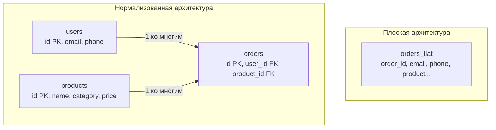

## Искусство разделять и властвовать

До этого момента мы изучали физику баз данных: как страницы памяти ложатся на диск, как работают индексы и что происходит под капотом СУБД. Но чтобы база работала быстро, мало просто поднять мощный сервер. Нужно правильно спроектировать **схему данных (Schema)**.

**Нормализация** — это математически обоснованный процесс декомпозиции (разделения) таблиц с целью устранения избыточности данных и предотвращения логических аномалий.

Проще говоря: это набор правил, которые заставляют нас разбивать одну гигантскую "плоскую" таблицу на несколько маленьких, связанных между собой через [[6. Первичные и внешние ключи]]. Но почему мы вообще должны это делать?

---

## Плоский мир и его проблемы (Аномалии данных)

Представьте, что Junior-разработчик спроектировал таблицу для хранения заказов в интернет-магазине так, как он привык видеть это в Excel-таблицах или JSON-ответах:

| order_id | user_email | user_phone | product_name | category | price |
| :--- | :--- | :--- | :--- | :--- | :--- |
| 1 | bob@go.dev | 555-01 | Gopher Plush | Toys | 20 |
| 2 | bob@go.dev | 555-01 | Go Book | Books | 40 |
| 3 | alice@go.dev | 555-02 | Gopher Plush | Toys | 20 |

На первый взгляд, это удобно. Мы можем сделать `SELECT * FROM orders WHERE user_email = 'bob@go.dev'` и сразу получить всю информацию. Но на практике такая структура — это бомба замедленного действия. Она порождает три фундаментальные проблемы, которые в теории баз данных называются **Аномалиями**.

### 1. Аномалия обновления (Update Anomaly)
Боб решил сменить номер телефона. В нашей таблице у Боба 10 000 заказов за последние 5 лет. Чтобы обновить его телефон, СУБД придется найти и обновить все 10 000 строк.
* **Следствие:** Если во время обновления сервер упадет (или возникнет дедлок), часть строк обновится, а часть — нет. База данных придет в неконсистентное состояние.

### 2. Аномалия удаления (Deletion Anomaly)
Боб отменил свой единственный заказ (id 1), и мы выполняем `DELETE FROM orders WHERE order_id = 1`.
* **Следствие:** Вместе с заказом мы безвозвратно удаляем из базы email и телефон Боба. Пользователь исчезает из системы просто потому, что у него нет активных заказов.

### 3. Аномалия вставки (Insertion Anomaly)
Мы хотим добавить в каталог новый товар — кружку, которую еще никто не купил.
* **Следствие:** Мы не можем вставить строку с товаром, потому что для нее еще нет `order_id` (или нам придется вставлять `NULL` во все поля заказа и пользователя, нарушая логику).

---

## Mechanical Sympathy: Налог на избыточность

Помимо логических аномалий, денормализованные (плоские) данные убивают производительность на уровне железа. 

> [!info] Под капотом
> В нашей плоской таблице строка `bob@go.dev` повторяется 10 000 раз. В кодировке UTF-8 это 10 байт (без учета заголовков кортежа). На 10 000 строк мы тратим 100 КБ дискового пространства просто на хранение одного и того же email-а.
> 
> Кажется, мелочь? А теперь масштабируем это на миллионы пользователей и гигабайты дублирующихся строк (названия городов, описания товаров).
> 1. **Buffer Pool:** Ваша оперативная память (RAM) заполняется мусором. Вместо того чтобы закэшировать 100 000 уникальных заказов, СУБД кэширует бесконечные копии одних и тех же email-ов. Частота Cache Miss-ов возрастает.
> 2. **Write-Ahead Log (WAL):** При обновлении телефона Боба СУБД должна будет записать в [[8. WAL. Write Ahead Log]] изменения для всех 10 000 строк, раздувая журнал транзакций и нагружая сеть при репликации на слейвы.

Нормализация решает эту проблему элегантно: мы выносим `user_email` в отдельную таблицу `users`, а в заказах оставляем только 8-байтный `user_id` (BIGINT). 



---

## Цена нормализации: Операция JOIN

В инженерии не бывает серебряных пуль, только компромиссы. Когда мы нормализуем базу, мы устраняем дублирование и аномалии, ускоряем операции записи (`INSERT`/`UPDATE`) и экономим место на диске.

Но мы платим за это **ценой чтения (Read Penalty)**.

Чтобы отобразить страницу профиля пользователя с его заказами, нам теперь недостаточно прочитать один файл с диска. База данных должна выполнить операцию **JOIN** — математическое соединение множеств в оперативной памяти.

> [!warning] Ловушка / Gotcha
> Оптимизатор СУБД тратит драгоценные такты CPU на построение плана объединения таблиц (Hash Join, Nested Loop или Merge Join). Если вы нормализовали базу до абсурда (создав 20 таблиц для простейшей сущности), ваш `SELECT` будет собирать данные по крупицам со всего диска, вызывая катастрофическое количество случайных чтений (Random I/O).

---

## Архитектура в Go: Маппинг нормализованных данных

В Go мы часто создаем структуру, которая отражает результат JOIN-запроса, а не отдельные нормализованные таблицы. Это позволяет нам за один сетевой запрос к БД получить плоские данные для передачи их на фронтенд.

```go
package main

import (
	"context"
	"database/sql"
)

// OrderDetailsDTO - Data Transfer Object для ответа клиенту
// В Go мы собираем нормализованные данные из базы обратно в плоскую структуру
type OrderDetailsDTO struct {
	OrderID     int64
	UserEmail   string
	ProductName string
	Price       int
}

func getOrderDetails(ctx context.Context, db *sql.DB, orderID int64) (*OrderDetailsDTO, error) {
	// База данных делает тяжелую работу по объединению нормализованных таблиц
	query := `
		SELECT o.id, u.email, p.name, p.price
		FROM orders o
		JOIN users u ON o.user_id = u.id
		JOIN products p ON o.product_id = p.id
		WHERE o.id = $1
	`
	
	var dto OrderDetailsDTO
	err := db.QueryRowContext(ctx, query, orderID).Scan(
		&dto.OrderID, 
		&dto.UserEmail, 
		&dto.ProductName, 
		&dto.Price,
	)
	
	if err != nil {
		return nil, err
	}
	return &dto, nil
}
```

> [!tip] Собеседование
> **Вопрос:** Если JOIN — это дорого, может вообще не нормализовать данные?
> **Ответ:** Нормализация — это дефолтное (базовое) состояние реляционной БД. В 95% случаев мы строим схему до 3-й нормальной формы (3NF). И только когда метрики профилирования показывают, что конкретный JOIN под высокой нагрузкой убивает базу (например, в ленте социальной сети), мы осознанно применяем денормализацию (см. [[14. Денормализация и когда она оправдана]]), кэшируем данные в Redis или используем паттерн CQRS. Оптимизировать нужно то, что болит, а не ломать архитектуру заранее.

## Итог

1. **Нормализация** — это математический алгоритм проектирования схемы для устранения дублирования и аномалий модификации данных (вставка, обновление, удаление).
2. На уровне «железа» нормализация экономит место на диске, уменьшает I/O при записи и позволяет Buffer Pool-у кэшировать больше полезных данных.
3. Трейд-офф нормализации: данные разбросаны по разным таблицам, и для их сборки требуются CPU-интенсивные операции `JOIN`.

Существует шесть классических нормальных форм, каждая из которых накладывает всё более жесткие ограничения на схему. Мы начнем наше погружение в их правила с самого первого и фундаментального шага. Переходим к следующей статье: [[10. Первая нормальная форма 1NF]].