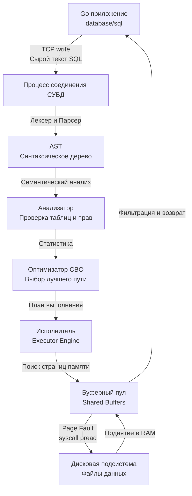

## Декларативная природа SQL: Вы просите, СУБД решает

Как инженеры, мы привыкли мыслить императивно. Когда вы пишете код на Go или C++, вы шаг за шагом инструктируете процессор, *как* именно нужно получить результат: создаете слайс, запускаете цикл, проверяете условие через `if`, фильтруете данные, аллоцируете память.

SQL (Structured Query Language) работает принципиально иначе. Это **декларативный** язык программирования (конкретнее — тьюринг-неполный язык запросов). В SQL вы описываете *что* вы хотите получить, но не *как* СУБД должна это делать.

Вы не пишете: *"Открой файл таблицы `users`, читай блоками по 8 КБ, ищи смещение колонки `age`, и если значение > 18, клади в буфер"*. Вы пишете `SELECT * FROM users WHERE age > 18`. Превращение этого декларативного желания в императивный C/C++ код (большинство СУБД вроде PostgreSQL или MySQL написаны на C/C++) с системными вызовами к ядру ОС — это и есть главная магия реляционных баз данных, которая скрыта от нас под капотом.

## Анатомия выполнения SQL-запроса

Чтобы писать производительный код и понимать, почему база "тормозит", нужно знать жизненный цикл SQL-запроса с момента, когда вы вызвали `db.QueryContext()` в Go, до момента получения байтов по сети.

### 1. Парсинг и семантический анализ (Parsing & Analysis)
Когда текст запроса прилетает по TCP сокету в СУБД, база данных ничего не знает о ваших таблицах. 
Сначала **Парсер** проверяет запрос на синтаксические ошибки (не забыли ли вы запятую) и строит AST (Abstract Syntax Tree). 
Затем **Анализатор (Analyzer / Traffic Cop)** проверяет семантику: существуют ли таблицы `users` и `orders`? Есть ли у пользователя права на чтение? Совпадают ли типы данных при сравнении? На этом этапе СУБД обращается к системным каталогам (системным таблицам, хранящим метаданные схемы).

### 2. Оптимизация (Query Optimization)
Это самый сложный и ресурсоемкий компонент любой СУБД. AST передается в **Оптимизатор запросов (Cost-Based Optimizer - CBO)**.
Поскольку SQL декларативен, один и тот же запрос можно выполнить десятками разных способов. Можно сначала отфильтровать пользователей, а потом приджоинить заказы. А можно наоборот. Можно читать таблицу целиком (Sequential Scan), а можно пойти в индекс (Index Scan).

Оптимизатор генерирует возможные планы выполнения, оценивает их «стоимость» (Cost) на основе собранной статистики (размеры таблиц, распределение данных) и выбирает самый дешевый. Подробнее мы погрузимся в это в статье [[11. Cost based optimizer]]. Именно результат работы оптимизатора мы видим, вызывая [[10. План выполнения запроса. EXPLAIN]].

### 3. Исполнение (Execution)
Выбранный план передается в **Executor Engine**. Исполнитель запрашивает блоки данных (в PostgreSQL они называются *pages*, обычно по 8 КБ) у подсистемы хранения.
СУБД всегда пытается найти страницу в оперативной памяти — в своем **Буферном пуле (Buffer Pool)**. Если страницы там нет, происходит кэш-промах, и СУБД делает системный вызов (например `pread` в Linux), чтобы вычитать эти 8 КБ с диска, положить их в RAM и только потом отдать Исполнителю на фильтрацию.

> [!info] Под капотом: CPU Bound vs IO Bound в СУБД
> Важно понимать, на что тратятся ресурсы. 
> 1. Парсинг и оптимизация — это чисто **CPU Bound** задачи. Они нагружают процессор сервера БД вычислениями.
> 2. Само выполнение запроса (Executor) чаще всего — **IO Bound** или **Memory Bound** задача (поиск в буферном пуле, ожидание ответа от диска).

---

## Mechanical Sympathy: Prepared Statements

Каждый раз, когда вы отправляете сырую строку запроса (например, конкатенируя строки в Go, чего делать категорически нельзя из-за уязвимостей, см. [[21. SQL Injection]]), СУБД вынуждена проходить все этапы: парсинг, анализ, оптимизация, компиляция плана. Это сжигание процессорного времени на пустом месте.

Для решения этой проблемы (а также для абсолютной защиты от SQL-инъекций) используются **Prepared Statements (Подготовленные выражения)**. 

Под капотом это разделение протокола СУБД на две фазы:
1. `PREPARE`: Вы отправляете шаблон запроса с плейсхолдерами `SELECT * FROM users WHERE age > $1;`. СУБД парсит его, проверяет семантику, строит план выполнения **один раз** и кэширует его в памяти соединения, возвращая клиенту идентификатор этого statement'а.
2. `EXECUTE`: Вы отправляете только идентификатор и бинарные значения аргументов (например, байты `int(25)`). СУБД берет готовый план из памяти и сразу переходит к исполнению. Никакого парсинга строк и выбора индексов!

> [!warning] Ловушка / Gotcha: Prepared Statements в Go
> При использовании стандартного `database/sql` в Go (без сторонних оберток), функция `db.Query("SELECT ... WHERE id = $1", id)` **автоматически** создает Prepared Statement под капотом. 
> НО, поскольку Go использует пул соединений ([[2. Connection pool]]), драйверу приходится хитрить: он готовит стейтмент на том соединении, которое сейчас свободно, выполняет запрос, а затем закрывает стейтмент. Если вы делаете много одинаковых `db.Query()`, вы можете спровоцировать лишние network round-trips (создать-выполнить-удалить). 
> В высоконагруженных (Highload) сервисах мы либо явно используем `db.Prepare()` при старте приложения, либо конфигурируем кэш стейтментов на уровне драйвера (например, `pgx` для PostgreSQL умеет кэшировать стейтменты на уровне каждого конкретного TCP-соединения автоматически). Подробности разберем в [[1. Работа с БД в Go. database_sql]].

---

## Подъязыки SQL

SQL принято делить на несколько логических подмножеств. На собеседованиях часто спрашивают, к какой группе относится та или иная команда:

1. **DDL (Data Definition Language)** — работа со структурой базы (схемой). 
   Команды: `CREATE`, `ALTER`, `DROP`, `TRUNCATE`. Изменения метаданных.
2. **DML (Data Manipulation Language)** — работа с самими данными. 
   Команды: `INSERT`, `UPDATE`, `DELETE`.
3. **DQL (Data Query Language)** — извлечение данных. 
   Команда: `SELECT`. Часто `SELECT` относят к DML, но технически это отдельная группа (так как она не мутирует данные).
4. **DCL (Data Control Language)** — управление доступом и правами. 
   Команды: `GRANT`, `REVOKE`.
5. **TCL (Transaction Control Language)** — управление транзакциями. 
   Команды: `BEGIN`, `COMMIT`, `ROLLBACK`.

---

## Цена запроса `SELECT *`

В классических ООП языках разработчики часто используют ORM (Object-Relational Mapping), которые по умолчанию генерируют запросы вида `SELECT * FROM users WHERE id = 1`. Механически это очень дорогой антипаттерн для бэкенда:

1. **Дисковый I/O**: Базе данных приходится читать все колонки из Heap-файла (даже если у вас есть индекс по ID). Вы ломаете концепцию [[6. Covering индекс]], заставляя базу всегда ходить в основную память таблиц.
2. **Network I/O**: База сериализует в TCP сокет все колонки (включая тяжелые TEXT или JSONB), забивая канал связи.
3. **RAM и GC в Go**: Рантайм Go вынужден аллоцировать память под все эти ненужные данные в куче (Heap), распаковывать их, что в итоге увеличит работу Garbage Collector'а.

> [!tip] Собеседование
> **Вопрос:** В чем фундаментальная разница между SQL и языками программирования общего назначения? Почему мы не пишем бизнес-логику в БД?
> **Ответ:** SQL — декларативен, он оптимизирован для реляционной алгебры и работы с множествами. ЯП (Go, Java) — императивны. Хотя в БД можно писать логику на процедурных расширениях (PL/pgSQL), это плохой архитектурный тон. База данных — самый узкий ресурс (bottleneck) в любой распределенной системе, так как она хранит состояние (stateful). Масштабировать БД крайне дорого и сложно (шардирование, репликация). Напротив, Go-бэкенд — stateless, мы можем запустить 100 подов в Kubernetes за секунды. Поэтому золотое правило System Design: выносим все CPU-емкие задачи на уровень бэкенда, а базу оставляем только для быстрого поиска и хранения.

## Итог

1. SQL говорит СУБД **что** нужно получить, а не **как** это искать.
2. Выполнение запроса — это сложный конвейер: TCP-сокет → Парсер → Анализатор → Оптимизатор (CBO) → Исполнитель (Buffer Pool / Disk).
3. Парсинг и построение планов отнимает много CPU, поэтому в production-коде (особенно в Go) нужно грамотно использовать Prepared Statements.
4. Использование ORM и неконтролируемых `SELECT *` приводит к излишним аллокациям памяти в Go и бессмысленной нагрузке на сеть/диск.

Поняв общую архитектуру выполнения, мы готовы перейти к базовому синтаксису и механике работы основной команды извлечения данных в следующей статье: [[2. SELECT. Основы]].