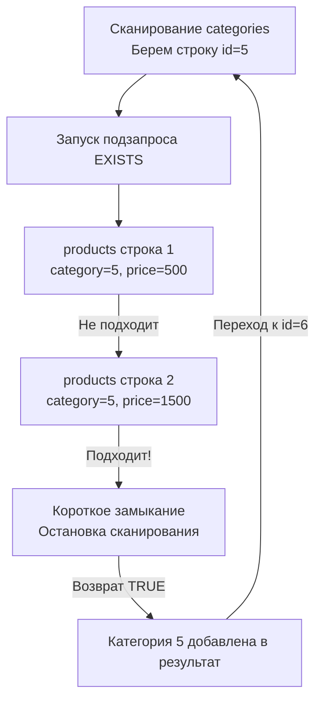

В предыдущей статье [[9. Подзапросы]] мы научились вкладывать одни SQL-выражения в другие, создавая сложные конвейеры обработки данных. Два самых частых оператора, которые используют вместе с подзапросами — это `IN` и `EXISTS`. 

Начинающие разработчики часто считают их взаимозаменяемыми синонимами, но под капотом СУБД (системы управления базами данных) они инициируют принципиально разные алгоритмы поиска. Понимание этой разницы, а также особенностей работы с пустыми значениями — это классический маркер уверенного Middle/Senior инженера.

## Оператор IN: Проверка на вхождение

Оператор `IN` проверяет, совпадает ли левое выражение хотя бы с одним элементом из списка справа. Список может быть задан статически (через запятую) или являться результатом скалярного табличного подзапроса.

```sql
-- Статический список
SELECT id, name FROM users WHERE role IN ('admin', 'moderator');

-- Динамический список (подзапрос)
SELECT name FROM products WHERE category_id IN (
    SELECT id FROM categories WHERE is_active = true
);
```

### Mechanical Sympathy: Как БД выполняет IN

С математической точки зрения `IN` — это просто синтаксический сахар для серии операторов `OR`.
Выражение `id IN (1, 2, 3)` парсер СУБД мгновенно переписывает в `id = 1 OR id = 2 OR id = 3`.

Если колонка `id` покрыта индексом, база данных выполнит несколько независимых **Index Seek** (спусков по B-Tree индексу) для каждого значения. Это очень быстрая операция, если список `IN` невелик. Подробнее механику деревьев мы обсудим в [[2. B Tree индекс под капотом]].

> [!warning] Ловушка / Gotcha: Гигантские списки IN
> Если в вашем подзапросе (или статическом списке) возвращаются миллионы ID, СУБД попытается построить гигантскую цепочку `OR` или загрузить весь этот список в оперативную память для поиска. Оптимизатор может решить, что делать миллион Index Seek-ов дороже, чем прочитать всю таблицу целиком (Sequential Scan). Это приведет к резкой деградации производительности.

---

## Оператор EXISTS: Предикат существования

В отличие от `IN`, оператор `EXISTS` не сравнивает конкретные значения. Он возвращает булево значение (`TRUE` или `FALSE`) в зависимости от того, **вернул ли подзапрос хотя бы одну строку**.

Почти всегда `EXISTS` используется с **коррелированными подзапросами** (когда внутренний запрос ссылается на внешний).

```sql
SELECT name 
FROM categories c
WHERE EXISTS (
    -- Подзапрос зависит от внешней таблицы 'c'
    SELECT 1 
    FROM products p 
    WHERE p.category_id = c.id AND p.price > 1000
);
```

### Mechanical Sympathy: Короткое замыкание (Short-circuit)

Главная инженерная суперсила оператора `EXISTS` — это алгоритм **Semi-Join (Полусоединение)** и логика **короткого замыкания**.

Как только СУБД находит *первую же* строку в таблице `products`, удовлетворяющую условию `p.category_id = c.id`, она **немедленно прекращает дальнейший поиск** для текущей категории. Ей неважно, есть ли там еще 10 000 дорогих товаров — важен сам факт существования хотя бы одного.



> [!info] Под капотом: SELECT 1
> Внутри `EXISTS` принято писать `SELECT 1` или `SELECT *`. Что из этого эффективнее?
> Современным оптимизаторам (PostgreSQL, MySQL 8+) **абсолютно всё равно**. Парсер видит предикат `EXISTS` и физически отсекает фазу проекции (вычисления колонок) для подзапроса. База данных не будет читать колонки с диска, она читает только структуру индекса или минимальные метаданные для проверки наличия строки. Выражение `SELECT 1` — это просто исторически устоявшийся паттерн (Idiomatic SQL).

---

## Что быстрее: IN или EXISTS?

Долгие годы на форумах шли холивары на эту тему. Историческое правило (Rule of Thumb) звучало так:
* Если внешний запрос большой, а подзапрос возвращает мало данных — используй **`IN`**.
* Если внешний запрос маленький, а подзапрос обращается к огромной таблице (и есть индексы) — используй **`EXISTS`**.

**Современная реальность:**
Благодаря [[11. Cost based optimizer]] (стоимостному оптимизатору), грань стерлась. В 95% случаев для запросов вида `IN (SELECT ...)` и `EXISTS (SELECT ...)` современные СУБД (особенно PostgreSQL) строят **абсолютно идентичные планы выполнения**, сводя их к алгоритмам `Hash Semi Join` или `Merge Semi Join`. 

---

## Фатальная ловушка: NOT IN и NULL

Если `IN` и `EXISTS` часто взаимозаменяемы, то их отрицания — `NOT IN` и `NOT EXISTS` — таят в себе самую страшную ловушку реляционной алгебры, связанную с трехзначной логикой.

Представьте задачу: "Найти всех пользователей, которые никогда не делали заказов".

**❌ Использование NOT IN (Опасно):**
```sql
SELECT id, email 
FROM users 
WHERE id NOT IN (SELECT user_id FROM orders);
```
Если в таблице `orders` по какой-то причине (например, баг в приложении) окажется хотя бы **одна** строка, где `user_id IS NULL`, этот подзапрос вернет список вроде `(1, 2, NULL)`. 

Как СУБД вычисляет `id NOT IN (1, 2, NULL)`?
Она разворачивает это в серию `AND`:
`id != 1 AND id != 2 AND id != NULL`

Согласно правилам SQL, любое сравнение с `NULL` дает результат `UNKNOWN`. 
Выражение `TRUE AND TRUE AND UNKNOWN` превращается в `UNKNOWN`. 
Поскольку `WHERE` пропускает только строгие `TRUE`, запрос **вернет 0 строк**, даже если в базе миллион пользователей без заказов!

**✅ Использование NOT EXISTS (Безопасно):**
```sql
SELECT u.id, u.email 
FROM users u
WHERE NOT EXISTS (
    SELECT 1 FROM orders o WHERE o.user_id = u.id
);
```
`NOT EXISTS` работает строго с булевой логикой (есть строка или нет). Ему плевать на значения колонок и `NULL`. Если заказ с таким `user_id` не существует, подзапрос вернет `FALSE`, а `NOT` инвертирует его в `TRUE`. Этот запрос всегда выдаст корректный результат. 

Детальнее работу с неизвестными состояниями мы разбираем в статье [[12. Работа с NULL в SQL]].

---

## Go Idioms: EXISTS вместо COUNT

В бэкенде на Go часто возникает бизнес-задача: просто проверить, существует ли запись в базе (например, занят ли email при регистрации).

**❌ Антипаттерн (Лишняя работа для базы):**
```go
var count int
// СУБД найдет ПЕРВЫЙ email, но продолжит сканировать индекс или таблицу до самого конца, 
// чтобы честно подсчитать ВСЕ такие email (даже если поле уникально, оптимизатор может перестраховаться).
err := db.QueryRow("SELECT COUNT(*) FROM users WHERE email = $1", email).Scan(&count)
if count > 0 {
    // email занят
}
```

**✅ Idiomatic Backend (Использование короткого замыкания):**
```go
var exists bool
// СУБД найдет первую запись, мгновенно прервет выполнение (короткое замыкание) 
// и вернет булево значение (true/false) прямо в рантайм Go.
query := "SELECT EXISTS(SELECT 1 FROM users WHERE email = $1)"
err := db.QueryRowContext(ctx, query, email).Scan(&exists)
if err != nil {
    return err
}

if exists {
    // email занят
}
```
Такой подход экономит такты процессора СУБД (особенно на неуникальных колонках) и является стандартом де-факто при написании высоконагруженных микросервисов.

## Итог

1. **`IN`** отлично подходит для проверки по статичным, небольшим спискам. Под капотом он превращается в цепочку `OR`.
2. **`EXISTS`** использует алгоритм **Semi-Join** с логикой короткого замыкания: база прекращает поиск при первом же совпадении.
3. В современных СУБД оптимизаторы часто уравнивают производительность `IN` и `EXISTS` для подзапросов, но `EXISTS` остается более предсказуемым для коррелированных связей.
4. **КРИТИЧЕСКИ ВАЖНО:** Избегайте `NOT IN` с подзапросами, если есть хотя бы микроскопический шанс появления `NULL` в результатах. Всегда используйте `NOT EXISTS`, чтобы не сломать бизнес-логику из-за трехзначной логики SQL.
5. В Go всегда используйте `SELECT EXISTS(...)` вместо `SELECT COUNT(*) > 0` для простых проверок на наличие данных.

Мы научились извлекать данные, фильтровать их, объединять таблицы и вкладывать запросы друг в друга. Но иногда нам нужно добавить немного условной логики (If-Else) прямо в SQL, чтобы трансформировать данные на лету. Об этом пойдет речь в следующей статье: [[11. CASE выражения]].