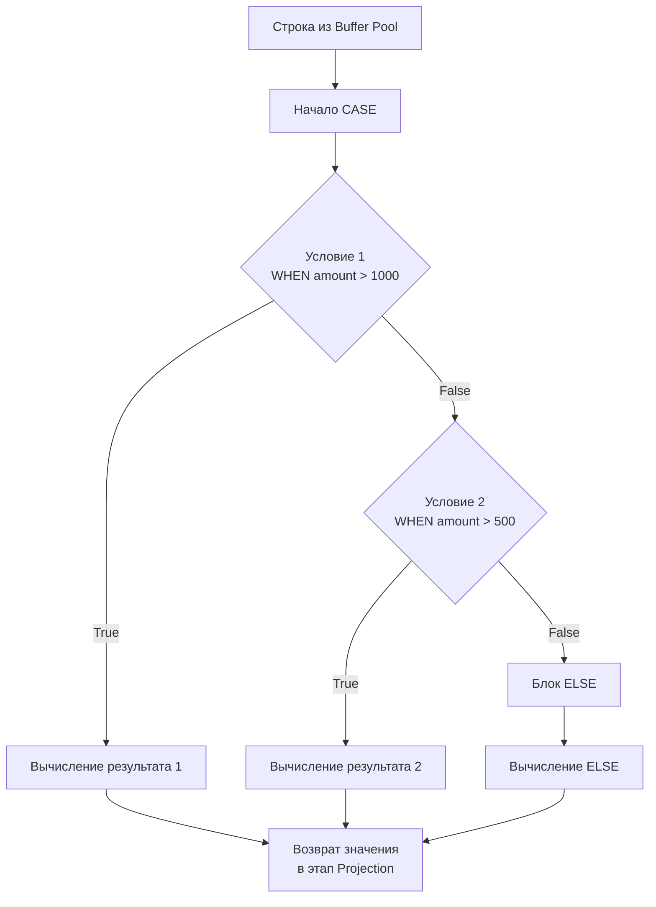

## Ветвление в декларативном мире: Условная логика в SQL

SQL — декларативный язык, который оперирует множествами. Мы привыкли, что логика ветвления (`if-else`, `switch-case`) — это прерогатива императивных языков вроде Go. 

Однако часто возникает потребность трансформировать данные "на лету" прямо в базе данных, чтобы не тянуть лишние байты по сети и не нагружать Garbage Collector в Go бессмысленным маппингом. Для реализации условной логики внутри запросов стандарт SQL предоставляет конструкцию **`CASE`**.

С архитектурной точки зрения, `CASE` позволяет интегрировать бизнес-правила прямо в этапы проекции (`SELECT`), фильтрации (`WHERE`) или сортировки (`ORDER BY`).

## Два формата CASE

Выражение `CASE` существует в двух синтаксических формах:

### 1. Simple CASE (Простой CASE)
Работает аналогично `switch` в Go без условий. Он сравнивает одно базовое выражение с набором значений. Идеален для маппинга энумераторов (enums).

```sql
SELECT 
    id,
    status,
    CASE status
        WHEN 'pending' THEN 'Ожидает'
        WHEN 'paid' THEN 'Оплачен'
        WHEN 'cancelled' THEN 'Отменен'
        ELSE 'Неизвестно'
    END AS status_ru
FROM orders;
```

### 2. Searched CASE (Поисковый CASE)
Работает как цепочка `if - else if - else` в Go. В каждом блоке `WHEN` можно писать абсолютно независимые, сложные логические предикаты.

```sql
SELECT 
    id,
    amount,
    CASE 
        WHEN amount > 100000 THEN 'VIP'
        WHEN amount > 50000 AND status = 'paid' THEN 'Premium'
        ELSE 'Regular'
    END AS customer_segment
FROM orders;
```

---

## Под капотом: Ленивое вычисление (Short-circuit)

Как процессор базы данных физически вычисляет `CASE` для каждой строки? 
Как и логические операторы `&&` и `||` в Go, `CASE` использует алгоритм **Короткого замыкания (Short-circuit evaluation)**.



СУБД оценивает условия строго сверху вниз. Как только находится первый `WHEN`, возвращающий `TRUE`, база данных вычисляет его `THEN`, **игнорируя все остальные ветки**. 

> [!warning] Ловушка / Gotcha: Защита от деления на ноль
> Благодаря ленивому вычислению, `CASE` часто используют как предохранитель для защиты от ошибок выполнения (Run-time errors), которые обрушили бы весь запрос.
> ```sql
> -- Если total_orders = 0, деление не выполнится, ошибки Division By Zero не будет!
> SELECT 
>     CASE 
>         WHEN total_orders = 0 THEN 0 
>         ELSE total_spent / total_orders 
>     END AS average_check
> FROM users;
> ```

---

## Паттерн: Условная агрегация (Conditional Aggregation / Pivot)

Это **самый важный паттерн** использования `CASE`, который спрашивают на 90% собеседований уровня Middle/Senior при проверке знаний SQL.

**Задача:** Вывести в одной строке общую сумму всех заказов, сумму только оплаченных и сумму только отмененных заказов.

**❌ Решение на стороне Go (Антипаттерн):**
Разработчик делает `SELECT amount, status FROM orders`, вытягивает миллион строк в память Go, аллоцирует огромный слайс структур и пишет цикл `for` с тремя `if`. Итог: сожженная пропускная способность сети (Network IO) и долгая пауза Garbage Collector-а.

**✅ Решение на стороне БД (Условная агрегация):**
Мы комбинируем `SUM` из статьи [[7. GROUP BY и агрегатные функции]] с конструкцией `CASE`.

```sql
SELECT 
    SUM(amount) AS total_all,
    SUM(CASE WHEN status = 'paid' THEN amount ELSE 0 END) AS total_paid,
    SUM(CASE WHEN status = 'cancelled' THEN amount ELSE 0 END) AS total_cancelled
FROM orders;
```

**Mechanical Sympathy:** База данных читает таблицу ровно один раз (Sequential Scan), на лету применяет логику ветвления в регистрах CPU и отдает Go-бэкенду ровно **одну строку** с тремя числами (24 байта). Это эталонный подход к написанию аналитических (OLAP) запросов в транзакционных (OLTP) базах.

---

## Паттерн: Кастомная сортировка в ORDER BY

Иногда бизнесу требуется не алфавитная и не числовая сортировка. Например, нужно вывести задачи: сначала со статусом `CRITICAL`, потом `HIGH`, потом все остальные по дате создания.

```sql
SELECT id, title, severity, created_at
FROM tickets
ORDER BY 
    CASE severity
        WHEN 'CRITICAL' THEN 1
        WHEN 'HIGH' THEN 2
        WHEN 'MEDIUM' THEN 3
        ELSE 4
    END,
    created_at DESC;
```

> [!warning] Ловушка / Gotcha: Убийство индексов
> Любое использование `CASE` (или любой другой функции) внутри [[4. ORDER BY, LIMIT]] **гарантированно отключает возможность использования B-Tree индексов для сортировки**. 
> Базе данных придется прочитать все отфильтрованные строки, вычислить для каждой результат `CASE` в оперативной памяти и запустить ресурсоемкий алгоритм `In-Memory Sort` (или `FileSort`, если не хватит `work_mem`). Для небольших выборок это нормально, но для миллионов строк — убьет производительность.

---

## Архитектурный холивар: SQL CASE vs Go Switch

Где должна жить логика ветвления: в базе данных или на бэкенде?

Для Principal инженера ответ всегда опирается на компромисс между CPU базы данных и Network/RAM бэкенда:

1. **Используйте SQL CASE, если:**
   * Условие используется для агрегации (как в примере с `SUM(CASE...)`). Это спасает сеть.
   * Условие необходимо для фильтрации данных на уровне БД.
   * Вы делаете сложный `UPDATE`, где новое значение зависит от старого:
     `UPDATE users SET tier = CASE WHEN points > 1000 THEN 'Gold' ELSE 'Silver' END;`

2. **Используйте Go Switch, если:**
   * Это чистый маппинг для представления данных (Presentation Layer). Например, перевод статуса 'active' в локализованную строку 'Активен' для выдачи в JSON-ответе.
   * База данных — это bottleneck (узкое место). Вычисления строк и регулярные выражения внутри `CASE` сжигают такты процессора СУБД. Процессор в БД масштабировать сложно и дорого. Процессор в подах Kubernetes (где работает ваш Go-код) масштабируется горизонтально и почти бесплатно. Вытягивайте сырые enum-состояния и мапьте их в Go.

> [!tip] Собеседование
> **Вопрос:** Что вернет `CASE`, если ни одно из условий `WHEN` не совпало, а блок `ELSE` не указан явно?
> **Ответ:** По стандарту SQL, если `ELSE` опущен и нет совпадений, `CASE` неявно возвращает `NULL`. Это частая причина трудноуловимых багов, поэтому хорошим тоном (Idiomatic SQL) считается всегда явно прописывать ветку `ELSE`.

## Итог

1. **`CASE`** — это единственный стандартный способ реализовать условную логику непосредственно внутри SQL-запроса.
2. Работает по принципу **короткого замыкания** (short-circuit), что позволяет безопасно писать конструкции с потенциальными ошибками (например, деление на ноль).
3. **Условная агрегация (`SUM(CASE...)`)** — мощнейший инструмент бэкенд-инженера для формирования сложных отчетов за один проход таблицы, избавляющий Go-приложение от мегабайтов лишнего трафика.
4. Использование `CASE` в `ORDER BY` дает гибкость, но отключает индексную сортировку.
5. Не забывайте про неявный `ELSE NULL`.

В этой статье мы коснулись того, что при отсутствии ветви `ELSE` возвращается `NULL`. Работа с отсутствующими значениями — это отдельная, математически сложная область реляционной модели данных, которая ломает интуицию программистов чаще всего. Мы детально разберем ее в следующей статье: [[12. Работа с NULL в SQL]].