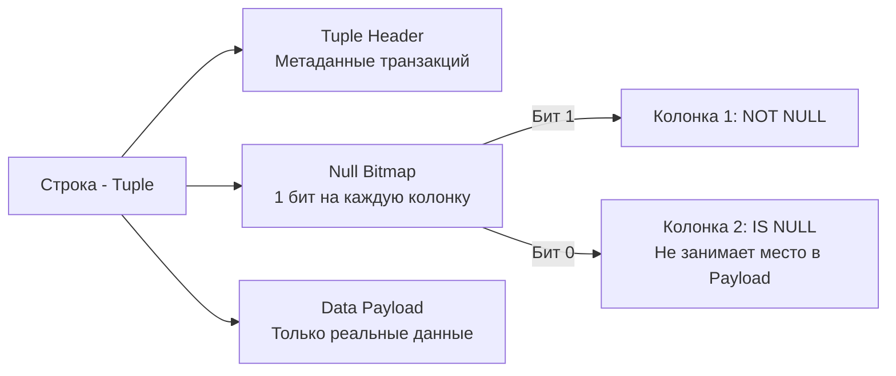

## Природа пустоты: Почему NULL ломает интуицию

В языках программирования общего назначения мы привыкли к понятию "отсутствие значения". В Go это `nil`, в C++ это `nullptr` или `NULL` (макрос для `0`). Во всех этих случаях "отсутствие" — это конкретный адрес в памяти (нулевой указатель), который можно сравнить: `if ptr == nil`.

В реляционных базах данных **`NULL` — это не значение, не нуль, не пустая строка и не нулевой указатель.** `NULL` — это маркер, обозначающий *состояние "Неизвестно" (Unknown)*. 

Если вы спросите базу данных: *"Равен ли неизвестный возраст Ивана неизвестному возрасту Петра?"* (`NULL = NULL`), база не ответит "Да". Она ответит "Я не знаю" (`UNKNOWN`).

Непонимание этой концепции — источник самых коварных "плавающих" багов в бэкенде, которые могут годами скрываться в production-коде.

## Трехзначная логика (3VL)

В Go логика двузначна (Boolean): `true` или `false`. SQL реализует трехзначную логику (Three-Valued Logic - 3VL): `TRUE`, `FALSE` и `UNKNOWN`.

Любая математическая операция или операция сравнения с `NULL` всегда дает `UNKNOWN`:
* `1 + NULL` → `UNKNOWN`
* `NULL = NULL` → `UNKNOWN`
* `NULL != 1` → `UNKNOWN`

**Таблицы истинности для UNKNOWN:**
В конструкции `WHERE` строка попадает в результат, **только если** предикат вычисляется строго в `TRUE`. `FALSE` и `UNKNOWN` отбрасываются.

| Выражение | Результат | Почему так происходит (мнемоника) |
| :--- | :--- | :--- |
| `TRUE AND UNKNOWN` | `UNKNOWN` | Если второе FALSE, то итог FALSE. Если TRUE, то TRUE. Итог зависит от неизвестного. |
| `FALSE AND UNKNOWN` | `FALSE` | Ложь умноженная на что угодно — это ложь (короткое замыкание). |
| `TRUE OR UNKNOWN` | `TRUE` | Истина плюс что угодно — это истина (короткое замыкание). |
| `FALSE OR UNKNOWN` | `UNKNOWN` | Итог полностью зависит от неизвестной переменной. |
| `NOT UNKNOWN` | `UNKNOWN` | Противоположность "неизвестному" — это всё еще "неизвестно". |

> [!warning] Ловушка / Gotcha: NOT IN
> Мы уже упоминали это в статье [[10. EXISTS и IN]], но это стоит повторить.
> Запрос `WHERE id NOT IN (1, 2, NULL)` разворачивается в `id != 1 AND id != 2 AND id != NULL`. Последнее условие дает `UNKNOWN`. Из таблицы выше мы видим, что `(TRUE AND TRUE) AND UNKNOWN` дает `UNKNOWN`. Запрос вернет **0 строк**.

---

## Под капотом: Как физически хранится NULL

С точки зрения **Mechanical Sympathy**, как СУБД (например, PostgreSQL) хранит "ничто" на диске? 
Наивно полагать, что в колонке типа `VARCHAR(255)` `NULL` занимает 255 байт нулей.

В PostgreSQL каждая строка (Tuple) имеет сложную структуру. База данных использует битовую маску, называемую **Null Bitmap**.



1. **Экономия I/O:** Если колонка имеет значение `NULL`, база данных просто выставляет `0` в соответствующем бите `Null Bitmap` в заголовке строки. В секцию `Data Payload` для этой колонки вообще ничего не пишется! `NULL` (почти) не занимает места на диске (0 байт данных).
2. **Скорость:** Проверка `IS NULL` или `IS NOT NULL` — это молниеносная побитовая операция в процессоре (bitwise AND), СУБД даже не нужно парсить сами данные строки.

---

## Функции спасения: Управление NULL

Поскольку обычные операторы (`=`, `!=`) с `NULL` не работают, SQL предоставляет специализированные инструменты.

### 1. IS NULL / IS NOT NULL
Единственный синтаксически верный способ проверить данные на "неизвестность".
```sql
-- ✅ Правильно
SELECT email FROM users WHERE deleted_at IS NULL;

-- ❌ Неправильно (Вернет 0 строк)
SELECT email FROM users WHERE deleted_at = NULL;
```

> [!tip] Собеседование: IS DISTINCT FROM
> **Вопрос:** Как сравнить две колонки `col1` и `col2` на равенство, если обе могут содержать `NULL`, и мы хотим, чтобы `NULL` считался равным `NULL`? Условие `col1 = col2` не сработает.
> **Ответ:** Использовать стандартный SQL-оператор `IS NOT DISTINCT FROM`.
> `WHERE col1 IS NOT DISTINCT FROM col2`. 
> Он рассматривает `NULL` как обычное значение. Если обе колонки `NULL`, он вернет `TRUE`.

### 2. COALESCE (Слияние)
Функция принимает список аргументов и возвращает **первый аргумент, отличный от `NULL`**. Это главный инструмент бэкенд-инженера для задания дефолтных значений на уровне БД.

```sql
-- Если balance равен NULL, вернет 0
SELECT COALESCE(balance, 0) AS current_balance FROM accounts;

-- Можно передавать цепочку значений
SELECT COALESCE(phone, email, 'Нет контактов') FROM users;
```

### 3. NULLIF (Предохранитель)
Принимает два аргумента. Если они равны, возвращает `NULL`. Иначе возвращает первый аргумент.
Идеально для защиты от `Division by Zero` (как альтернатива громоздкому `CASE`).

```sql
-- Если total_orders = 0, NULLIF вернет NULL.
-- Деление на NULL даст NULL, ошибки деления на ноль не будет!
SELECT total_spent / NULLIF(total_orders, 0) FROM users;
```

---

## Агрегация и NULL: Невидимые данные

Функции агрегации (см. [[7. GROUP BY и агрегатные функции]]) обладают встроенным механизмом игнорирования пустоты. 

Функции `SUM`, `AVG`, `MIN`, `MAX` **молча пропускают `NULL` значения**.

Представьте таблицу зарплат из 3 строк: `100`, `200` и `NULL`.
* `SUM(salary)` вернет `300`.
* `AVG(salary)` вернет `150` (300 / 2). База разделит на 2 (количество известных значений), а не на 3!

Единственное исключение — `COUNT(*)`, который считает физические строки (кортежи), а не значения в колонках. 
Поэтому `COUNT(*)` для этой таблицы вернет `3`, а `COUNT(salary)` вернет `2`.

---

## Go Idioms: Борьба с NULL на бэкенде

Маппинг SQL `NULL` в строгие типы Go — это место, где разработчики часто совершают ошибки, приводящие к панике (panic) или деградации производительности.

У нас есть 3 пути извлечения nullable-колонки `bio TEXT` в Go:

### Подход 1: Использование указателей (Удар по GC)
```go
var bio *string
err := rows.Scan(&bio)
```
*Минус:* Вы передаете указатель на указатель. Это заставляет компилятор Go (Escape Analysis) аллоцировать строку в куче (Heap), а не на стеке. Для миллионов строк это спровоцирует тяжелую работу Garbage Collector-а. Плюс, в бизнес-логике придется постоянно делать проверки `if bio != nil`.

### Подход 2: Использование sql.Null* (Идиоматично, но многословно)
Пакет `database/sql` предоставляет типы `sql.NullString`, `sql.NullInt64` и т.д.
```go
var bio sql.NullString
err := rows.Scan(&bio)

if bio.Valid {
    fmt.Println(bio.String)
} else {
    fmt.Println("Биографии нет")
}
```
*Плюс:* Тип `sql.NullString` — это структура (value type), она легко ложится на стек, избавляя GC от аллокаций. 
*Минус:* Засоряет доменные модели (структуры бизнес-логики) SQL-специфичными типами.

### Подход 3: Делегирование через COALESCE (Mechanical Sympathy)
Самый мощный архитектурный паттерн — вообще не пускать `NULL` в рантайм Go, если бизнес-логике не нужно различать "нет значения" и "пустое значение".

```sql
-- SQL: Трансформируем NULL в пустую строку на уровне БД
SELECT COALESCE(bio, '') FROM users;
```

```go
// Go: Используем обычный примитив
var bio string
err := rows.Scan(&bio) // Если был NULL, СУБД пришлет '', ошибки не будет!
```
Это снижает сетевой оверхед (передача `NULL` требует флагов в протоколе), спасает от аллокаций в куче и оставляет доменные структуры в Go чистыми.

## Итог

1. **`NULL` — это не значение, это маркер "Неизвестно".** 2. Любое сравнение с `NULL` через `=` дает `UNKNOWN`. Всегда используйте `IS NULL`.
2. Остерегайтесь `NOT IN` при наличии nullable-колонок. Одно `NULL` значение обнулит весь результат.
3. Физически `NULL` почти не занимает места на диске, используя Null Bitmap в заголовке строки (в PostgreSQL).
4. Агрегатные функции (кроме `COUNT(*)`) молча игнорируют `NULL`.
5. На бэкенде в Go лучше избегать указателей для маппинга. Используйте `sql.Null*` (для стековой аллокации) или `COALESCE` прямо в SQL-запросе, чтобы выдавать предсказуемые дефолтные значения.

Понимание "пустоты" спасает от многих багов. Но есть еще одна операция, которая вызывает не меньше проблем с потреблением RAM и CPU базы данных — это попытка избавиться от дублирующихся строк. Этому посвящена следующая статья: [[13. DISTINCT и дубликаты]].