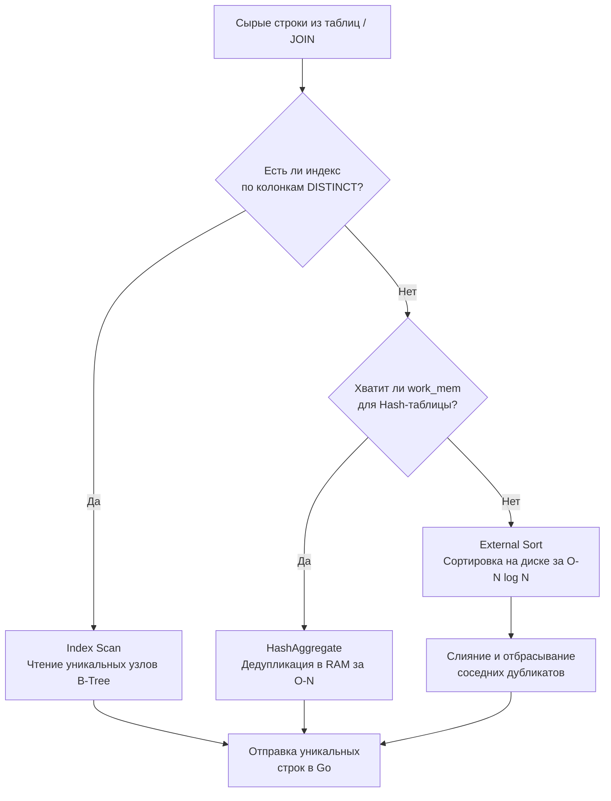

## Мультимножества: Почему базы данных допускают хаос

В строгой математической теории множеств (на которой базируется реляционная модель) дубликаты невозможны по определению. Множество `{1, 2, 2, 3}` математически эквивалентно `{1, 2, 3}`. 

Однако в реальном мире SQL оперирует не множествами, а **мультимножествами (Bags / Multisets)**. СУБД (система управления базами данных) исторически допускает существование абсолютно идентичных строк. Это сделано ради производительности: проверка каждой новой вставляемой строки на уникальность относительно всей таблицы (без индекса) убила бы скорость записи (т.е. операции `INSERT`).

Если нам нужно строгое множество (только уникальные значения), мы обязаны явно попросить об этом базу данных с помощью ключевого слова `DISTINCT`.

```sql
-- Вернет все статусы, включая тысячи дубликатов 'paid'
SELECT status FROM orders;

-- Вернет только уникальные статусы (например, 'paid', 'pending', 'cancelled')
SELECT DISTINCT status FROM orders;
```

## Под капотом: Механика дедупликации

С точки зрения **Mechanical Sympathy**, ключевое слово `DISTINCT` — это не бесплатная магическая фильтрация. Физически для процессора СУБД операция `DISTINCT` почти ничем не отличается от `GROUP BY` (без агрегатных функций). 

Когда вы пишете `DISTINCT`, оптимизатор СУБД строит план выполнения, используя один из алгоритмов устранения дубликатов:



1. **HashAggregate (Хэш-дедупликация):** Если данных не очень много, СУБД читает строки и кладет их в хэш-таблицу в оперативной памяти (в пределах `work_mem`). Если ключ уже есть в таблице — строка отбрасывается. Это быстро, но требует RAM.
2. **Sort / Unique (Сортировка):** Если оперативной памяти не хватает, СУБД начинает сортировать данные (в том числе сбрасывая временные файлы на медленный диск — Spill to Disk). Отсортировав данные, база просто идет по ним сверху вниз и пропускает идущие подряд одинаковые значения (узел `Unique` в [[10. План выполнения запроса. EXPLAIN]]). Это крайне дорогая по CPU и I/O операция.

> [!warning] Ловушка / Gotcha: DISTINCT по нескольким колонкам
> `DISTINCT` всегда применяется **ко всей строке целиком** (ко всем колонкам в `SELECT`), а не к одной конкретной. 
> Если вы напишете `SELECT DISTINCT id, status, created_at FROM orders`, СУБД будет искать уникальные *комбинации* этих трех полей. Если `id` уникален (Primary Key), то `DISTINCT` не сделает вообще ничего полезного, но базу данных вы заставите запустить тяжелый алгоритм хэширования или сортировки.

---

## Архитектурное преступление: DISTINCT как костыль для JOIN

Это, пожалуй, самый важный пункт для оценки уровня инженера на собеседовании. 

Начинающие разработчики часто сталкиваются с проблемой: при написании сложного запроса с несколькими таблицами (см. [[6. JOIN. INNER, LEFT, RIGHT]]) в результатах внезапно появляются дубликаты. Это происходит из-за связи "один ко многим", когда родительская строка множится на количество дочерних.

**❌ Антипаттерн "Ленивый фикс":**
Вместо того чтобы разобраться в структуре связей и исправить условие `ON` или использовать `GROUP BY`, разработчик просто дописывает `DISTINCT` в начало запроса:
```sql
-- Получить всех пользователей, у которых есть оплаченные заказы
SELECT DISTINCT u.id, u.email 
FROM users u
LEFT JOIN orders o ON u.id = o.user_id 
WHERE o.status = 'paid';
```

**Почему это катастрофа (Mechanical Sympathy):**
1. СУБД послушно выполняет `JOIN` в памяти. Если у пользователя 10 000 заказов, база создаст 10 000 идентичных строк `(u.id, u.email)`.
2. Затем СУБД выделяет огромный кусок RAM (или диска), чтобы прохэшировать или отсортировать эти 10 000 строк и удалить 9 999 из них.
3. Вы сожгли такты процессора СУБД и память на создание мусора, а затем сожгли еще больше ресурсов на его уборку.

**✅ Правильное решение (Делегирование через EXISTS):**
Дубликатов вообще не должно возникать в памяти БД. Мы просто проверяем факт существования (как разобрали в [[10. EXISTS и IN]]):
```sql
SELECT u.id, u.email 
FROM users u
WHERE EXISTS (
    SELECT 1 FROM orders o 
    WHERE o.user_id = u.id AND o.status = 'paid'
);
```
Этот запрос отработает мгновенно (Short-circuit evaluation) без выделения памяти под дедупликацию.

---

## Продвинутая магия: DISTINCT ON (PostgreSQL)

Стандартный `DISTINCT` убирает дубликаты целиком по всем колонкам. Но в реальной бизнес-логике часто возникает задача: **"Получить только ПОСЛЕДНИЙ заказ для каждого пользователя"**.

В MySQL или стандартном SQL для этого пришлось бы писать сложные оконные функции или коррелированные подзапросы. В PostgreSQL есть мощнейшее расширение стандарта — **`DISTINCT ON`**. Оно позволяет указать, по какому именно полю определять уникальность, а остальные поля взять из "первой попавшейся" строки.

```sql
-- Получить детали самых свежих заказов по каждому пользователю
SELECT DISTINCT ON (user_id) 
    user_id, 
    id AS order_id, 
    amount, 
    created_at
FROM orders
ORDER BY user_id, created_at DESC;
```

**Как это работает:**
СУБД сортирует данные сначала по `user_id`, а затем по `created_at DESC` (самые новые сверху). Оператор `DISTINCT ON (user_id)` идет по этому отсортированному списку и берет только первую строку для каждого `user_id`. Остальные отбрасываются. 

> [!tip] Собеседование
> **Вопрос:** В чем подвох `DISTINCT ON`? Что будет, если забыть `ORDER BY`?
> **Ответ:** Без `ORDER BY` или если колонка из `DISTINCT ON` не стоит первой в `ORDER BY`, PostgreSQL вернет синтаксическую ошибку. Если написать `ORDER BY user_id` без сортировки по дате, СУБД вернет *непредсказуемую* (случайную) строку для каждого пользователя, так как порядок чтения с диска не гарантирован.

---

## Бэкенд на Go: Где лучше удалять дубликаты?

Представим, что мы собираем список ID категорий из списка товаров. У нас есть два пути.

**Путь 1: Дедупликация в SQL**
```sql
SELECT DISTINCT category_id FROM products WHERE status = 'active';
```
* **Плюсы:** Минимальный сетевой трафик (Network I/O). Гоняем по TCP только уникальные ID. Рантайм Go аллоцирует маленький слайс.
* **Минусы:** Нагрузка на CPU базы данных. Если индекс по `category_id` отсутствует, БД будет строить Hash-таблицу.

**Путь 2: Дедупликация в Go (In-Memory)**
```go
rows, _ := db.Query("SELECT category_id FROM products WHERE status = 'active'")
defer rows.Close()

// Идиоматичный Set в Go через мапу
uniqueCategories := make(map[int64]struct{})
for rows.Next() {
    var id int64
    _ = rows.Scan(&id)
    uniqueCategories[id] = struct{}{}
}
```
* **Плюсы:** Разгружает CPU базы данных (база — узкое место). Go-сервисы легко масштабировать.
* **Минусы:** Огромный сетевой оверхед. Если товаров 1 000 000, а уникальных категорий 10, мы передадим по сети миллион строк, заставим драйвер сделать миллион `Scan()` через рефлексию и замусорим Heap, напрягая Garbage Collector.

**Золотое правило (Rule of Thumb):**
Всегда используйте `DISTINCT` на стороне БД, **если** вы значительно сокращаете объем передаваемых данных по сети (редукция 10 к 1 и более). Исключение: если база данных "лежит" от 100% загрузки CPU, а у бэкенда есть запас ресурсов и сверхбыстрая локальная сеть (например, в одном Kubernetes-кластере), тогда дедупликацию можно перенести в Go.

## Итог

1. **`DISTINCT`** заставляет реляционную базу данных соблюдать правила строгих математических множеств.
2. Физически это тяжелая операция, работающая через Hash-таблицы (`HashAggregate`) или сортировку (`Unique`).
3. Использование `DISTINCT` для скрытия дубликатов, возникших из-за неправильных `JOIN` — это грубый антипаттерн, убивающий производительность сервера БД.
4. В PostgreSQL обязательно используйте `DISTINCT ON (...) ORDER BY ...` для элегантного решения задачи "найти последнюю запись в группе".
5. На уровне архитектуры всегда балансируйте: дедупликация в БД экономит пропускную способность сети и память бэкенда, но тратит ценный CPU сервера СУБД.

На этом мы завершаем базовый блок по SQL. Мы научились извлекать, фильтровать, связывать, группировать и дедуплицировать данные. Однако бизнес-требования часто выходят за рамки линейных запросов. Пора переходить к продвинутым техникам, которые отличают Senior разработчика. В следующем разделе мы начнем с того, как сделать сложные SQL-запросы читаемыми, переиспользуемыми и модульными: [[1. CTE. WITH выражения]].