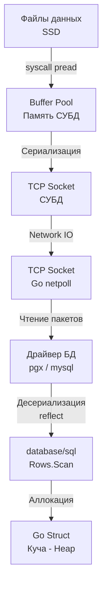

## Проекция данных: Анатомия команды SELECT

В реляционной алгебре операция выбора определенных столбцов из отношения (таблицы) называется **проекцией** (Projection). В SQL за эту операцию отвечает команда `SELECT`.

Синтаксически это самая частая команда в любом приложении. На базовом уровне она выглядит тривиально:
```sql
SELECT id, email, created_at
FROM users;
```

Здесь мы указываем базе данных, **какие именно** атрибуты кортежей (строк) нам нужны. СУБД читает страницы данных (pages) из своего буферного пула, извлекает нужные колонки, сериализует их в бинарный протокол (например, PostgreSQL Wire Protocol) и отправляет по TCP-соединению нашему бэкенду.

### Алиасы (AS) и вычисляемые поля
`SELECT` позволяет не только извлекать сырые данные, но и трансформировать их "на лету" на стороне СУБД. Вы можете использовать математические операции, конкатенацию строк или функции базы данных, назначая результату псевдоним (алиас) с помощью ключевого слова `AS`:

```sql
SELECT 
    id,
    first_name || ' ' || last_name AS full_name, -- Конкатенация в PostgreSQL
    salary * 1.15 AS projected_salary -- Вычисляемое поле
FROM employees;
```

> [!info] Под капотом: Вычисления в БД vs Бэкенд
> Стоит ли делать вычисления (например, конкатенацию или математику) в SQL или лучше запрашивать сырые данные и считать в Go? 
> **Mechanical Sympathy:** Сервер БД — это bottleneck (узкое место). Вычисления строк и математика с плавающей точкой тратят процессорное время (CPU) базы данных. Бэкенд на Go масштабируется горизонтально добавлением подов в Kubernetes за секунды, а базу данных масштабировать на запись сложно и дорого. 
> *Правило (Rule of Thumb):* Если вычисление нужно для **фильтрации или сортировки** на стороне БД (в `WHERE` или `ORDER BY`), делайте его в SQL. Если это просто форматирование данных для отображения или бизнес-логики, извлекайте сырые колонки и делайте это в Go (где CPU дешевый и масштабируемый).

---

## Исполнение SELECT в Go: Жизненный цикл данных

Для Go-разработчика SQL-запрос не заканчивается на стороне СУБД. Важно понимать путь данных от диска базы до структуры в куче (Heap) вашего Go-приложения.



Когда вы выполняете `SELECT`, драйвер базы данных читает байты из сокета (через неблокирующий сетевой поллер Go — `netpoll`). Затем метод `Scan()` распаковывает эти байты в переменные Go.

### Идиоматичный паттерн извлечения множества строк

Рассмотрим классический production-ready код чтения списка пользователей:

```go
// Пакеты: context, database/sql, fmt

type User struct {
	ID        int64
	Email     string
	CreatedAt time.Time
}

func GetActiveUsers(ctx context.Context, db *sql.DB) ([]User, error) {
	query := `SELECT id, email, created_at FROM users`
	
    // 1. Выполняем запрос
	rows, err := db.QueryContext(ctx, query)
	if err != nil {
		return nil, fmt.Errorf("db.QueryContext failed: %w", err)
	}
    // КРИТИЧЕСКИ ВАЖНО: всегда закрываем rows через defer
	defer rows.Close() 

	var users []User // Если знаем примерный размер, лучше сделать make([]User, 0, cap)

    // 2. Итерируемся по результату
	for rows.Next() {
		var u User
        // 3. Мапим байты в структуру Go
		if err := rows.Scan(&u.ID, &u.Email, &u.CreatedAt); err != nil {
			return nil, fmt.Errorf("rows.Scan failed: %w", err)
		}
		users = append(users, u)
	}

    // 4. Проверяем ошибки после цикла
	if err := rows.Err(); err != nil {
		return nil, fmt.Errorf("rows iteration failed: %w", err)
	}

	return users, nil
}
```

### Разбор механики и Gotchas

> [!warning] Ловушка / Gotcha: Утечка соединений (Connection Leak)
> Метод `db.QueryContext` берет одно TCP-соединение из пула ([[2. Connection pool]]) и "бронирует" его за возвращаемым объектом `*sql.Rows`. Это соединение **не вернется в пул**, пока вы не вызовете `rows.Close()` или пока `rows.Next()` не вернет `false` (прочитав все строки до конца).
> Если внутри цикла `for rows.Next()` произойдет ошибка (например, в `Scan`) и вы сделаете `return`, не вызвав `Close()`, соединение останется висеть открытым бесконечно. При высокой нагрузке пул соединений быстро исчерпается, и новые запросы начнут блокироваться в ожидании свободного коннекта (вызывая деградацию всего сервиса). Именно поэтому `defer rows.Close()` пишется **сразу** после проверки ошибки `db.QueryContext`.

> [!info] Под капотом: Цена Rows.Scan и Escape Analysis
> Стандартный метод `rows.Scan(&u.ID, ...)` принимает аргументы как `...any` (пустой интерфейс). Это значит, что под капотом драйвер использует пакет `reflect` для определения типов переданных указателей во время выполнения (Runtime). 
> Рефлексия — относительно медленная операция. Кроме того, передача указателей в `Scan` заставляет компилятор Go (при фазе Escape Analysis) аллоцировать структуру `User` в куче (Heap), а не на стеке, что добавляет работы Garbage Collector-у. 
> Для сверх-высоконагруженных систем от стандартного `database/sql` часто отказываются в пользу кодогенерации (например, `sqlc`), которая генерирует строго типизированный код без рефлексии (подробнее обсудим в [[1. Работа с БД в Go. database_sql]]).

> [!tip] Собеседование: QueryRow и sql.ErrNoRows
> **Вопрос:** Как правильно запросить ровно одну строку и обработать ситуацию, когда данных нет?
> **Ответ:** Использовать `db.QueryRowContext()`. В отличие от `Query`, он не требует вызова `Close()`, так как закрывает соединение автоматически после `Scan()`.
> Важный нюанс: если БД ничего не вернула, `Scan()` вернет специальную ошибку `sql.ErrNoRows`. В бизнес-логике `ErrNoRows` часто не является реальной системной ошибкой (например, "Пользователь не найден"), поэтому ее нужно обрабатывать явно, транслируя в доменную ошибку (вроде `ErrUserNotFound`) или возвращая `nil`, если отсутствие данных — это норма.

## Итог

1. **`SELECT`** — это операция проекции. Выбираем только те колонки, которые реально нужны приложению, экономя Network I/O и память (RAM) на сервере Go. Никаких `SELECT *` в production-коде.
2. Трансформации данных можно делать в SQL через алиасы и функции, но CPU-емкие операции лучше переносить на бэкенд.
3. При работе с массивом строк в Go жизненно необходимо использовать `defer rows.Close()` во избежание утечки соединений (connection pool exhaustion).
4. Обязательно проверяйте `rows.Err()` после завершения цикла итерации, так как обрыв TCP-соединения во время передачи потока данных может произойти на середине результата.

Базовый `SELECT` возвращает данные безусловно. Однако в реальности нам почти всегда нужно отсекать лишнее. В следующей статье мы разберем механику ограничения выборки на уровне СУБД: [[3. WHERE и фильтрация]].