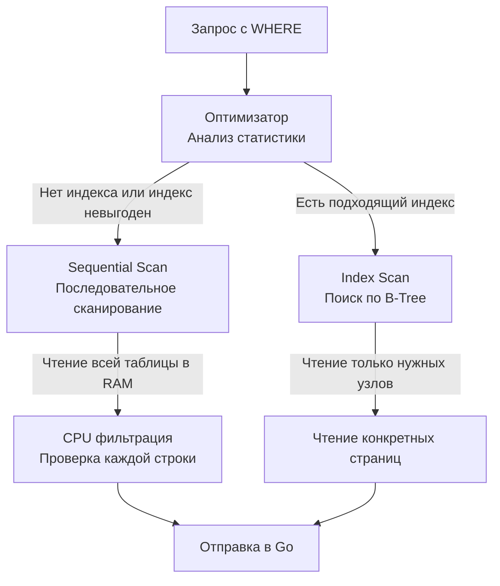

## Предикаты и ограничение выборки

В реляционной алгебре операция, которая отсекает ненужные строки, называется **ограничением (Restriction)** или **селекцией (Selection)**. В SQL за это отвечает предложение `WHERE`.

Если `SELECT` ограничивает ширину потока данных (отсекая колонки), то `WHERE` ограничивает его длину (отсекая строки). С точки зрения **Mechanical Sympathy**, раннее отсечение данных — это фундаментальный способ снизить нагрузку на три ключевых узла:
1. **Дисковая подсистема (Disk IO):** Меньше страниц читать в Buffer Pool (если используются индексы).
2. **Процессор (CPU):** Меньше строк нужно десериализовать и проверять в памяти.
3. **Сеть (Network IO):** Меньше байтов отправлять по TCP в ваше Go-приложение.

## Как БД выполняет WHERE: Seq Scan vs Index Scan

Когда парсер СУБД встречает `WHERE`, он передает логическое условие (предикат) оптимизатору. У базы есть два принципиально разных пути выполнения этого предиката:



1. **Sequential Scan (Полное сканирование):** СУБД поднимает с диска в оперативную память (Shared Buffers) **каждую** страницу таблицы. Затем процессор сервера БД берет каждую строку и вычисляет предикат (например, `age > 18`). Если строка не подходит, она отбрасывается. Это сжигание CPU-циклов впустую, если таблица огромна, а вам нужны всего две строки.
2. **Index Scan (Сканирование индекса):** СУБД спускается по дереву индекса (обычно B-Tree), находит точные смещения (TID — Tuple Identifier) нужных строк на диске и читает только их. Процессору почти не нужно вычислять предикаты для отбраковки. Более глубоко индексы мы разберем в разделе [[1. Что такое индекс и зачем он нужен]].

> [!info] Под капотом: Короткое замыкание (Short-circuit evaluation)
> В Go мы привыкли, что в выражении `if a != nil && a.IsValid()`, если `a == nil`, вторая часть не вычисляется. В SQL (например, в PostgreSQL) порядок вычисления предикатов `WHERE A AND B` не гарантируется слева направо! Оптимизатор может решить сначала вычислить `B`, если статистика показывает, что условие `B` отсечет 99% строк, а `A` — только 10% (это называется Selectivity / Селективность). Никогда не пишите SQL, полагаясь на строгий порядок вычисления в `WHERE`.

---

## SARGability: Главный секрет производительного WHERE

Это критически важный концепт для собеседований на Middle+/Senior. 
**SARGable** (Search ARGument ABLE) означает, что предикат написан так, что СУБД может использовать индекс для его выполнения.

Любая манипуляция с колонкой "слева" от оператора сравнения мгновенно убивает SARGability, превращая быстрый поиск по индексу в тяжелый `Sequential Scan`.

**❌ Non-SARGable (Индекс НЕ будет использован):**
```sql
-- Функция над колонкой. СУБД должна вычислить YEAR() для каждой строки таблицы!
SELECT id FROM users WHERE YEAR(created_at) = 2023;

-- Математика над колонкой.
SELECT id FROM products WHERE price * 0.9 < 100;

-- Поиск по шаблону, начинающийся с %. B-Tree не может искать с конца.
SELECT email FROM users WHERE email LIKE '%@gmail.com';
```

**✅ SARGable (Индекс будет использован):**
```sql
-- Диапазон. B-Tree отлично ищет от и до.
SELECT id FROM users WHERE created_at >= '2023-01-01' AND created_at < '2024-01-01';

-- Математика перенесена вправо. Переменная просто вычисляется один раз при парсинге.
SELECT id FROM products WHERE price < 100 / 0.9;

-- B-Tree может искать префикс!
SELECT email FROM users WHERE email LIKE 'john.doe@%'; 
```

> [!tip] Собеседование
> **Вопрос:** У нас есть индекс по колонке `status`. Запрос `SELECT * FROM orders WHERE status != 'CANCELLED'` работает очень медленно (Full Table Scan). Почему СУБД не использует индекс?
> **Ответ:** Операторы неравенства (`!=`, `<>`) обычно обладают крайне низкой селективностью. Оптимизатор понимает, что под условие "не отменен" подпадает, скажем, 95% таблицы. Читать 95% таблицы через индекс (совершая случайный доступ к диску / Random IO) — гораздо дороже, чем прочитать всю таблицу целиком за один проход (Sequential IO). Индекс выгоден только тогда, когда мы ищем малую долю данных. Убедиться в этом можно через [[10. План выполнения запроса. EXPLAIN]].

---

## Ловушки при работе с WHERE в Go

При написании бэкенда на Go динамическое построение условия `WHERE` — это частая и полная подводных камней задача.

### 1. Срез в операторе IN

В SQL мы часто пишем `WHERE id IN (1, 2, 3)`. Начинающие Go-разработчики пытаются передать срез (slice) как один аргумент в Prepared Statement:

```go
// ❌ ОШИБКА: Пакет database/sql не умеет разворачивать срезы Go в список аргументов SQL.
// Это вызовет синтаксическую ошибку или запаникует драйвер.
ids := []int{1, 2, 3}
db.Query("SELECT name FROM users WHERE id IN ($1)", ids)
```

**✅ Правильный идиоматичный подход (без сторонних библиотек):**
Мы должны сгенерировать строку с плейсхолдерами `($1, $2, $3)` и передать аргументы развернув их через `...`.

```go
func GetUsersByIDs(ctx context.Context, db *sql.DB, ids []int) ([]User, error) {
    if len(ids) == 0 {
        return nil, nil // Быстрый возврат, нет смысла идти в БД
    }

    // Подготавливаем плейсхолдеры: "$1, $2, $3"
    placeholders := make([]string, len(ids))
    args := make([]any, len(ids)) // interface{} срез для db.Query
    
    for i, id := range ids {
        placeholders[i] = fmt.Sprintf("$%d", i+1)
        args[i] = id
    }

    query := fmt.Sprintf(
        "SELECT id, name FROM users WHERE id IN (%s)", 
        strings.Join(placeholders, ", "),
    )

    // args... разворачивает срез []any в вариативные аргументы
    rows, err := db.QueryContext(ctx, query, args...)
    if err != nil {
        return nil, fmt.Errorf("query execute error: %w", err)
    }
    defer rows.Close()

    // ... сканирование строк
}
```

> [!info] Под капотом
> Для упрощения этой рутины в Go-сообществе используют SQL-билдеры (например, `squirrel` или `goqu`) либо инструменты кодогенерации (например, `sqlc`), которые берут генерацию плейсхолдеров и маппинг типов на себя. Подробнее в [[1. Работа с БД в Go. database_sql]].

### 2. Трехзначная логика и NULL

Вторая фатальная ошибка — попытка сравнения с `NULL` через оператор равенства.

```sql
-- ❌ НЕВЕРНО: Всегда вернет 0 строк (Unknown)
SELECT id FROM users WHERE deleted_at = NULL;
```

SQL реализует трехзначную логику: `TRUE`, `FALSE` и `UNKNOWN`. `NULL` — это отсутствие значения. Нельзя сказать, равно ли "отсутствие значения" другому "отсутствию значения". Любая операция сравнения с `NULL` (даже `NULL = NULL`) дает результат `UNKNOWN`. А `WHERE` пропускает строку только если предикат вычислен строго в `TRUE`.

Для проверки на пустоту используются специальные операторы:
```sql
-- ✅ ВЕРНО
SELECT id FROM users WHERE deleted_at IS NULL;
SELECT id FROM users WHERE deleted_at IS NOT NULL;
```
Полное погружение в эту механику ждет вас в статье [[12. Работа с NULL в SQL]].

## Итог

1. **`WHERE`** защищает ваш бэкенд от потопа данных. Фильтруйте данные как можно ближе к диску (на сервере СУБД), а не в памяти приложения на Go.
2. Следите за **SARGability**. Функции и математические операции над левым операндом выключают индексы и заставляют процессор БД молотить всю таблицу (Seq Scan).
3. При передаче слайсов из Go в оператор `IN` необходимо динамически генерировать строку с плейсхолдерами.
4. Помните про особенности `NULL` и используйте `IS NULL`.

Отфильтровав нужные строки, мы часто хотим получить их в определенном порядке или забрать только первую десятку для пагинации. О том, как это влияет на память и аллокации, мы поговорим в следующей статье: [[4. ORDER BY, LIMIT]].