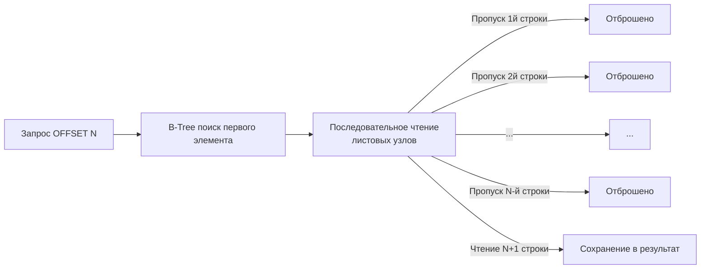

## Упорядочивание хаоса: Иллюзия порядка в реляционной алгебре

Фундаментальное правило работы с реляционными базами данных, о котором часто забывают: **таблицы представляют собой неупорядоченные множества (sets)**. В математической теории множеств элементы не имеют позиции. 

Если вы делаете `SELECT * FROM users` без явного указания сортировки, СУБД имеет полное право вернуть строки в абсолютно случайном порядке. Более того, этот порядок может меняться от запроса к запросу, в зависимости от того, в каком порядке страницы данных (pages) в данный момент вытесняются или поднимаются в `Buffer Pool`, или от того, как отработал сборщик мусора базы (например, `VACUUM` в PostgreSQL, который переиспользует пустоты от удаленных строк).

Чтобы получить детерминированный результат, мы обязаны использовать конструкцию `ORDER BY`.

## Механика ORDER BY: RAM, Диск и B-Tree

С точки зрения **Mechanical Sympathy**, сортировка — это одна из самых ресурсоемких операций для процессора и памяти сервера БД. У базы данных есть два принципиально разных пути выполнения сортировки.

### 1. Сортировка в памяти (In-Memory Sort / FileSort)
Если данных мало, СУБД собирает все отфильтрованные строки и сортирует их в оперативной памяти (используя алгоритмы вроде QuickSort). 
В PostgreSQL за лимит памяти для одной операции сортировки отвечает параметр `work_mem` (по умолчанию часто всего 4MB). 

> [!warning] Ловушка / Gotcha: Spill to Disk (Сброс на диск)
> Если объем данных для сортировки превышает `work_mem`, СУБД не падает с Out Of Memory. Она начинает разбивать данные на чанки, сортировать их по частям и сбрасывать временные файлы на диск (External Merge Sort). Дисковый I/O на порядки медленнее оперативной памяти. Запрос, который летал на тестовой среде, в production при росте данных внезапно начинает выполняться секунды или минуты. Увидеть это можно в логах [[10. План выполнения запроса. EXPLAIN]] (ищите слова `external merge Disk`).

### 2. Сортировка по индексу (Index Sort)
Идеальный сценарий. Индекс B-Tree (B-дерево) по своей природе хранит данные в строго отсортированном виде в листовых узлах, которые связаны между собой двусвязным списком (Doubly Linked List).

Если вы делаете `ORDER BY created_at`, и по этой колонке есть B-Tree индекс, СУБД вообще не выполняет операцию сортировки! Процессор просто переходит к крайнему левому (или правому, при `DESC`) узлу индекса и читает готовые, уже отсортированные указатели на строки. Это называется **Index Scan**, и он работает моментально. Подробнее механику деревьев разберем в [[2. B Tree индекс под капотом]].

---

## LIMIT и паттерн Top-N

Команда `LIMIT N` (в некоторых СУБД `TOP N` или `FETCH FIRST N ROWS ONLY`) — это директива "раннего выхода" (Early Stop). Как только СУБД нашла `N` строк, удовлетворяющих условиям, она мгновенно прерывает выполнение запроса.

Комбинация `ORDER BY` и `LIMIT` без индекса включает в СУБД специальную оптимизацию — **Top-N Heapsort**. 
Если вы просите `ORDER BY score DESC LIMIT 10`, базе не нужно сортировать миллион строк. Она создает в памяти структуру данных "Куча" (Heap) размером ровно 10 элементов. Проходя по таблице, она просто поддерживает эти 10 максимальных значений. Это потребляет минимум RAM и никогда не сбрасывается на диск.

### Mechanical Sympathy в Go: Аллокация памяти
Если ваш запрос использует `LIMIT`, вы заранее знаете точное (или максимальное) количество строк, которое вернет СУБД. Это критически важно для оптимизации аллокаций в Go.

**❌ Плохо (Лишние аллокации в куче):**
```go
var users []User // nil slice
rows, _ := db.Query("SELECT id FROM users LIMIT 100")
for rows.Next() {
    // При добавлении элементов append будет неоднократно 
    // выделять новую память и копировать старые данные (growslice)
    users = append(users, u) 
}
```

**✅ Idiomatic Go (Zero reallocations):**
```go
// Мы точно знаем лимит, поэтому выделяем емкость (capacity) заранее.
// Длина (length) равна 0, чтобы append работал корректно.
users := make([]User, 0, 100) 
rows, _ := db.Query("SELECT id FROM users LIMIT 100")
for rows.Next() {
    // Массив под капотом слайса не будет переаллоцироваться!
    users = append(users, u)
}
```

---

## Убийца производительности: OFFSET и глубокая пагинация

Самый популярный способ сделать постраничный вывод на бэкенде — связка `LIMIT` и `OFFSET`.

```sql
SELECT id, name FROM users ORDER BY created_at DESC LIMIT 50 OFFSET 100000;
```

> [!tip] Собеседование
> **Вопрос:** Почему запрос с `OFFSET 100000` работает чудовищно медленно, даже если по колонке сортировки `created_at` есть покрывающий индекс?
> **Ответ:** `OFFSET` не умеет перепрыгивать через строки. Из-за архитектуры MVCC (которую мы разберем позже) база данных не знает заранее, какие из этих 100 000 строк "живы" и видны текущей транзакции, а какие удалены. Поэтому СУБД обязана **прочитать с диска, распаковать и отбросить** первые 100 000 строк, чтобы отдать вам следующие 50. Сложность такого запроса — `O(N)`. Чем глубже страница, тем медленнее запрос.



### Альтернатива: Keyset Pagination (Cursor / Seek Method)

Чтобы решить проблему "глубокой пагинации" (Deep Pagination) на высоконагруженных проектах, `OFFSET` категорически запрещен. Вместо него используют пагинацию по ключу (курсору).

Суть: мы запоминаем значение последней строки на предыдущей странице и используем его в `WHERE`.

```sql
-- Запрос первой страницы
SELECT id, name, created_at 
FROM users 
ORDER BY created_at DESC, id DESC 
LIMIT 50;

-- Предположим, последний пользователь на странице имел:
-- created_at = '2023-10-01', id = 1042

-- Запрос второй страницы (НИКАКОГО OFFSET!)
SELECT id, name, created_at 
FROM users 
WHERE (created_at, id) < ('2023-10-01', 1042)
ORDER BY created_at DESC, id DESC 
LIMIT 50;
```

**Почему это работает мгновенно?**
Условие `WHERE` позволяет СУБД совершить быстрый поиск по дереву (Index Seek) за `O(log N)`. База спускается по индексу прямо к записи `1042`, берет следующие 50 листовых узлов и сразу возвращает результат. Ей не нужно считывать и отбрасывать предыдущие 100 000 записей.

> [!info] Под капотом: Зачем нужен `id` в сортировке?
> Обратите внимание на `ORDER BY created_at DESC, id DESC`. Если сортировать только по времени `created_at`, и в одну миллисекунду зарегистрируются два пользователя, курсор может пропустить одного из них. Сортировка всегда должна замыкаться уникальным полем (обычно Primary Key), чтобы сделать порядок абсолютно детерминированным (Strictly Deterministic).

## Итог

1. Таблицы в SQL не имеют порядка. Без `ORDER BY` порядок выдачи случаен.
2. Сортировка в памяти (FileSort) без индексов ограничена параметром `work_mem`. Если памяти не хватает, СУБД начинает сбрасывать данные на диск, что критически замедляет I/O.
3. Лучшая сортировка — та, которой не было. Поиск по B-Tree индексу уже выдает отсортированные данные.
4. В Go всегда используйте `make([]T, 0, limit)`, чтобы избавить Garbage Collector от лишней работы при чтении ограниченных выборок.
5. `OFFSET` работает за `O(N)` и убивает базу на больших смещениях. На Middle+/Senior позициях вы обязаны использовать **Keyset Pagination (Cursor Pagination)** для реализации постраничного вывода.

Мы научились извлекать, фильтровать и сортировать данные. Теперь пора перейти к мутациям (изменениям) состояния базы данных в следующей статье: [[5. INSERT, UPDATE, DELETE]].