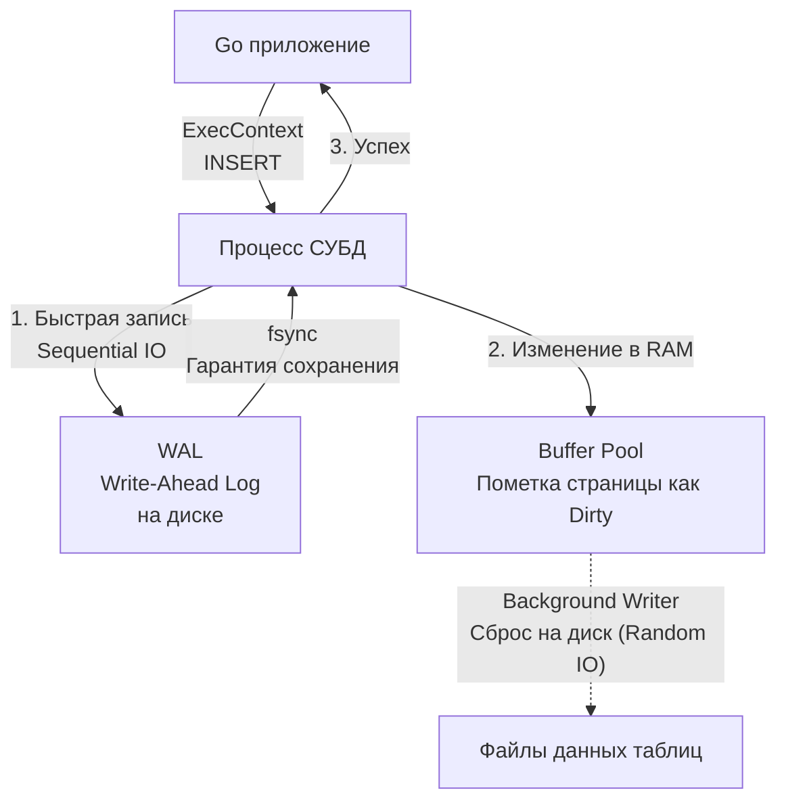

## Мутация состояния: DML операции

Если `SELECT` (DQL) — это операция чтения, которая не меняет состояние мира, то `INSERT`, `UPDATE` и `DELETE` (Data Manipulation Language — DML) — это команды мутации. Они изменяют самое ценное, что есть в вашем проекте — консистентное состояние базы данных.

С точки зрения бэкенд-инженера, мутации требуют гораздо большей аккуратности, чем чтение. Ошибка в `SELECT` приведет к неверному отображению данных в UI. Ошибка в `UPDATE` без условия `WHERE` уничтожит данные во всей таблице (так называемый "Mass Update" инцидент).

## INSERT: Рождение данных

Базовый синтаксис вставки новой строки (кортежа) выглядит так:

```sql
INSERT INTO users (email, password_hash, created_at) 
VALUES ('user@example.com', 'hash', '2023-10-01');
```

### Массовая вставка (Bulk Insert / Batching)

Для вставки множества строк **категорически неправильно** делать `INSERT` в цикле на стороне Go. Каждый запрос — это отдельный сетевой вызов (Network Round-Trip), отдельный парсинг запроса в СУБД и отдельная транзакция.

**✅ Правильно (Многострочный INSERT):**
```sql
INSERT INTO users (email, created_at) VALUES 
('user1@mail.com', '2023-10-01'),
('user2@mail.com', '2023-10-01'),
('user3@mail.com', '2023-10-01');
```

> [!warning] Ловушка / Gotcha: Лимит параметров
> При генерации Bulk Insert запросов в Go нужно помнить о лимите аргументов (плейсхолдеров `$1, $2...`) в протоколе СУБД. В PostgreSQL, например, максимальное количество параметров в одном Prepared Statement ограничено 65535 (2^16 - 1). Если у вас таблица из 10 колонок, вы сможете вставить максимум 6553 строки за один запрос. Если данных больше, массив нужно чанковать (бить на батчи).

### Получение сгенерированного ID

Очень часто Primary Key (`id`) генерируется на стороне базы данных (через `AUTOINCREMENT`, `SERIAL` или `UUID`). При вставке бэкенду нужно знать, какой ID был присвоен новой строке.

Исторически драйверы возвращали `LastInsertId` в объекте результата. Но это плохо работает в конкурентной среде и не поддерживается в PostgreSQL. Современный, идиоматичный подход (особенно для PostgreSQL) — использование конструкции `RETURNING`.

```sql
INSERT INTO users (email) VALUES ('test@test.com') RETURNING id, created_at;
```

В Go это обрабатывается так же, как обычный `SELECT`, через метод `QueryRowContext`:

```go
func CreateUser(ctx context.Context, db *sql.DB, email string) (int64, error) {
    query := `INSERT INTO users (email) VALUES ($1) RETURNING id`
    
    var id int64
    // Используем QueryRowContext, так как RETURNING возвращает строку результата
    err := db.QueryRowContext(ctx, query, email).Scan(&id)
    if err != nil {
        return 0, fmt.Errorf("failed to insert user: %w", err)
    }
    
    return id, nil
}
```

---

## Под капотом: Mechanical Sympathy записи

Что физически происходит с диском и процессором при выполнении `INSERT` или `UPDATE`? 

Начинающие разработчики думают, что база данных берет строку и сразу пишет её в файл на SSD. Это было бы катастрофически медленно из-за случайного доступа к диску (Random I/O). 

Реальный процесс записи выглядит так:



1. **WAL (Write-Ahead Log):** База сначала записывает *намерение* изменить данные в специальный лог-файл. Эта запись происходит **последовательно** (Sequential I/O), что работает на дисках в сотни раз быстрее, чем случайная запись. Как только системный вызов `fsync` подтвердил, что лог на диске, база может ответить Go-приложению "Успешно".
2. **Buffer Pool:** Сами данные изменяются только в оперативной памяти базы данных. Страница памяти (Page) помечается как «грязная» (Dirty).
3. **Background Writer:** В фоновом режиме, асинхронно, СУБД сбрасывает грязные страницы из RAM в основные файлы таблиц на диске.

Если сервер выдернут из розетки, грязные страницы в RAM исчезнут. Но при перезапуске СУБД прочитает WAL и накатит (Replay) все потерянные операции обратно в память.

---

## UPDATE: Изменение состояния и MVCC

Команда обновления синтаксически проста:

```sql
UPDATE users 
SET status = 'active', updated_at = '2023-10-02'
WHERE id = 42;
```

> [!info] Под капотом: UPDATE в PostgreSQL — это DELETE + INSERT
> В классических СУБД вроде MySQL (InnoDB) `UPDATE` пытается изменить строку прямо на месте. В PostgreSQL из-за архитектуры **MVCC** (Multi-Version Concurrency Control) строки иммутабельны (неизменяемы). 
> Когда вы делаете `UPDATE`, PostgreSQL **не перезаписывает** старые данные. Он помечает старую строку как «мертвую» (устанавливает скрытое системное поле `xmax`) и вставляет **абсолютно новую** строку со свежими данными. 
> *Следствие:* Частые апдейты в Postgres приводят к раздуванию таблиц (Table Bloat). Для очистки мертвых строк в фоне работает специальный процесс `Autovacuum` (подробнее разберем в [[11. VACUUM и garbage collection]]).

### Go Idiom: Проверка RowsAffected

Частая ошибка на Middle-собеседованиях:
Разработчик делает `UPDATE users SET status = 'active' WHERE id = 99999;`. В базе нет пользователя с `id=99999`. Какую ошибку вернет драйвер базы данных в Go?

**Ответ: Никакую. `err` будет `nil`.**

С точки зрения SQL, запрос синтаксически и семантически корректен. Просто под условие `WHERE` попало 0 строк. Успешно обновлено 0 строк.

Чтобы в бизнес-логике понять, обновили ли мы хоть что-то, необходимо проверять результат выполнения:

```go
func UpdateStatus(ctx context.Context, db *sql.DB, id int64, status string) error {
    query := `UPDATE users SET status = $1 WHERE id = $2`
    
    // Для мутаций (без RETURNING) всегда используем ExecContext!
    res, err := db.ExecContext(ctx, query, status, id)
    if err != nil {
        return fmt.Errorf("exec failed: %w", err)
    }
    
    // Проверяем, сколько строк реально было затронуто
    affected, err := res.RowsAffected()
    if err != nil {
        return fmt.Errorf("failed to get rows affected: %w", err)
    }
    
    if affected == 0 {
        return fmt.Errorf("user with id %d not found", id) // Доменная ошибка
    }
    
    return nil
}
```

> [!warning] Ловушка / Gotcha: db.Query для UPDATE
> Если вы вызовете `db.QueryContext` для запроса `UPDATE` или `INSERT` (без `RETURNING`), запрос выполнится на сервере БД. НО метод `Query` возвращает объект `*sql.Rows`, который захватывает TCP-соединение из пула. Если вы не вызовете `rows.Close()` (а новички часто пишут `_ = db.Query(...)`), соединение навсегда зависнет в статусе "занято". Для любых запросов, не возвращающих набор строк, **строго обязательно** использовать `db.ExecContext()`.

---

## DELETE и архитектурный паттерн Soft Delete

Удаление строк выглядит максимально просто:

```sql
DELETE FROM users WHERE id = 42;
```

**Mechanical Sympathy:** Физически `DELETE` не стирает нули и единицы с диска мгновенно. Он просто помечает строку как "мертвую" (в Postgres — проставляет `xmax`, в InnoDB — бит удаления). Страница данных остается того же размера, просто внутри нее появляется "дырка".

### Hard Delete vs Soft Delete

В enterprise-системах физическое удаление (`DELETE`) — так называемый **Hard Delete** — используется редко из-за требований к аудиту, восстановлению данных и целостности связей.

Вместо этого используется паттерн **Soft Delete (Мягкое удаление)**:

```sql
-- Добавляем колонку
ALTER TABLE users ADD COLUMN deleted_at TIMESTAMP NULL;

-- Мягкое удаление (по факту это UPDATE)
UPDATE users SET deleted_at = NOW() WHERE id = 42;
```

Затем все `SELECT` запросы к этой таблице обязаны включать условие:
`SELECT * FROM users WHERE deleted_at IS NULL;`

> [!tip] Собеседование: Проблемы Soft Delete
> **Вопрос:** Мы используем Soft Delete (поле `deleted_at`). У нас есть уникальный индекс (Unique Constraint) на колонку `email`. Пользователь удалил аккаунт. Теперь он пытается зарегистрироваться заново с тем же email. Что произойдет?
> **Ответ:** СУБД выдаст ошибку нарушения уникальности (Unique Violation). Уникальный индекс B-Tree ничего не знает о вашей бизнес-логике с `deleted_at`. Старая строка все еще физически в базе.
> **Решение:** В PostgreSQL это решается созданием **Partial Index (Частичного индекса)**:
> `CREATE UNIQUE INDEX idx_users_email ON users(email) WHERE deleted_at IS NULL;`
> Таким образом, "удаленные" пользователи вообще не будут попадать в этот уникальный индекс. (Подробности в [[7. Partial индекс]]).

## Итог

1. Мутации (`INSERT`, `UPDATE`, `DELETE`) модифицируют состояние БД. Они всегда работают по цепочке **WAL (Диск) -> Buffer Pool (RAM)**.
2. Для массовой вставки всегда используйте Bulk Insert (один `INSERT` с множеством `VALUES`), а не цикл в Go, помня о лимите параметров.
3. В Go для получения ID после `INSERT` используйте идиоматичный `RETURNING` + `db.QueryRowContext()`.
4. Для `UPDATE` и `DELETE` всегда используйте `db.ExecContext()` и проверяйте `res.RowsAffected()`, чтобы знать, изменилось ли что-то по факту.
5. Помните, что `UPDATE` в современных MVCC СУБД — это дорогая операция (создание новой строки под капотом).

До этого момента мы работали только с одной таблицей в вакууме. Но сила реляционных баз — в связях (Relations). В следующей статье мы перейдем к самому мощному и сложному инструменту SQL — объединению данных из разных таблиц: [[6. JOIN. INNER, LEFT, RIGHT]].